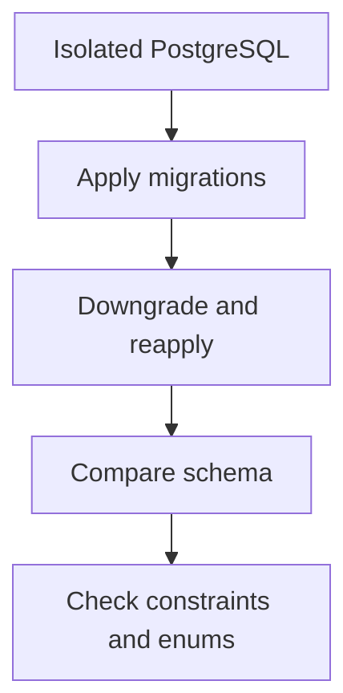

# Testing Alembic migrations in CI {#testing-alembic-migrations-in-ci}

<div class="bdr-post__hero" data-bdr-post="2026-09-13-testing-alembic-migrations-in-ci" role="img" aria-label="A revision history walked up, back and up again, with five checks planted along it" markdown="0"></div>

Imagine a shop with users and orders. A new release adds `users.is_active`; earlier migrations created the order status enum and a rule that an order amount must be positive. CI runs `alembic upgrade head` on an empty PostgreSQL database and passes. Can we roll back the release? Does the rule reject zero? Will existing orders survive?

We will answer those questions with runnable tests, then replace recurring schema checks with `alembic-gauntlet`. The lab uses PostgreSQL 17, Alembic 1.20.0, SQLAlchemy 2.0.54, asyncpg 0.31.0 and alembic-gauntlet 0.3.0.

<!-- more -->

<div id="the-five-migration-tests-every-python-project-should-run-in-ci" data-search-exclude></div>
<div id="the-test-most-pipelines-have" data-search-exclude></div>
<div id="five-bugs-one-file-each" data-search-exclude></div>
<div id="five-tests-by-hand" data-search-exclude></div>
<div id="what-each-test-caught" data-search-exclude></div>
<div id="the-thing-the-naming-test-taught-me" data-search-exclude></div>
<div id="running-it-in-ci" data-search-exclude></div>
<div id="the-contract-with-envpy" data-search-exclude></div>
<div id="the-five-tests-as-one-import" data-search-exclude></div>

## Four revisions, several ways to break them {#checks}

Our history is linear:

| Revision | Change |
|---|---|
| `0001` | Create `users` with a unique email |
| `0002` | Create `orders`, its foreign key, an index and the `order_status` enum: `new`, `paid`, `shipped` |
| `0003` | Require `orders.amount > 0` |
| `0004` | Add `users.is_active`, NOT NULL with a server default of `true` |

For example, revision `0003` creates and removes the same CHECK constraint:

```python
"""orders amount must be positive

Revision ID: 0003
Revises: 0002
"""

from alembic import op

revision = "0003"
down_revision = "0002"


def upgrade() -> None:
    # The metadata's convention turns "amount_positive" into chk_orders_amount_positive.
    op.create_check_constraint("amount_positive", "orders", "amount > 0")


def downgrade() -> None:
    op.drop_constraint("amount_positive", "orders", type_="check")
```

The models' naming convention expands `amount_positive` to `chk_orders_amount_positive`. If the downgrade uses `positive_amount` instead, the upgrade still passes, but rollback tries to remove a constraint that does not exist.

The lab keeps one correct history and thirteen deliberately broken variants. Each changes one migration file. We will first give tests an isolated database, then check which failures they detect.

<div id="testing-database-migrations-with-testcontainers-up-down-and-up-again" data-search-exclude></div>
<div id="step-1-a-database-that-exists-only-for-the-test-session" data-search-exclude></div>
<div id="step-2-pytest-configuration" data-search-exclude></div>
<div id="step-3-the-contract-with-envpy" data-search-exclude></div>
<div id="step-4-the-test-file" data-search-exclude></div>
<div id="step-5-ci" data-search-exclude></div>
<div id="what-it-costs" data-search-exclude></div>

## Connect Alembic to the test database {#isolation}

In `tests/conftest.py`, start one PostgreSQL container per pytest session and select the migration history. `VARIANT` defaults to `clean`. The optional `MIGRATION_TEST_URL` lets the matrix runner reuse its own disposable container:

```python
"""One PostgreSQL container per session, and the migration history variant under test."""

import os

import pytest
from alembic.config import Config
from testcontainers.community.postgres import PostgresContainer

VARIANT = os.getenv("VARIANT", "clean")


@pytest.fixture(scope="session")
def migration_db_url():
    if url := os.getenv("MIGRATION_TEST_URL"):
        yield url
        return
    with PostgresContainer("postgres:17-alpine", driver="asyncpg") as postgres:
        yield postgres.get_connection_url()


@pytest.fixture
def alembic_config() -> Config:
    config = Config("alembic.ini")
    config.set_main_option("version_locations", f"migrations/versions/{VARIANT}")
    return config
```

Installing alembic-gauntlet registers its `migration_engine` fixture through a pytest plugin. It reads `migration_db_url` and creates an async engine. Our handwritten tests create a separate schema with `fresh_schema`; the base class provides its own schema isolation. Both remove their schemas in cleanup. These examples use a dedicated test database.

Set `asyncio_mode = auto` in `pytest.ini`; the lab also sets `asyncio_default_fixture_loop_scope = function`. The fixture `orm_metadata`, shown below, will supply the application's models.

Alembic's `env.py` must accept the connection and schema that the test supplies. Here is the complete environment from the lab:

```python
"""Alembic environment. The part that matters for testing is the injected connection and schema."""

import asyncio
import os

from alembic import context
from sqlalchemy import text
from sqlalchemy.engine import Connection
from sqlalchemy.ext.asyncio import create_async_engine
from sqlalchemy.pool import NullPool
from sqlalchemy.schema import CreateSchema

from shop.models import Base

config = context.config
target_metadata = Base.metadata

# The test runner injects the schema it created for this test; production gets "public".
target_schema = config.attributes.get("target_schema") or os.getenv("MIGRATION_SCHEMA", "public")


def do_run_migrations(connection: Connection) -> None:
    connection.execute(CreateSchema(target_schema, if_not_exists=True))
    quoted_schema = connection.dialect.identifier_preparer.quote_schema(target_schema)
    connection.execute(
        text("SELECT set_config('search_path', :schema, true)"),
        {"schema": quoted_schema},
    )
    context.configure(
        connection=connection,
        target_metadata=target_metadata,
        version_table_schema=target_schema,
    )
    with context.begin_transaction():
        context.run_migrations()


async def run_migrations_online() -> None:
    engine = create_async_engine(config.get_main_option("sqlalchemy.url"), poolclass=NullPool)
    try:
        async with engine.begin() as connection:
            await connection.run_sync(do_run_migrations)
    finally:
        await engine.dispose()


if context.is_offline_mode():
    raise SystemExit("offline mode is not used in this project")

injected = config.attributes.get("connection")
if injected is not None:
    do_run_migrations(injected)  # the test runner owns the connection and the transaction
else:
    asyncio.run(run_migrations_online())
```

`version_table_schema` puts `alembic_version` beside our tables. Transaction-local `search_path` directs unqualified table names to that schema. The test owns an injected connection's transaction; standalone execution uses `engine.begin()` so schema setup and migrations commit together. The [Alembic cookbook](https://alembic.sqlalchemy.org/en/latest/cookbook.html#using-asyncio-with-alembic) describes the `run_sync` bridge and connection sharing.

We also run the standalone path in a separate process, then inspect the revision and tables through a new connection. Otherwise, tests that always inject a connection can hide a broken command-line path.

<!-- diagram:concept -->
<figure class="bdr-diagram" markdown="1">
<figcaption><span class="bdr-diagram__eyebrow">THE IDEA, VISUALIZED</span><strong>Check migrations in both directions</strong></figcaption>
<div class="bdr-diagram__viewport" markdown="1" data-search-exclude>


```mermaid
---
config:
  theme: default
  look: classic
  flowchart:
    useMaxWidth: false
    wrappingWidth: 150
    padding: 12
    nodeSpacing: 24
    rankSpacing: 32
---
flowchart TD
    accTitle: Check migrations in both directions
    accDescr: A test database exercises upgrades, downgrades and reapplication. The resulting schema is checked against models and explicit constraints.
    A["Isolated PostgreSQL"]
    B["Apply migrations"]
    C["Downgrade and reapply"]
    D["Compare schema"]
    E["Check constraints and enums"]
    A --> B --> C --> D --> E
```

</div>
<p class="bdr-diagram__caption">A test database exercises upgrades, downgrades and reapplication. The resulting schema is checked against models and explicit constraints.</p>
</figure>
<!-- /diagram:concept -->

### A successful downgrade can still leave a broken history {#round-trip}

Remove `order_status.drop(op.get_bind())` from revision `0002`'s downgrade. Dropping `orders` succeeds, but its PostgreSQL enum type remains. Reapplying `0002` then fails because the type already exists.

The handwritten test applies each revision, rolls back one step and applies it again, including the final revision:

```python
async def test_every_revision_up_down_up(migration_engine: AsyncEngine, alembic_config: Config) -> None:
    """The stairway: each revision applied, rolled back one step, applied again."""
    revisions = revisions_base_to_head(alembic_config)
    async with fresh_schema(migration_engine) as schema:
        for i, revision in enumerate(revisions):
            await migrate(migration_engine, alembic_config, schema, command.upgrade, revision)
            assert await current_revision(migration_engine, schema) == revision
            await migrate(migration_engine, alembic_config, schema, command.downgrade, revisions[i - 1] if i else "base")
            await migrate(migration_engine, alembic_config, schema, command.upgrade, revision)
```

Here `revisions_base_to_head` reads Alembic's history; `migrate` runs a command in a transaction and passes the connection and schema to `env.py`; `current_revision` reads the version table. All three helpers are in `tests/helpers.py`.

This catches both the leftover enum and the wrong constraint name. Our shop supports reversing these four revisions. A project with intentionally irreversible migrations needs tests for its supported recovery path instead.

<div id="your-models-and-your-schema-have-drifted-would-ci-notice" data-search-exclude></div>
<div id="where-drift-comes-from" data-search-exclude></div>
<div id="the-six-drifts" data-search-exclude></div>
<div id="the-check-that-catches-half-of-them" data-search-exclude></div>
<div id="the-one-it-will-not-look-at-unless-you-ask" data-search-exclude></div>
<div id="the-two-it-will-never-look-at" data-search-exclude></div>
<div id="what-to-run-in-ci" data-search-exclude></div>
<div id="the-pieces" data-search-exclude></div>

## Compare the database with the models {#schema-drift}

Suppose a developer changes `is_active` to nullable in the migration, while the model still requires a value. Or the migration uses a default of `false`, while the model says `true`. Both histories apply successfully to empty tables.

`alembic-gauntlet` supplies the recurring checks. This entire test class comes from `tests/test_gauntlet.py`:

```python
import pytest
from alembic_gauntlet import MigrationTestBase
from sqlalchemy import MetaData

from shop.models import Base


@pytest.mark.integration
class TestMigrations(MigrationTestBase):
    migration_diff_compare_server_default = True

    @pytest.fixture
    def orm_metadata(self) -> MetaData:
        return Base.metadata
```

Version 0.3.0 collects **seven inherited tests**: revision steps, schema/model comparison, one head, downgrade to base, naming conventions, CHECK names and enum values. `migration_diff_compare_server_default = True` enables default comparison explicitly; the default is off. Our handwritten round trip above also verifies reapplication of the final revision, which the base class's stairway in this version leaves downgraded.

Here are selected results from the lab. An ordinary upgrade passes every row except the two-head history:

| Deliberate error | Check that fails |
|---|---|
| `0003` and `0004` both descend from `0002` | One head; `upgrade head` is ambiguous too |
| Wrong nullable flag, type, default, missing index or extra column | Schema/model comparison |
| Missing `chk_orders_amount_positive` | CHECK-name comparison |
| Missing `shipped` from `order_status` | Enum-value comparison |
| Constraint created with an unexpected name | Naming-convention check |

In Alembic 1.20, named CHECK additions/removals can also be compared by enabling `alembic.ext.checkconstraint_byname` alongside the standard autogenerate plugins. It is off by default, and compares names, not expressions. The [autogenerate documentation](https://alembic.sqlalchemy.org/en/latest/autogenerate.html#detecting-check-constraints) describes these limits. The gauntlet check used here also compares CHECKs by name.

### A correct name does not prove a correct condition {#constraint-behavior}

Change `amount > 0` to `amount >= 0`, keeping the same constraint name. All seven inherited checks still pass. The database now accepts a zero-value order, so add a behavior test:

```python
@pytest.mark.parametrize("amount", [0, -1])
async def test_order_amount_must_be_positive(migrated_connection, amount):
    await migrated_connection.execute(
        text("INSERT INTO users (id, email) VALUES (1, 'buyer@example.test')")
    )
    with pytest.raises(IntegrityError) as raised:
        async with migrated_connection.begin_nested():
            await migrated_connection.execute(
                text("INSERT INTO orders (id, user_id, amount, status) "
                     "VALUES (42, 1, :amount, 'new')"),
                {"amount": amount},
            )
    assert raised.value.orig.sqlstate == "23514"
```

The lab's `migrated_connection` fixture applies `head`, opens a transaction in the test schema and yields the connection. The test inserts a valid user first so a missing foreign key cannot be mistaken for the expected CHECK failure. A savepoint contains the failed insert, and SQLSTATE `23514` confirms a CHECK violation.

The correct history rejects both `0` and `-1`. The changed condition accepts `0`, so that case fails with `DID NOT RAISE`. This is the rule we care about, beyond the constraint's presence.

## Upgrade a database that already has orders {#data}

Revision `0004` should add a flag without changing users or orders. Put `DELETE FROM orders` into its upgrade: the schema still matches the models and all seven inherited checks pass on empty tables.

Seed an order at revision `0003`, then upgrade and check the actual rows. This test uses `Decimal`, SQLAlchemy's `text`, Alembic's `command` and the same `fresh_schema`/`migrate` helpers:

```python
async def test_existing_orders_survive(migration_engine, alembic_config):
    async with fresh_schema(migration_engine) as schema:
        await migrate(migration_engine, alembic_config, schema, command.upgrade, "0003")
        async with migration_engine.begin() as connection:
            await connection.execute(text(f'SET LOCAL search_path TO "{schema}"'))
            await connection.execute(text(
                "INSERT INTO users (id, email) VALUES (1, 'buyer@example.test')"
            ))
            await connection.execute(text(
                "INSERT INTO orders (id, user_id, amount, status) "
                "VALUES (42, 1, 19.99, 'paid')"
            ))

        await migrate(migration_engine, alembic_config, schema, command.upgrade, "0004")
        async with migration_engine.connect() as connection:
            await connection.execute(text(f'SET LOCAL search_path TO "{schema}"'))
            users = (await connection.execute(
                text("SELECT id, email, is_active FROM users ORDER BY id")
            )).all()
            orders = (await connection.execute(
                text("SELECT id, user_id, amount, status FROM orders ORDER BY id")
            )).all()
        assert users == [(1, "buyer@example.test", True)]
        assert orders == [(42, 1, Decimal("19.99"), "paid")]
```

With the correct migration, user `1` gains `is_active=True`; order `42` still belongs to that user, costs `19.99` and has status `paid`. The destructive variant fails because the returned order list is empty. Structural checks cannot infer which business data a migration must preserve.

For a migration that converts existing values, extend this pattern with its boundary values and expected results. Lock duration and concurrent writes on large tables still need a separate rehearsal at representative scale.

## Run the same checks in CI {#ci}

From the lab directory, Docker and `uv` are enough:

```bash
uv run --no-project --python 3.13 --with-requirements requirements.txt python -m pytest -q
uv run --no-project --python 3.13 --with-requirements requirements.txt python run_matrix.py
```

The first command runs the correct history: **20 passed**. The second checks all fourteen histories. It succeeds only if the correct one passes, each broken variant triggers its expected check, and no setup errors or skips hide missing coverage. A missing Docker daemon fails the run.

For GitHub Actions, `ci-example.yml` contains a job that runs the first command from this repository's lab directory:

```yaml
name: Migration checks
on:
  pull_request:
  push:
    branches: [master]
permissions:
  contents: read
jobs:
  migrations:
    runs-on: ubuntu-24.04
    timeout-minutes: 10
    defaults:
      run:
        working-directory: docs/blog/lab/2026-09-07-five-alembic-migration-tests
    steps:
      - uses: actions/checkout@v7
      - uses: astral-sh/setup-uv@v10
      - run: uv run --no-project --python 3.13 --with-requirements requirements.txt python -m pytest -q
```

The example uses [actions/checkout](https://github.com/actions/checkout) and [setup-uv](https://github.com/astral-sh/setup-uv). In your service, point `working-directory` at your migration tests and use your dependency file. The command was verified locally against PostgreSQL; the workflow file is a template, not a report of a hosted CI run.

## What to bring into your project {#conclusion}

We caught a broken rollback, an enum left behind, schema drift, a weakened CHECK and lost orders. Each case needed a check aimed at that failure; a single successful upgrade would miss most of them.

Use [alembic-gauntlet](https://bedrock-python.github.io/alembic-gauntlet/) for schema isolation and the recurring history, naming and model checks. Add small tests for your database rules and rows written before the new revision. Together they make migration review concrete: CI shows which promise the change broke.

## Examples and labs {#labs}

- [Lab: the five migration tests](../lab/2026-09-07-five-alembic-migration-tests/README.md) — the historical name is retained; the current lab contains twenty tests and fourteen migration histories.
