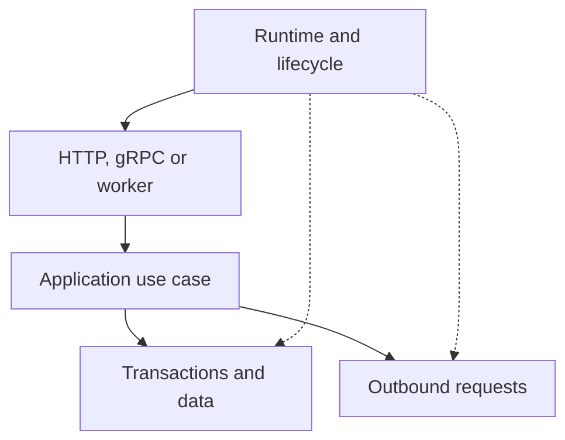

# Why I extract Python service infrastructure into libraries {#why-bedrock-python-libraries}

Across Python services using the same stack, I kept assembling similar infrastructure: SQLAlchemy sessions, Redis and Kafka clients, resource startup and shutdown, retries, metrics and migration checks. Code moved between projects while fixes diverged between copies.

Bedrock Python grew from wanting to maintain those solutions as separate libraries. A service chooses the components it needs; I can fix shared mechanics in one package and release a version that consumers adopt explicitly.

<!-- more -->

## What is worth extracting {#boundaries}

A useful candidate is a recurring task with a clear responsibility. A client needs a managed connection pool, a transaction needs an owner, and a process needs an order for closing resources. Those mechanisms appear across different domains.

The consequences of failure still depend on the product. A library can bound a request's duration but cannot decide whether the service may repeat a payment. It can provide an Outbox without choosing which events form an order's public contract.

| Shared mechanism | Service-specific decision |
|---|---|
| Lifecycle and resource cleanup | Which capabilities readiness requires |
| Timeouts, backoff and circuit breaking | Request budget and retry safety |
| Session and transaction management | Which changes must be atomic |
| Outbox and deduplication | Event meaning and acceptable repeated effects |

Extraction helps when that boundary can be described and tested. If adopting a package means teaching it the entire domain, reconsider the abstraction first.

## Why separate packages {#composition}

A substantial internal framework can be justified when a team deliberately accepts a common stack and upgrade cycle. For Bedrock Python, I chose more independent pieces: a project may need only deadline management or migration tests.

That constrains the API. An integration should accept the capabilities it needs without unnecessarily imposing a class hierarchy. Resource ownership must be explicit: who creates a client, who closes it and whether an existing instance can be supplied.

Within a library, separating core logic from integrations matters. The [article on zero-dependency cores](2026-09-07-zero-dependency-cores.md) covers that approach and its costs. It is a design principle, not a claim that PostgreSQL or HTTP access requires no driver.

<!-- diagram:concept -->
<figure class="bdr-diagram" markdown="1">
<figcaption>THE IDEA, VISUALIZED<strong>The application composes the pieces it needs</strong></figcaption>

The runtime manages resource lifetime. The application use case uses the clients and stores it needs while business rules remain in the service.

</figure>
<!-- /diagram:concept -->

## How the pieces fit in a service {#example}

Consider an orders API that reads an order from PostgreSQL and asks a neighboring service for stock. At process scope, it needs a shared database pool and HTTP client. At operation scope, it needs a session, the remaining time budget and application rules.

[servicewright](https://bedrock-python.github.io/servicewright/) can coordinate startup and shutdown. [sqlalchemy-foundation-kit](https://bedrock-python.github.io/sqlalchemy-foundation-kit/) provides session-management tools, while [clientwright](https://bedrock-python.github.io/clientwright/) supplies outbound HTTP policies. The application connects them and decides how to respond when stock information is unavailable.

The sequence matters: resources exist before readiness, a request receives its own work scope, outbound operations respect the remaining time, and active work finishes before shared clients close. The articles on [lifecycle](2026-09-13-python-service-lifecycle.md), [transactions](2026-09-13-sqlalchemy-sessions-and-transactions.md) and [HTTP and gRPC clients](2026-09-13-production-http-grpc-clients.md) explain those decisions. A complete API example lives in the lab.

## The cost of independent libraries {#tradeoffs}

A separate package needs a public API, documentation, compatible upgrades and verification with real consumers. Duplicating a few lines can be cheaper than maintaining another dependency.

Composition has a cost too. Two libraries can work independently while disagreeing about resource ownership, cancellation or errors. Integration examples help expose those mismatches. Shared build and release conventions help carry fixes across repositories; the [template-to-release article](2026-09-13-python-library-from-template-to-release.md) covers that process.

My criterion for extraction is a recurring need and a boundary that remains useful outside the first service. Establish that through use before expanding the API.

## What this blog covers {#verification}

The blog examines Python backend decisions: where a transaction's guarantee ends, when retrying is dangerous, what readiness checks and how to test dependency failure. The libraries provide concrete examples; the same questions arise in projects that do not use them.

The [library catalog](../../libraries/index.md) helps locate a component by task. The articles explain the behavior and limitations to understand before adopting it.

## Examples and labs {#labs}

The complete setups and reproduction instructions are available separately:

- [Lab: what every production Python microservice reimplements](../lab/2026-09-07-what-every-microservice-reimplements/README.md)
