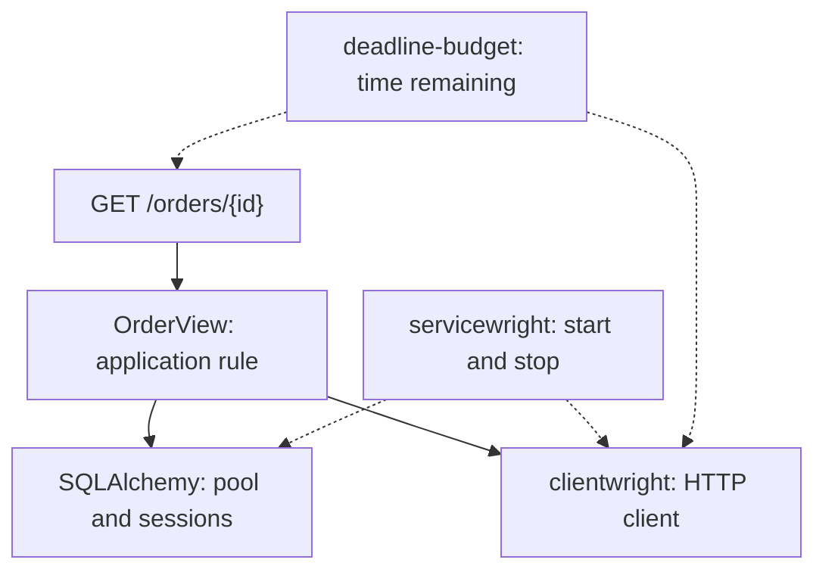

# Why I extract Python service infrastructure into libraries {#why-bedrock-python-libraries}

<div class="bdr-post__hero" data-bdr-post="2026-09-13-why-bedrock-python-libraries" role="img" aria-label="An orders API combines a database session, an HTTP client, a deadline and resource cleanup" markdown="0"></div>

Imagine an orders API: read an order from PostgreSQL, ask the warehouse for stock, return whether the quantity is sufficient. Later, a background job needs the same information. The application rule is small; connection pools, time limits, dependency failures and shutdown still need to work in both places.

Bedrock Python grew out of extracting those repeated mechanisms into separate libraries. Here is a concrete example of what they take care of, what the service still decides and how to check that the pieces work together.

<!-- more -->

<div id="welcome-to-the-bedrock-python-blog" data-search-exclude></div>
<div id="why-this-exists" data-search-exclude></div>
<div id="the-decision" data-search-exclude></div>
<div id="what-to-expect-from-this-blog" data-search-exclude></div>

## Start with the decision the service owns {#boundaries}

Our API returns `404` for an unknown order. For a known order, it compares warehouse stock with the requested quantity. If stock is unavailable, it returns an error rather than inventing a zero balance.

In `orders.py`, `OrderStore.find()` returns an order or `None`; `StockReader.available()` returns a count. They are small Python protocols. The application use case has no FastAPI or infrastructure imports:

```python
class OrderView:
    def __init__(self, store: OrderStore, stock: StockReader):
        self.store, self.stock = store, stock

    async def get(self, order_id: int) -> dict:
        order = await self.store.find(order_id)
        if order is None:
            raise OrderMissing(order_id)
        available = await self.stock.available(order.sku)
        return {
            "order_id": order.id,
            "available": available,
            "can_fulfill": available >= order.quantity,
        }
```

The lab checks this class with ordinary in-memory objects as well as real adapters. Libraries can provide connections and retries; the comparison and the missing-order rule belong here.

This is a stock **view**, not a reservation. The database read and warehouse response are not one transaction, and stock can change afterwards. A purchase operation needs its own consistency rules.

<div id="what-every-production-python-microservice-reimplements" data-search-exclude></div>
<div id="the-list" data-search-exclude></div>
<div id="why-not-a-framework" data-search-exclude></div>
<div id="a-hundred-lines" data-search-exclude></div>
<div id="run" data-search-exclude></div>
<div id="how-the-pieces-stay-apart" data-search-exclude></div>

## Connect PostgreSQL and the warehouse {#example}

First, implement `OrderStore` with [sqlalchemy-foundation-kit](https://github.com/bedrock-python/sqlalchemy-foundation-kit). Its `AsyncSessionManager` owns the engine and supplies sessions. Our adapter chooses the query and the session boundary:

```python
from sqlalchemy import text
from orders import Order


class SqlOrderStore:
    def __init__(self, db):
        self.db = db

    async def find(self, order_id):
        async with self.db.get_session() as session:
            row = (
                (
                    await session.execute(
                        text("SELECT id, sku, quantity FROM orders WHERE id = :id"),
                        {"id": order_id},
                    )
                )
                .mappings()
                .one_or_none()
            )
            return Order(**row) if row is not None else None
```

The `async with` exits before `OrderView` calls the warehouse. A slow HTTP response therefore does not keep this database connection checked out. This operation only reads; `get_session()` does not commit application changes. A write operation would need an explicit transaction boundary.

Next, create a shared HTTP client with [clientwright](https://github.com/bedrock-python/clientwright). This service permits at most two attempts for `GET`, because looking up stock has no intended side effect. The request handler will supply the overall deadline:

```python
from clientwright import AdapterDeps, ClientConfig, RetryConfig, TimeoutConfig, build
from clientwright.contrib.deadline import AmbientDeadlineSource


def stock_client(base_url):
    return build(
        "httpx",
        ClientConfig(
            service_name="orders",
            base_url=base_url,
            timeout=TimeoutConfig(total=5),
            retry=RetryConfig(
                max_attempts=2,
                methods=frozenset({"GET"}),
                initial_backoff=0.02,
                jitter=0,
                budget_ratio=1.0,
            ),
            circuit_breaker=None,
            deadline_header="X-Deadline-Ms",
            on_unsupported="strict",
        ),
        AdapterDeps(deadline_source=AmbientDeadlineSource()),
    )
```

For this example, the retry budget allows up to one extra attempt per original call (`budget_ratio=1.0`). The client has a five-second ceiling, but `AmbientDeadlineSource` shortens it to the current request's remaining time. `X-Deadline-Ms` carries that remainder to the warehouse; the receiving service must choose to honor it.

The adapter also checks the response. Exhausted `503` responses and malformed stock data become the application's `StockUnavailable` error. Timeout exceptions remain distinguishable:

```python
import httpx
from orders import StockUnavailable


class HttpStockReader:
    def __init__(self, client):
        self.client = client

    async def available(self, sku):
        try:
            response = await self.client.get(f"/stock/{sku}")
            response.raise_for_status()
            available = response.json()["available"]
            if type(available) is not int or available < 0:
                raise ValueError("Expected a nonnegative stock count")
            return available
        except httpx.TimeoutException:
            raise
        except (httpx.HTTPError, ValueError, KeyError, TypeError) as error:
            raise StockUnavailable(sku) from error
```

These policies are configured for this read operation. They are not permission to repeat a payment or another state-changing request. Retry safety and traffic limits are covered in [the HTTP and gRPC clients article](2026-09-13-production-http-grpc-clients.md).

## Give the whole operation one time limit {#deadline}

The request may spend time in PostgreSQL before making its first HTTP attempt. Give the operation one [deadline-budget](https://github.com/bedrock-python/deadline-budget) context instead of restarting the clock for each step:

```python
import asyncio
import httpx
from clientwright.contrib.deadline import use_budget
from deadline_budget import BudgetContext
from fastapi import APIRouter, Header, HTTPException
from servicewright.adapters.fastapi import UnitScopeDep
from orders import OrderMissing, OrderView, StockUnavailable

router = APIRouter()


@router.get("/orders/{order_id}")
async def get_order(
    order_id: int,
    unit: UnitScopeDep,
    x_deadline_ms: int = Header(default=800, ge=50, le=2000),
):
    budget = BudgetContext.create(total_seconds=x_deadline_ms / 1000)
    try:
        with use_budget(budget):
            async with asyncio.timeout(budget.remaining()):
                view = await unit.get(OrderView)
                return await view.get(order_id)
    except OrderMissing as error:
        raise HTTPException(404, "Order not found") from error
    except StockUnavailable as error:
        raise HTTPException(503, "Stock is temporarily unavailable") from error
    except (TimeoutError, httpx.TimeoutException) as error:
        raise HTTPException(504, "Order lookup deadline exceeded") from error
```

The service chooses an 800 ms default and accepts `X-Deadline-Ms` only between 50 and 2,000 ms. `use_budget()` exposes the same remaining budget to clientwright; `asyncio.timeout()` bounds the handler's awaited work, including the database read. These controls request cancellation when time runs out; they do not roll back effects already committed elsewhere.

`UnitScopeDep` comes from the servicewright FastAPI adapter. It resolves the configured `OrderView`; the handler decides which application errors become `404`, `503` or `504`. An invalid deadline header is rejected with `422`.

## Create shared resources once and close them last {#composition}

[servicewright](https://github.com/bedrock-python/servicewright) supplies the process lifecycle. Our `Container` implements its two scopes: `app_scope()` owns shared resources, while `unit_scope()` gives each request access to the application use case. The session used to read an order opens only inside `SqlOrderStore.find()`.

This is `Container.app_scope()` from `service.py`. `self.settings` contains the two service URLs, `Scope` resolves `OrderView`, and `events` records lifecycle order for the lab:

```python
@asynccontextmanager
async def app_scope(self):
    try:
        async with AsyncExitStack() as stack:
            self.db = await stack.enter_async_context(
                AsyncSessionManager(
                    self.settings.database_url,
                    poolclass="async_adapted_queue",
                )
            )
            self.http = await stack.enter_async_context(
                stock_client(self.settings.warehouse_url)
            )
            view = OrderView(SqlOrderStore(self.db), HttpStockReader(self.http))
            self.scope = Scope(self.db, view)
            self.events.append("resources:open")
            yield self.scope
    finally:
        self.events.append("resources:closed")
```

`AsyncExitStack` closes the HTTP client and then the database manager, including when a later startup step fails. The imports and the small scope implementation are in the lab. Neither pool is created for each request.

Now configure the runtime and its FastAPI entrypoint:

```python
def build_service(settings, *, port=0):
    container = Container(settings)
    spec = AppSpec(
        service_name="orders",
        create_container=lambda _: container,
        warmers_factory=lambda ctx: [PostgresWarmer(ctx.container.db, timeout=2)],
        drain_delay_seconds=0.2,
        drain_grace_seconds=3,
        cleanup_timeout_seconds=2,
    )

    async def register_health(scope):
        spec.health.add_check(
            "postgres", PostgresHealthCheck(scope.db.session_maker, timeout=1)
        )

    spec.lifecycle.add_pre_start_hook(register_health)
    api = FastApiEntrypoint(
        config=HttpConfig(host="127.0.0.1", port=port, graceful_timeout=2),
        routers=(router,),
    )
    return Service(spec, entrypoints=[api]), api, container
```

PostgreSQL warmup runs a real query before the HTTP listener starts. Readiness checks PostgreSQL; in this example a warehouse outage is reported by the order endpoint rather than making every endpoint unready. On shutdown, readiness drops, active requests have a bounded grace period, and the application scope closes afterwards.

The lab uses `Service.run(..., stop=event)` to exercise that path on Windows and Linux. The standalone entrypoint in `service.py` uses `run_sync()`; it is the place to connect process-level signal handling.

<!-- diagram:concept -->
<figure class="bdr-diagram" markdown="1">
<figcaption><span class="bdr-diagram__eyebrow">THE IDEA, VISUALIZED</span><strong>One use case with explicit resource owners</strong></figcaption>
<div class="bdr-diagram__viewport" markdown="1" data-search-exclude>


```mermaid
---
config:
  theme: default
  look: classic
  flowchart:
    useMaxWidth: false
    wrappingWidth: 150
    padding: 12
    nodeSpacing: 24
    rankSpacing: 32
---
flowchart TD
    accTitle: One use case with explicit resource owners
    accDescr: servicewright manages shared resources. OrderView reads the order and queries stock; the handler sets the time budget and maps errors to HTTP responses.
    A["servicewright: start and stop"]
    B["SQLAlchemy: pool and sessions"]
    C["clientwright: HTTP client"]
    D["GET /orders/{id}"]
    E["OrderView: application rule"]
    F["deadline-budget: time remaining"]
    D --> E
    E --> B
    E --> C
    A -.-> B
    A -.-> C
    F -.-> D
    F -.-> C
```

</div>
<p class="bdr-diagram__caption">servicewright manages shared resources. OrderView reads the order and queries stock; the handler sets the time budget and maps errors to HTTP responses.</p>
</figure>
<!-- /diagram:concept -->

## Check the behavior, not just the imports {#verification}

The practical example starts PostgreSQL 17 in Docker, a local warehouse over HTTP and the orders API. It checks these outcomes:

| Situation | Expected result |
|---|---|
| Known order | Read by ID, request stock by SKU, compare quantities |
| Unknown order | `404`, no warehouse request |
| Invalid deadline header | `422` |
| Warehouse returns one `503` | One retry, with a smaller remaining budget |
| Warehouse stays unavailable or sends invalid data | `503` |
| Warehouse stops responding | `504` under the operation budget |
| Shutdown during a warehouse call | Request finishes within grace; shared resources close afterwards |
| PostgreSQL warmup fails | No HTTP listener; opened resources close |

During the held warehouse call, the lab also checks that no connection remains checked out from the database pool. It verifies that `OrderView` works with plain objects and that the HTTP adapter works without starting a runtime or API.

With Docker running and uv installed, run from the website repository root:

```bash
cd docs/blog/lab/2026-09-07-what-every-microservice-reimplements
uv run --no-project --python 3.13 --with-requirements requirements.txt python run_skeleton.py
```

The verified library versions are `servicewright 0.13.1`, `sqlalchemy-foundation-kit 0.4.0`, `clientwright 0.5.0` and `deadline-budget 0.1.3`, on Python 3.13. The requirements file pins the libraries and the main test dependencies. This is a composition example; TLS, authentication, deployment probes and load testing require their own setup.

## When a separate library earns its cost {#tradeoffs}

Suppose two services need the same fix to deadline propagation. With copied helpers, each copy must be located, changed and tested. With a shared package, the fix has one implementation and a version; each service still updates and verifies that version explicitly.

That is useful when the boundary stays small: a session owner, a client policy or a resource lifecycle. The stock comparison remains in the application because it expresses what this service does. A few local lines with no second consumer may not justify a package's releases, compatibility work and documentation.

Independent packages also need joint checks. This example would be wrong if the HTTP client ignored the ambient budget or closed before the request finished, even if each package passed its own tests. The lab is part of the cost of maintaining that boundary. [Shared release tooling](2026-09-13-python-library-from-template-to-release.md) helps with packaging; it does not establish compatibility by itself.

## Choose the pieces your service needs {#conclusion}

We built an order lookup with explicit business decisions, short database sessions, bounded outbound reads and a tested shutdown path. That is why I extract infrastructure into Bedrock libraries: maintain recurring mechanisms once, while letting each service choose its behavior.

Start with the relevant part: `clientwright` and `deadline-budget` for outbound HTTP under a shared time limit, `sqlalchemy-foundation-kit` for sessions and transactions, or `servicewright` for resource lifecycle. Adopt the combination when your service needs it. The [library catalog](../../libraries/index.md) and articles on [lifecycle](2026-09-13-python-service-lifecycle.md), [transactions](2026-09-13-sqlalchemy-sessions-and-transactions.md) and [optional dependencies](2026-09-07-zero-dependency-cores.md) cover the next decisions.

## Source and reproduction {#labs}

The [lab README](../lab/2026-09-07-what-every-microservice-reimplements/README.md) describes the files, assertions and local environment. The code above is taken from that executable example.
