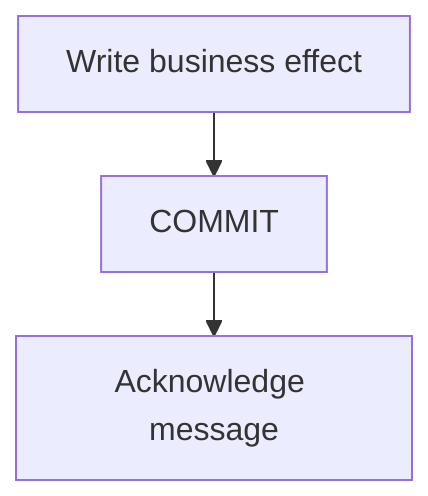

# Article diagrams

## Choice

Use [Zensical's native Mermaid integration](https://zensical.org/docs/authoring/diagrams/).
It already handles rendering and instant navigation. Flowcharts explain decisions
and ownership, sequence diagrams explain timing and transaction boundaries, and
state diagrams explain recovery and lifecycle transitions. Zensical also supports
class and entity relationship diagrams when those fit a future article.

Keep the default theme and classic look in each fence. Shared CSS maps the native
Mermaid variables to Bedrock's warm surfaces, terracotta accent and text colors.
Those variables inherit into the renderer's shadow roots, including inside the
expanded dialog. There is no second Mermaid loader or custom SVG renderer.

The first pass covers all 49 articles in English and Russian. Each diagram answers
one question near the section that explains it. Existing runnable examples stay
intact. The Outbox diagram replaces its old ASCII drawing and distinguishes the
database commit from subsequent Kafka delivery.

## Authoring

Start with a question the reader might get wrong: who commits, which failure
retries, what happens after SIGTERM, or where a dependency belongs. Use short node
labels and explain the consequence in the caption. Avoid decorating an article
with an unrelated architecture map or repeating its whole table of contents.

Prefer three to eight nodes. Use top-to-bottom layout for long pipelines and
left-to-right layout for a short chain or a list branching from one node. Inspect
both languages: Russian labels can change the layout substantially. For a complex
subject, separate two questions into two figures instead of building one poster.

Copy this figure into the appropriate section of a post:

````markdown
<figure class="bdr-diagram" markdown="1">
<figcaption><span class="bdr-diagram__eyebrow">THE IDEA, VISUALIZED</span><strong>Commit before acknowledging</strong></figcaption>
<div class="bdr-diagram__viewport" markdown="1" data-search-exclude>



</div>
<p class="bdr-diagram__caption">Commit the database effect before acknowledging the message. A crash in between can cause redelivery.</p>
</figure>
````

For `sequenceDiagram`, replace the `flowchart` configuration with:

```yaml
  sequence:
    useMaxWidth: false
    wrap: true
    width: 140
    actorMargin: 36
    mirrorActors: false
```

For `stateDiagram-v2`, use `state: {useMaxWidth: false}` and `direction TB` when
long transition labels make a horizontal layout too wide. Do not put unescaped
semicolons in sequence labels: Mermaid treats them as statement separators.
Use a comma, a line break, or Mermaid's entity syntax instead.

`accTitle` and `accDescr` provide the SVG's accessible name and description,
following [Mermaid's accessibility support](https://mermaid.js.org/config/accessibility.html).
Repeat those texts in the visible title and caption, so the explanation is also
available before rendering or if JavaScript cannot load. Translate all labels,
titles and descriptions in the matching Russian post; keep API names and IDs.
The Russian eyebrow is `ИДЕЯ В СХЕМЕ`.

The viewport uses [search exclusion](https://zensical.org/docs/setup/search/)
to keep Mermaid syntax out of search results; the visible title and caption remain
searchable. Reading time counts the caption, without treating Mermaid syntax as
an executable code example.

## Interaction and validation

Keep `useMaxWidth: false`: the SVG retains legible text instead of shrinking an
entire sequence onto a phone screen. The figure stays within the article's width;
its viewport scrolls independently with touch or keyboard. Expand moves the
rendered host into a modal dialog, retaining the SVG and reserving its original
space. Escape or Close restores it and returns focus to the invoking button.
Native page navigation closes the dialog and disconnects obsolete observers.
The build completes each edition's sitemap with articles and labs before combining
the root sitemap: Zensical uses the edition sitemap to recognize instant links.

Run `make docs-check` and rebuild both editions. The unit checks cover article
coverage, translated accessible descriptions, Markdown rendering and reading time.
Mermaid syntax needs a browser check as well: Zensical's build emits the source
and rendering happens in the browser.

With a running bilingual preview and Playwright installed, run:

```bash
python scripts/check_diagrams_browser.py --base-url http://localhost:8000
python scripts/check_diagrams_browser.py --base-url http://localhost:8000 --browser webkit --sample
```

Install the Playwright browser separately if needed. `--channel chrome` selects
an installed Chrome for the Chromium check. The check uses the real native
renderer, tests both editions at phone and desktop widths, and checks opening,
closing and navigation. Screenshots are saved under `build/diagrams/browser/`.

When upgrading Zensical or Mermaid, rerun the browser checks. Zensical currently
loads Mermaid from its CDN on pages that contain diagrams; the integration retains
that behavior. Test captions and article readability with that request blocked too.
