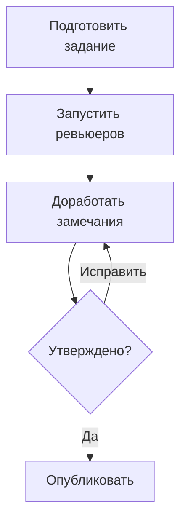

# Знакомьтесь: mr-review — проверка merge request с помощью ИИ {#introducing-mr-review-ai-powered-merge-request-reviews}

<div class="bdr-post__hero" data-bdr-post="2026-05-28-introducing-mr-review" role="img" aria-label="Модель готовит замечания к изменениям, а человек решает, какие из них опубликовать" markdown="0"></div>

Ревью кода — одна из самых полезных практик в разработке, но её качество сильно колеблется. Ревьюеры устают, переключаются между задачами прямо во время проверки и что-то упускают. **mr-review** — локальный инструмент командной строки, который с помощью LLM разбирает изменения в merge request так, как это сделал бы внимательный инженер.

<!-- more -->

## В чём проблема {#the-problem}

Обычное ревью MR состоит из нескольких этапов, которые люди часто объединяют или пропускают:

1. **Понять замысел** — какую задачу решает изменение?
2. **Проверить diff** — соответствует ли реализация замыслу? Есть ли ошибки?
3. **Оставить замечания к строкам** — конкретные предложения, которые можно применить.
4. **Подвести итог** — общий вывод и проблемы, блокирующие слияние.

Большинство инструментов ревью с ИИ помещают всё это в один промпт и получают стену общих замечаний. mr-review разделяет проверку на этапы.

## Как это работает {#how-it-works}

mr-review подключается к вашей системе управления репозиториями (GitLab, GitHub, Gitea, Forgejo или Bitbucket) и получает diff. Затем выполняет четыре этапа:

```
Подготовка → Делегирование → Доработка → Публикация
```

**Brief** — модель читает заголовок MR, описание и список файлов, чтобы сначала понять цель изменения.

**Dispatch** — модель обрабатывает diff по частям и готовит черновые замечания к строкам каждого файла. Такое разбиение сохраняет фокус каждого промпта и не даёт большому diff переполнить контекст.

**Polish** — черновые комментарии проходят редактуру: дубликаты удаляются, тон выравнивается, бесполезные наблюдения отбрасываются.

**Post** — вы интерактивно просматриваете итоговый список и выбираете комментарии для публикации. Без вашего подтверждения в MR ничего не отправляется.

<!-- diagram:concept -->
<figure class="bdr-diagram" markdown="1">
<figcaption><span class="bdr-diagram__eyebrow">ИДЕЯ В СХЕМЕ</span><strong>Где решение остаётся за ревьюером</strong></figcaption>
<div class="bdr-diagram__viewport" markdown="1" data-search-exclude>



</div>
<p class="bdr-diagram__caption">Модель собирает и уточняет замечания. Человек задаёт условия ревью и утверждает то, что будет опубликовано в merge request.</p>
</figure>
<!-- /diagram:concept -->

## Готовые режимы проверки {#preset-based-review-modes}

Разным ревью нужен разный фокус. В mr-review есть четыре предустановленных режима:

| Режим | Что проверяет |
|---|---|
| `thorough` | Корректность, логику, удобство сопровождения |
| `security` | Проверку входных данных, аутентификацию и авторизацию, секреты, инъекции |
| `style` | Имена, структуру, согласованность с окружающим кодом |
| `performance` | Часто выполняемые участки, лишние выделения памяти, запросы N+1 |

## Выбор модели {#model-flexibility}

mr-review работает с Claude, OpenAI и любым совместимым с OpenAI API. Если всё должно оставаться внутри вашей инфраструктуры, направьте его на локальный экземпляр Ollama.

## С чего начать {#getting-started}

```bash
docker run --rm -it \
  -e GITLAB_TOKEN=your_token \
  ghcr.io/bedrock-python/mr-review \
  review --preset thorough --mr-url https://gitlab.com/org/repo/-/merge_requests/42
```

Полная документация: [bedrock-python.github.io/mr-review](https://bedrock-python.github.io/mr-review/).
