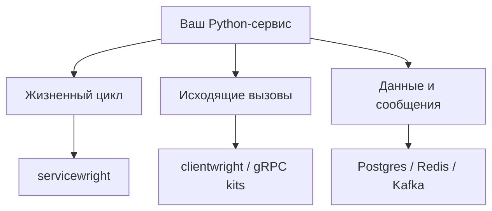

# Добро пожаловать в блог Bedrock Python {#welcome-to-the-bedrock-python-blog}

Здесь мы рассказываем об экосистеме **Bedrock Python**: что это такое, зачем она существует и какие идеи за ней стоят. А ещё публикуем руководства, практические советы и инженерные статьи о создании бэкенд-сервисов на Python.

<!-- more -->

## Зачем всё это { #why-this-exists }

За эти годы я запускал столько бэкенд-сервисов, что уже сбился со счёта. Разные предметные области, разные команды, но почти всегда один и тот же стек: Python, asyncio, SQLAlchemy, Kafka, Redis, PostgreSQL.

И каждый раз первая неделя или две выглядели одинаково. Настроить асинхронные сессии. Написать базовую модель с UUID и временными метками в UTC. Собрать Outbox, чтобы события не терялись между базой данных и брокером. Подключить трассировку. Написать тесты миграций, за которые никто не хочет браться.

Всё это ещё не продукт. Никто не нанимает вас ради фабрики сессий. Это инфраструктурная обвязка, которую я постоянно копировал из предыдущего проекта, исправлял ошибку в одной копии и забывал о четырёх остальных.

В какой-то момент мне надоело заново решать одни и те же задачи.

## Решение { #the-decision }

Я вынес инфраструктурную обвязку из сервисов в библиотеки. Каждая берёт на себя один фрагмент инфраструктуры, который мне приходилось писать снова и снова, и превращает его в версионируемый, протестированный и опубликованный пакет. В сервисах остаётся то, что делает их уникальными: предметная область, бизнес-правила, сам продукт.

Это и есть Bedrock Python. Не фреймворк и не платформа, а инфраструктурный слой, который я больше не хочу писать в пятый раз. Освободившееся время можно потратить на суть того, что я создаю.

Несколько требований, которым должна соответствовать каждая библиотека:

- **Единственная ответственность** — каждый пакет решает одну задачу и делает это хорошо.
- **Безопасная типизация по умолчанию** — полное соответствие строгому режиму mypy, без утечек `Any`.
- **Наблюдаемость** — интеграция с OpenTelemetry там, где она нужна.
- **Удобство тестирования** — проектирование под Clean / Onion architecture, чтобы бизнес-логика не зависела от инфраструктуры.

<!-- diagram:concept -->
<figure class="bdr-diagram" markdown="1">
<figcaption>ИДЕЯ В СХЕМЕ<strong>Соберите нужный вам сервис</strong></figcaption>

У библиотек общие соглашения, а приложение само выбирает жизненный цикл, клиентов и компоненты данных. Здесь показаны зоны ответственности, а не обязательное дерево зависимостей.

</figure>
<!-- /diagram:concept -->

## Чего ждать от блога { #what-to-expect-from-this-blog }

Руководств, советов из опыта эксплуатации этого стека и общих инженерных статей, не привязанных к конкретному пакету. Время от времени — заметок о том, почему что-то устроено именно так.

Оставайтесь на связи.
