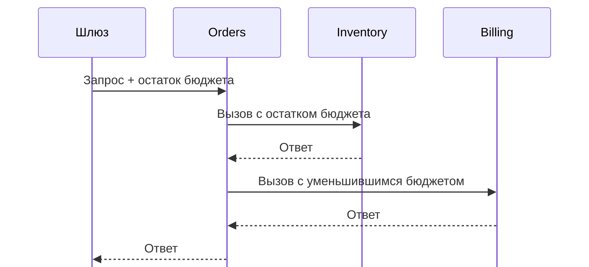

# Таймаут — не дедлайн: как теряется бюджет времени в микросервисах {#timeouts-are-not-deadlines-how-latency-budgets-break-across-microservices}

<div class="bdr-post__hero" data-bdr-post="2026-09-06-timeouts-are-not-deadlines" role="img" aria-label="Общий бюджет уменьшается вдоль цепочки вызовов, а одинаковые таймауты на каждом шаге — нет" markdown="0"></div>

Представим сервис Orders: он получает остатки по HTTP, затем резервирует товар и проводит оплату через gRPC. Выделим запросу две секунды и проследим, куда уходит это время при медленном ответе, повторах и вызовах других сервисов.

<!-- more -->

В [лаборатории](../lab/2026-09-06-timeouts-are-not-deadlines/README.md) лежат запускаемые примеры с локальными серверами. Используем Python 3.13, httpx 0.28.1, grpcio 1.83.1, deadline-budget 0.1.3, clientwright 0.2.2 и grpc-client-kit 0.1.0. Время ниже приблизительное: запуск клиента и планирование задач добавляют задержки.

## Один HTTP-ответ длится дольше таймаута { #a-timeout-limits-an-operation }

Для начала Orders скачивает отчёт об остатках. Inventory сразу отправляет заголовки, затем восемь байт с интервалом в полсекунды. Такой ответ моделирует обработчик:

```python
import asyncio


async def drip(reader, writer):
    await reader.readuntil(b"\r\n\r\n")
    writer.write(b"HTTP/1.1 200 OK\r\nContent-Length: 8\r\n\r\n")
    await writer.drain()
    try:
        for _ in range(8):
            await asyncio.sleep(0.5)
            writer.write(b"x")
            await writer.drain()
    except ConnectionResetError:
        pass  # The client may stop reading before the body is complete.
    finally:
        writer.close()
```

Orders запрашивает отчёт через HTTPX:

```python
import httpx


async def get_report(url):
    async with httpx.AsyncClient(timeout=1.0) as client:
        return await client.get(url)
```

Вызов успешно завершается примерно через четыре секунды. В HTTPX `timeout=1.0` задаёт ограничения на подключение, чтение, запись и ожидание соединения из пула. [Таймаут чтения](https://www.python-httpx.org/advanced/timeouts/) ограничивает ожидание следующей порции данных, поэтому байт каждые 0,5 секунды не даёт ему сработать. Если Inventory молчит, тот же клиент получает `ReadTimeout` примерно через секунду.

Чтобы ограничить всю загрузку, поставим дедлайн снаружи `get()`. В Python 3.11+ для этого есть `asyncio.timeout()`:

```python
async def get_report_with_deadline(url):
    async with httpx.AsyncClient(timeout=1.0) as client:
        async with asyncio.timeout(1.0):
            return await client.get(url)
```

Теперь чтение медленного ответа завершается с `TimeoutError` примерно через секунду. Обычный `get()` читает тело целиком, поэтому оно тоже попадает под ограничение. При использовании `client.stream()` цикл чтения нужно поместить внутрь блока таймаута. Таймаут чтения HTTPX ограничивает одно ожидание, дедлайн — всю операцию. [Таймауты asyncio](https://docs.python.org/3/library/asyncio-task.html#timeouts) запрашивают отмену задачи: блокировка event loop или подавление отмены могут задержать их срабатывание.

## Повторы расходуют тот же бюджет { #retries-multiply-it }

Теперь Inventory принимает соединения, но не отвечает. Orders делает до трёх попыток GET-запроса, который только читает данные:

```python
async def get_stock(client, url):
    for attempt in range(3):
        try:
            return await client.get(url, timeout=1.0)
        except httpx.TimeoutException:
            if attempt == 2:
                raise
```

Каждая попытка может потратить секунду на ожидание данных: суммарно около трёх секунд без прочих задержек. Последний `raise` нужен: без него после всех неудач функция вернула бы `None`. Обернём весь цикл один раз, чтобы выделить всем попыткам общую секунду:

```python
async def get_stock_with_deadline(client, url):
    async with asyncio.timeout(1.0):
        return await get_stock(client, url)
```

Если такие правила нужны нескольким клиентам, [clientwright](https://bedrock-python.github.io/clientwright/) добавляет повторы и общий дедлайн, сохраняя интерфейс `httpx.AsyncClient`. Здесь Orders разрешает три попытки, а `total` ограничивает их суммарное время вместе с паузами:

```python
from clientwright import ClientConfig, RetryConfig, TimeoutConfig, build


async def get_stock_with_clientwright(url):
    config = ClientConfig(
        service_name="orders",
        timeout=TimeoutConfig(total=1.0),
        retry=RetryConfig(max_attempts=3, initial_backoff=0.01),
    )
    async with build("httpx", config) as client:
        return await client.get(url)
```

В примере с сервером, который не отвечает, получаем:

| Политика | Результат | Примерное ожидание | Получено запросов |
|---|---|---|---|
| Ручной цикл, `timeout=1.0` на попытку | `ReadTimeout` | 3 с + накладные расходы | 3 |
| clientwright, `total=1.0` | `HttpxDeadlineExceededError` | 1 с | 1 |
| clientwright, `total=3.0, read=1.0` | `HttpxDeadlineExceededError` | 3 с | 3 |

`HttpxDeadlineExceededError` также наследуется от `clientwright.DeadlineExceededError` и `httpx.TimeoutException`. Три попытки — верхний предел; общий бюджет определяет, получится ли начать следующую. Короткие функции создают клиентов для наглядности; в сервисе их обычно переиспользуют между запросами.

## Orders вызывает Inventory, затем Billing { #across-a-hop-the-timeout-becomes-a-lie }

Перейдём к оформлению заказа. Gateway выделяет Orders две секунды. Orders сначала резервирует товар в Inventory, затем просит Billing провести оплату. В лаборатории каждая операция занимает 1,5 секунды. Используем байтовые сообщения и небольшой класс клиента (stub), чтобы обойтись без сгенерированных protobuf-файлов:

```python
import grpc
import grpc.aio


class LeafStub:
    def __init__(self, channel):
        self.call = channel.unary_unary("/lab.Leaf/Do")


async def submit_from_gateway(target):
    async with grpc.aio.insecure_channel(target) as channel:
        submit = channel.unary_unary("/lab.Orders/Do")
        return await submit(b"order", timeout=2.0)


async def submit_with_fresh_timeouts(inventory, billing):
    await inventory.call(b"reserve", timeout=5.0)
    await billing.call(b"charge", timeout=5.0)
```

В отличие от таймаута чтения HTTPX, параметр `timeout` в gRPC задаёт дедлайн всего RPC. Ошибка здесь в том, что Orders выдаёт **каждому исходящему RPC новые пять секунд**, независимо от входящего дедлайна.

| Время | Событие при новых таймаутах |
|---|---|
| 0,0 с | Gateway вызывает Orders с лимитом 2 с; Inventory получает 5 с |
| 1,5 с | Товар зарезервирован; Billing получает новые 5 с |
| 2,0 с | Gateway получает `DEADLINE_EXCEEDED`; обработчики отменяются |
| 3,0 с | Имитация списания завершается |

В лаборатории `asyncio.shield()` моделирует оплату, которая продолжается после отмены обработчика. Это явное допущение примера, а не утверждение, что любая запись в БД игнорирует отмену. Отмена обработчика не гарантирует, что внешний платёж был отменён.

## Передаём входящий дедлайн в исходящие RPC { #where-the-deadline-lives }

Orders узнаёт, сколько времени осталось у входящего запроса, через [`context.time_remaining()`](https://grpc.github.io/grpc/python/grpc_asyncio.html#grpc.aio.ServicerContext.time_remaining). [deadline-budget](https://bedrock-python.github.io/deadline-budget/) учитывает прошедшее время на монотонных часах, а [grpc-client-kit](https://bedrock-python.github.io/grpc-client-kit/guide/deadlines/) через перехватчики передаёт остаток в исходящие RPC. Подключим обе библиотеки:

```python
from deadline_budget import BudgetContext
from grpc_client_kit import (
    ChannelPool,
    DeadlineBudgetConfig,
    GrpcClient,
    GrpcClientConfig,
    TimeoutConfig as GrpcTimeoutConfig,
    build_interceptors,
    use_budget as use_grpc_budget,
)


class Orders:
    def __init__(self, pool: ChannelPool, inventory: str, billing: str):
        chain = build_interceptors(
            timeout=GrpcTimeoutConfig(default=5.0),
            deadline_budget=DeadlineBudgetConfig(),
        )
        self.inventory = GrpcClient(
            LeafStub, GrpcClientConfig(target=inventory, insecure=True),
            pool, interceptors=chain,
        )
        self.billing = GrpcClient(
            LeafStub, GrpcClientConfig(target=billing, insecure=True),
            pool, interceptors=chain,
        )

    async def handle(self, request, context):
        left = context.time_remaining()
        total = 2.0 if left is None else min(left, 2.0)
        if total <= 0:
            await context.abort(grpc.StatusCode.DEADLINE_EXCEEDED, "no time left")
        budget = BudgetContext.create(total_seconds=total, min_timeout=0.0)

        try:
            with use_grpc_budget(budget):
                async with self.inventory as inventory:
                    await inventory.call(b"reserve")
                async with self.billing as billing:
                    await billing.call(b"charge")
        except grpc.aio.AioRpcError as error:
            await context.abort(error.code(), "downstream failed")
        return b"ok"
```

Сервис держит `ChannelPool` в течение своего жизненного цикла и регистрирует `Orders.handle` как `/lab.Orders/Do`; код запуска есть в лаборатории. `None` означает отсутствие входящего дедлайна, поэтому Orders применяет собственный лимит в две секунды. Ноль означает, что время закончилось, и не должен превращаться в новый бюджет. `min_timeout=0.0` не позволяет округлить маленький остаток вверх до стандартного для библиотеки минимума в 0,1 секунды.

Теперь Inventory получает примерно две секунды, а Billing — около половины секунды. Billing может отказаться до начала работы, если времени недостаточно. Его обработчик в лаборатории проверяет:

```python
async def require_time(context, seconds):
    left = context.time_remaining()
    if left is not None and left < seconds:
        await context.abort(
            grpc.StatusCode.DEADLINE_EXCEEDED, "cannot finish in time"
        )


async def billing_handler(request, context):
    await require_time(context, 1.5)
    await asyncio.sleep(1.5)  # Simulated payment; no real money moves.
    return b"ok"
```

В примере с фиксированной длительностью запрос завершается ошибкой примерно через 1,5 секунды, а Billing не начинает списание. Реальному сервису придётся оценивать длительность с запасом: точное время заранее неизвестно. Inventory уже зарезервировал товар, поэтому отмену резерва нужно предусмотреть отдельно. Дедлайн не откатывает выполненные операции и не защищает оплату от дублей.

<!-- diagram:concept -->
<figure class="bdr-diagram" markdown="1">
<figcaption><span class="bdr-diagram__eyebrow">ИДЕЯ В СХЕМЕ</span><strong>Передавайте остаток времени вместо нового таймаута</strong></figcaption>
<div class="bdr-diagram__viewport" markdown="1" data-search-exclude>



</div>
<p class="bdr-diagram__caption">Каждый исходящий вызов ограничен остатком времени входящего запроса. Работа и повторные попытки расходуют один общий бюджет.</p>
</figure>
<!-- /diagram:concept -->

## Передаём бюджет и по HTTP { #carry-the-budget-over-http-too }

Вернёмся к HTTP-версии Inventory. На первое чтение он отвечает `503`, на повтор — успешно. Затем Orders тратит полсекунды на свою работу и читает данные ещё раз. Каждая попытка должна передавать текущий остаток. В HTTP нет стандартного аналога gRPC-дедлайна; здесь сервисы договариваются о заголовке `X-Deadline-Ms` с остатком в миллисекундах.

```python
from clientwright import AdapterDeps
from clientwright.contrib.deadline import AmbientDeadlineSource, use_budget as use_http_budget


async def read_inventory_twice(url):
    config = ClientConfig(
        service_name="orders",
        timeout=TimeoutConfig(total=10.0),
        retry=RetryConfig(max_attempts=3, initial_backoff=0.3, jitter=0.0),
        deadline_header="X-Deadline-Ms",
    )
    deps = AdapterDeps(deadline_source=AmbientDeadlineSource())
    async with build("httpx", config, deps) as client:
        budget = BudgetContext.create(total_seconds=2.0)
        with use_http_budget(budget):
            first = await client.get(url)
            await asyncio.sleep(0.5)  # Simulated local work.
            second = await client.get(url)
        return first, second
```

Сервер получает три запроса: первую попытку, её повтор и второй логический вызов. Заголовок уменьшается: сначала около 2000 мс, затем меньше после паузы, затем ещё меньше после локальной работы. Десять секунд в конфигурации не увеличивают двухсекундный бюджет запроса.

Получив запрос, Inventory должен разобрать заголовок и создать собственный бюджет: clientwright не делает это на стороне сервера. Функция ниже ограничивает бюджет двумя секундами и оставляет 0,2 секунды на завершение:

```python
def budget_from_header(value: str | None) -> BudgetContext:
    total = 2.0 if value is None else min(int(value) / 1000, 2.0)
    if total <= 0.2:
        raise TimeoutError("not enough time after the completion margin")
    return BudgetContext.create(
        total_seconds=total, safety_margin=0.2, min_timeout=0.0
    )
```

HTTP-обработчик отвечает `400`, если заголовок не удалось разобрать как целое число (`ValueError`), и возвращает ошибку дедлайна, если бюджет исчерпан (`TimeoutError`). Корректный бюджет устанавливается через `use_http_budget()`. Принимать заголовок следует только от сервисов, которым разрешено задавать внутренний бюджет. Время доставки в переданном остатке не учтено: если значение 500 мс дошло за 50 мс, у получателя окажется на 50 мс больше, чем осталось у отправителя. Запас уменьшает это расхождение, но не синхронизирует дедлайны точно. Вызывающий сервис должен по-прежнему ограничивать собственное ожидание.

`use_http_budget()` и `use_grpc_budget()` работают с разными контекстными переменными. Если обработчик делает HTTP- и gRPC-вызовы, установите один объект в обоих контекстах:

```python
async def call_both(http_client, url, grpc_stub, budget):
    with use_http_budget(budget), use_grpc_budget(budget):
        await http_client.get(url)
        return await grpc_stub.call(b"reserve")
```

## Оставляем время следующему шагу { #the-safety-margin }

Допустим, Orders нужны 0,2 секунды на завершение ответа, а после Inventory нужно оставить 0,5 секунды для Billing. При работе с обычными gRPC-клиентами можно распределить время явно через `DeadlineBudget`:

```python
from deadline_budget import DeadlineBudget


async def submit_with_reserve(inventory, billing):
    budget = DeadlineBudget(
        total_seconds=2.0, safety_margin=0.2, min_timeout=0.0
    )
    timeout = budget.timeout_for(cap=5.0, reserve_for_next=0.5)
    if timeout <= 0:
        raise TimeoutError("no time for inventory after reserving billing time")
    await inventory.call(b"reserve", timeout=timeout)
    await billing.call(b"charge", timeout=budget.timeout_for(cap=5.0))
```

Inventory получает максимум около 1,3 секунды: `2.0 - 0.2 - 0.5`. Если он завершится за секунду, Billing достанется около 0,8 секунды. Обе операции должны укладываться в эти лимиты: предыдущий пример Inventory с задержкой 1,5 секунды завершился бы по таймауту. `DeadlineBudget` только рассчитывает время, а ограничивает вызов сам gRPC. Стандартный `min_timeout=0.1` может оказаться больше оставшегося времени, поэтому здесь задан ноль. Если на вызов не осталось времени, код отклоняет его. Запас на завершение помогает освободить ресурсы, но не гарантирует, что этого времени хватит.

## Заключение { #what-changed-in-the-code }

Мы разобрали медленный HTTP-ответ, повторные попытки и цепочку вызовов между сервисами. Во всех сценариях понадобилось одно правило: выделить запросу общий бюджет и расходовать его на каждом шаге, включая паузы между попытками и локальную работу.

Используйте наши библиотеки, чтобы применить это в своих сервисах: [deadline-budget](https://bedrock-python.github.io/deadline-budget/) считает остаток времени и помогает распределить его между вызовами, а [clientwright](https://bedrock-python.github.io/clientwright/) применяет этот бюджет к HTTP-запросам и повторам, сохраняя привычный интерфейс клиента. Для gRPC тот же бюджет подключается к исходящим RPC через [grpc-client-kit](https://bedrock-python.github.io/grpc-client-kit/guide/deadlines/).

Начните с [лаборатории](../lab/2026-09-06-timeouts-are-not-deadlines/README.md): измените задержки, посмотрите, где заканчивается бюджет, и перенесите такую настройку в свою цепочку запросов.
