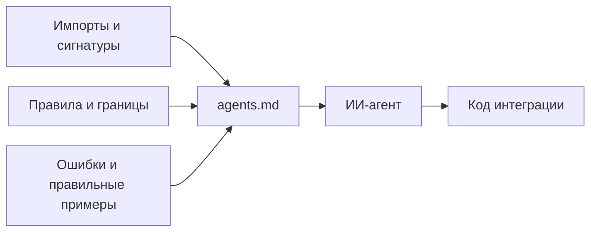

# Мы начали писать документацию для ИИ-агентов {#we-started-writing-documentation-for-ai-coding-agents}

<div class="bdr-post__hero" data-bdr-post="2026-09-07-documentation-for-ai-coding-agents" role="img" aria-label="Страница для модели, которую можно передать ей одним нажатием" markdown="0"></div>

В 2024 году я писал документацию для разработчиков. В какой-то момент 2026-го заметил, что значительная часть читателей — ИИ-ассистенты. Подключая мои библиотеки к сервисам, они придумывали несуществующие классы, вызывали синхронные функции с `await` и передавали сессию там, где нужен движок БД. Документация была рассчитана на человека, который читает несколько страниц и связывает их между собой. Расскажу, что я изменил: собрал сведения для модели на отдельной странице каждой библиотеки, сформулировал правила использования API и добавил возможность передать страницу в чат одним нажатием. А заодно — сколько сил требует поддержка такой документации.

<!-- more -->

## Два читателя, два вопроса {#two-readers-two-questions}

Разработчик ищет в документации ответ: «Стоит ли использовать эту библиотеку и как она устроена?» Он начинает с обзора, читает об основных понятиях, открывает руководство по быстрому старту и возвращается к справочнику, когда нужно уточнить сигнатуру. Ему помогают объяснения и диаграммы. Руководство из шести страниц тоже подходит: человек помнит прочитанное и связывает разделы между собой.

Модели, которой предстоит писать код, нужны более конкретные сведения: «Как устроен API и где легко ошибиться?» В таком сценарии она получает фрагмент документации в контексте, а пробелы заполняет по аналогии с другими библиотеками. Если написано «передайте координатор», но не указан импорт, модель попробует импортировать его из корня пакета. Если показан `await run_alembic_upgrade(...)`, но не сказано, что `get_all_revisions` синхронна, она может поставить `await` перед обеими функциями. В результате получается правдоподобный API, которого у вашей библиотеки нет.

С этого наблюдения всё началось. Документация объясняла общие понятия, но не называла правила, от которых зависит правильность кода.

## Одна страница на библиотеку {#one-page-per-library}

Теперь у каждой библиотеки организации есть `agents.md`: пункт «For AI agents» в навигации и адрес `/agents/` на сайте. Это не краткий пересказ других страниц. Это вся библиотека на одной странице для читателя, который не увидит остальных, пока ему явно не предложат их загрузить.

У этих страниц общая структура. Вот начало страницы deadline-budget — первое, что читает модель:

```text
| Пакет       | deadline-budget на PyPI, корень импортов — deadline_budget                    |
| Требования  | Python 3.10+, без зависимостей времени выполнения                             |
| Установка   | pip install deadline-budget · extras: settings (модели Pydantic), dishka     |
| Точки входа | DeadlineBudget, BudgetContext — оба из deadline_budget                       |
| Асинхронность | Нет. Все методы синхронны и сразу возвращают результат: читают часы,        |
|               | не спят, ничего не ожидают и не отменяют                                    |
```

Сначала — имя устанавливаемого пакета и имя модуля для импорта: они могут различаться, и модели их путают. Затем — точные пути импорта основных классов и функций. Ещё до первого примера указано, какие вызовы синхронные, а какие нужно выполнять с `await`.

Дальше идёт раздел **Scope**: два абзаца о том, что библиотека делает и чего от неё ждать не следует. Например, у deadline-budget прямо сказано: библиотека только считает время. Она не запускает таймеры и задачи, не отменяет операции, не оборачивает клиентов и не передаёт бюджет через заголовки, контекстные переменные или thread-local. Эти уточнения не дают модели приписать библиотеке поведение, которого в ней нет.

Затем **Mental model** — четыре–шесть основных сущностей и описание их взаимодействия; **Wiring** — минимальный, но полный пример подключения. После них — таблицы API с именами, сигнатурами, возвращаемыми значениями и исключениями. Завершают страницу два особенно полезных раздела.

<!-- diagram:concept -->
<figure class="bdr-diagram" markdown="1">
<figcaption><span class="bdr-diagram__eyebrow">ИДЕЯ В СХЕМЕ</span><strong>Соберите правила API на одной странице</strong></figcaption>
<div class="bdr-diagram__viewport" markdown="1" data-search-exclude>



</div>
<p class="bdr-diagram__caption">На одной странице собраны импорты, сигнатуры, обязательные правила и примеры. Модели остаётся меньше пробелов, которые пришлось бы заполнять догадками.</p>
</figure>
<!-- /diagram:concept -->

## Правила, от которых зависит корректность кода {#rules-that-hold-or-break-the-code}

Под таким заголовком на каждой странице есть нумерованный список обязательных правил. Их нарушение может дать код, который выглядит рабочим, хотя библиотека не гарантирует его корректность. Несколько примеров:

- servicewright: «Когда установлен `stop`, метод `serve()` должен вернуть управление, оставив приём входящих запросов открытым. Не закрывайте слушающий сокет в этом месте: сначала Host выставит readiness в false, затем вызовет `drain(grace)`».
- alembic-gauntlet: «От вашего `env.py` зависит, проверяют ли тесты то, что задумано. Если задан `config.attributes['connection']`, используйте это соединение. Иначе тесты могут пройти, применив миграции к схеме `public` через соединение, транзакцию которого никто не откатывает».
- grpc-client-kit: «Таймаут — бюджет всего вызова, включая повторы. Длительность вызова не равна `max_attempts × timeout`».
- pg-partsmith: «Передавайте `Engine` / `AsyncEngine`, а не `Session` / `AsyncSession`. Библиотека выполняет DDL через собственное соединение и сразу фиксирует изменения; транзакция сессии для этого не подходит».
- omni-box: «Библиотека никогда не открывает и не фиксирует транзакцию БД».
- clientwright: «`UNSET` — не `None`. `UNSET` оставляет стандартное значение адаптера и отражает это в отчёте; `None` явно означает отсутствие ограничения».

Каждое правило называет вероятную ошибку, объясняет последствия и показывает, как действовать правильно. Короткое «передавайте Engine, а не Session» проще учитывать на протяжении двухсот строк генерируемого кода, чем подробное рассуждение о DDL и сессиях.

На библиотеку приходится от пятнадцати до двадцати правил. Их формулировка оказалась полезной и безотносительно ИИ: чтобы написать такое правило, нужно точно разобраться в поведении библиотеки. В общем обзоре гораздо легче обойтись расплывчатым объяснением.

## Сначала ошибка, затем правильный вариант {#wrong-then-right}

Второй раздел — **Common mistakes**, где каждый пример дан парой:

```python
# WRONG — a mixin that does not exist in this package
from alembic_gauntlet.contrib.testcontainers import TestcontainersDatabaseMixin

class TestMigrations(TestcontainersDatabaseMixin, MigrationTestBase): ...

# RIGHT — contrib ships one fixture; import it into a conftest
# tests/conftest.py
from alembic_gauntlet.contrib.testcontainers import migration_db_url  # noqa: F401
```

```python
# WRONG — the budget object sent to another service
await billing.charge(order_id, budget=pickle.dumps(ctx.budget))

# RIGHT — the number sent, a new budget built on arrival
await billing.charge(order_id, timeout=ctx.timeout_for_call("billing.charge"))
# ... in the callee:
budget = DeadlineBudget(total_seconds=timeout_from_request, safety_margin=0.2)
```

Пример WRONG показывает правдоподобную ошибку, а не заведомо нелепый код. Именно такой API модель может придумать по аналогии с другими библиотеками. Одного упоминания «интеграции с testcontainers» ей достаточно, чтобы предложить подобный mixin. Пара примеров помогает увидеть ошибку и сразу найти замену. На четырнадцати страницах сейчас 83 такие пары.

## Страница должна попасть к модели {#the-page-has-to-reach-the-model}

Страница для модели бесполезна, если её приходится выделять целиком в браузере и надеяться, что форматирование сохранится. Поэтому каждая страница документации организации доступна и как исходный Markdown по собственному адресу: `/guide/quickstart/` — ещё и `/guide/quickstart.md`, а `/agents/` — `/agents.md`. Никакой сложной генерации: после сборки сайта скрипт из тридцати строк копирует каждый `docs/<path>.md` в `site/<path>.md`, рядом с адресом HTML. Модель, способная загрузить URL, получает текст; агенту с инструкцией «прочитай `/agents.md` перед написанием кода» не нужно извлекать содержимое из HTML.

Над каждой страницей есть кнопка **Copy page**, которая копирует Markdown для вставки в чат. В её меню — **View as Markdown**, **Open in ChatGPT**, **Open in Claude** и **Open in Perplexity**. Последние три открывают ассистента с адресом страницы и просьбой сначала её прочитать. Для генерируемого справочника API кнопка отключена через `copy_page: false`: исходный Markdown там содержит инструкции для генератора документации, а не описание API. Копировать такой файл в чат было бы бесполезно.

Раздел «How to read this page» объясняет, как пользоваться страницей для агентов и где искать дополнительные сведения. В конце находится **Documentation map** — таблица остальных страниц с пояснением, когда их читать. Например: «Прочитайте при выборе между `DeadlineBudget` и `BudgetContext`». Так модель получает повод открыть конкретное руководство.

## Как поддерживать документацию в актуальном состоянии {#keeping-it-true}

Страница описывает публичный API, поэтому её нужно обновлять вместе с кодом. Устаревшая документация особенно опасна: модель может довериться ей и использовать уже несуществующие классы или методы. Это правило закреплено в руководстве для участников каждой библиотеки и в шаблоне pull request. На ревью проверяется простое условие: если PR меняет публичный интерфейс, нужно проверить и обновить соответствующие сведения в `docs/agents.md`.

Заготовка страницы хранится в шаблоне библиотеки организации; места, которые нужно заполнить, помечены `TODO`. Инструкции требуют сделать это до первого коммита, независимо от того, создаёт библиотеку человек или агент. Код кнопки Copy page хранится в четырёх одинаковых файлах во всех репозиториях — это позволяет переносить исправления сразу во все библиотеки. Образцом для самих страниц стала документация pg-partsmith.

Поддержка требует времени. Четырнадцать страниц — это 7045 строк Markdown: от 374 у самой маленькой библиотеки до 657 у самой большой. При каждом изменении публичного API приходится возвращаться к документации. Но эта работа дала результат, полезный и обычным читателям.

## Что это дало людям {#what-it-did-for-the-humans}

Страница для агентов оказалась лучшей страницей каждого сайта и для опытного инженера, уже знакомого с предметной областью. Начальная таблица отвечает на пять его первых вопросов. Scope за два абзаца показывает, подходит ли библиотека. Правила описывают то, что иначе пришлось бы узнавать во время инцидента. Эту страницу я отправляю коллеге, спрашивающему о библиотеке и её подводных камнях, и открываю сам, возвращаясь к ней через месяц.

Чтобы документацией мог пользоваться читатель с ограниченным контекстом, пришлось явно сформулировать правила, указать импорты рядом с именами и показать ошибочный код рядом с правильным. Также понадобилось объяснить, чего библиотека не делает. Эти сведения полезны всем: ошибки модели лишь показали, где их не хватало.

У каждой библиотеки в [каталоге](https://bedrock-python.github.io/libraries/) такая страница есть в разделе «For AI agents». Чтобы увидеть структуру, посмотрите [pg-partsmith](https://bedrock-python.github.io/pg-partsmith/agents/), по которому делались остальные, и [deadline-budget](https://bedrock-python.github.io/deadline-budget/agents/) — самый короткий полный пример.
