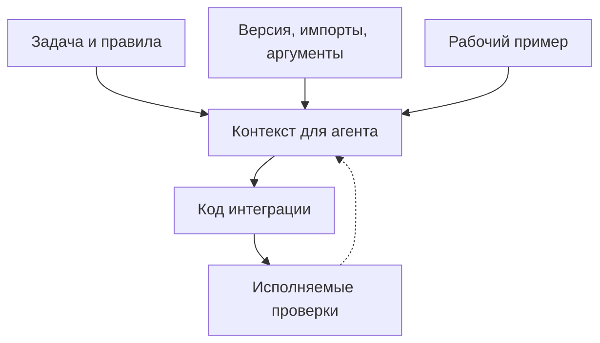

# Документация, по которой ИИ-агент может написать и проверить код {#we-started-writing-documentation-for-ai-coding-agents}

<div class="bdr-post__hero" data-bdr-post="2026-09-07-documentation-for-ai-coding-agents" role="img" aria-label="Задача, описание API конкретной версии и рабочий пример помогают получить проверяемый код" markdown="0"></div>

Представим, что мы просим ИИ-агента добавить расчёт доставки в сервис заказов. Сначала нужно проверить остаток товара, затем рассчитать доставку: на оба шага отведено 600 мс, при этом каждый должен занять не больше 400 мс. В проекте используется deadline-budget. Обзор библиотеки объясняет идею, но для реализации нужны точный импорт, сведения о синхронных методах, единицах таймаута и отмене работы.

Соберём эти сведения в короткое описание задачи, напишем функцию и проверим обещания документации тестами. Это пример подготовки полезной документации, а не измерение качества ИИ-модели.

<!-- more -->

## Даём читателю контекст для конкретной задачи {#two-readers-two-questions}

Фраза «используй deadline-budget» оставляет несколько вопросов. Запускается ли таймер при создании бюджета? Нужен ли `await` перед `timeout_for_call()`? Отменит ли библиотека запрос на склад? Правдоподобный, но неверный ответ на любой из них испортит код.

Агент может уметь открывать страницы, искать по репозиторию и запускать тесты. В документации нужно указать, с чего начать и где проверить недостающие сведения. Разработчику, который пишет ту же функцию вручную, нужны те же факты.

Для этой задачи можно передать агенту такое описание вместе с нужными файлами:

> Реализуй `shipping_quote(sku, *, stock, shipping)` с `deadline-budget==0.1.3` на Python 3.13.
>
> Уложи проверку склада и расчёт доставки в 600 мс. На каждый шаг отведи не больше 400 мс. Если остаток товара равен нулю или отрицательный, верни `None`. В остальных случаях верни расчёт доставки.
>
> Перед выбором вызовов прочитай приложенное описание API и правила для адаптеров. Запусти предоставленные тесты и сообщи результат.

Адаптеры относятся к нашему приложению. `stock` возвращает целое количество товара, а `shipping` рассчитывает доставку. Обе функции асинхронные и принимают `sku` и именованный аргумент `timeout` в секундах. Они должны применять этот таймаут и не подавлять отмену. Так читатель понимает, какие зависимости предоставляет приложение и что относится к API библиотеки.

## Что нужно знать до первого вызова {#one-page-per-library}

В [шаблоне библиотек Bedrock](https://github.com/bedrock-python/python-library-template/blob/master/template/docs/agents.md.jinja) для этого предусмотрен `docs/agents.md`. В нашем примере читателю достаточно небольшой таблицы API:

| Что уточнить | Ответ для примера |
|---|---|
| Пакет | `deadline-budget==0.1.3`; проверено с Python 3.13 |
| Импорты | `from deadline_budget import BudgetContext, DeadlineExceededError` |
| Создание контекста | `BudgetContext.create(total_seconds, call_caps=None, *, min_timeout=0.1, safety_margin=0.0)` |
| Вызовы с `await` | Ни `create()`, ни `timeout_for_call()`: оба метода синхронные |
| Единицы времени | Секунды; `timeout_for_call()` возвращает `float` |
| Время жизни | Один контекст на расчёт доставки, общий для обоих шагов |
| Отмена | Адаптер и внешний `asyncio.timeout()` в приложении |
| Ошибки | `DeadlineExceededError` при расчёте нового таймаута; `TimeoutError` от общего ограничения времени или этих адаптеров |

На [странице deadline-budget для агентов](https://github.com/bedrock-python/deadline-budget/blob/master/docs/agents.md) разобрано больше возможностей. В [README практикума](../lab/2026-09-07-documentation-for-ai-coding-agents/README.md) мы описали одну интеграцию: правила для адаптеров и запускаемый код. У такого описания должны быть указаны версия и границы задачи, чтобы читатель понимал, когда идти в полный справочник.

## Показываем ошибку и замену {#wrong-then-right}

Рассмотрим возможную ошибку внутри асинхронной функции:

```python
from deadline_budget import BudgetContext

# WRONG: inside an async function
ctx = await BudgetContext.create(total_seconds=0.6)
```

Получим `TypeError`: `create()` возвращает объект `BudgetContext`, к которому нельзя применить `await`. Исправление короткое:

```python
from deadline_budget import BudgetContext

ctx = BudgetContext.create(total_seconds=0.6)
timeout = ctx.timeout_for_call("stock")
```

Практикум выполняет ошибочный вызов и проверяет исключение. Он также сверяет сигнатуру и значения аргументов по умолчанию с установленным пакетом. Так можно разобрать конкретную ошибку API, не выдавая её за результат запуска модели и не обещая, что определённая формулировка запроса всегда её предотвратит.

Для одной локальной ошибки достаточно короткой пары. Если правило касается нескольких вызовов, лучше показать законченную функцию.

## Объясняем правила на рабочем коде {#rules-that-hold-or-break-the-code}

Вот `shipping.py`. Из внешних библиотек импортируем только API бюджета. Функции `stock` и `shipping` передаёт приложение:

```python
import asyncio

from deadline_budget import BudgetContext


async def shipping_quote(sku, *, stock, shipping):
    ctx = BudgetContext.create(
        total_seconds=0.6,
        min_timeout=0,
        call_caps={"stock": 0.4, "shipping": 0.4},
    )
    async with asyncio.timeout(ctx.remaining()):
        available = await stock(sku, timeout=ctx.timeout_for_call("stock"))
        if available <= 0:
            return None
        return await shipping(sku, timeout=ctx.timeout_for_call("shipping"))
```

Контекст создаётся один раз, до проверки склада. Перед каждым вызовом заново вычисляется таймаут. Если первый шаг занял 250 мс, второму останется не больше 350 мс. Новый контекст на втором шаге ошибочно выдал бы ему свежий бюджет.

Рядом с кодом нужно оговорить две детали. Во-первых, в версии 0.1.3 `min_timeout` по умолчанию равен 100 мс и может превышать остаток времени. Здесь мы явно задаём ноль. Во-вторых, бюджет только вычисляет числа. [`asyncio.timeout()` из Python](https://docs.python.org/3.13/library/asyncio-task.html#asyncio.timeout) запрашивает отмену текущей задачи, когда заканчивается время всей операции. Это работает с асинхронным кодом, который отдаёт управление и не подавляет отмену; блокирующая работа может выйти за пределы таймаута.

Имена в `call_caps` тоже относятся к правилам примера. Для неизвестного имени отдельного ограничения нет: `"stcok"` не вызывает ошибку конфигурации. Опечатка меняет поведение, хотя код успешно импортируется.

<!-- diagram:concept -->
<figure class="bdr-diagram" markdown="1">
<figcaption><span class="bdr-diagram__eyebrow">ИДЕЯ В СХЕМЕ</span><strong>От описания задачи к проверяемому коду</strong></figcaption>
<div class="bdr-diagram__viewport" markdown="1" data-search-exclude>


```mermaid
---
config:
  theme: default
  look: classic
  flowchart:
    useMaxWidth: false
    wrappingWidth: 150
    padding: 12
    nodeSpacing: 24
    rankSpacing: 32
---
flowchart TD
    accTitle: От описания задачи к проверяемому коду
    accDescr: Задача, сведения об API и рабочий пример формируют контекст. Код интеграции проходит проверки; обнаруженные ошибки помогают уточнить документацию.
    A["Задача и правила"] --> D["Контекст для агента"]
    B["Версия, импорты, аргументы"] --> D
    C["Рабочий пример"] --> D
    D --> E["Код интеграции"] --> F["Исполняемые проверки"]
    F -.-> D
```

</div>
<p class="bdr-diagram__caption">Задача, сведения об API и рабочий пример формируют контекст. Код интеграции проходит проверки; обнаруженные ошибки помогают уточнить документацию.</p>
</figure>
<!-- /diagram:concept -->

## Передаём агенту содержимое страницы {#the-page-has-to-reach-the-model}

Есть два удобных пути: дать прямую ссылку на Markdown агенту, который умеет загружать файлы, или скопировать нужную страницу в его контекст. Само наличие URL в запросе не доказывает, что страница прочитана. Если инструмент не может её открыть, передайте текст или локальный файл.

В шаблоне библиотеки есть [скрипт экспорта](https://github.com/bedrock-python/python-library-template/blob/master/template/scripts/emit_markdown.py) и кнопка **Copy page**. Экспорт выполняется после сборки документации и учитывает страницы разделов:

| Исходник | Опубликованный Markdown |
|---|---|
| `docs/agents.md` | `site/agents.md` |
| `docs/guide/quickstart.md` | `site/guide/quickstart.md` |
| `docs/guide/index.md` | `site/guide.md` |

Страницы с `copy_page: false` исключаются. Это важно для справочника API, в исходнике которого находится лишь инструкция генератору документации: её копирование не передаст читателю готовое описание API. Проверяйте сам экспортированный файл, включая код и ссылки. Успешная сборка HTML ещё не доказывает, что экспорт работает.

Рядом с кратким описанием оставьте карту дальнейшего чтения. Для нашей задачи она может вести к [статье о дедлайнах](2026-09-06-timeouts-are-not-deadlines.md), когда нужно передавать бюджет между вызовами, к [необязательным зависимостям](2026-09-07-zero-dependency-cores.md) при выборе установки и к справочнику библиотеки, если нужен ещё не описанный метод. Объясняйте, на какой вопрос отвечает ссылка; вставлять все страницы в каждую задачу незачем.

## Проверяем утверждения, которые могут устареть {#keeping-it-true}

Практикум проверяет версию, импорты, значения по умолчанию и поведение функции. Кроме того, он сравнивает Python-блок из README с `shipping.py` по синтаксическому дереву. Если изменить код и забыть обновить пример, проверка упадёт.

Тест поведения записывает оба таймаута. Только внутри модуля бюджета часы заменены управляемыми: тест сдвигает их вручную, а asyncio пользуется настоящими часами. Вот метод из `test_contract.py`:

```python
async def test_sequential_steps_share_one_budget(self):
    calls = []

    async def stock(sku, *, timeout):
        calls.append(("stock", sku, timeout))
        self.clock.advance(0.25)
        return 3

    async def shipping(sku, *, timeout):
        calls.append(("shipping", sku, timeout))
        return {"shipping_cents": 490}

    result = await shipping_quote("sku-42", stock=stock, shipping=shipping)
    self.assertEqual(result, {"shipping_cents": 490})
    self.assertEqual(
        [(name, sku) for name, sku, _ in calls],
        [("stock", "sku-42"), ("shipping", "sku-42")],
    )
    self.assertAlmostEqual(calls[0][2], 0.4)
    self.assertAlmostEqual(calls[1][2], 0.35)
```

Первый вызов ограничен 400 мс. Второму достаются оставшиеся 350 мс общего бюджета. Другие тесты проверяют отсутствие товара, исчерпание времени перед вторым шагом, минимальный таймаут по умолчанию, опечатку в имени вызова и зависший шаг, который отменяет настоящий `asyncio.timeout()`. Ошибка расчёта бюджета проверяется отдельно от таймаута зависимости.

Запустите проверки из корня репозитория сайта:

```bash
cd docs/blog/lab/2026-09-07-documentation-for-ai-coding-agents
uv run --no-project --python 3.13 --with-requirements requirements.txt python test_contract.py
```

Всего одиннадцать проверок: зафиксированная версия пакета и тестовые инструменты стандартной библиотеки. Вызова модели, внешнего сервиса и Docker здесь нет. Проверки подтверждают работоспособность примера из документации, но не показывают, как часто агент реализует его правильно.

Когда публичный API меняется, проверяйте затронутое описание, примеры и тесты в том же изменении. Успешные тесты подтверждают только заложенные в них утверждения: они не гарантируют актуальность каждого предложения на странице для агентов. Если достаточно короткого описания и точных ссылок, не заводите второй справочник API, который придётся обновлять вручную.

<div id="what-it-did-for-the-humans" data-search-exclude></div>

## Оставляем следующему читателю проверяемую точку входа {#conclusion}

Для расчёта доставки оказались полезны конкретные сведения: версия, импорты, значения по умолчанию, обязанности адаптеров, рабочая функция и команда её проверки. Те же факты нужны разработчику, который будет ревьюить получившийся код.

Подключая библиотеки Bedrock, начните со страницы для агентов и сверьте её с установленной версией. Для своей библиотеки возьмите [шаблон](https://github.com/bedrock-python/python-library-template), заполните описание API и добавьте проверки поведения из примеров. Читатель должен получить достаточно проверенных сведений для задачи и понятный способ обнаружить ошибку.
