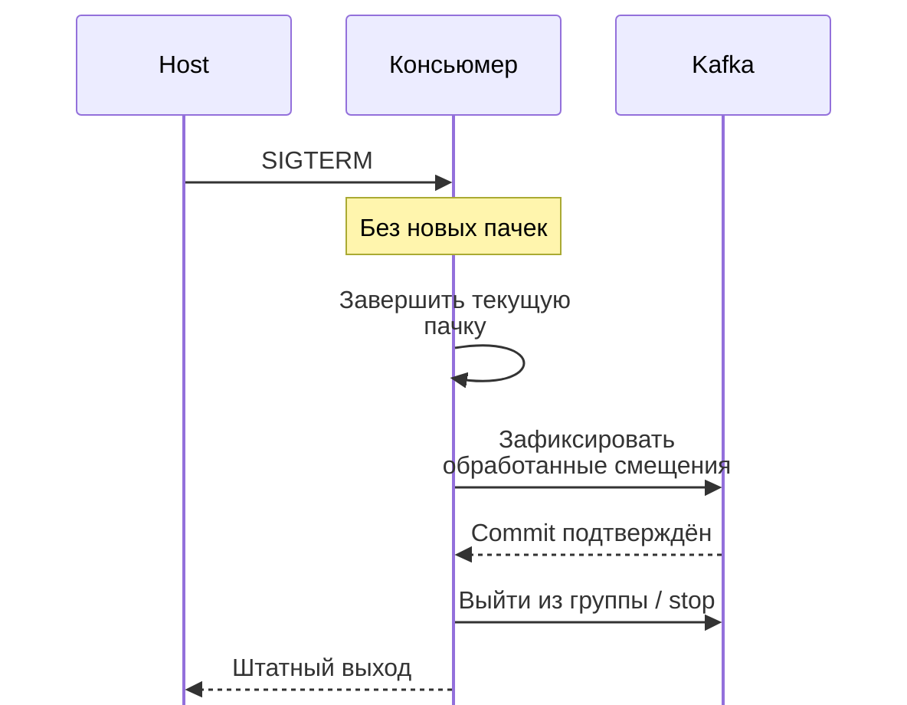

# Корректная остановка консьюмера Kafka в Kubernetes {#graceful-kafka-consumer-shutdown-in-kubernetes}

<div class="bdr-post__hero" data-bdr-post="2026-09-07-graceful-kafka-consumer-shutdown" role="img" aria-label="Завершить пакет, зафиксировать смещения, выйти из группы — и новая реплика сразу начнёт работу" markdown="0"></div>

Kafka consumer в Kubernetes развёртывается заново несколько раз в день, и каждый раз получает `SIGTERM` посреди пакета. Его действия в следующую секунду определяют две вещи: будут ли удерживаемые сообщения обработаны повторно и как долго замена будет ждать первой работы. Я построил типичный consumer — цикл с фиксацией после каждого пакета и обработчиком сигнала, завершающим процесс, — и измерил обновление. Новая реплика ждала первое сообщение тридцать секунд, три сообщения обработались дважды. Затем тот же цикл с завершением пакета, фиксацией и выходом из группы: ноль дубликатов, замена работала уже через треть секунды.

<!-- more -->

Результаты получены в [эксперименте статьи](../lab/2026-09-07-kafka-consumer-shutdown/README.md): Kafka в контейнере и управляющий скрипт, имитирующий обновление. Версии: aiokafka-foundation-kit 0.1.2, aiokafka 0.14.0, servicewright 0.10.0, Python 3.13.

## Что делает группа, когда участник исчезает {#what-the-group-does-when-a-member-disappears}

Партиции группы распределены между участниками; перераспределение, rebalance, происходит при вступлении или выходе. Участник, который *выходит*, сообщает координатору, и перераспределение начинается сразу. *Погибший* участник никого не уведомляет. Координатор замечает отсутствие heartbeat только после таймаута сессии и лишь тогда перераспределяет партиции. До этого партиции принадлежат уже несуществующему процессу, а замена, вступившая через секунду после начала обновления, сидит без партиций и сообщений.

Это первая цена неправильной остановки. Её платит новый pod, поэтому симптом выглядит как «развёртывание прошло нормально, но отставание очереди выросло на полминуты».

Вторая цена — смещения. Consumer, фиксирующий их после пакета и погибший посередине, успел обработать сообщения без фиксации. Замена начинает с последнего зафиксированного смещения и обрабатывает их снова. Для идемпотентного обработчика это лишняя работа, для остальных — повторный эффект. Об этом [статья об inbox](2026-09-07-transactional-inbox.md) и [статья о фоновых задачах](2026-09-07-idempotency-for-jobs-and-consumers.md).

## Измерение: consumer, который просто завершается {#measured-the-consumer-that-exits}

Цикл получает до пяти сообщений, обрабатывает каждое двести миллисекунд и фиксирует смещения после пакета. `SIGTERM` обрабатывается привычным завершением процесса:

```python
signal.signal(signal.SIGTERM, lambda *_: (log("SIGTERM: exiting now"), os._exit(143)))

async with consumer_lifecycle(settings(), topics=(TOPIC,)) as consumer:
    while True:
        batches = await consumer.getmany(timeout_ms=500, max_records=5)
        for records in batches.values():
            for message in records:
                await process(message)
        if batches:
            await consumer.commit()
```

Управляющий скрипт посылает `SIGTERM` после восьмого сообщения и запускает замену в той же группе:

```text
   1.20 s  committed
   1.40 s  processed 5
   1.60 s  processed 6
   1.80 s  processed 7
   1.80 s  SIGTERM: exiting now
   first instance:  processed 8 messages, exited with 143 0.00 s after the signal
   second instance: first message 29.61 s after start, processed 22; processed twice: [5, 6, 7]
```

Выход мгновенный — будто это и есть цель обработчика сигнала, хотя результат обратный. Процесс ушёл, не уведомив группу, и та ждала heartbeat до истечения таймаута сессии, прежде чем отдать партиции замене. Двадцать девять секунд новый pod был запущен, здоров и бездействовал. Сообщения пять–семь из незавершённого пакета уже обработались, но смещения не зафиксировались, поэтому замена обработала их снова.

## Протокол {#the-protocol}

Четыре шага те же, что у [HTTP-сервера](2026-09-07-graceful-shutdown-is-a-protocol.md), с другими действиями. Перестать брать новую работу: не получать следующий пакет. Завершить текущую: обработать весь уже полученный пакет, иначе понадобится повтор. Зафиксировать завершённое, чтобы замена начала после него. Корректно выйти из группы, запустив перераспределение сейчас, а не после таймаута сессии. Затем закрыть producer и пулы, выйти с кодом ноль — всё в пределах `terminationGracePeriodSeconds`.

Это тот же цикл, но сигнал превращается в событие, проверяемое между пакетами, а не внутри:

```python
async def consume(scope, stop: asyncio.Event) -> None:
    async with consumer_lifecycle(settings(), topics=(TOPIC,)) as consumer:   # stop() on exit: the group is left cleanly
        while not stop.is_set():
            batches = await consumer.getmany(timeout_ms=500, max_records=5)
            for records in batches.values():
                for message in records:                                       # the batch in flight is finished, stop or not
                    await process(message)
            if batches:
                await consumer.commit()
        log("stop seen between batches: leaving")
```

Обработчик сигнала принадлежит runtime и устанавливает событие. `stop()` потребителя вызывается при выходе из блока жизненного цикла и отправляет запрос выхода из группы. То же обновление:

```text
   1.84 s  processed 8
   2.04 s  processed 9
   2.05 s  committed
   2.05 s  stop seen between batches: leaving
   first instance:  processed 10 messages, exited with 0 0.45 s after the signal
   second instance: first message 0.31 s after start, processed 20; processed twice: []
```

Сигнал пришёл во время обработки пакета с сообщениями шесть–десять. Пакет завершился, смещения зафиксировались, цикл увидел событие, consumer вышел из группы, процесс завершился с нулевым кодом в пределах полусекунды. Замена вступила в группу, уже знавшую об уходе старого участника, и получила первое сообщение через три десятых секунды. Десять плюс двадцать — тридцать сообщений топика; повторной обработки нет.

<!-- diagram:concept -->
<figure class="bdr-diagram" markdown="1">
<figcaption><span class="bdr-diagram__eyebrow">ИДЕЯ В СХЕМЕ</span><strong>Завершите пачку до передачи работы</strong></figcaption>
<div class="bdr-diagram__viewport" markdown="1" data-search-exclude>



</div>
<p class="bdr-diagram__caption">При остановке перестаньте брать новую работу, завершите текущую пачку, зафиксируйте смещения и выйдите из группы. Новый консьюмер продолжит с зафиксированной позиции.</p>
</figure>
<!-- /diagram:concept -->

## Какие значения настроить {#the-numbers-to-set}

Размер пакета ограничивает длительность остановки: пять сообщений по двести миллисекунд — секунда работы, которую нужно дождаться. Бюджет завершения должен её покрывать. `max_records`, умноженный на время самого медленного сообщения, даёт время drain; `drain_grace_seconds` должен быть больше; `terminationGracePeriodSeconds` — ещё больше, с запасом на очистку. Это арифметика из статьи об остановке, где вместо текущего запроса — пакет.

Таймаут сессии — другая сторона того же вопроса. Столько группа терпит молчащего участника до перераспределения, и столько ей стоит его внезапная смерть. Нельзя просто сильно уменьшить таймаут: иначе перераспределение начнёт происходить при каждой паузе сборщика мусора. Решение — корректный выход.

`enable_auto_commit` остаётся выключенным. Автофиксация работает по таймеру независимо от завершения обработки: сбой может привести к пропуску сообщений вместо повтора. Фиксация после пакета обеспечивает повтор при сбое, а именно с ним и призван справляться inbox.

## Из чего это состоит {#the-pieces}

Consumer — обычный `AIOKafkaConsumer`, собранный из настроек библиотекой [aiokafka-foundation-kit](https://bedrock-python.github.io/aiokafka-foundation-kit/). Её `consumer_lifecycle` управляет запуском и остановкой; цикл между ними ваш. Событие остановки, бюджет drain и сигналы принадлежат [servicewright](https://bedrock-python.github.io/servicewright/): consumer становится одной из фоновых точек входа сервиса и получает тот же порядок завершения, что HTTP-сервер.

Суть — в строках второй реплики: двадцать девять секунд и три дубликата либо треть секунды и ни одного.
