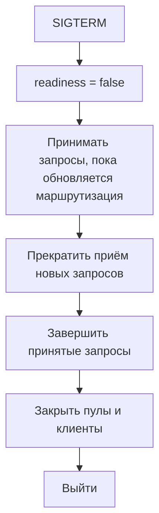

# Корректная остановка в Kubernetes — это протокол, а не обработчик сигнала {#graceful-shutdown-in-kubernetes-is-a-protocol-not-a-signal-handler}

<div class="bdr-post__hero" data-bdr-post="2026-09-07-graceful-shutdown-is-a-protocol" role="img" aria-label="Сначала вывести из маршрутизации, затем дождаться текущей работы, очистить ресурсы и выйти" markdown="0"></div>

Каждый веб-фреймворк обрабатывает `SIGTERM`: прекращает принимать соединения, даёт текущим запросам завершиться и аккуратно выходит. Именно это называют graceful в списке изменений, и я годами этому верил. Затем измерил запросы, приходящие в секунду после сигнала — в Kubernetes они как раз продолжают приходить, — и корректная остановка фреймворка отклонила 44 из них. Статья об этом измерении, четырёх шагах, которые действительно нужны pod, почти всегда пропускаемом шаге и арифметике, не позволяющей kubelet убить процесс на полпути.

<!-- more -->

Все числа получены в [эксперименте статьи](../lab/2026-09-07-graceful-shutdown/README.md): два сервера с одинаковыми маршрутами и скрипт, имитирующий Kubernetes. Версии: uvicorn 0.52.4, FastAPI 0.141.1, servicewright 0.10.0, httpx 0.28.1, Python 3.13.

## Что на самом деле делает Kubernetes {#what-kubernetes-actually-does}

Когда pod удаляется при обновлении или уменьшении числа реплик, параллельно происходят два процесса, не ожидающие друг друга:

1. Pod переходит в `Terminating`, и контроллер endpoints выводит его из набора адресов Service для обычного трафика. Изменение распространяется до каждого kube-proxy, ingress-контроллера и sidecar сервисной сетки по их собственному расписанию. В маленьком кластере это сотни миллисекунд, в большом — несколько секунд.
2. Kubelet начинает процедуру остановки контейнера с бюджетом `terminationGracePeriodSeconds` и отправляет главному процессу `SIGTERM` после выполнения `preStop`, если он задан. Когда бюджет заканчивается, следует `SIGKILL`.

Ключевое слово — *распространяется*. Некоторое время после сигнала балансировщики, ещё не получившие обновление, продолжают направлять новые соединения в pod. Если процесс закрывает слушающий сокет сразу по `SIGTERM`, все они получают отказ. Для клиента это ошибка соединения с внешне здоровым сервисом во время обычного развёртывания. Так появляется всплеск 5xx при каждом обновлении, который никто не может объяснить. Балансировщик не сломан: pod ушёл раньше, чем об этом узнали остальные.

## Измерение {#the-measurement}

У двух серверов одинаковые маршруты: `/work` занимает 20 мс, `/slow` — две секунды и изображает отчёт, экспорт или платёж, выполняющийся в момент сигнала. Скрипт запускает сервер, ждёт готовности, начинает один `/slow`, посылает `SIGTERM` и запускает таймер. Следующую секунду он отправляет `/work` каждые 20 мс, изображая ещё не уведомлённый балансировщик, и опрашивает readiness каждые 50 мс. Затем считает ответы.

Сначала FastAPI под `uvicorn.run` с обработчиками сигналов самого uvicorn — типичная конфигурация сервиса:

```text
uvicorn, SIGTERM, then 1 s of traffic at one request per 20 ms
   0.00 s  SIGTERM sent
   0.00 s  readiness probe -> 200
   0.06 s  readiness probe -> refused
   1.90 s  in-flight /slow request -> ok
   2.40 s  process exited
  requests after SIGTERM: {'ok': 3, 'refused': 44, '5xx': 0, 'other': 0}
```

Читайте две части отдельно. Текущий запрос завершился: uvicorn ждал его две секунды, и эта часть graceful shutdown работает. Но слушающий сокет закрылся в пределах ста миллисекунд после сигнала, и все последующие запросы балансировщика получили отказ на уровне TCP. Сорок четыре из сорока семи. Readiness перешёл прямо от `200` к `refused`, так что сигнал остановить маршрутизацию не успел дойти: pod просто исчез.

Uvicorn здесь не ошибается. Он не знает, что запросы ещё приходят: для этого нужно знать устройство Kubernetes, а веб-серверу это не положено. Знание должно находиться уровнем выше — у того, кто запускает сервер.

## Протокол {#the-protocol}

Корректная остановка Kubernetes — четыре шага в фиксированном порядке с общим ограничением времени. Два фреймворк уже выполняет. Два других выполнить сам не может.

**Первый: перестать сообщать о готовности, продолжая обслуживать запросы.** Сразу после сигнала readiness начинает отвечать `503`. Больше ничего не меняется: сокет открыт, запросы принимаются и обслуживаются. Несколько секунд pod остаётся исправным сервером, сообщающим о скором уходе. Это закрывает окно из первого раздела: компоненты, проверяющие readiness, увидят `503`, а получающие обновления списка endpoints успеют узнать об изменении.

**Второй: дать новости распространиться.** Фиксированная пауза по измеренной задержке кластера, в течение которой сохраняется первый режим. Её почти все пропускают: самому процессу она не нужна, он готов выйти. Она нужна запросам. Обычное решение — `preStop` в манифесте, который спит пять секунд до отправки сигнала. Оно работает, но живёт в YAML, задерживает сигнал вместо переключения readiness, и каждый сервис должен помнить о нём отдельно.

**Третий: завершить текущую работу — drain.** Теперь закрыть слушающий сокет и дать уже принятым запросам завершиться в пределах отведённого времени. Uvicorn хорошо делает эту часть; отличается только момент её начала.

**Четвёртый: освободить ресурсы в обратном порядке.** Остановить серверы, выполнить обработчики завершения при ещё открытой области приложения, закрыть пулы БД и клиенты, сбросить накопленные трассировки, выйти с кодом `0`. У каждого действия тоже есть бюджет: зависший dispose пула не должен съесть весь срок kubelet.

Общее ограничение времени:

```text
terminationGracePeriodSeconds  >  задержка + время завершения запросов + бюджет очистки + запас
```

Если ошибиться, kubelet отправит `SIGKILL` посреди третьего шага, и запрос, ради которого этот шаг существует, всё равно погибнет.

<!-- diagram:concept -->
<figure class="bdr-diagram" markdown="1">
<figcaption><span class="bdr-diagram__eyebrow">ИДЕЯ В СХЕМЕ</span><strong>Готовность меняется раньше закрытия порта</strong></figcaption>
<div class="bdr-diagram__viewport" markdown="1" data-search-exclude>



</div>
<p class="bdr-diagram__caption">Дайте изменениям маршрутизации распространиться до закрытия порта, затем завершите запросы и освободите ресурсы. Все фазы должны укладываться в бюджет завершения pod.</p>
</figure>
<!-- /diagram:concept -->

## То же измерение с протоколом {#the-same-measurement-with-the-protocol}

Servicewright выполняет именно эту последовательность: при событии остановки `serve()` возвращает управление, пока сервер ещё принимает запросы; Host переводит readiness в false, ждёт `drain_delay_seconds`, затем выполняет drain точек входа в обратном порядке, останавливает их и очищает ресурсы с ограничением `cleanup_timeout_seconds`. Определение сервиса — два маршрута FastAPI и три числа:

```python
from servicewright import AppSpec, Service, run_sync
from servicewright.adapters.fastapi import FastApiEntrypoint, HttpConfig

spec = AppSpec(
    service_name="shutdown-lab",
    create_container=lambda settings: Container(),
    drain_delay_seconds=1.5,     # step two: how long the news takes to travel in this cluster
    drain_grace_seconds=10.0,    # step three: how long in-flight work may take
    cleanup_timeout_seconds=5.0, # step four: per teardown step
)
service = Service(spec, entrypoints=[FastApiEntrypoint(config=HttpConfig(port=8000), routers=(router,))])
run_sync(service, Settings())
```

Тот же скрипт, та же секунда запросов:

```text
servicewright, drain_delay_seconds=1.5
   0.00 s  SIGTERM sent
   0.00 s  readiness probe -> 503
   1.90 s  in-flight /slow request -> ok
   2.41 s  process exited with 0
  requests after SIGTERM: {'ok': 47, 'refused': 0, '5xx': 0, 'other': 0}
```

Readiness отвечает `503` уже на первый опрос после сигнала, и ни один запрос не отклонён: ещё не уведомлённый балансировщик получал ответы всю секунду, пока продолжал отправку. Текущий запрос завершается на 1,90 с, drain начинается после задержки, вскоре процесс выходит с кодом `0`. Отличие от журнала uvicorn — полторы секунды, когда pod был не готов к маршрутизации, но оставался открытым.

Весь приём — в задержке. Посмотрим, что будет без неё: тот же сервис со стандартным `drain_delay_seconds`, равным нулю:

```text
servicewright, drain_delay_seconds=0
   0.00 s  SIGTERM sent
   0.00 s  readiness probe -> 503
   0.11 s  readiness probe -> refused
   1.90 s  in-flight /slow request -> ok
   2.41 s  process exited with 0
  requests after SIGTERM: {'ok': 5, 'refused': 42, '5xx': 0, 'other': 0}
```

Readiness переключается, порядок правильный, но слушатель закрывается в тот же момент. Балансировщик, проверяющий readiness раз в пять секунд, не успевает увидеть `503` до исчезновения сокета. Правильный порядок без временного окна даёт тот же результат, что отсутствие протокола. Пауза — обязательный шаг, а не оптимизация.

## Подбор значений {#sizing-the-numbers}

`drain_delay_seconds` — измеренная задержка распространения endpoints в вашем кластере плюс запас. Часто хватает одной–трёх секунд; сервисная сетка или медленный ingress могут увеличить её до пяти. Эта цена платится только при завершении pod. При всплесках ошибок во время обновлений сначала стоит проверить именно её.

`drain_grace_seconds` — максимальная длительность запроса, который вы готовы дождаться. Обычное значение — тридцать секунд; сервису с запросами до двух секунд может хватить десяти.

`cleanup_timeout_seconds` ограничивает каждый шаг освобождения ресурсов. Зависший dispose пула после этого времени журналируется и пропускается, чтобы остальные шаги тоже выполнились.

Далее манифест — здесь нужна арифметика:

```yaml
readinessProbe:
  httpGet:
    path: /system/health/readyz
    port: 8000
  periodSeconds: 5
terminationGracePeriodSeconds: 60   # 1.5 + 10 + 5, and a lot of slack
```

## Не только HTTP {#not-only-http}

Тот же протокол нужен всем точкам входа, которых в сервисе обычно несколько. Kafka consumer, получивший `SIGTERM` посреди пакета, проходит те же шаги: убрать готовность, прекратить получать новые записи, закончить текущий пакет и зафиксировать смещения, корректно выйти из группы для быстрого перераспределения, затем закрыть producer и пулы. Планировщик перестаёт запускать новые задачи и ждёт текущую. gRPC-сервер прекращает принимать потоки и ждёт открытые. Порядок и бюджеты общие, поэтому им место в одном runtime, а не в отдельных обработчиках фреймворков. Сервис с HTTP API и consumer в одном процессе завершает их в порядке, обратном запуску.

## Что изменилось в коде {#what-changed-in-the-code}

Маршруты, обработчики и uvicorn не изменились. Добавились единый жизненный цикл, управляющий порядком, и три числа. Это [servicewright](https://bedrock-python.github.io/servicewright/): его Host проводит любой набор точек входа через Bootstrap, Warmup, Ready, Serve, Drain и Cleanup. Арифметика выше приведена на [странице Kubernetes](https://bedrock-python.github.io/servicewright/operations/kubernetes/). FastAPI остаётся обычным приложением под обычным uvicorn; runtime забирает только решение о времени остановки.

Суть — во второй половине журнала: полторы секунды `503` и ни одного отказа в соединении.
