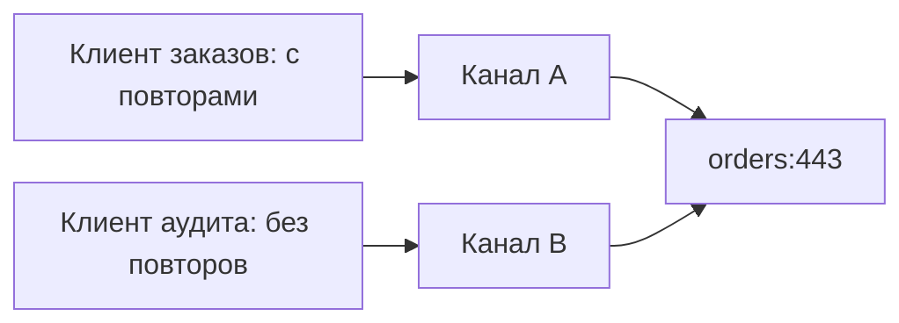

# Пул gRPC-каналов нельзя строить только по адресу {#grpc-channels-should-not-be-pooled-by-address-alone}

<div class="bdr-post__hero" data-bdr-post="2026-09-07-grpc-channels-pooled-by-identity" role="img" aria-label="Идентичность канала включает адрес, учётные данные, параметры и перехватчики" markdown="0"></div>

gRPC-канал дорого открывать и дёшево держать открытым. Поэтому у каждого сервиса с несколькими gRPC-зависимостями появляется пул каналов, а первый пул — всегда словарь с ключом `host:port`. Ключ очевидный, но неверный: при создании `grpc.aio` закрепляет в канале не только адрес, но и учётные данные, параметры, сжатие и цепочку перехватчиков. Изменить их потом нельзя. Два клиента с одинаковым адресом и различием в любом из этих пунктов получают один канал, и второй незаметно выполняет вызовы с конфигурацией первого. Я измерил простейший случай: клиент аудита без политики повторов всё-таки сделал три попытки, потому что делил адрес с клиентом заказов.

<!-- more -->

Результаты получены [скриптом статьи](../lab/2026-09-07-grpc-channel-identity/README.md) с сервером внутри процесса, считающим входящие попытки. Версии: grpc-client-kit 0.1.0, grpcio 1.83.1, Python 3.13.

## Что такое канал {#what-a-channel-is}

В `grpc.aio` канал создаётся с target, учётными данными либо признаком небезопасного соединения, параметрами вроде keepalive и ограничений размера сообщений, стандартным сжатием и списком перехватчиков. Всё фиксируется при создании. Нет `channel.add_interceptor()` или изменения параметров: API — `insecure_channel(target, options, compression, interceptors)`, и полученный канал остаётся таким. Это намеренно: перехватчики выполняются внутри канала, а состояние соединения, таймер keepalive и задержки переподключения зависят от этих аргументов.

Поэтому идентичность канала — весь кортеж. Пул, использующий только один элемент, адрес, рано или поздно отдаст одному клиенту канал, созданный для другого.

## Измерение: клиент аудита, который повторил вызов {#measured-the-audit-client-that-retried}

Два клиента одного процесса обращаются к ledger по одному адресу. У клиента заказов политика трёх попыток при `UNAVAILABLE`: неудачную запись заказа нужно повторить. У клиента аудита повторов нет: запись должна пройти один раз либо вернуться как ошибка, без повторной отправки. Ledger на всё отвечает `UNAVAILABLE` и считает запросы. Сначала пул с ключом по адресу:

```text
pool keyed by address:  orders -> UNAVAILABLE after 3 attempt(s) at the server
                        audit  -> UNAVAILABLE after 3 attempt(s) at the server   (the audit client inherited the orders client's retries)
```

Клиент аудита запросил канал к `127.0.0.1:port`; пул уже хранил канал заказов с его перехватчиками. Единственный вызов аудита превратился в три попытки на сервере. Конфигурация аудита не требует повторов, а его код не может узнать, что они произошли. В реальном ledger это могут быть три записи, две ошибки `ALREADY_EXISTS` или дубликат, найденный сверкой через месяц.

Те же клиенты с пулом по полной идентичности:

```text
pool keyed by identity: orders -> UNAVAILABLE after 3 attempt(s) at the server
                        audit  -> UNAVAILABLE after 1 attempt(s) at the server   channels in the pool: 2
```

Два канала к одному адресу, по одному на цепочку перехватчиков. Каждый клиент получает именно заявленную политику. Два канала — минимально необходимое число для двух конфигураций, потому что конфигурация живёт в канале.

<!-- diagram:concept -->
<figure class="bdr-diagram" markdown="1">
<figcaption><span class="bdr-diagram__eyebrow">ИДЕЯ В СХЕМЕ</span><strong>Одинаковый адрес не означает одинаковый канал</strong></figcaption>
<div class="bdr-diagram__viewport" markdown="1" data-search-exclude>



</div>
<p class="bdr-diagram__caption">Цепочка интерсепторов входит в идентичность канала. Повторно используйте каждую идентичность между запросами, но разделяйте каналы клиентов с разными политиками.</p>
</figure>
<!-- /diagram:concept -->

## Обратная ошибка: канал на каждый вызов {#the-opposite-mistake-a-channel-per-call}

Когда цепочка входит в ключ, ошибка может стать обратной. Цепочка состоит из *экземпляров* перехватчиков; два списка, собранные по одинаковой конфигурации из новых экземпляров, имеют разную идентичность. Если сервис пересоздаёт цепочку на каждый запрос — из осторожности или потому, что вызов сборщика оказался в обработчике, — он получает новый канал на каждый вызов:

```text
a chain built per call:  5 calls -> 5 channels
one chain per target:    5 calls -> 1 channel(s)
```

Пять вызовов, пять каналов, пять установлений соединения, пять таймеров keepalive и неограниченный рост пула под нагрузкой. Правило: собрать цепочку один раз на target и повторно использовать список. Поэтому клиент кеширует её для target, а фабрика перехватчиков вызывается на target, а не на каждый запрос. То же относится к учётным данным: пул сравнивает их по идентичности объектов, поскольку gRPC credentials не определяют равенство. Новый объект credentials на каждый запрос означает новый канал.

## Параметры тоже входят в ключ {#options-are-identity-too}

Первым обычно встречается keepalive. Если клиент пингует сервер каждые десять секунд, сервер должен это разрешать, иначе ответит `GOAWAY` и `ENHANCE_YOUR_CALM`. Интервал keepalive — аргумент канала. Как и границы задержки переподключения, максимальные размеры сообщений и строка политики балансировки. Два клиента одного адреса с разными keepalive:

```text
two connectivity configs -> 2 channels
```

Снова два канала, и снова необходимый минимум. Пул отказывается объединять то, что сам gRPC объединить не позволяет.

## Работоспособность проверяется по адресу {#health-per-address}

Одна вещь всё же относится к адресу, а не полной идентичности: доступность сервера. Проверка здоровья опрашивает адреса; если адрес неисправен, одновременно неисправны все каналы к нему независимо от параметров и цепочки. Поэтому флаг работоспособности пула имеет ключ по адресу и меняет все соответствующие записи, а сами каналы хранятся по полной идентичности. Два ключа отвечают на два вопроса: «какой канал несёт эту конфигурацию?» и «отвечает ли кто-нибудь по этому адресу?». Смешивать их — ошибка в любом направлении.

## Пул {#the-pool}

```python
from grpc_client_kit import ChannelPool, GrpcClient, GrpcClientConfig, RetryConfig, TimeoutConfig, build_interceptors

retrying = build_interceptors(timeout=TimeoutConfig(default=2.0), retry=RetryConfig(max_attempts=3))
plain = build_interceptors(timeout=TimeoutConfig(default=2.0))       # built once each, reused

async with ChannelPool() as pool:                                     # one per process; owns the channels
    orders = GrpcClient(LedgerStub, GrpcClientConfig(target="ledger:50051"), pool, interceptors=retrying)
    audit = GrpcClient(LedgerStub, GrpcClientConfig(target="ledger:50051"), pool, interceptors=plain)
    async with orders as stub:                                        # a stub on the channel for THIS identity
        await stub.Post(request)
```

Пул владеет каналами и живёт дольше всех клиентов. Клиент ничем не владеет, и его дёшево создавать на запрос: он выбирает target и просит пул о канале с подходящей идентичностью. Ключ включает target, режим безопасности, идентичность credentials, параметры, сжатие и токен цепочки — всё, что `grpc.aio` закрепил при создании.

Так устроен `ChannelPool` в [grpc-client-kit](https://bedrock-python.github.io/grpc-client-kit/guide/channels/). Его проектирование началось именно с ключа.

Суть — во второй строке первой таблицы: три попытки у клиента, настроенного на одну.
