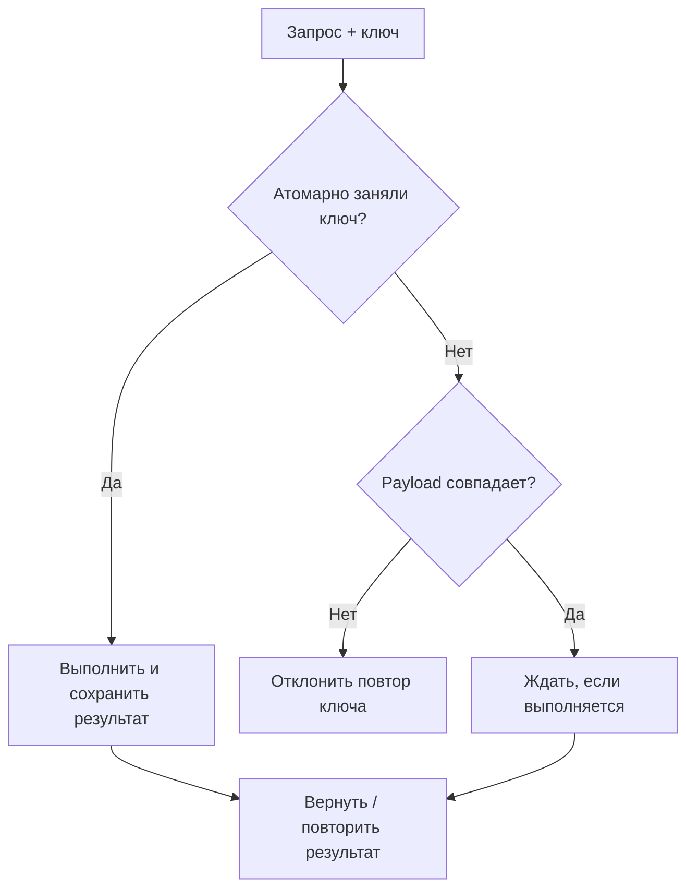

# Ключи идемпотентности: часть, которую обычно реализуют неправильно {#idempotency-keys-the-part-everyone-gets-wrong}

<div class="bdr-post__hero" data-bdr-post="2026-09-07-idempotency-keys-the-part-everyone-gets-wrong" role="img" aria-label="Главный случай — повтор, пришедший до завершения первого запроса" markdown="0"></div>

`Idempotency-Key` — одна из самых копируемых и чаще всего неправильно реализуемых идей платёжных API. Первая реализация обычно кеширует результат: найти ключ, вернуть сохранённый ответ, иначе выполнить операцию и записать результат. Все тесты проходят, потому что второй запрос в них приходит после завершения первого. Но ключ особенно нужен в противоположном случае: клиент получил таймаут и повторил запрос, пока первый ещё выполняется. Я построил провайдера платежей, считающего списания, и воспроизвёл этот случай с тремя реализациями одного ключа. Кеш результатов списал деньги дважды.

<!-- more -->

Числа получены [скриптом статьи](../lab/2026-09-07-idempotency-keys/README.md) с Redis 7 в контейнере. Версии: idempotency-kit 0.3.0, redis 8.1.0, Python 3.13.

## Что обещает ключ {#what-the-key-promises}

Для клиента контракт короткий: если отправить одинаковый запрос дважды с одним ключом, эффект возникнет один раз, а ответы совпадут. Это позволяет повторять `POST` после таймаута, не гадая, прошёл ли первый запрос: повтор либо вернёт сохранённый ответ, либо создаст его, а списание останется одно.

У обещания две половины, которые обычно реализуют в неправильном порядке. «Одинаковый ответ» — кеш. «Один эффект» — гарантия при конкуренции. Кеш легко даёт первую половину, а вторую — лишь когда второй запрос приходит после завершения первого. Интересный случай — запрос, который ещё выполняется.

## Измерение: первый запрос ещё работает {#measured-the-request-that-is-still-running}

Провайдер списывает деньги за 300 мс. Клиент отправляет запрос и через 50 мс, получив собственный таймаут, посылает идентичный с тем же ключом. Три реализации, одно хранилище, один ключ:

```text
in_flight='run'    (a result cache)         responses=['ch_1', 'ch_1']                     charges made=['ch_1', 'ch_2']
in_flight='wait'   (the default)            responses=['ch_1', 'ch_1']                     charges made=['ch_1']
in_flight='raise'  (409 for the second)     responses=['ch_1', 'IdempotencyInProgressError'] charges made=['ch_1']
```

Внимательно посмотрите на первую строку: она выглядит правильной. Оба клиента получили `ch_1`, ответы согласованы, все проверки ответа проходят. Но провайдер списал деньги дважды. Второй запрос не нашёл записи — первый ещё не успел её сохранить, — выполнил списание, затем проиграл гонку записи результата и вернул результат победителя. Согласованные ответы, повторный эффект. Ошибка видна не в ответе API, а в выписке по карте.

Вторая строка — исправление через резервацию. До действия координатор записывает под ключом маркер *pending* с коротким сроком аренды. Второй запрос находит его, понимает, что идентичная операция выполняется, и ждёт результат вместо повторного действия. Оба получают `ch_1`, списание одно, для повторившего клиента всё прозрачно.

Третья строка использует ту же резервацию, но иначе отвечает на «кто-то уже делает это»: сразу возвращает ошибку. HTTP-слой отображает её в `409 Conflict`. Такой подход подходит публичному API, где не стоит удерживать соединение, пока выполняется другой запрос. Внутренние клиенты чаще предпочитают ждать. Оба режима корректны и выбираются настройкой; простой кеш не обеспечивает ни одного.

<!-- diagram:concept -->
<figure class="bdr-diagram" markdown="1">
<figcaption><span class="bdr-diagram__eyebrow">ИДЕЯ В СХЕМЕ</span><strong>Что происходит при повторном запросе с тем же ключом</strong></figcaption>
<div class="bdr-diagram__viewport" markdown="1" data-search-exclude>



</div>
<p class="bdr-diagram__caption">Политика wait: перед выполнением атомарно занять ключ. Совпадающий запрос ждёт результат первой операции; другой payload с тем же ключом отклоняется.</p>
</figure>
<!-- /diagram:concept -->

## Это всё ещё не блокировка ресурса {#it-is-still-not-a-lock}

Резервацию принимают за блокировку и пытаются так использовать, поэтому важно обозначить границу. Блокировка защищает ресурс на время. Резервация защищает *ключ* на одну попытку: «этот запрос обрабатывается». Она ничего не говорит о заказе, балансе и других ресурсах, за которые могут конкурировать разные ключи. Два запроса с разными ключами на списание с одной карты проходят параллельно, как и должны. Ключ — заявление клиента об одинаковом запросе, а не захват карты.

Аренда не даёт случайно получить вечную блокировку. Pending без срока истечения навсегда заблокирует ключ после гибели worker посреди списания. С арендой просроченный маркер считается отсутствующим, следующий запрос забирает ключ и выполняет действие. В худшем случае возвращается поведение at-least-once для запроса с погибшим worker, чей исход всё равно неизвестен. Аренда должна превышать длительность самой медленной нормальной попытки; обычное значение — тридцать секунд.

## Ключ не описывает запрос {#the-key-is-not-the-request}

Вторая ошибка кеша менее заметна. Ключ идентифицирует запрос, но не описывает его. Клиент естественным образом строит ключ из номера заказа, затем отправляет *другое* действие с тем же заказом и случайно повторно использует ключ. Хранилище только по ключу отвечает результатом первого запроса:

```text
same key, same amount     -> replayed ch_1, charges made=1
same key, amount 5        -> IdempotencyKeyReuseError, charges made=1
```

Исправление — отпечаток рядом с результатом: хеш полей, определяющих запрос. Совпавший отпечаток позволяет повторно вернуть ответ; несовпавший вызывает отказ с обоими отпечатками в ошибке, которую HTTP-слой может отобразить в `422`. Ключи предназначены одинаковым запросам. Набор полей определяется операцией: timestamp и trace id могут законно меняться при повторе, а хеш всего запроса запретил бы нужные повторы. Явно перечислите значимые поля и хешируйте их.

## Ошибки не кешируются; хранилище тоже может сломаться {#failures-are-not-cached-and-neither-is-the-store}

Ещё два правила, которые часто упускает кеш результатов.

Действие, выбросившее исключение, не должно оставлять запись, чтобы повтор мог запустить его снова:

```text
first call  -> provider timed out
second call -> ch_1, charges made=1
```

При ошибке действия pending освобождается. Второй вызов не находит записи и выполняет одно списание. Кеширование ошибки превратило бы временный таймаут провайдера в постоянную невозможность оплатить заказ на весь срок ключа — противоположность цели повторов.

Само хранилище тоже может быть недоступно. Это решение библиотека не должна принимать за вашу предметную область; команде стоит сформулировать его явно:

```text
Redis unreachable -> the action ran anyway: ch_1, charges made=1  (availability over exactly-once, by design)
```

Без хранилища нельзя знать, встречался ли ключ. Fail closed останавливает записи до восстановления Redis. Fail open выполняет операцию с риском повтора. Библиотека выбирает fail open, журналирует и считает ошибки хранилища; решение превратить их в жёсткий отказ оставляет вызывающему коду, знающему цену повторения. Для сброса кеша продолжение очевидно приемлемо. Для списания важно, дедуплицирует ли провайдер по собственному ключу; разумно передать ключ дальше и использовать его защиту.

## Область действия и срок хранения {#scope-and-lifetime}

Несколько решений задаются настройками, но принять их должна каждая реализация:

- **Область действия.** Ключ уникален для операции, а не всей системы. Один ключ под `order.create` и `order.cancel` даёт две записи, поэтому клиент может использовать его на этапах одного процесса. Изоляцию по пользователю или арендатору обеспечивает вызывающий код: включите арендатора в ключ.
- **Срок хранения.** Запись должна пережить максимально поздний повтор: минуты при сетевых таймаутах, сутки при перезапуске упавшей пакетной задачи. Частое значение — 24 часа; минимальное — минута, поскольку слишком короткая запись может не пережить создавший её запрос.
- **Размер.** До 255 символов в ключе, результат хранится как JSON. Слишком большой ответ не стоит кешировать целиком: сохраните ссылку и загрузите данные при повторе.

## Как это выглядит {#the-shape}

Полная обёртка сценария использования:

```python
from idempotency_kit import AsyncIdempotencyCoordinator, IdempotencyDomainService, PydanticResultAdapter, async_idempotent
from idempotency_kit.infra.storage.redis.aio import RedisAsyncIdempotencyRepository

coordinator = AsyncIdempotencyCoordinator(
    RedisAsyncIdempotencyRepository(redis, key_prefix="idempotency:"),
    IdempotencyDomainService(default_ttl_minutes=60 * 24),
    in_flight="wait",                       # or "raise" for a public API: 409 for the second caller
    in_flight_lease_seconds=30,             # longer than the slowest honest attempt
)


class ChargeOrder:
    def __init__(self, coordinator: AsyncIdempotencyCoordinator) -> None:
        self.coordinator = coordinator

    @async_idempotent(
        operation="payment.charge",
        adapter=PydanticResultAdapter(Charge),
        infra_param="coordinator",
        fingerprint_params=("order_id", "amount"),   # the parts of the request that make it this request
    )
    async def execute(self, order_id: str, amount: int, *, idempotency_key: str | None = None) -> Charge:
        return await self.provider.charge(order_id, amount, idempotency_key=idempotency_key)
```

Здесь видны три решения: ответ второму конкурентному запросу, срок удержания ключа погибшим worker и аргументы, определяющие одинаковый запрос. Четвёртое — поведение без Redis — документированное значение по умолчанию. Вызов провайдера внизу передаёт ключ дальше: у провайдера собственная идемпотентность, и вместе эти уровни защищают однократность через сеть.

Это [idempotency-kit](https://bedrock-python.github.io/idempotency-kit/). В версии 0.3.0 кеш результатов превратился в резервацию после того, как первую таблицу статьи воспроизвели на предыдущей версии.

Суть — в первой таблице: одинаковые ответы и два списания.
