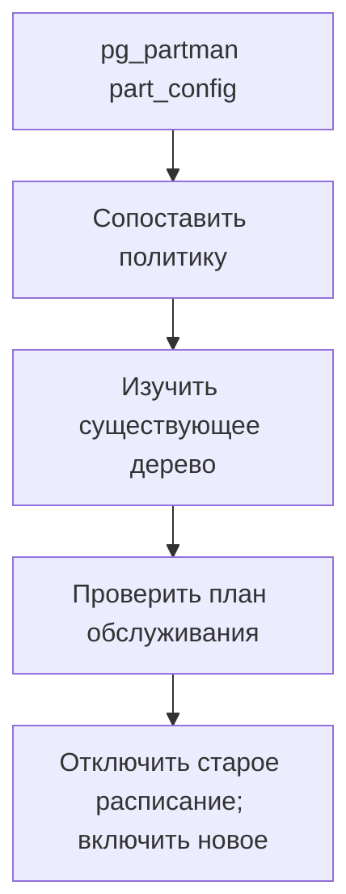

# Переход с pg_partman на управление партициями из приложения {#migrating-from-pg_partman-to-application-managed-partitions}

<div class="bdr-post__hero" data-bdr-post="2026-09-07-migrating-from-pg-partman" role="img" aria-label="Принадлежность определяется границами, поэтому существующее дерево принимается без перестройки" markdown="0"></div>

pg_partman — стандартный и хороший ответ на обслуживание партиций PostgreSQL, когда доступны расширения и команда готова управлять логикой внутри БД. Уходят от него по трём причинам: управляемый PostgreSQL не предоставляет расширение, Python-команда хочет тестировать и развёртывать эту логику вместе с приложением, либо нужно видеть действия обслуживания заранее. Миграцию останавливает один вопрос: что станет с существующими партициями? Измеренный ответ — ничего. Они принимаются под управление на месте.

<!-- more -->

Числа получены в [эксперименте статьи](../lab/2026-09-07-migrating-from-pg-partman/README.md): PostgreSQL 17 с pg_partman 5.5.0 в контейнере. Версии: pg-partsmith 1.5.1, Python 3.13.

## Что построил pg_partman {#what-pg_partman-built}

```text
    events_default     DEFAULT
    events_p20260701   FOR VALUES FROM ('2026-07-01 00:00:00+00') TO ('2026-08-01 00:00:00+00')
    events_p20260801   FOR VALUES FROM ('2026-08-01 00:00:00+00') TO ('2026-09-01 00:00:00+00')
    events_p20260901   FOR VALUES FROM ('2026-09-01 00:00:00+00') TO ('2026-10-01 00:00:00+00')
    events_p20261001   FOR VALUES FROM ('2026-10-01 00:00:00+00') TO ('2026-11-01 00:00:00+00')
    events_p20261101   FOR VALUES FROM ('2026-11-01 00:00:00+00') TO ('2026-12-01 00:00:00+00')
```

Пять месячных партиций и DEFAULT, созданные через `create_parent` с `p_premake := 2` и обслуживаемые `run_maintenance`. Это обычные таблицы PostgreSQL, присоединённые к родителю диапазонами. Их связь с pg_partman задаёт строка его конфигурационной таблицы.

## Конфигурация и есть миграция {#the-configuration-is-the-migration}

```text
    control                created_at
    partition_interval     1 mon
    premake                2
    retention              3 months
    retention_keep_table   True
```

Пять полей и их соответствия:

| pg_partman | pg-partsmith |
|---|---|
| `control` | `partition_column` |
| `partition_interval = '1 mon'` | `granularity=PartitionGranularity.MONTH` |
| `premake = 2` | `creation=CreateAhead(count=3)` |
| `retention = '3 months'` | `retention=KeepNewest(count=3)` либо `KeepFor(timedelta(days=90))`, с учётом различий календарных месяцев и фиксированной длительности |
| `retention_keep_table = true` | `drop=DropNever()` |

Два пункта требуют внимания. **`premake` считает партиции *впереди*, а `CreateAhead` включает текущую**: переносится как `premake + 1`. Ошибка на единицу здесь самая простая. **`retention` задаёт длительность, `KeepNewest` — количество**. Они совпадают лишь при соответствующих интервалах. `KeepFor` задаёт длительность, `KeepNewest` — часто подразумеваемое число периодов; 90 дней и три календарных месяца не всегда равны.

Остальное в `part_config` — шаблонная таблица, расписание фонового worker, `infinite_time_partitions` — либо не имеет прямого аналога из-за другого устройства библиотеки, либо переходит к существующему планировщику задач вне БД.

## Принятие под управление не требует отдельного шага {#adoption-is-not-a-step}

Интересно, что библиотека видит в дереве, которое не строила:

```text
    inspect: the root has 6 children, 0 detached partition(s) known to the library
    plan for public.events:
      nothing to do
```

Действий нет. Не «принять пять партиций» и не «чужие объекты»: дерево уже соответствует конфигурации.

Потому что **принадлежность определяется границами, а не именами**. Партиция на сетке схемы участвует в её жизненном цикле независимо от названия и создавшего инструмента. `events_p20260901` покрывает ровно сентябрь — значит, это сентябрьская партиция. Не нужны команда принятия и импорт метаданных, а окно с существующей партицией не получит дубликат.

Имена не станут единообразными, и это нормально:

```text
    events__2026_12     <- created by pg-partsmith
    events_p20260801    <- created by pg_partman
    events_p20260901
```

Две схемы именования в одном дереве понятны обоим инструментам: решение о назначении таблицы не опирается на имя.

## Период совместной работы {#running-both-at-once}

Переход можно растянуть во времени:

```text
--- 4. one tick of pg-partsmith on the same table
    created=0 detached=0 dropped=0 issues=0 error=None
--- 5. and one more run of pg_partman, after pg-partsmith's tick
    6 partitions: events_default, events_p20260701, ..., events_p20261101
```

В эксперименте оба менеджера последовательно обслужили одну таблицу и ничего не сделали: дерево уже соответствовало обеим конфигурациям. Согласованное дерево требует ноль DDL, и второй последовательный запуск находит результат первого. Это измерение не гарантирует безопасность конкурентных разрушительных операций двух независимых менеджеров.

Полезный порядок: неделю запускать новый инструмент только в режиме плана и сравнивать его с реальными действиями pg_partman, затем передать ему применение и выключить старое обслуживание. Так можно проверить поведение заранее и явно передать ответственность.

При пересечении нужно согласовать две вещи. Создание вперёд: если один инструмент создаёт дальше, второй просто обнаружит готовую партицию. **Политика хранения** должна совпадать: иначе один удалит ожидаемое другим. До отключения старого менеджера используйте `DropNever()` и отдельно контролируйте отсоединения; запрет drop сам по себе не запрещает detach.

## Отключение pg_partman {#switching-pg_partman-off}

Для этой таблицы достаточно удалить строку `part_config`. Затем зададим политику, отличную от прежней:

```text
    plan for public.events:
      CREATE public.events__2026_12 (create_ahead)
      DETACH public.events_p20260701 (retention_expired)
    created=1 detached=1 dropped=0 issues=0
    detached: events_p20260701
      marker='pg-partsmith:orphan-parent=public.events\npg-partsmith:detach'
```

Создать на месяц дальше вперёд, хранить на месяц меньше истории. Библиотека создала свою декабрьскую партицию и вывела из обращения июльскую, созданную pg_partman: она не создавала таблицу, но теперь управляет её жизненным циклом.

Последняя строка показывает гарантию безопасности. Перед отсоединением библиотека записывает в комментарий таблицы маркер: кем и от какого родителя она отсоединена. Позднее удаление проверяет этот маркер. Отсоединённая таблица без него считается чужой и не удаляется. Июльская партиция теперь может быть удалена после отсрочки, а другие отсоединённые таблицы — нет. Это [логика безопасного хранения](2026-09-07-partition-retention-is-not-drop-table.md), применённая к унаследованному дереву.

<!-- diagram:concept -->
<figure class="bdr-diagram" markdown="1">
<figcaption><span class="bdr-diagram__eyebrow">ИДЕЯ В СХЕМЕ</span><strong>Передайте политику обслуживания, а не данные</strong></figcaption>
<div class="bdr-diagram__viewport" markdown="1" data-search-exclude>



</div>
<p class="bdr-diagram__caption">pg-partsmith изучает существующее дерево партиций. Сопоставьте прежнюю политику, проверьте план и передайте управление расписанием; два обслуживающих процесса не дают общей гарантии безопасной конкуренции.</p>
</figure>
<!-- /diagram:concept -->

## Что вы теряете и получаете {#what-you-give-up-and-what-you-get}

**Теряете** встроенный фоновый worker. pg_partman умеет обслуживать себя внутри БД через `pg_partman_bgw`. Библиотеке приложения нужен внешний вызов: Kubernetes CronJob, APScheduler, Celery beat или ваш планировщик. Это существенная эксплуатационная разница. Если БД надёжнее планировщика команды, есть причина остаться.

**Получаете** три вещи, измеренные в других статьях серии: план до выполнения, отказ трогать неопознанные таблицы и обслуживание, которое версионируется, тестируется и развёртывается вместе с приложением. Для Python-команды последнее часто решающее: политика партиций проходит то же ревью, что код записи данных.

**Оба инструмента** в показанном сценарии оставляют DEFAULT-партицию без изменений. Если в ней есть реальные строки, их перенос — отдельная миграция, описанная в [статье о переносе данных](2026-09-07-how-to-partition-an-existing-postgresql-table.md).

## Инструменты {#the-pieces}

Принятие дерева выше — обычная работа [pg-partsmith](https://bedrock-python.github.io/pg-partsmith/): те же `inspect`, `plan` и `maintain`, что для собственного дерева. Определение принадлежности по границам делает существующее дерево обычным входом, а маркер не даёт политике хранения удалять чужие отсоединённые таблицы.

Пять партиций, две схемы имён, одно дерево — ни одна партиция не пересоздана.
