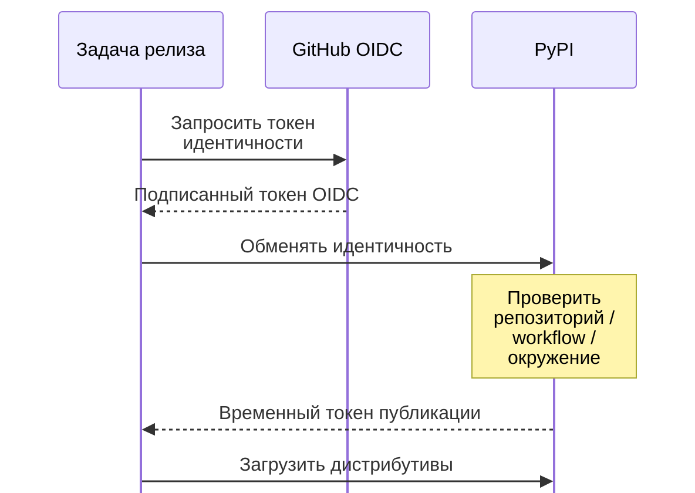

# Публикация в PyPI без API-токенов: полный путь Trusted Publishing {#publishing-to-pypi-without-api-tokens-trusted-publishing-end-to-end}

<div class="bdr-post__hero" data-bdr-post="2026-09-07-publishing-to-pypi-without-api-tokens" role="img" aria-label="Краткоживущее удостоверение запуска вместо сохранённого ключа" markdown="0"></div>

API-токен PyPI в секретах репозитория — пароль без срока действия, ограниченный проектом, но не объясняющий, кто именно его использовал. Trusted Publishing заменяет его удостоверением: GitHub Actions предъявляет краткоживущий OIDC-токен с репозиторием, workflow и окружением, а PyPI решает, разрешена ли этой комбинации публикация. Постоянный секрет не нужно хранить и менять. Ниже весь путь Bedrock-репозиториев от слитого PR до wheel в PyPI, включая восстановление после сбоев.

<!-- more -->

Сегодня по этой схеме выпущены шесть библиотек, поэтому каждый шаг ниже реально выполнялся. Файлы workflow находятся в `.github/workflows/` каждого репозитория.

## Что заменяет токен {#what-replaces-the-token}

Задача публикации объявляет одно разрешение и одно окружение:

```yaml
permissions:
  contents: read
  id-token: write        # Trusted Publisher (PyPI OIDC)

jobs:
  publish:
    environment: pypi
```

`id-token: write` позволяет запросить у GitHub OIDC-токен. Это подписанное утверждение о *конкретном* запуске: репозиторий, файл workflow, ref, окружение. Инструмент публикации обменивает его в PyPI на краткоживущий токен загрузки. PyPI разрешает обмен, только если сведения соответствуют настроенному Trusted Publisher.

На стороне PyPI четыре поля: владелец и имя репозитория, имя файла workflow, имя окружения. Важны обе стороны. Другой файл workflow не сможет публиковать, как и нужный workflow без указанного окружения.

Отсутствие постоянного токена видно по секретам репозитория:

```text
CODECOV_TOKEN
```

Это весь список. Токена PyPI нет ни в репозитории, ни в окружении `pypi`, ни в аргументах шага публикации:

```yaml
- run: uv build
- run: uv publish --check-url https://pypi.org/simple/redis-client-kit/
```

`uv publish` без переданных credentials использует доступный OIDC-механизм. При неверной настройке Trusted Publishing PyPI возвращает понятный отказ 403 с диагностикой ожидаемой идентичности.

<!-- diagram:concept -->
<figure class="bdr-diagram" markdown="1">
<figcaption><span class="bdr-diagram__eyebrow">ИДЕЯ В СХЕМЕ</span><strong>Обменяйте проверенную идентичность на временный токен</strong></figcaption>
<div class="bdr-diagram__viewport" markdown="1" data-search-exclude>



</div>
<p class="bdr-diagram__caption">PyPI сверяет идентичность workflow с настройками доверенного издателя. Задача получает временный токен вместо хранения постоянного секрета PyPI.</p>
</figure>
<!-- /diagram:concept -->

## Окружение управляет допуском {#the-environment-is-the-gate}

`environment: pypi` — не украшение. Окружение GitHub может требовать проверяющих, паузу и допустимую ветку; задача ждёт выполнения этих правил. К этому же имени привязана конфигурация PyPI. Для публикации должна совпасть вся доверенная идентичность, включая репозиторий и окружение.

В этих репозиториях у окружения нет дополнительных правил защиты: публикация допускается для тега, который автоматизация релиза создала после слияния PR. Если каждый выпуск должен подтверждать человек, добавьте обязательного проверяющего окружения: перед загрузкой появится шаг согласования без изменения механизма credentials.

## От слитого PR к тегу {#from-a-merged-pull-request-to-a-tag}

Другая половина процесса решает, *что* публиковать. На входе conventional commits, на выходе PR релиза:

```yaml
on:
  push:
    branches: [master]

jobs:
  release-please:
    steps:
      - uses: googleapis/release-please-action@v5
```

Action поддерживает один открытый PR проекта с новой версией, changelog по сообщениям коммитов после прошлого релиза и обновлением дополнительных файлов:

```json
"extra-files": [
  { "type": "generic", "path": "redis_client_kit/__version__.py" }
]
```

Последняя часть стоит этих двух строк. Версия в одном файле, обновляемом автоматизацией, не расходится с тегом. После слияния PR action создаёт тег и релиз GitHub, затем работу продолжает публикация.

Тип коммита определяет изменение версии: `fix:` — patch, `feat:` — minor, `!` или `BREAKING CHANGE:` — major согласно принятой конфигурации версионирования. Это ограничивает сообщения коммитов намеренно: версия выводится из изменений, а не выбирается уставшим человеком.

## Почему публикацию запускает workflow_run {#the-publish-trigger-and-why-it-is-a-workflow_run}

```yaml
on:
  workflow_run:
    workflows: ["Release Please"]
    types: [completed]
  workflow_dispatch:
    inputs:
      tag:
        description: "Release tag to publish (e.g. redis-client-kit-v0.1.0)"
```

Workflow публикации запускается после завершения workflow релиза и проверяет: оставил ли тот тег релиза на этом коммите?

```bash
TAG=$(git tag --points-at HEAD | grep -E '^redis-client-kit-v' | head -1)
```

Обычно ответ «нет»: обычное слияние в основную ветку запускает автоматизацию, которая лишь обновляет PR релиза. Задача останавливается. Тег появляется после слияния самого PR релиза — этот запуск и публикует пакет.

Перед сборкой версия ещё раз записывается из тега:

```bash
VERSION="${TAG#redis-client-kit-v}"
echo "__version__ = \"$VERSION\"" > redis_client_kit/__version__.py
```

Автоматизация уже закоммитила эту строку. Повтор — страховка: артефакт PyPI в любом случае получает версию тега сборки. Вот шаг из сегодняшнего запуска:

```text
    __version__ = "0.2.0"
    Successfully built dist/redis_client_kit-0.2.0.tar.gz
    Successfully built dist/redis_client_kit-0.2.0-py3-none-any.whl
    Publishing 2 files to https://upload.pypi.org/legacy/
    Uploading redis_client_kit-0.2.0-py3-none-any.whl (33.0KiB)
    Uploading redis_client_kit-0.2.0.tar.gz (23.5KiB)
```

## Когда что-то идёт не так {#the-day-something-goes-wrong}

Два механизма восстановления, оба использованы сегодня.

**Публикация завершилась частично.** `--check-url https://pypi.org/simple/<project>/` делает повторную загрузку безопасной: уже опубликованные файлы пропускаются вместо ошибки «file already exists». Если wheel загрузился, а перед sdist соединение оборвалось, можно повторить запуск. Опубликованное имя файла в PyPI нельзя просто заменить повторной загрузкой.

**Публикация не началась.** Вход `workflow_dispatch` принимает тег для ручного запуска. Это выход, когда тег есть, но автоматический запуск не произошёл: сбой GitHub, отключённый workflow, отмена из-за очереди. Сборка идёт из тега и публикует именно выпущенную версию.

Третий сбой не связан с загрузкой и сегодня случился дважды: нестабильный инфраструктурный шаг CI самого PR релиза. Автоматизация не может слить PR с упавшими проверками, и внешне готовый релиз не выходит. Достаточно перезапустить ошибочные задачи. Поэтому стоит проследить выпуск до конца, а не считать слитый PR опубликованным пакетом.

## Практические преимущества {#what-this-buys-concretely}

- **Нет постоянного токена для ротации.** Не нужно следить за его заменой и отзывом при уходе сотрудника.
- **Нет сохранённого секрета для случайной утечки.** Его нельзя вывести отладочным шагом или случайно закоммитить; защита самого привилегированного workflow всё равно важна.
- **Уже область доверия.** Идентичность включает репозиторий, workflow и окружение. Другой workflow того же репозитория не становится доверенным автоматически.
- **Осмысленный аудит.** Происхождение публикации связано с репозиторием и workflow, а не просто с кем-то, имевшим общий токен.

Ограничение: нужен поддерживаемый PyPI провайдер CI. Локальному `uv publish` с ноутбука снова понадобятся credentials. Для процесса, отказавшегося от ручных релизов с ноутбука, это подходящая граница.

## Инструменты {#the-pieces}

Всё включено в [python-library-template](https://github.com/bedrock-python/python-library-template): четыре workflow, конфигурация релиза с файлом версии, окружение `pypi` и настройка репозитория. Новая библиотека — генерация шаблона и один Trusted Publisher в PyPI. Её первый релиз пройдёт тем же путём, что шестой сегодняшний.
