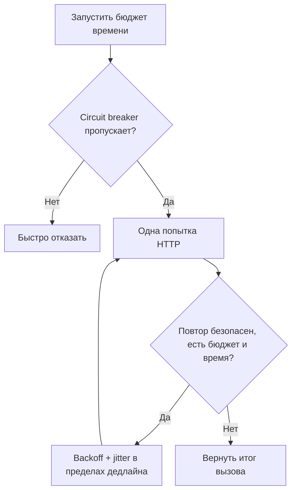

# Надёжность — это не `retry=3` {#reliability-is-not-retry3}

<div class="bdr-post__hero" data-bdr-post="2026-09-07-reliability-is-not-retry-3" role="img" aria-label="Повторы — один из четырёх механизмов и единственный, добавляющий нагрузку" markdown="0"></div>

`retry=3` первым добавляют в HTTP-клиент и последним пересматривают. Это одна настройка, а не стратегия надёжности. В обычный день она незаметна, поэтому переживает любое ревью. Я направил сорок клиентов к одной зависимости и измерил повторы, дедлайн, бюджет повторов и circuit breaker по отдельности и вместе. На исправной зависимости повторы ничего не стоили. На неисправной утроили нагрузку на уже падающий сервис.

<!-- more -->

Числа получены в [эксперименте статьи](../lab/2026-09-07-reliability-is-not-retry-3/README.md): сорок конкурентных клиентов и origin внутри процесса. Версии: clientwright 0.2.2, httpx 0.28.1, Python 3.13.

## Почему повторы кажутся бесплатными {#why-retries-look-free}

Зависимость медленная, но исправна: две секунды на запрос.

```text
  no retries, total=30s     origin saw  40 (1.00x)  ok=40  slowest caller 2.09s
  retry=3, total=30s        origin saw  40 (1.00x)  ok=40  slowest caller 2.05s
```

Результат одинаков. Повторы срабатывают на ошибках, которых не было; настройка не изменила нагрузку, задержку и исход. Так обычно выглядит `retry=3`, поэтому о ней больше не думают.

## Цена в критический момент {#what-they-cost-when-it-matters}

Те же сорок клиентов, та же зависимость, теперь отвечающая `503`:

```text
  no retries    origin saw  40 (1.00x)  ok=0  503=40
  retry=3       origin saw 120 (3.00x)  ok=0  503=40
```

Втрое больше запросов, ни одного дополнительного успеха. Неисправная зависимость теперь получает тройную нагрузку от клиентов, пытающихся защититься от её сбоя. Самим клиентам не лучше: каждый получил ту же ошибку чуть позже.

В этом проблема `retry=3` как стратегии. Повторы полезны при *независимых* сбоях: плохое соединение, неудачный узел, краткий сбой. Они вредят при *коррелированных* отказах перегруженной или сломанной зависимости: все клиенты повторяют одновременно в худший момент. `max_attempts` ограничивает один вызов и не различает эти ситуации.

## Дедлайн — первый настоящий механизм {#a-deadline-is-the-first-real-mechanism}

```text
  retry=3, total=1.0s (a deadline)  origin saw 40 (1.00x)  ok=0
                                    slowest caller 1.00s  HttpxDeadlineExceededError=40
```

Здесь произошло две вещи; вторую часто упускают.

Хорошая: все клиенты получили исход через секунду вместо ожидания двух. Дедлайн превращает медленную зависимость в быстрый отказ запроса. Его можно обработать запасным путём, кешем, собственным `503` с `Retry-After`. Поздний успех после ухода пользователя ничего не стоит.

Вторая: **origin всё равно получил сорок запросов и выполнил все сорок**. Он не знает, что клиент ушёл. Дедлайн защищает *вызывающую сторону*, но не зависимость, пока не передаётся вместе с запросом и не останавливает ненужную работу. Это [передача дедлайна](2026-09-06-timeouts-are-not-deadlines.md), отличающая общий срок операции от локального ожидания.

Общий дедлайн также ограничивает цену повторов: `max_attempts=3` не превратит двухсекундный вызов в шестисекундный, если весь вызов ограничен бюджетом. Без дедлайна повторы умножают задержку, с ним укладываются в обещанный срок.

## Бюджет повторов ограничивает усиление нагрузки {#a-retry-budget-removes-the-amplification}

```text
  retry=3                    origin saw 120 (3.00x)  503=40
  retry=3, budget_ratio=0.1  origin saw  50 (1.25x)  503=40  budget refused 40
```

Бюджет — отношение повторов к обычным запросам, общее для всех вызовов клиента. Десять процентов разрешают один повтор на десять обычных запросов. Когда запас исчерпан, ошибка возвращается сразу.

Сорок повторов отклонены, origin получил на четверть больше трафика вместо утроения. Единичный нестабильный вызов ещё получает повтор: бюджет не является общим выключателем. При редких ошибках поведение прежнее, при массовых нагрузка перестаёт множиться. Механизм реагирует на частоту отказов, не требуя заранее классифицировать их причину.

## Circuit breaker защищает следующую волну {#a-circuit-breaker-protects-the-next-wave-not-this-one}

```text
  retry=3, budget, breaker(8, 5s)  origin saw 50 (1.25x)  503=40
```

Для первой одновременной волны автомат ничего не изменил, и это правильно. Все сорок вызовов уже начались до подсчёта сбоев. Польза видна в следующей:

```text
  wave 1 through one client: origin saw 50, 0.09s, 503=40
  wave 2 through one client: origin saw  0, 0.00s, HttpxCircuitOpenError=40
```

Вторая волна не дошла до origin. Сорок клиентов сразу узнали о недоступности — без соединения, таймаута и ожидания. Circuit breaker превращает дорогой медленный сбой в дешёвый локальный и снимает нагрузку, мешающую восстановлению.

Цена проявляется при восстановлении:

```text
  the first success after the origin healed: 5.04 s (breaker recovery_timeout is 5 s)
```

Origin был исправен пять секунд, прежде чем клиенты узнали. Это прямой компромисс: короткий интервал проверки быстрее замечает восстановление, но рискует нагрузить ещё нестабильный сервис; длинный бережнее, но продлевает видимую недоступность. Поэтому автомат нужен по origin: один плохой хост не должен закрывать исправный. Подробности — [в статье о ключе автомата](2026-09-07-circuit-breakers-should-be-per-origin.md).

## Чего эти механизмы не делают {#what-none-of-them-do}

Механизмы выше управляют тем, как *клиент* переживает отказ. Ни один не делает повторную запись безопасной.

`POST` с таймаутом мог выполниться или нет; клиент не знает, а эти настройки не решают проблему. Двойное списание происходит потому, что повтор неидемпотентной операции опасен при любом бюджете. Нужен распознаваемый сервером ключ — [идемпотентность](2026-09-07-idempotency-keys-the-part-everyone-gets-wrong.md). Пока безопасное повторение не обеспечено, для такой записи корректно ограничиться одной попыткой.

Они также не добавляют мощности. Бюджет и автомат не дают вашему клиенту усугубить перегрузку, но не создают серверов и не заменяют серверное управление допуском запросов.

## Список настроек {#the-list}

Для каждой зависимости нужны четыре решения вместо одного:

1. **Дедлайн** из бюджета вызывающей стороны, передаваемый дальше для остановки ненужной работы.
2. **Политика повторов**, укладывающаяся в дедлайн и реагирующая на временные сбои, а не неверные запросы.
3. **Бюджет повторов**, ограничивающий рост нагрузки при массовых отказах.
4. **Circuit breaker по origin**, быстро отклоняющий обращения к недоступной зависимости и дающий ей восстановиться.

Плюс механизм вне клиента: ключ идемпотентности для меняющих состояние операций, чтобы повтор не создавал новое действие.

`retry=3` — только второй пункт, без первого, третьего и четвёртого, с молчаливым предположением о пятом.

<!-- diagram:concept -->
<figure class="bdr-diagram" markdown="1">
<figcaption><span class="bdr-diagram__eyebrow">ИДЕЯ В СХЕМЕ</span><strong>Повторы находятся внутри ограниченного вызова</strong></figcaption>
<div class="bdr-diagram__viewport" markdown="1" data-search-exclude>



</div>
<p class="bdr-diagram__caption">Дедлайн ограничивает общее время, бюджет — дополнительную работу, circuit breaker — вызовы нездорового origin. Каждый механизм ограничивает отдельную часть сбоя.</p>
</figure>
<!-- /diagram:concept -->

## Инструменты {#the-pieces}

Все четыре настраиваются в одном клиенте [clientwright](https://bedrock-python.github.io/clientwright/): `TimeoutConfig`, `RetryConfig` с `max_attempts`, статусами и `budget_ratio`, `CircuitBreakerConfig` по origin. Дедлайн между сервисами передаёт [deadline-budget](https://bedrock-python.github.io/deadline-budget/), безопасный повтор записи обеспечивает ключ [idempotency-kit](https://bedrock-python.github.io/idempotency-kit/).

Одна настройка утроила трафик к уже неисправной зависимости. Не хватало трёх остальных.
