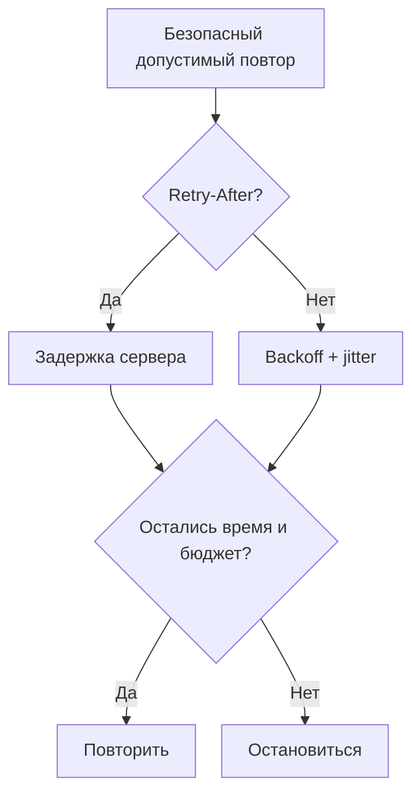

# Retry-After, backoff и jitter: что делает HTTP-клиент в продакшене {#retry-after-backoff-and-jitter-what-a-production-http-client-actually-does}

<div class="bdr-post__hero" data-bdr-post="2026-09-07-retry-after-backoff-and-jitter" role="img" aria-label="Растущие паузы и разброс попыток во времени, с учётом указанной сервером задержки" markdown="0"></div>

Обычный цикл повторов — четыре строки: попытаться, поймать, подождать, повторить. Рабочая политика HTTP-клиента требует примерно восьми решений, которые этот цикл молча принимает неправильно. Фиксированная пауза синхронизирует всех упавших клиентов. Заголовок с просьбой сервера подождать игнорируется. Повторяется `POST`, который сервер уже мог получить. Повторяется `500`, хотя тот же запрос может снова вызвать ту же внутреннюю ошибку. Это не экзотика: каждый пункт встречался в разборах инцидентов. Ниже — проверки с origin, воспроизводящим по одной проблеме.

<!-- more -->

Числа получены [скриптом статьи](../lab/2026-09-07-retry-after-backoff-jitter/README.md) с origin внутри процесса. Версии: clientwright 0.2.2, httpx 0.28.1, Python 3.13.

## Учитывать Retry-After {#honour-retry-after}

Когда сервер отвечает `503` или `429` с `Retry-After`, он сообщает то, что формула задержки может только предположить: сколько подождать. Клиент, всё равно использующий собственную паузу, возвращается раньше и усиливает проблему. Две попытки к origin с `503` и `Retry-After: 1`:

```text
respect_retry_after=True (default)   -> 503 after 1.02s (server asked for 1 s between attempts)
respect_retry_after=False            -> 503 after 0.06s (server asked for 1 s between attempts)
```

Первый клиент выдержал запрошенную секунду. Второй — собственные пятьдесят миллисекунд и снова обратился к восстанавливающемуся серверу. При наличии заголовок заменяет вычисленную паузу; верхний предел, по умолчанию шестьдесят секунд, не даёт ошибочной настройке внешнего сервиса задержать запрос на час.

## Jitter или новая волна {#jitter-or-the-herd}

Пятьдесят клиентов одновременно сталкиваются со сбоем: так бывает, когда зависимость падает и все текущие запросы разом завершаются ошибкой. Все ждут и повторяют. С фиксированной паузой они повторят одновременно, создав вторую волну того же размера:

```text
fixed backoff 0.3 s, no jitter   retries landed between 0.39s and 0.40s  (spread 12 ms, 49 within 10 ms of the median)
backoff 0.3 s, jitter=0.5        retries landed between 0.17s and 0.49s  (spread 314 ms, 5 within 10 ms of the median)
```

Сорок девять из пятидесяти повторов в окне десять миллисекунд: только что оправившаяся зависимость снова получает пятьдесят одновременных запросов. Jitter, случайный множитель задержки, распределяет их примерно по трети секунды; максимум в окне — пять. Это одно умножение, отличающее сглаживание сбоя от его воспроизведения. Экспоненциальный рост между попытками — 0,1 с, 0,2 с, 0,4 с — раздвигает их во времени так же, как jitter раздвигает разных клиентов. Рабочая политика включает оба; четырёхстрочный цикл — ни одного.

## Таймаут чтения не равен ошибке подключения {#a-read-timeout-is-not-a-connection-error}

Ошибка установления соединения означает, что запрос по этому соединению ещё не отправлен. Таймаут чтения означает, что запрос отправлен, но ответ не получен вовремя; неизвестно, выполнил ли сервер действие. Для корректного `GET` разница несущественна. Для `POST` со списанием — принципиальна. Отправим `POST` к origin с двухсекундным ответом, таймаутом чтения 0,3 с и разрешёнными тремя попытками:

```text
POST, read timeout at 0.3 s, 3 attempts allowed -> ReadTimeout; the origin received 1 POST(s)
the same POST marked idempotent=True           -> ReadTimeout; the origin received 3 POST(s)
```

По умолчанию клиент не повторил `POST`, origin получил его один раз. Когда вызывающий код явно объявил операцию идемпотентной, клиент повторил, и origin получил три запроса «списать 10 EUR». Оба поведения соответствуют настройке; ошибка — выбрать второе без знания безопасности. Метод задаёт стандарт: `GET`, `HEAD`, `PUT`, `DELETE`, `OPTIONS`, `TRACE` идемпотентны по HTTP, `POST` — нет. Место вызова может переопределить это: объявить защищённый ключом `POST` повторяемым или запретить повторы для некорректно меняющего состояние `GET`.

## Что вообще повторяется {#what-is-retried-at-all}

Шесть запросов с шестью типами исхода, разрешены три попытки:

```text
GET 503          -> 503            attempts=3
GET 500          -> 500            attempts=1
GET 429          -> 429            attempts=3
GET disconnect   -> 200            attempts=2
POST 503         -> 503            attempts=1
DELETE 503       -> 503            attempts=3
```

`503` сообщает о временной невозможности обслужить запрос и повторяется. `500` означает внутреннюю ошибку: неизменённый запрос может снова попасть в тот же сбойный код, поэтому по умолчанию повторов нет. `429` повторяется с учётом `Retry-After`, но не считается сбоем circuit breaker: сервер отвечает и ограничивает частоту. Разрыв соединения в показанном безопасно повторяемом вызове вызвал повтор, и вторая попытка прошла. `POST` с тем же `503`, который повторили `GET` и `DELETE`, не повторяется по причине предыдущего раздела.

Оставшиеся условия таблица не показывает: попытка вместе с паузой должна помещаться в общий дедлайн — [статья о дедлайнах](2026-09-06-timeouts-are-not-deadlines.md); невоспроизводимое тело, например потоковая загрузка, запрещает повторы; общий бюджет origin может отклонить уже разрешённую остальными условиями попытку — [статья о бюджете](2026-09-07-retries-can-make-an-outage-worse.md).

## Конфигурация {#the-checklist}

Все перечисленные решения в явных настройках:

```python
from clientwright import ClientConfig, RetryConfig, TimeoutConfig, build

config = ClientConfig(
    service_name="orders",
    timeout=TimeoutConfig(total=5.0),          # every attempt and every sleep fit inside this
    retry=RetryConfig(
        max_attempts=3,
        initial_backoff=0.1, multiplier=2.0,   # 0.1 s, 0.2 s, ... between attempts
        max_backoff=10.0,
        jitter=0.2,                            # ±20 %: no herd
        respect_retry_after=True,              # the server's number beats the formula
        retry_after_max=60.0,
        retryable_status={429, 502, 503, 504}, # 500 is not on this list on purpose
        # methods: the idempotent ones; a call site may say otherwise for one request
    ),
)
client = build("httpx", config)
```

Четырёхстрочный цикл содержит лишь одно из девяти решений — число попыток, — и часто путает даже его с числом повторов. Здесь явно записаны стандартные настройки [clientwright](https://bedrock-python.github.io/clientwright/guide/retries/). Сервис обычно меняет общий бюджет времени, а место вызова — идемпотентность `POST`, который действительно сделан безопасным для повторения.

Суть — в столбце измерения списаний: один запрос или три запроса на списание.

<!-- diagram:concept -->
<figure class="bdr-diagram" markdown="1">
<figcaption><span class="bdr-diagram__eyebrow">ИДЕЯ В СХЕМЕ</span><strong>Для повтора нужны основание и время</strong></figcaption>
<div class="bdr-diagram__viewport" markdown="1" data-search-exclude>



</div>
<p class="bdr-diagram__caption">Повторяйте только безопасную операцию при подходящем результате. Учитывайте Retry-After, иначе используйте backoff с jitter; останавливайтесь, если ожидание и новая попытка не укладываются в дедлайн.</p>
</figure>
<!-- /diagram:concept -->
