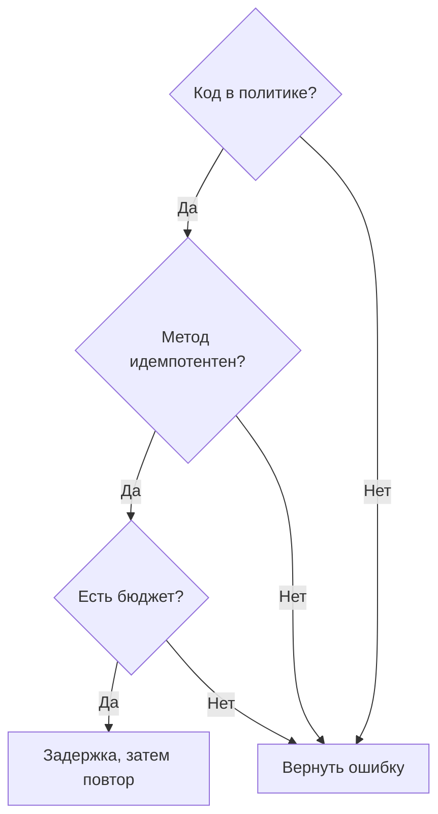

# Безопасные повторы gRPC: какие статусы действительно стоит повторять {#safe-grpc-retries-which-status-codes-you-should-actually-retry}

<div class="bdr-post__hero" data-bdr-post="2026-09-07-safe-grpc-retries" role="img" aria-label="Статус помогает выбрать повтор, но сам по себе не гарантирует безопасность эффекта" markdown="0"></div>

`max_attempts=3` — самая частая и редко осмысленная строка gRPC-конфигурации. Повтор — ставка на то, что сервер ещё не сделал работу и повторение ничего не стоит. Некоторые статусы дают основания для этой ставки, большинство — нет. `INTERNAL` особенно подозрителен, но я и сам не раз включал его в повторы. Я построил платёжный сервер со счётчиком списаний и проверил политики. Повтор `INTERNAL` списал деньги трижды. Повтор общепринятого `UNAVAILABLE` тоже дал три списания в одном из двух сценариев возникновения. Ниже таблица кодов, измерения и три настройки честной политики.

<!-- more -->

Числа получены в [эксперименте статьи](../lab/2026-09-07-safe-grpc-retries/README.md): локальный `grpc.aio`-сервер с обработчиком `Charge`, который воспроизводит заданные сбои и считает действия. Версии: grpcio 1.83.1, grpc-client-kit 0.1.0, Python 3.13.

## Что статус сообщает о выполненной работе {#what-a-status-code-tells-you-about-the-work}

Статусы gRPC классифицируют ошибки, а политике повторов нужно понять ещё и то, запускался ли обработчик. Одного статуса для надёжного ответа на второй вопрос не всегда достаточно.

```text
the request was refused before the handler ran        the request is wrong; retrying changes nothing
──────────────────────────────────────────────        ──────────────────────────────────────────────
UNAVAILABLE          connection failed, server         INVALID_ARGUMENT      the payload is bad
                     draining, no healthy backend      NOT_FOUND             the thing is not there
RESOURCE_EXHAUSTED   quota, flow control, a full       ALREADY_EXISTS        it was already done
                     queue ahead of the handler        PERMISSION_DENIED     you may not
                                                      UNAUTHENTICATED       who are you
                     usually. see below.               FAILED_PRECONDITION   the world is not in the right state
                                                      OUT_OF_RANGE          past the end
                                                      UNIMPLEMENTED         no such method

the handler ran, and nobody knows how far
─────────────────────────────────────────
INTERNAL             the handler raised; the write it made before raising is still there
UNKNOWN              an exception nobody mapped
DATA_LOSS            exactly what it says
ABORTED              a conflict mid-transaction; retry the transaction, not the RPC
DEADLINE_EXCEEDED    the request's budget is spent; a retry spends more of what is gone
CANCELLED            the caller left
```

Первый столбец содержит кандидатов на повтор, но с оговоркой. Второй — ошибки клиента или факты предметной области, для которых повтор добавляет шум. Третий опасен повторными эффектами: сервер мог успеть выполнить действие до ошибки.

Стандартный набор [grpc-client-kit](https://bedrock-python.github.io/grpc-client-kit/) — только `{UNAVAILABLE, RESOURCE_EXHAUSTED}` из первого столбца. Вот почему нужна оговорка.

## Измерение: пять способов неудачного списания {#measured-five-ways-to-fail-a-charge}

`Charge` увеличивает счётчик в момент предполагаемого списания. До этой строки он может отказать, после — завершиться ошибкой. Клиент отправляет одинаковый запрос с `max_attempts=3` и разными политиками. Таблица показывает ответ клиенту, попытки на сервере и списания.

```text
UNAVAILABLE before the handler ran                              -> OK           attempts=2  charges=1
INTERNAL after the charge, default policy                       -> INTERNAL     attempts=1  charges=1
INTERNAL after the charge, INTERNAL made retryable              -> INTERNAL     attempts=3  charges=3
UNAVAILABLE after the charge, default policy                    -> UNAVAILABLE  attempts=3  charges=3
UNAVAILABLE after the charge, Charge not in idempotent_methods  -> UNAVAILABLE  attempts=1  charges=1
```

Первая строка — случай, ради которого существуют повторы. Первая реплика завершала работу и отказала до действия, вторая попытка попала на исправную. Одно списание, успешный ответ. Это реальная польза повторов.

Вторая — правильное стандартное поведение: обработчик списал деньги, затем не записал ledger и вернул `INTERNAL`. Повтора нет. Клиент видит ошибку, списание одно. Результат неприятен, но честен и допускает разбор.

Третью конфигурацию я писал не раз: «INTERNAL временный, наши серверы возвращают его при сбое БД, повторяем». Три попытки, три списания, в конце всё тот же `INTERNAL`. Клиент не видит ни одного успеха. Эту строку стоит запомнить.

Четвёртая — оговорка. `UNAVAILABLE` часто возникает до выполнения обработчика, но так же может выглядеть гибель реплики после списания и до ответа либо намеренный abort обработчика. Стандартная политика не различает причины. Три списания.

Пятая исправляет четвёртую явным разрешённым списком. `idempotent_methods` перечисляет безопасно повторяемые методы. Всё вне списка не повторяется независимо от статуса. `Charge` не включён и получает одну попытку; читающий `Export` включён и сохраняет повторы.

Политика сочетает два решения: статус указывает транспортную возможность повтора, метод — допустимость для бизнеса. Нужны оба.

<!-- diagram:concept -->
<figure class="bdr-diagram" markdown="1">
<figcaption><span class="bdr-diagram__eyebrow">ИДЕЯ В СХЕМЕ</span><strong>Для повтора нужны три условия</strong></figcaption>
<div class="bdr-diagram__viewport" markdown="1" data-search-exclude>



</div>
<p class="bdr-diagram__caption">Одного подходящего статуса недостаточно: метод должен допускать повтор, а задержка и попытка — укладываться в оставшийся дедлайн и лимит попыток.</p>
</figure>
<!-- /diagram:concept -->

## Дедлайн относится к вызову, а не попытке {#the-deadline-is-for-the-call-not-the-attempt}

Вторая популярная настройка — таймаут, вторая популярная ошибка — перемножить её с попытками. Три попытки по десять секунд превращаются в тридцать, если нет общего ограничения.

```text
1.5 s then UNAVAILABLE, timeout 2.0 s, 3 attempts allowed  -> DEADLINE_EXCEEDED  attempts=2  charges=0  2.01s
```

Обработчик спит полторы секунды и отказывает. Таймаут вызова — две секунды. Слой повторов один раз превращает его в дедлайн и выдаёт каждой попытке остаток: первая получает 2,0 с и падает на 1,5; пауза занимает десятую; вторая получает 0,4 с и упирается в дедлайн; третья не начинается. Клиент ждал обещанные 2,01 с. При независимых таймаутах попыток ожидание составило бы 4,7 с.

[Статья о дедлайнах](2026-09-06-timeouts-are-not-deadlines.md) разбирает такой вызов внутри цепочки из пяти. Правило на каждом уровне одно: повтор расходует бюджет, не продлевает его.

## Автомат считает попытки {#the-breaker-counts-attempts}

В этой реализации gRPC circuit breaker находится под слоем повторов и видит исход каждой попытки. Отсюда следствие для порога:

```text
fail_threshold=2 under max_attempts=3, first call              -> CircuitBreakerOpenError  attempts=2  charges=2
fail_threshold=2 under max_attempts=3, first call, recoverable -> OK                       attempts=2  charges=1
```

В первой строке один неудачный вызов разомкнул собственную цепь: две ошибки достигли порога, третья попытка была отклонена ещё в процессе. Клиент получил `CircuitBreakerOpenError` вместо серверного `UNAVAILABLE`. Во второй строке первая попытка упала, вторая прошла, счётчик обнулился.

Поэтому здесь `fail_threshold` должен превышать `max_attempts`, иначе защита от лавины сработает уже на первом плохом вызове. Обычная пара — пять и три.

## Потоки — особый случай {#streams-are-not-calls}

Unary-stream RPC, оборвавшийся посередине, по умолчанию не повторяется. При включении повторов внимательно читайте результат:

```text
unary-stream breaks at item 3, default policy               -> UNAVAILABLE  client received [1, 2]              server attempts=1
same, retry_streaming=True and Export in idempotent_methods -> OK           client received [1, 2, 1, 2, 3, 4, 5]  server attempts=2
```

Повтор потока — *перезапуск с начала*. Сервер снова отправляет всё, а потребитель повторно видит уже полученные элементы один и два. Вторая строка успешна для транспорта, но даёт дубликаты потребителю. Поэтому библиотека требует и флаг, и разрешённый список и журналирует каждый такой повтор. Потоку, переживающему разрыв, нужен токен возобновления в протоколе. Потоковые запросы в обратную сторону вообще не повторяются: итератор уже потреблён первой попыткой.

## Явно записанная политика {#the-policy-written-down}

```python
from grpc_client_kit import CircuitBreakerConfig, RetryConfig, TimeoutConfig, build_interceptors

chain = build_interceptors(
    timeout=TimeoutConfig(default=2.0, per_method={"/lab.Payments/Export": 30.0}),
    retry=RetryConfig(
        max_attempts=3,                                        # per call, inside the timeout above
        idempotent_methods={"/lab.Payments/Export", "/lab.Payments/GetCharge"},
    ),                                                         # retryable_codes stays at the default two
    circuit_breaker=CircuitBreakerConfig(fail_threshold=5),   # more than max_attempts
)
```

Три явно названных решения: два стандартных кода-кандидата на повтор, полный список безопасно повторяемых методов без `Charge` и порог автомата выше числа попыток. Таймаут принадлежит всему вызову; слой повторов распределяет, а не умножает его. Остальные настройки — задержка и jitter: они управляют нагрузкой, но не делают повторный эффект корректным.

Ещё одна полезная проверка: библиотека предупреждает о native gRPC `retryPolicy` в service config канала. Эти повторы выполняются ниже всех перехватчиков; два слоя могут дать девять запросов, неочевидных из журналов. Выберите один цикл повторов на вызов.

Суть — в третьей строке первой таблицы: три списания, а клиент увидел ошибку.
