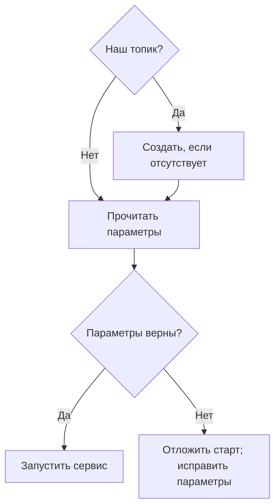

# Должно ли приложение создавать топики Kafka при запуске? {#should-your-application-create-kafka-topics-on-startup}

<div class="bdr-post__hero" data-bdr-post="2026-09-07-should-your-application-create-kafka-topics-on-startup" role="img" aria-label="Топик могут создать три стороны; одна из них молча создаёт неправильный" markdown="0"></div>

Кто-то должен создать топик. Кандидатов три: брокер автоматически при первом упоминании имени, приложение при запуске или человек через процесс управления кластером. У каждого варианта есть проблема, которая обнаруживается спустя недели. Самая знакомая — топик с одной партицией и опечаткой в имени, незаметно созданный producer и принимающий трафик, которого никто не читает.

<!-- more -->

Числа получены в [эксперименте статьи](../lab/2026-09-07-topics-on-startup/README.md) с Kafka в контейнере и включённым автоматическим созданием, типичным для разработки. Версии: aiokafka-foundation-kit 0.1.3, aiokafka 0.14.0, Python 3.13.

## Что делает брокер {#what-the-broker-does-for-you}

```text
--- 1. nobody created it: a producer writes to a topic that does not exist
    send to ordrs.events-b4f0e5: accepted; the topic now exists with 1 partition(s)
--- 2. a consumer subscribes to a topic that does not exist
    subscribe to orders.events-46631c: no error; the topic now exists with 1 partition(s)
```

Оба случая удобны в разработке и опасны в production.

Producer записал в `ordrs.events` с опечаткой и не получил ошибки. Теперь такой топик существует со стандартным числом партиций брокера, и все сообщения идут туда. Consumer `orders.events` здоров, не отстаёт и ничего не получает. Для Kafka всё нормально: существуют два топика, у одного есть подписчик.

Случай consumer зеркальный и чуть хуже. Подписка на несуществующее имя создаёт топик. Опечатка даёт пустой топик, куда никто никогда не отправит данные, и бесконечно ожидающего consumer без жалоб.

Оба создали топик с **одной партицией**, стандартной для этого кластера и редко подходящей рабочему сценарию. Число партиций ограничивает параллелизм группы: одну партицию обрабатывает ровно один участник независимо от количества pod.

Поэтому автоматическое создание брокером стоит отключить в production одним решением на уровне кластера. Тогда оба случая станут явными ошибками: опечатка должна обнаруживаться при первом обращении.

## Что делает приложение {#what-the-application-does}

```text
--- 3. the application creates its topics at startup
    ensure_topics_async(num_partitions=6): exists with 6 partition(s)
```

Теперь структура топика задаётся рядом с использующим её кодом, проходит то же ревью и развёртывание. Это сильнейший аргумент за создание приложением: топик и код меняются вместе, новому сервису не нужен запрос в очередь другой команды перед первым запуском.

Дальше — издержки.

## Структура определяется при первом создании {#the-shape-is-decided-once-forever}

```text
--- 4. the next deploy asks for a different shape
    ensure_topics_async(num_partitions=12) on the same topic: exists with 6 partition(s)
```

Второй вызов не упал и ничего не изменил. Создание идемпотентно для старта: существующий топик допустим, сервис запускается. Но это не цикл приведения к желаемому состоянию. В коде теперь двенадцать партиций, в кластере шесть, уведомления нет.

Для библиотеки это правильное поведение. Добавление партиций меняет распределение ключей и может нарушить порядок обработки при переходе ключа между партициями; нельзя делать это побочным эффектом развёртывания. Но после первого запуска число в коде становится описанием намерения. Проверяйте его: сравнение ожидаемого и фактического количества при старте стоит одного admin-вызова и превращает молчаливое расхождение в заметную диагностику.

## Три реплики стартуют одновременно {#three-replicas-start-at-the-same-time}

```text
--- 5. three replicas start at the same moment
    replica 1: started
    replica 2: started
    replica 3: started
    the topic exists with 3 partition(s)
```

При обновлении несколько pod выполняют одинаковый код создания. Один создаёт топик, остальные получают «уже существует» и считают это успехом. Реализация обязана явно обеспечивать такое поведение: необработанный `TopicAlreadyExistsError` уронил бы два pod из трёх при первом запуске нового топика. Поэтому схема «проверить, затем создать» недостаточна — между шагами гонка.

## Структура, которую кластер не может предоставить {#a-shape-the-cluster-cannot-give-you}

```text
--- 6. a shape the cluster cannot honour
    replication_factor=3 on a one-broker cluster: InvalidReplicationFactorError:
    Replication factor: 3 larger than available brokers: 1
    the topic does not exist
```

Сервис не стартует. Это правильно: молча получить коэффициент репликации один вместо ожидаемых трёх — риск, который лучше не обнаруживать при инциденте. Но это и причина опасений насчёт создания при старте: неверное число в конфигурации делает сервис незапускаемым.

Защита та же, что у другой стартовой валидации: ошибка обнаружится в первом окружении, если число брокеров совпадает с production. Если окружения различаются, как часто бывает, коэффициент репликации должен задаваться настройками окружения, а не константой кода.

## Так должно ли? {#so-should-it}

**Да, если** сервис владеет топиком, топики принадлежат отдельным сервисам, а не служат общими контрактами команд, и окружения достаточно похожи. Удобство реально: новый топик — изменение кода, чистое окружение готово после одного развёртывания.

**Нет, если** топик — межкомандный контракт, кластером управляют с планами ёмкости и квотами либо число партиций определяет расходы, за которые отвечаете не вы. Тогда приложение должно *проверять*: при старте удостоверяться в наличии топиков нужной структуры и отказываться запускаться при расхождении. Это та же проверяемая ошибка без права менять чужой кластер.

**В обоих случаях** отключите автоматическое создание в production, храните декларацию в коде, даже если применяет её человек, и проверяйте структуру при старте. Именно проверка найдёт топик, вручную созданный год назад с одной партицией.

<!-- diagram:concept -->
<figure class="bdr-diagram" markdown="1">
<figcaption><span class="bdr-diagram__eyebrow">ИДЕЯ В СХЕМЕ</span><strong>Создание и проверка — разные шаги</strong></figcaption>
<div class="bdr-diagram__viewport" markdown="1" data-search-exclude>



</div>
<p class="bdr-diagram__caption">ensure_topics_async создаёт отсутствующий топик, но не меняет существующий. Приложение явно проверяет фактическую конфигурацию; общие топики могут создаваться отдельно.</p>
</figure>
<!-- /diagram:concept -->

## Инструменты {#the-pieces}

В примере используется [aiokafka-foundation-kit](https://bedrock-python.github.io/aiokafka-foundation-kit/): `TopicConfig` для каждого топика, `ensure_topics_async`, считающий существование успехом, и жизненный цикл producer с возможностью выполнить создание до запуска. Два отдельных аргумента сохраняют разницу между «у меня есть топики» и «создай их». Существующий топик библиотека не перестраивает по причинам выше.

Топик с опечаткой и одной партицией — не гипотеза, а один из самых частых Kafka-инцидентов, которые я видел. Настройка кластера не даёт ему возникнуть молча.
