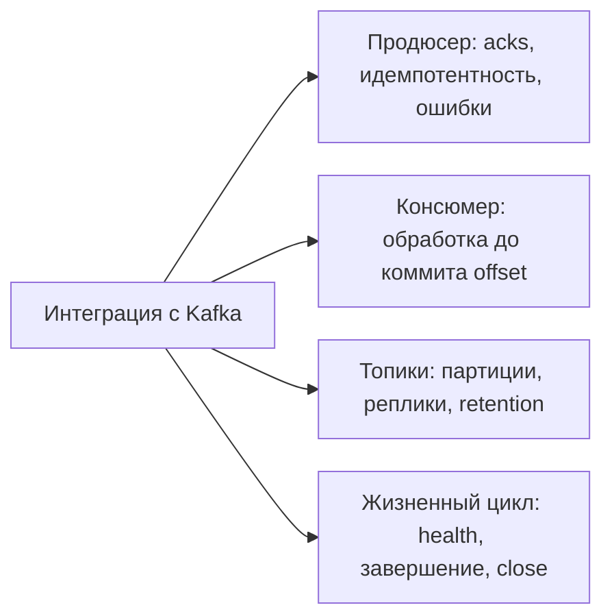

# Проверки aiokafka перед выходом в продакшен {#the-production-checklist-for-aiokafka}

<div class="bdr-post__hero" data-bdr-post="2026-09-07-the-production-checklist-for-aiokafka" role="img" aria-label="Каждое стандартное поведение проверено на настоящем брокере" markdown="0"></div>

Aiokafka — хороший клиент со значениями по умолчанию для библиотеки, а не конкретного сервиса. В разнице между ними возникают инциденты. Вот мой список перед выпуском consumer или producer, проверенный контейнером Kafka: какие настройки запрещает конструктор, что сериализаторы делают с ключами, что перечитывает новый consumer, какие смещения фиксирует auto-commit и что случается со слишком медленным участником группы.

<!-- more -->

Числа получены в [эксперименте статьи](../lab/2026-09-07-aiokafka-checklist/README.md) с Kafka в контейнере. Версии: aiokafka-foundation-kit 0.1.3, aiokafka 0.14.0, Python 3.13.

## Отправитель {#the-producer}

**Создавайте внутри работающего event loop.** Конструктору aiokafka нужен активный цикл, поэтому создание при импорте или на уровне модуля падает до запуска сервиса:

```text
    built at module scope, no running loop: RuntimeError: The object should be created within an
    async function or provide loop directly.
```

Это хороший, ранний и понятный отказ. Producer должен принадлежать жизненному циклу приложения, запускаться и останавливаться вместе с ним.

**`acks` и идемпотентность — одно решение.** Идемпотентному producer нужен `acks=all`; иное сочетание отклоняется конструктором:

```text
    enable_idempotence=True (default) with acks='1': ValueError: Invalid ACKS parameter
```

`acks=all` с идемпотентностью подходит данным, которые нельзя терять: брокер ждёт синхронные реплики, номера последовательности дедуплицируют собственные повторы producer. `acks=1` снижает задержку ценой возможной потери уже подтверждённого сообщения при гибели лидера до репликации. Выбирайте явно, рядом с `enable_idempotence=False`, чтобы компромисс был виден.

**Сжатию может понадобиться неустановленная библиотека.** `gzip` работает сразу, остальные варианты требуют зависимостей:

```text
    compression_type='lz4' (no cramjam installed): RuntimeError: Compression library for lz4 not found
```

Это тоже ошибка создания, не первой отправки. Выберите `aiokafka[lz4]` в зависимостях или `gzip` в настройках до развёртывания.

**Ключи — bytes, значения определяет сериализатор.** При JSON-сериализаторе значения и отсутствии сериализатора ключа строковый ключ даёт `TypeError`:

```text
    send(key='order-1', value={...}):  TypeError: a bytes-like object is required, not 'str'
    send(key=b'order-1', value={...}): accepted
```

Ключ определяет партицию, а та — порядок. События одного агрегата должны иметь один ключ, кодируемый в bytes в одном месте.

**Десериализатор задаёт контракт для всего топика.** Одно не-JSON-сообщение вызывает ошибку JSON-десериализатора внутри fetcher, до обработчика:

```text
    a plain-text message on a JSON topic: 0 of 4 messages read, then JSONDecodeError
```

Ноль из четырёх: consumer не доставил даже сообщения перед плохим, потому что распаковка выполняется для пакета. Если возможны другие форматы, старые записи, сообщения другой команды или tombstone, получайте сырые bytes и разбирайте в обработчике с явной политикой ошибок. Одно испорченное сообщение не должно остановить партицию.

## Получатель {#the-consumer}

**Фиксации нет без вашего решения.** В настройках библиотеки `enable_auto_commit=False`; consumer без commit перечитывает всё после перезапуска:

```text
    no commit at all                   first run read 10, the replacement read 10 again
    await consumer.commit() per batch  first run read 10, the replacement read 0 again
```

Это намеренно: фиксировать после работы, чтобы сбой давал повтор, а не пропуск. С повторами справляется идемпотентность — [статья о задачах и consumer](2026-09-07-idempotency-for-jobs-and-consumers.md); пропущенную работу таким способом не восстановить.

**Auto-commit фиксирует полученное, а не завершённое.** Этот пункт стоит прочитать дважды:

```text
    fetched 10, processed 3 before the crash, the replacement got 0:
    7 messages nobody processed
```

Получено десять сообщений, обработано три, процесс остановился, замена не получила ничего: смещения всех десяти уже зафиксированы. Семь молча пропущены. Auto-commit не просто реже фиксирует после обработки; он меняет связь между обработкой и фиксацией и допускает такую потерю работы без ошибки.

В этом же измерении есть второй нюанс: фиксация произошла в `stop()`. При auto-commit аккуратная остановка сохраняет текущие смещения независимо от завершения обработки. Достаточно обычного обновления, авария не обязательна.

**Время обработки ограничено `max_poll_interval_ms`.** Если участник слишком долго не опрашивает очередь, его исключают из группы. Два consumer, интервал шесть секунд, один обрабатывает девять:

```text
    the slow member read [0, 2, 4, 6] and then slept 9 s; its commit ->
    CommitFailedError: Commit cannot be completed since the group has already rebalanced
    and assigned the partitions to another member.
    the other member read [0, 1, 2, 3, 4, 5, 6, 7]
    messages handled twice: [0, 2, 4, 6]
```

Медленный участник *завершил* работу, но commit отклонён, смещения не записаны. Партиции перешли второму, тот снова прочитал те же четыре сообщения. Два процесса обработали их повторно с пересечением во времени — типичный финал расследования двойных писем клиенту.

Решение не только в большем интервале. `max_poll_records` должен давать пакет, уверенно укладывающийся в интервал; сам интервал выбирается по p99 пакетной обработки. Действительно долгую работу можно вынести из poll-цикла, но передача должна быть надёжной до фиксации смещений.

**Consumer нужна корректная остановка.** Жизненный цикл библиотеки управляет подпиской и закрытием; цикл между ними ваш. По `SIGTERM` нужно закончить пакет, зафиксировать смещения и выйти из группы. Это избавляет замену от ожидания таймаута сессии. В [статье об остановке Kafka](2026-09-07-graceful-kafka-consumer-shutdown.md) измерены двадцать девять секунд против трети секунды.

## Топики и здоровье {#topics-and-health}

**Создание топиков требует двух настроек.** Одной передачи списка недостаточно:

```text
    producer_lifecycle(topics=[...]) without auto_create_topics=True: created nothing
    with both arguments: created
```

Создание приложением удобно в разработке и требует явного решения в production: число партиций связано с ёмкостью и может находиться в ответственности другой команды. Два аргумента отделяют наличие списка от разрешения создавать.

**Отказ прерывает оставшуюся последовательность.** Топики создаются по одному; существующий допустим, другая ошибка останавливает процесс:

```text
    ensure_topics_async([ok, replication_factor=3 on a one-broker cluster, ok]):
    InvalidReplicationFactorError: Replication factor: 3 larger than available brokers: 1
      the topic before it: created; the topic after it: missing
```

Первый топик есть, третьего нет. Брокер, отказавший одному, вероятно, откажет следующему, поэтому остановка разумна. Но создание при старте не атомарно: частично создавший топики сервис должен безопасно запуститься снова. Это обеспечивает идемпотентное создание.

**Проверка здоровья — настоящая операция.** Она открывает соединение producer:

```text
    a cluster that answers:  True in 0.00 s
    a paused broker, timeout_seconds=2.0: False in 2.01 s
```

Две секунды показывают работающий таймаут, но это также две секунды ожидания readiness. Сделайте таймаут короче внешнего таймаута пробы, не проверяйте на каждый запрос. «Кластер отвечает» не гарантирует здоровье группы; отставание consumer — отдельный и часто более полезный показатель.

## Короткий список {#the-list-short}

1. Создавать клиенты в работающем цикле, владеть ими в жизненном цикле приложения.
2. Использовать `acks=all` с идемпотентностью либо явно выбрать иной компромисс.
3. Установить библиотеку сжатия либо выбрать `gzip`.
4. Кодировать ключи в bytes в одном месте, сохраняя распределение и порядок.
5. Не давать одному плохому сообщению отравить десериализацию пакета.
6. `enable_auto_commit=False`, фиксация после работы.
7. Настроить `max_poll_records` и `max_poll_interval_ms` по p99 пакета.
8. При остановке завершать пакет, фиксировать смещения, выходить из группы.
9. Создавать топики намеренно, идемпотентно, с безопасным повторным запуском.
10. Ограничить проверку здоровья таймаутом и отдельно наблюдать отставание.

<!-- diagram:concept -->
<figure class="bdr-diagram" markdown="1">
<figcaption><span class="bdr-diagram__eyebrow">ИДЕЯ В СХЕМЕ</span><strong>Четыре части интеграции с Kafka</strong></figcaption>
<div class="bdr-diagram__viewport" markdown="1" data-search-exclude>



</div>
<p class="bdr-diagram__caption">Надёжность продюсера, обработка сообщений, конфигурация топиков и жизненный цикл требуют отдельных решений. Подтверждение отправки не фиксирует атомарно запись в БД или offset консюмера.</p>
</figure>
<!-- /diagram:concept -->

## Инструменты {#the-pieces}

Всё выше — поведение самой aiokafka. [Aiokafka-foundation-kit](https://bedrock-python.github.io/aiokafka-foundation-kit/) добавляет объект настроек, жизненный цикл, идемпотентное создание топиков и проверку здоровья. Клиент намеренно не оборачивается: после входа в lifecycle вы получаете `AIOKafkaProducer` или `AIOKafkaConsumer`. Отправка, получение и commit остаются API aiokafka.
