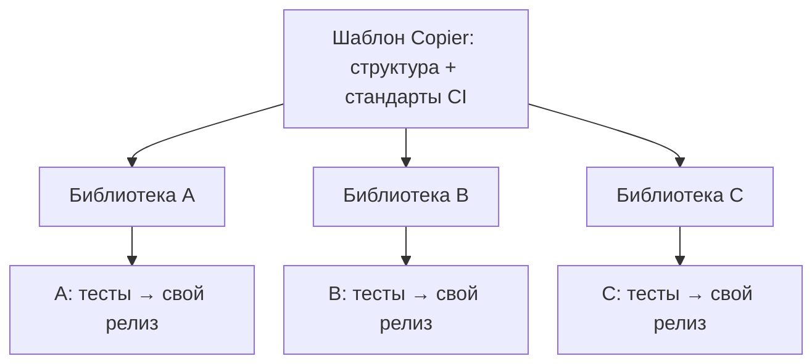

# Двенадцать библиотек, один инженерный стандарт, без монорепозитория {#twelve-libraries-one-engineering-standard-no-monorepo}

<div class="bdr-post__hero" data-bdr-post="2026-09-07-twelve-libraries-one-standard" role="img" aria-label="Шестнадцать независимых репозиториев с едиными правилами" markdown="0"></div>

Bedrock Python — шестнадцать репозиториев: двенадцать библиотек, два инструмента, шаблон и этот сайт. Библиотеки выпускаются независимо, стремятся к ядру без лишних зависимостей и устанавливаются отдельно. Ради этого их и разделили. Но шестнадцать репозиториев означают шестнадцать копий CI, линтинга, релизов и настроек безопасности, расходящихся в разные стороны, — классический аргумент за монорепозиторий. Расскажу, как остановил расхождение: шаблон собирает библиотеку за 1,3 секунды, скрипт одинаково настраивает GitHub, а три собственные ошибки превратились в общие правила.

<!-- more -->

Числа получены [скриптом статьи](../lab/2026-09-07-twelve-libraries-one-standard/README.md): генерация библиотеки и запуск её собственных проверок. Версии: uv 0.11.25, Python 3.13.

## Что единый стандарт означает на практике {#what-one-standard-means-in-practice}

Репозитории организации одинаково отвечают на одни вопросы:

- **Инструменты.** Uv для окружения и lock-файла, hatchling для сборки, Ruff для линтинга и форматирования с длиной строки 120 и двадцатью семействами правил, строгий mypy, pytest с `asyncio_mode = "auto"` и порогом покрытия.
- **Проверки.** `make check` — Ruff и mypy, `make test` — модульные и интеграционные тесты. CI запускает линтинг, модульные тесты на минимальном Python, 3.12 и 3.13, интеграционные тесты и итоговую задачу *All checks passed*. Защита ветки требует только её, поэтому добавление задачи не меняет ruleset.
- **Релизы.** Conventional commits проверяются commit-msg hook. Release Please обрабатывает push в `master` и поддерживает PR релиза; слияние создаёт тег, Publish отправляет пакет в PyPI через Trusted Publishing без API-токена.
- **Настройки репозитория.** Squash либо merge commit, удаление слитых веток, отключённые wiki и projects, сайт документации как homepage, topics из keywords `pyproject.toml`, поиск секретов с push protection, предупреждения и обновления безопасности Dependabot, приватные сообщения об уязвимостях, стандартный токен workflow только для чтения и ruleset `master`, требующий PR и итоговую проверку.
- **Документация.** Сайт Zensical с общей темой, страницей «For AI agents» и кнопкой Copy page, четыре файла которой намеренно побайтово одинаковы.
- **Зависимости.** Еженедельный Dependabot для `uv`, сгруппированные PR для dev-зависимостей и actions.

По отдельности решения обычны. Ценность — в согласованности всех репозиториев.

## Шаблон {#the-template}

Каноническая форма стандарта — шаблон [Copier](https://copier.readthedocs.io/) с девятью вопросами: отображаемое имя, имя PyPI, импорт, описание, имя и почта автора, организация GitHub, минимальный Python, начальная версия. Остальное выводится. Все ответы в командной строке:

```text
$ copier copy --trust --defaults --data project_slug=widget-kit ... python-library-template widget-kit
Template generated. Next steps: 1. uv sync --group dev  2. uv run pre-commit install ...
1.29s total

$ find . -type f | wc -l
41
```

Сорок один файл за 1,3 секунды: пакет с `py.typed` и аннотированным `__version__.py`, `pyproject.toml`, Makefile, четыре workflow, Dependabot, pre-commit, шаблоны issue и PR, `CONTRIBUTING`, `SECURITY`, `CODE_OF_CONDUCT`, лицензия, документация с agents и Copy page, тест версии. Затем собственные проверки сгенерированного проекта:

```text
$ uv sync --group dev && make check && make test
All checks passed!
8 files already formatted
Success: no issues found in 2 source files
Required test coverage of 90% reached. Total coverage: 100.00%
1 passed in 0.02s
5.16s total
```

Новая библиотека зелёная до первой собственной строки. Эта строка сразу пишется под теми же Ruff, mypy и структурой тестов, что у остальных. Шаблон служит спецификацией репозитория, а не только исходной точкой.

<!-- diagram:concept -->
<figure class="bdr-diagram" markdown="1">
<figcaption><span class="bdr-diagram__eyebrow">ИДЕЯ В СХЕМЕ</span><strong>Общие стандарты, независимые релизы</strong></figcaption>
<div class="bdr-diagram__viewport" markdown="1" data-search-exclude>



</div>
<p class="bdr-diagram__caption">Шаблон задаёт структуру проекта и проверки качества. Каждый репозиторий сохраняет собственную реализацию, версию и график публикаций.</p>
</figure>
<!-- /diagram:concept -->

## Скрипт {#the-script}

Шаблон пишет файлы, но не настройки GitHub вне репозитория. Они расходятся сильнее всего: страницу настроек никто не ревьюит. Поэтому `setup_repo.py` принимает `org/repo` и последовательно приводит их к стандарту:

```text
-> Environment: pypi (Trusted Publishing)
-> Environment: github-pages; Pages built by Actions
-> Actions: workflows get a read-only token unless they ask for more; Release Please may open PRs
-> Repository: squash or merge commits only, branches deleted on merge, no wiki/projects, docs as homepage
-> Security: secret scanning + push protection, Dependabot alerts + security updates, private reporting
-> Topics: pyproject keywords + python (existing topics kept)
-> Ruleset master-rules: pull request required, "All checks passed" required, no force-push
-> Classic branch protection: removed (the ruleset replaces it)
```

Скрипт идемпотентен и одновременно служит аудитом: правильный репозиторий не меняет и сообщает об этом. Изменился стандарт — меняется скрипт, затем проход по шестнадцати репозиториям возвращает согласованность. За два дня сентября он заменил накопленные вручную правила branch protection единым ruleset во всех проектах.

В ruleset отключено требование актуальности ветки перед слиянием. Иначе каждый PR требовал бы rebase после других слияний, включая еженедельные обновления бота. Это выбранный компромисс удобства и проверки совместимости с новыми изменениями; итоговая задача подтверждает результаты своего CI, но сама не тестирует будущие сочетания коммитов.

## Релизы без ручного выбора версии {#releases-without-a-human-typing-a-version}

В шестнадцати репозиториях ручное изменение версий особенно ненадёжно. Тип изменения задаёт сообщение коммита; Release Please превращает `fix:` в patch, `feat:` в minor, пишет changelog и поддерживает PR следующего релиза. Его слияние и есть выпуск. Workflow по релизному событию берёт тег, переписывает файл версии, собирает и публикует через `uv publish --check-url`. Повтор уже опубликованной версии пропускает готовые файлы.

Trusted Publishing связывает публикацию с OIDC-идентичностью workflow конкретного репозитория и окружения. Нет постоянного токена, который можно забыть, раскрыть или не сменить. Во время написания серии четыре выпуска прошли путь от слитого исправления до устанавливаемого wheel менее чем за три минуты каждый.

## Три мои ошибки {#the-three-things-i-got-wrong}

**Изменения документации запускали релизы.** В первую неделю общий security policy попал в двенадцать репозиториев, и конфигурация Release Please открыла двенадцать patch-PR. Теперь разделы changelog заданы явно: `docs`, `chore`, `ci`, `test`, `refactor`, `build`, `style` скрыты, выпускаются нужные `feat`, `fix`, `perf`, `revert`. Настройка перенесена в шаблон: урок усвоен один раз и исправлен везде.

**Форматирование затронуло документацию.** После изменения поведения Ruff 0.16 проверка стала обрабатывать Python-фрагменты Markdown: отдельный аргумент, тело без `def` и другие неполные примеры. `ruff format --check` покраснел во всех репозиториях в один день. В шаблон и каждый `pyproject.toml` добавлено `extend-exclude = ["*.md"]`.

**Обновления шаблона не возвращаются автоматически.** Copier может обновлять проект, если сохранены источник шаблона и ответы. Мои проекты этого не помнят: многие появились раньше шаблона, файла ответов нет. Поэтому общие изменения переносятся скриптом с одинаковыми PR вместо `copier update`. Так поддерживаются и четыре одинаковых файла Copy page. Это работает, но сейчас я с первого дня сохранял бы ответы даже для приведённого к шаблону старого репозитория.

## Почему не монорепозиторий {#why-not-a-monorepo}

Общее дерево упростило бы общие CI, линтинг и выпуск, но мне важнее независимость пакетов. Сервис устанавливает только `deadline-budget` без зависимостей. Единая версия связала бы его с графиком Kafka-клиента, а независимые версии внутри монорепозитория потребовали бы дополнительной инфраструктуры. Поэтому здесь выбраны отдельные репозитории: независимость — часть продукта, стандарт делает её сопровождение посильным.

Шаблон, скрипт и workflow находятся в [python-library-template](https://github.com/bedrock-python/python-library-template). Каждая библиотека [каталога](https://bedrock-python.github.io/libraries/) либо создана из него, либо приведена к нему.

Суть — во втором измерении: зелёные проверки за пять секунд до первой строки кода.
