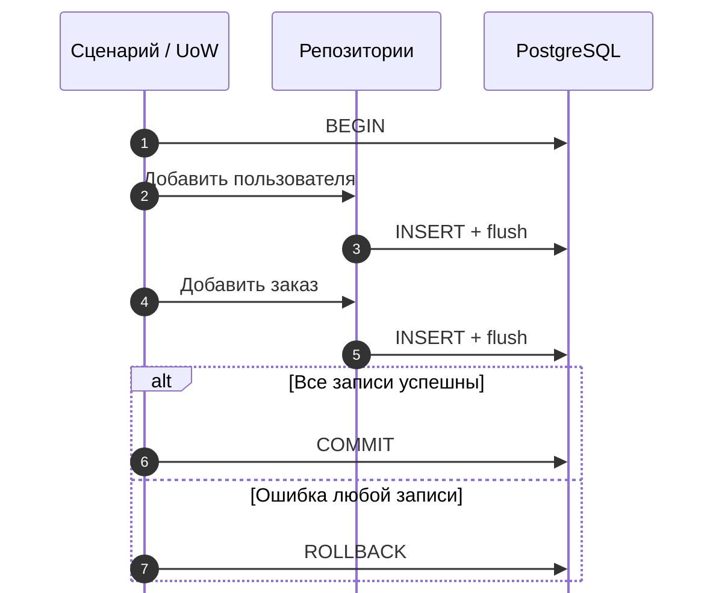

# Паттерн Unit of Work в SQLAlchemy 2 {#the-unit-of-work-pattern-in-sqlalchemy-2}

<div class="bdr-post__hero" data-bdr-post="2026-09-07-unit-of-work-in-sqlalchemy-2" role="img" aria-label="Граница транзакции принадлежит сценарию использования, фиксация происходит один раз" markdown="0"></div>

Почти каждый впервые написанный репозиторий содержит `commit()`: чтобы получить id, передать его дальше, прочитать строку в тесте. Это решение мешает рассуждать о данных: сценарий с двумя репозиториями теперь имеет две фиксации, и сбой между ними оставляет половину операции в БД. У решения давно есть имя, а SQLAlchemy 2 делает его коротким: сценарию принадлежит транзакция, репозитории пишут в неё, commit выполняется один раз в конце либо не выполняется. Измерим до и после, а также две дополнительные возможности: блок чтения, отбрасывающий записи, и тестирование сценария без БД.

<!-- more -->

Числа получены [скриптом статьи](../lab/2026-09-07-unit-of-work-sqlalchemy-2/README.md) с PostgreSQL 17 в контейнере. Версии: SQLAlchemy 2.0.52, asyncpg 0.31.0, sqlalchemy-foundation-kit 0.3.0, Python 3.13.

## До: репозитории сами фиксируют изменения {#before-repositories-that-commit}

Две таблицы `users` и `orders`, CHECK требует положительную сумму заказа. Два типичных первых репозитория:

```python
class SelfCommittingUserRepo:
    async def add(self, email: str) -> User:
        user = User(email=email)
        self.session.add(user)
        await self.session.commit()          # "so the id is there"
        return user


class SelfCommittingOrderRepo:
    async def add(self, user_id: int, amount: int) -> Order:
        order = Order(user_id=user_id, amount=amount)
        self.session.add(order)
        await self.session.commit()
        return order
```

Сценарий создаёт пользователя и его первый заказ, но заказ неверен:

```text
repositories commit for themselves -> users=1 orders=0   (a user with no order: half a use case)
```

Пользователь есть, заказа нет. Для клиента операция провалилась, для БД наполовину прошла. Следующая попытка упадёт уже на уникальном email. Это свойство любого дизайна, где единица фиксации меньше единицы бизнес-смысла. Репозиторий не знает, что пользователь осмыслен только вместе с заказом: это знание находится уровнем выше.

## После: сценарию принадлежит граница {#after-the-use-case-owns-the-boundary}

Те же таблицы и репозитории с заменой одной строки: `flush()` вместо `commit()`. Строка отправляется в БД, id возвращается, фиксации нет:

```python
class UserRepo:
    async def add(self, email: str) -> User:
        user = User(email=email)
        self.session.add(user)
        await self.session.flush()           # the id is there; nothing is committed
        return user
```

Класс транзакции предоставляет репозитории поверх одной session; unit of work открывает её:

```python
class Transaction(AsyncSQLAlchemyUowTransaction):
    @property
    def users(self) -> UserRepo:
        return UserRepo(self.session)

    @property
    def orders(self) -> OrderRepo:
        return OrderRepo(self.session)


class PlaceOrder:
    def __init__(self, uow: AsyncSQLAlchemyUnitOfWork[Transaction]) -> None:
        self.uow = uow

    async def execute(self, email: str, amount: int) -> int:
        async with self.uow.transaction() as tx:   # commits on exit, rolls back on exception
            user = await tx.users.add(email)
            order = await tx.orders.add(user.id, amount)
            return order.id
```

Сценарий не видит session. Открывает транзакцию, работает через репозитории и выходит; блок фиксирует успех или откатывает исключение. Тот же неверный заказ:

```text
the use case owns the transaction  -> users=0 orders=0   (nothing happened)
```

Теперь корректный:

```text
order 2 -> users=1 orders=1   (one commit, both rows)
```

Одна фиксация и обе строки либо ни фиксации, ни строк. Id заказа равен 2, не 1: неудачная попытка израсходовала значение последовательности до отката. Выдача значений PostgreSQL sequence не откатывается вместе с транзакцией; пропуск id сам по себе не ошибка.

<!-- diagram:concept -->
<figure class="bdr-diagram" markdown="1">
<figcaption><span class="bdr-diagram__eyebrow">ИДЕЯ В СХЕМЕ</span><strong>Один владелец определяет результат всей операции</strong></figcaption>
<div class="bdr-diagram__viewport" markdown="1" data-search-exclude>



</div>
<p class="bdr-diagram__caption">Оба репозитория используют одну транзакцию. Flush отправляет SQL, но не фиксирует его; Unit of Work сохраняет обе записи при успехе или откатывает обе при ошибке.</p>
</figure>
<!-- /diagram:concept -->

## Блок чтения не фиксирует запись {#read-only-means-read-only}

Вторая возможность паттерна — блок, обещающий не сохранять изменения:

```python
async with uow.query() as qx:
    users = await qx.users.list()
```

Это поведение обеспечивается механизмом: случайно попавшая в query-блок запись не фиксируется:

```text
after uow.query() -> users=1 orders=1   (the write was discarded)
```

Разница между комментарием «только чтение» и границей, которая отбрасывает незакоммиченные изменения. Пути чтения используют `query()`, записи — `transaction()`. Ревьюер видит назначение по блоку, не изучая репозиторий.

## Savepoint: сбой шага вместо всей транзакции {#savepoints-one-failed-step-not-one-failed-transaction}

В PostgreSQL ошибка запроса прерывает транзакцию: до rollback не работают и следующие запросы, включая запись сведений о сбое. Savepoint создаёт вложенную границу, которую можно откатить отдельно:

```python
async with uow.transaction() as tx:
    user = await tx.users.add("b@example.com")
    try:
        async with tx.savepoint():
            await tx.orders.add(user.id, amount=-1)      # fails; the savepoint rolls back
    except IntegrityError:
        pass
    await tx.orders.add(user.id, amount=20)              # still inside a live transaction
```

```text
-> users=2 orders=2   (the bad order rolled back, the good one and the user committed)
```

Без savepoint второй `add` получил бы «current transaction is aborted». С ним граница последствий совпадает с выбранной вами границей шага.

## Тестирование сценария {#the-use-case-under-test}

Третья возможность окупает паттерн за неделю: сценарий зависит от объекта с `transaction()`, выдающего объект с `users` и `orders`. В этом контракте нет SQLAlchemy. Подмена со списком вместо БД занимает двадцать строк, сценарий работает без изменений:

```text
order 2, rows written=[('t@example.com',), (1, 7)], commits=1, 0.0 ms, no PostgreSQL
```

Модульный тест за долю миллисекунды без контейнера проверяет запрошенные записи и одну фиксацию. Интеграционные тесты выше доказывают, что настоящий unit of work соблюдает контракт. Это разделение возможно потому, что session не попала в сигнатуру сценария.

## Кто владеет транзакцией {#who-owns-the-transaction}

Короткое правило для ревью: репозитории делают flush, но не commit и не rollback. Сценарии открывают одну транзакцию, работают внутри и передают завершение блоку. Чтение идёт через блок без фиксации. Если общий результат должен пережить ошибку отдельного шага, оберните этот шаг savepoint, а не второй независимой транзакцией. Session живёт один блок, репозитории получают её от объекта транзакции. Поэтому сервисные сигнатуры не требуют `AsyncSession`, а сценарий можно тестировать списком.

В примере используется `AsyncSQLAlchemyUnitOfWork` из [sqlalchemy-foundation-kit](https://bedrock-python.github.io/sqlalchemy-foundation-kit/guide/advanced/#unit-of-work-uow): `transaction()`, `query()` и `savepoint()` поверх `async_sessionmaker` и вашего класса транзакции с репозиториями. Менеджер session описан в [статье о PgBouncer](2026-09-07-pgbouncer-transaction-mode-async-sqlalchemy.md).

Суть — в первых двух результатах: `users=1 orders=0`, затем `users=0 orders=0`.
