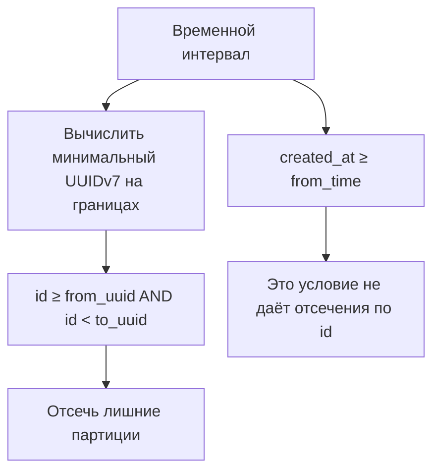

# UUIDv7 как ключ партиционирования PostgreSQL {#uuidv7-as-a-postgresql-partition-key}

<div class="bdr-post__hero" data-bdr-post="2026-09-07-uuidv7-as-a-postgresql-partition-key" role="img" aria-label="Упорядоченный по времени идентификатор становится временной осью и ключом партиционирования" markdown="0"></div>

Диапазонное партиционирование по времени обычно требует изменить первичный ключ: PostgreSQL требует включить колонку партиционирования во все уникальные ограничения. `PRIMARY KEY (id)` становится `PRIMARY KEY (id, created_at)`, внешние ключи тоже несут timestamp. Упорядоченный по времени id устраняет необходимость такого обхода. Первые 48 бит UUIDv7 содержат Unix-время в миллисекундах, поэтому id сам задаёт временную ось и таблицу можно партиционировать по существующему ключу.

<!-- more -->

Числа получены в [эксперименте статьи](../lab/2026-09-07-uuidv7-partition-key/README.md) с PostgreSQL 17 в контейнере. Версии: pg-partsmith 1.5.0, Python 3.13.

## Одна колонка первичного ключа {#one-column-in-the-primary-key}

```text
    CREATE TABLE events (id UUID PRIMARY KEY, ...) PARTITION BY RANGE (id): accepted
    the same table partitioned by created_at with PRIMARY KEY (id):
      FeatureNotSupportedError: unique constraint on partitioned table must include all
      partitioning columns
```

В двух строках весь аргумент. Timestamp-партиционирование распространяет составной ключ на все ссылающиеся таблицы и код, который раньше передавал только id. С UUIDv7 над схемой ничего не меняется: `WHERE id = $1` находит строку, внешнему ключу нужна одна колонка.

## Границы — UUID {#the-bounds-are-uuids}

Границы окон — обычные UUID-литералы, вычисленные из начала месяцев:

```text
    events__2026_07  FOR VALUES FROM ('019f1af9-b400-7000-8000-000000000000')
                     TO ('019fba9e-d800-7000-8000-000000000000')
    events__2026_08  FOR VALUES FROM ('019fba9e-d800-7000-8000-000000000000')
                     TO ('01a05a43-fc00-7000-8000-000000000000')
    events__2026_09  FOR VALUES FROM ('01a05a43-fc00-7000-8000-000000000000')
                     TO ('01a0f4c2-c400-7000-8000-000000000000')
```

Каждая граница — *минимальный* UUIDv7 для момента: биты времени, версии и варианта, случайные биты нулевые. Минимум на обоих концах делает окна смежными: верхняя граница месяца совпадает с нижней следующего, промежутка для потерявшегося id нет.

Строки распределяются по собственному ключу, без триггера и синхронизации с `created_at`:

```text
    an id generated this month      -> inserted
    an id generated last month      -> inserted
    an id generated two months ago  -> inserted
    events__2026_07  1 row(s)
    events__2026_08  1 row(s)
    events__2026_09  1 row(s)
```

При отдельной колонке timestamp ключ и время могут разойтись: backfill берёт `created_at` из импорта, timestamp позже меняют, `now()` срабатывает при вставке вместо времени события. UUIDv7 фиксирует время в момент генерации идентификатора.

## Отсечение партиций работает по id {#pruning-happens-on-the-id-not-on-the-timestamp}

```text
    WHERE id >= <first uuid7 of last month> AND id < <first uuid7 of this month>:
      1 partition(s): events__2026_08
    WHERE created_at >= <last month> AND created_at < <this month>:
      4 partition(s): events__2026_07, events__2026_08, events__2026_09, events__2026_10
    WHERE id = <one id>:
      1 partition(s): events__2026_07
```

Первая строка — преимущество: временной диапазон, выраженный диапазоном id, читает одну партицию. Третья — повседневный поиск по id, автоматически выбирающий ровно одну.

Вторая — цена. `created_at` остаётся корректной колонкой, но планировщик не использует её для отсечения: это не ключ партиционирования. Очевидный запрос диапазона дат по timestamp обращается ко всем партициям.

Приложению нужен используемый на практике перевод момента в минимальный UUIDv7 и запросы `id >= from_time(a) AND id < from_time(b)`. Это пара функций и соглашение. Без них партиционирование незаметно не помогает таким чтениям.

<!-- diagram:concept -->
<figure class="bdr-diagram" markdown="1">
<figcaption><span class="bdr-diagram__eyebrow">ИДЕЯ В СХЕМЕ</span><strong>Отсечение партиций следует за ключом</strong></figcaption>
<div class="bdr-diagram__viewport" markdown="1" data-search-exclude>



</div>
<p class="bdr-diagram__caption">Временной интервал преобразуется в диапазон UUIDv7 по id. Фильтр только по created_at не задаёт границы ключа партиционирования, даже если описывает тот же временной интервал.</p>
</figure>
<!-- /diagram:concept -->

## Три неподходящих идентификатора {#the-three-ids-that-do-not-fit}

```text
    an id from a year ago (imported history):        CheckViolationError: no partition of
                                                     relation "events" found for row
    an id from three months ahead (a clock that is wrong): the same
    a uuid4 from a client that did not get the memo:       the same
```

Одинаковая ошибка PostgreSQL, три разных эксплуатационных случая.

**Импорт истории.** Старым строкам нужны id со старым временем и партиции месяцев, которые вы не собирались создавать. Подготовьте их до импорта и учитывайте, что политика хранения позже сочтёт их просроченными.

**Неверные часы.** При генерации на пишущих машинах окно выбирают их часы. Хост на три месяца впереди потребует ещё не созданную `create_ahead` партицию и получит отказ вставки. Несколько секунд опережения на границе месяца отправят строку в следующий месяц — поэтому создавать вперёд нужно заранее.

**Случайный `uuid4`.** В нём нет timestamp, старшие биты случайны и обычно указывают за пределы всех окон. Источник часто неожиданен: клиентская библиотека, fixture или сервис, которому не сообщили о важности формата. Защита — единое место генерации на серверной стороне.

Общее правило: **генерация id становится частью контракта схемы**. Любой генератор определяет желаемую партицию. Ошибочный id может привести к отказу вставки; этот сценарий нужно учитывать заранее.

## Та же граница у политики хранения {#retention-has-the-same-edge}

```text
    created=0 detached=1 dropped=1 issues=0
    events__2026_08  1 row(s)
    events__2026_09  1 row(s)
    an id for 2026-07, the month retention just retired:
      CheckViolationError: no partition of relation "events" found for row
```

После вывода окна из обращения поздней строке некуда попасть. Так устроена любая временная схема, но здесь окно определяется id, созданным задолго до записи: отложенная задача, повтор запроса, неделя в dead-letter. Хранение должно покрывать максимальную задержку доставки. Измерять нужно время от генерации id до вставки, а не только от бизнес-события.

## Когда использовать {#when-to-reach-for-it}

**Подходит** естественно упорядоченным по времени таблицам с добавлением записей, где хочется избежать составного ключа: события, аудит, outbox, сообщения, запуски задач.

**Не выбирайте автоматически** для всех публичных идентификаторов. UUIDv7 раскрывает время генерации до миллисекунды и позволяет упорядочивать id. Если это чувствительная информация, нужен отдельный непрозрачный публичный идентификатор.

Колонку timestamp всё равно сохраните. Она стоит восемь байт, понятна людям и отчётам и помогает диагностировать неверные часы.

## Инструменты {#the-pieces}

Границы вычисляет кодек [pg-partsmith](https://bedrock-python.github.io/pg-partsmith/): `TimeBoundaries(granularity=MONTH, codec=UUIDv7BoundaryCodec())` с `RangePartitioning(key="id")`. Создание вперёд, хранение, план и принадлежность работают как для timestamp: календарь тот же, меняется кодирование границ. Есть и кодек целых epoch-значений, например миллисекунд.

Временное партиционирование без составного ключа действительно проще. Оно переносит ответственность на тех, кому разрешено генерировать id.
