# Прогрев, readiness и liveness — три разные задачи {#warmup-readiness-and-liveness-are-three-different-things}

<div class="bdr-post__hero" data-bdr-post="2026-09-07-warmup-readiness-and-liveness-are-three-different-things" role="img" aria-label="Три вопроса и три проверки с разным назначением" markdown="0"></div>

Большинство сервисов отвечает на все три вопроса одним обработчиком, обычно ping базы. Каждое смешение создаёт свой сбой. Liveness с проверкой БД перезапускает все pod при её кратком отказе. Readiness, не переходящая в false, направляет трафик в завершающийся pod. Смешанный с readiness прогрев даёт холодные кеши или убитый до завершения pod. Я провёл один сервис через прогрев, отказ зависимости и `SIGTERM` и наблюдал намеренно разные ответы двух проб и рабочего маршрута.

<!-- more -->

Числа получены в [эксперименте статьи](../lab/2026-09-07-warmup-readiness-liveness/README.md): обе пробы и маршрут опрашиваются каждые сто миллисекунд в течение жизненного цикла. Версии: servicewright 0.10.0, FastAPI 0.141.1, Python 3.13.

## Жизнь pod в шести переходах {#the-whole-life-of-a-pod-in-six-transitions}

```text
      0.0 s  livez=ConnectError  readyz=ConnectError  /cached=ConnectError
      3.3 s  livez=200           readyz=200           /cached=200
      6.1 s  livez=200           readyz=503           /cached=200
      9.2 s  livez=200           readyz=200           /cached=200
     11.2 s  livez=200           readyz=503           /cached=200
     13.2 s  livez=ConnectError  readyz=ConnectError  /cached=ConnectError
```

Три секунды прогрева, Redis недоступен с шестой до девятой, `SIGTERM` на одиннадцатой. Каждое различие столбцов — отдельное решение.

```mermaid
---
config:
  theme: default
  look: classic
  state:
    useMaxWidth: false
---
stateDiagram-v2
    accTitle: Сбой зависимости меняет readiness, а не liveness
    accDescr: В этом сервисе сокет открывается после прогрева. Сбой обязательной зависимости убирает под из маршрутизации без перезапуска; завершение также выключает readiness до закрытия сокета.
    direction TB
    state "Прогрев: сокет ещё закрыт" as Warmup
    state "Работа: live 200 / ready 200" as Ready
    state "Сбой зависимости: live 200 / ready 503" as Degraded
    state "Завершение: live 200 / ready 503" as Draining
    [*] --> Warmup
    Warmup --> Ready: Прогрев завершён; открыть сокет
    Ready --> Degraded: Сбой обязательной зависимости
    Degraded --> Ready: Зависимость восстановлена
    Ready --> Draining: SIGTERM
    Draining --> [*]: Пауза, завершение запросов, закрытие
```

<!-- diagram:concept -->
<figure class="bdr-diagram" markdown="1">
<figcaption><span class="bdr-diagram__eyebrow">ИДЕЯ В СХЕМЕ</span><strong>Сбой зависимости меняет readiness, а не liveness</strong></figcaption>
<div class="bdr-diagram__viewport" markdown="1" data-search-exclude>



</div>
<p class="bdr-diagram__caption">В этом сервисе сокет открывается после прогрева. Сбой обязательной зависимости убирает под из маршрутизации без перезапуска; завершение также выключает readiness до закрытия сокета.</p>
</figure>
<!-- /diagram:concept -->

## Прогрев отличается от readiness и liveness {#warmup-is-not-readiness-and-neither-is-it-liveness}

Первые 3,3 секунды не отвечало ничего: ни маршрут, ни пробы. Слушатель привязывается после прогрева, чтобы не принимать запросы до подготовки кешей, пулов и клиентов.

У этого порядка есть следствие: **во время прогрева HTTP liveness не может ответить**. Это даже не `503`, а отказ соединения. Проба с `failureThreshold: 3` и `periodSeconds: 5` имеет короткий бюджет и может убить долго прогревающийся pod, затем его замену и следующую. Развёртывание не поднимается; виден `CrashLoopBackOff` без ошибки приложения, которое выполняло порученную инициализацию.

Решение — `startupProbe`: она откладывает остальные пробы, допускает длинный стартовый бюджет и после успеха передаёт контроль короткой liveness. Прогрев — фаза с естественным концом.

Ещё два следствия. Ошибка обязательного прогрева должна прервать запуск, а не разрешить обслуживание холодным сервисом. `SIGTERM` во время прогрева должен переходить к очистке: отменённому при обновлении pod не нужно сначала заканчивать минутное заполнение кеша.

## Liveness относится к процессу, а не зависимостям {#liveness-is-about-the-process-not-the-dependencies}

С 6,1 до 9,2 секунды Redis был недоступен. Readiness стала 503, liveness оставалась 200, маршрут без Redis продолжал отвечать:

```text
      6.1 s  livez=200  readyz=503  /cached=200
```

Если включить Redis в liveness, все реплики одновременно провалят пробу и перезапустятся при уже неисправной общей зависимости. Перезапуск не чинит Redis, зато уничтожает прогретые кеши и текущие запросы. После восстановления на Redis разом обрушится холодная группа новых pod.

Правило: **liveness отвечает, застрял ли сам процесс**. Заблокированный event loop, переставший выполнять работу пул потоков, невосстановимое внутреннее состояние. Если перезапуск не исправит причину, ей не место в liveness. Пока цикл работает, проба почти скучно зелёная — это нормально.

Readiness может зависеть от всего, что *необходимо для обслуживания*, но не от всего, что у pod просто есть. Здесь маршрут работал при false, потому что Redis ему не нужен. Слишком широкая проба исключает pod даже для работоспособных маршрутов. Где различие важно, полезна готовность по сервисам; иначе единый флаг проще при явном компромиссе.

Если *все* реплики провалят readiness из-за общей зависимости, недоступным станет весь сервис. Кеш, который можно было обойти, или рекомендации с запасным ответом приведут к полному отказу: балансировщику некуда отправлять запрос. Жёсткая зависимость может определять readiness, необязательная требует другого решения. Это [аргумент о Redis fail open](2026-09-07-when-should-redis-fail-open.md) в другом месте.

## Readiness должна выключиться раньше приёма запросов {#readiness-has-to-go-false-before-the-pod-stops-serving}

При `SIGTERM` важен порядок обновления:

```text
    SIGTERM at 11.1 s, process exited at 13.3 s with code 0
    readyz stopped saying 200 at 11.2 s (0.1 s after SIGTERM)
    the route stopped answering at 13.2 s (2.1 s after SIGTERM)
    requests kept succeeding for 2.0 s after readiness went false
```

Readiness стала false в пределах десятой секунды, сервис отвечал ещё две. Этот промежуток и нужен при остановке: сведения о выводе pod из Service распространяются не мгновенно. Kube-proxy, ingress и клиенты узнают об изменениях с задержкой, а запросы продолжают приходить уже останавливаемому pod.

Немедленное закрытие слушателя создаёт ошибки соединения для продолжающего идти трафика, которые могут выглядеть как 502 и вызывать повторы на другой, тоже завершающийся pod. Отсюда всплески 502 при каждом развёртывании, часто без соответствующих ошибок приложения.

Порядок: readiness false, продолжить обслуживание на время распространения, затем закрыть слушатель и завершить текущие запросы. Задержку нужно измерить в своём кластере — от false до фактического прекращения трафика. Остальная арифметика — drain grace, `terminationGracePeriodSeconds`, максимальный запрос — в [статье об остановке](2026-09-07-graceful-shutdown-is-a-protocol.md).

## Три проверки в таблице {#the-three-in-one-table}

| | Liveness | Readiness | Startup |
|---|---|---|---|
| Вопрос | Застрял ли процесс? | Направлять ли сюда трафик сейчас? | Закончилась ли инициализация? |
| Зависимости | Нет | Нужные для обслуживания | Проверяет завершение выбранного старта |
| Во время прогрева | Ещё не отвечает | False | Единственная активная проба |
| При отказе обязательной зависимости | True | False | Уже завершена |
| После SIGTERM | True до выхода процесса | Сразу false | Уже завершена |
| Последствие неудачи | Перезапуск pod | Прекращение маршрутизации | Продолжить ждать, затем перезапустить |

Часто удивляет последняя ячейка readiness: отрицательная готовность — *не обязательно ошибка*. Это решение маршрутизации. Прогревающийся, завершающийся или ожидающий обязательную зависимость pod ведёт себя правильно. Тревога на каждый отказ пробы шумит при каждом обновлении. Следите за последствиями для группы: нет готовых реплик либо их меньше необходимого.

## Инструменты {#the-pieces}

Жизненный цикл предоставляет [servicewright](https://bedrock-python.github.io/servicewright/): прогрев до bind, readiness true после привязки всех точек входа и false до drain, реестр здоровья с отдельной liveness и readiness, учитывающей флаг и зарегистрированные проверки, настраиваемая задержка перед закрытием слушателя. Пробы обслуживает выбранный адаптер, порядок общий для HTTP, gRPC и worker.

Три вопроса, три ответа, шесть переходов. Один ping БД на всё способен дать и цикл перезапусков, и всплеск 502.
