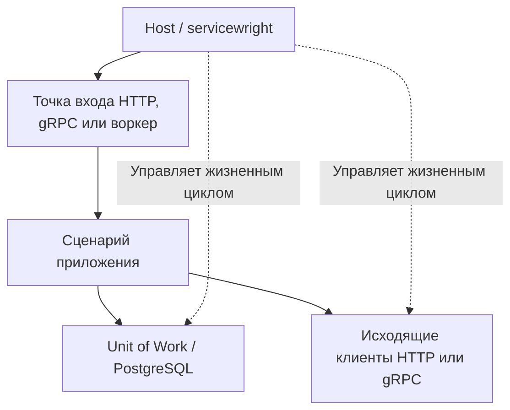

# Что каждый Python-микросервис заново реализует для продакшена {#what-every-production-python-microservice-reimplements}

<div class="bdr-post__hero" data-bdr-post="2026-09-07-what-every-microservice-reimplements" role="img" aria-label="Одинаковая инфраструктура вокруг небольшого ядра продуктовой логики" markdown="0"></div>

Откройте репозиторий backend-сервиса, прожившего год в production, и найдите код, не относящийся к продукту. Везде одно и то же: запуск, health endpoint, почти правильная остановка, повторы, неверно понятый таймаут, фабрика session, базовая модель, требующий закрытия Kafka producer, недоделанный outbox, метрики, трассировка и однократный прогон миграций. Сервис создан не ради этого, но без этого падает. Разберём список, почему общий фреймворк неудобен как ответ, и запустим стострочный сервис, получающий нужную инфраструктуру готовыми компонентами.

<!-- more -->

## Список {#the-list}

Вот что я последние годы писал заново или копировал из прошлого проекта в каждый сервис:

```text
жизненный цикл     порядок запуска, прогрев, готовность, сигнал остановки, очистка в обратном порядке
здоровье           разные проверки жизнеспособности и готовности
завершение         обслуживать запросы до обновления балансировщика, завершить работу, закрыть пулы, выйти с кодом 0

повторы HTTP       с backoff, jitter, Retry-After и только для идемпотентных вызовов
таймауты           ограничивать весь вызов, а не отдельную попытку
дедлайны           передавать бюджет входящего запроса во все исходящие
circuit breaker    отдельно для каждого origin, с порогом, учитывающим повторы

сессии БД          фабрика, пул, настройки, совместимые с PgBouncer
транзакции         один владелец, один commit, откат при исключении
Redis              клиент, проверка здоровья, решение о работе при сбое
Kafka              продюсер с жизненным циклом, консьюмер с остановкой посреди пачки

идемпотентность    ключ, хранилище, правило для двух одновременных запросов
outbox             бизнес-запись и событие создаются вместе

метрики            единый реестр, одинаковые метки повсюду
трассировка        провайдер, передача контекста через каждый сервис
тесты миграций     вперёд, назад, снова вперёд и сравнение с моделями
```

Каждая строка — неделя в первый раз и день в пятый; в пятой копии есть баг, исправленный во второй. Другие статьи серии измеряют отдельные пункты и последствия их отсутствия. Здесь вопрос в форме решения.

## Почему не фреймворк {#why-not-a-framework}

Очевидный ответ — один пакет: `from company.platform import Service`, и все команды наследуют обвязку. Я строил и такое. Проблема: фреймворк владеет приложением. Он выбирает веб-сервер, DI, загрузчик настроек, формат журналов, версии зависимостей; его релиз становится общим. Нужны только дедлайны — придётся взять всё. Нравится собственный загрузчик настроек — придётся спорить с фреймворком. Через два года он крупнейшая и труднее всего обновляемая зависимость организации, удерживающая минимальную версию Python.

В итоге я выбрал небольшую библиотеку на отдельную задачу, минимальное ядро, самостоятельное использование и выпуск, взаимодействие через протокол объекта вместо прямых связей. Сервис берёт четыре нужных компонента. Команда со своим загрузчиком передаёт объект подходящей формы. Наследоваться от платформы не требуется.

Обещать совместимость легко; убедительно только показать совместную работу.

## Сто строк {#a-hundred-lines}

Сервис — API заказов: ищет заказ в PostgreSQL, запрашивает остатки у склада, отвечает. Есть прогрев, readiness, drain, пул session, HTTP-клиент с повторами и общим таймаутом, дедлайн от входящего заголовка до исходящего. Сто строк с пустыми; код и runner настоящего PostgreSQL со складом-заглушкой — в [каталоге эксперимента](../lab/2026-09-07-what-every-microservice-reimplements/README.md).

```python
@dataclass(frozen=True)
class Settings:  # the shape the runtime reads; nothing to inherit
    logging: object | None = None
    metrics: object | None = None
    tracing: object | None = None
    error_tracking: object | None = None

    def get_app_version(self) -> str:
        return "1.0.0"
```

Настройки — frozen dataclass с четырьмя полями и методом: runtime читает только это. Наследования нет; можно передать Pydantic-модель или обычный класс подходящей формы.

```python
class Container:  # your DI, in twelve lines: one app scope for singletons, one unit scope per request
    def __init__(self, db: AsyncSessionManager, http) -> None:
        self.db, self.http = db, http

    @contextlib.asynccontextmanager
    async def app_scope(self):
        try:
            yield Scope(db=self.db, http=self.http)
        finally:  # pools close here, after every entrypoint has drained
            await self.http.aclose()
            await self.db.aclose()

    @contextlib.asynccontextmanager
    async def unit_scope(self, context=None):
        async with self.db.get_session() as session:
            yield Scope(session=session, http=self.http)
```

Вся интеграция DI — два асинхронных контекстных менеджера: на процесс и на запрос. Настоящий сервис мог бы передать dishka, runtime не заметил бы разницы. Область приложения закрывается *после* drain, когда запросам уже не нужны пулы. Область запроса открывает одну session и закрывает при любом исходе обработчика.

```python
def create_container(settings: Settings) -> Container:
    db = AsyncSessionManager(os.environ["DATABASE_URL"], poolclass="async_adapted_queue")
    http = build("httpx", ClientConfig(
        service_name="orders",
        base_url=os.environ["WAREHOUSE_URL"],
        timeout=TimeoutConfig(total=5.0),
        retry=RetryConfig(max_attempts=3),
        deadline_header="X-Deadline-Ms",       # what is left of the request, on the wire
        on_unsupported="strict",
    ), AdapterDeps(deadline_source=AmbientDeadlineSource()))
    return Container(db, http)
```

Два singleton. Менеджер session создаёт пул с настройками для работы через пулер соединений. HTTP-клиент — обычный `httpx.AsyncClient` с политикой: три попытки внутри пяти секунд и заголовок остатка дедлайна из бюджета текущего запроса.

```python
@router.get("/orders/{order_id}")
async def get_order(order_id: int, unit: UnitScopeDep, x_deadline_ms: int | None = Header(default=None)):
    budget = BudgetContext.create(total_seconds=x_deadline_ms / 1000, safety_margin=0.1) if x_deadline_ms else None
    with use_budget(budget):                    # every outbound call below is trimmed to it
        session, http = await unit.get("session"), await unit.get("http")
        known = (await session.execute(text("SELECT count(*) FROM orders WHERE id = :id"), {"id": order_id})).scalar()
        stock = (await http.get(f"/stock/{order_id}")).json()
    return {"order_id": order_id, "known": bool(known), "stock": stock}
```

Обработчик — обычный маршрут FastAPI. Получает область запроса зависимостью, строит бюджет по входящему заголовку, оставляя сто миллисекунд на ответ, и выполняет два вызова внутри. Таймаут им явно не передаёт. БД ограничена настройками session; HTTP читает остаток через контекстную переменную, ограничивает им вызов и записывает в исходящий заголовок.

```python
spec = AppSpec(
    service_name="orders",
    create_container=create_container,
    warmers_factory=lambda ctx: [PostgresWarmer(ctx.container.db)],   # readiness waits for a real query
    drain_delay_seconds=1.0,                                          # keep serving while endpoints propagate
    drain_grace_seconds=10.0,
    cleanup_timeout_seconds=5.0,
)
spec.lifecycle.add_pre_start_hook(register_health)
service = Service(spec, entrypoints=[FastApiEntrypoint(config=HttpConfig(port=8000), routers=(router,))])
run_sync(service, Settings())
```

Жизненный цикл содержит фабрику контейнера, прогрев настоящим запросом до готовности, три бюджета остановки, проверку пула после его создания и HTTP-точку входа. Вторая точка в том же spec добавит Kafka consumer рядом с API; другой список даст отдельное worker-развёртывание.

## Запуск {#run}

Runner поднимает PostgreSQL с одной строкой `orders`, склад-заглушку, возвращающий полученный заголовок дедлайна, и сервис подпроцессом. Затем вызывает его, отправляет `SIGTERM` и продолжает запросы:

```text
   0.35 s  readyz -> 200 {'status': 'ok'}
   0.36 s  GET /orders/1 with X-Deadline-Ms: 800 -> 200 {'order_id': 1, 'known': True,  'stock': {'in_stock': 3, 'deadline_ms_seen': 697}}
   0.36 s  GET /orders/2 without a deadline       -> 200 {'order_id': 2, 'known': False, 'stock': {'in_stock': 3, 'deadline_ms_seen': 4999}}
   0.36 s  SIGTERM
   0.57 s  readyz during the drain delay -> 503
   0.57 s  GET /orders/1 during the drain delay -> 200
   1.64 s  process exited with 0
```

Первая строка: readiness зелёная лишь после успешного запроса прогрева, значит, первый пользователь не оплачивает первое подключение. Вторая: запрос пришёл с 800 мс, обработчик оставил 100 себе, БД потратила несколько, складу передано 697. Третья: без входного дедлайна используется общий клиентский бюджет пять секунд, и склад узнаёт его. После сигнала readiness отвечает `503`, пока настоящий запрос получает `200`; далее drain, закрытие пулов, выход ноль.

Каждая строка — пункт списка, но не код обработчика. В нём шесть строк бизнес-логики и один `with`.

## Как компоненты остаются независимыми {#how-the-pieces-stay-apart}

В файле четыре библиотеки, ни одна не импортирует другую. Runtime читает форму настроек и вызывает два метода контейнера. Менеджер session передан прогреву и health, которым нужны `get_session()` и фабрика. HTTP-клиент получает дедлайн через протокол `remaining()` и `expired()`, которому соответствует объект бюджета. Можно передать собственную реализацию. Сама библиотека бюджета не имеет зависимостей, не запускает задач и не знает HTTP: вычисляет оставшееся время и возвращает числа.

Так устроена организация: небольшие библиотеки, минимальные ядра, extras интеграций и протоколы между ними. Сервис выбирает нужные части. В списке четырнадцать строк и двенадцать библиотек; этому сервису не понадобились Redis, Kafka, хранилище идемпотентности, outbox, тесты миграций, менеджер партиций и два набора gRPC. Им посвящены другие статьи серии.

Я снова и снова видел одинаковую инфраструктуру в разных сервисах. [Bedrock Python](https://bedrock-python.github.io/libraries/) выносит её в небольшие независимые библиотеки. Здесь показан минимальный сервис, в котором этот подход работает целиком.

<!-- diagram:concept -->
<figure class="bdr-diagram" markdown="1">
<figcaption><span class="bdr-diagram__eyebrow">ИДЕЯ В СХЕМЕ</span><strong>У инфраструктуры тоже есть границы</strong></figcaption>
<div class="bdr-diagram__viewport" markdown="1" data-search-exclude>



</div>
<p class="bdr-diagram__caption">Host управляет жизненным циклом, сценарий — бизнес-операцией, а отдельные библиотеки обеспечивают работу с БД и транспортами. Доменные правила остаются в приложении.</p>
</figure>
<!-- /diagram:concept -->
