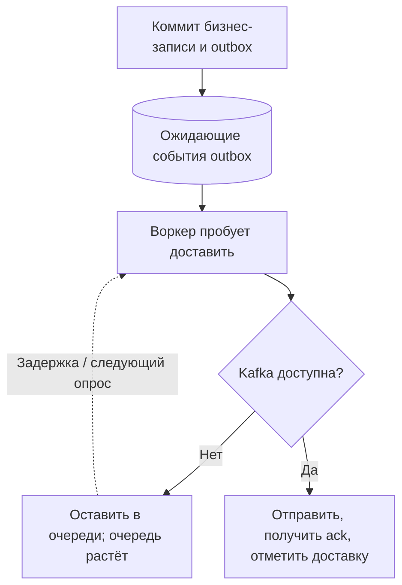

# Что происходит, когда Kafka недоступна целый час? {#what-happens-when-kafka-is-down-for-an-hour}

<div class="bdr-post__hero" data-bdr-post="2026-09-07-what-happens-when-kafka-is-down-for-an-hour" role="img" aria-label="При долгом сбое прямая отправка теряет события, а надёжное хранение сохраняет их" markdown="0"></div>

Не секунда сбоя, которую скрывает повтор, а час: неудачное обновление брокеров, заполненные диски, сетевое разделение зон. У каждого публикующего сервиса есть ответ; часто это потеря событий, замеченная лишь после вопроса клиента о заказе. Я приостановил контейнер Kafka и сравнил две схемы с двадцатью событиями. Путь запроса получил три ошибки отправки, но одно из этих событий всё-таки доставилось. Outbox ничего не потерял и не израсходовал бюджет попыток.

<!-- more -->

Числа получены в [эксперименте статьи](../lab/2026-09-07-when-kafka-is-down/README.md) с PostgreSQL 17 и Kafka в контейнерах. Брокер приостановлен, поэтому не отвечает и не отклоняет соединение. Версии: omni-box 0.2.1, aiokafka 0.14.0, Python 3.13.

## Публикация внутри запроса {#publishing-from-the-request-path}

Обычная схема вызывает `send_and_wait` прямо при событии. Вот результат при исчезнувшем брокере и заранее подключённом producer:

```text
  request 1: RequestTimedOutError: [Error 7] RequestTimedOutError after 2.0 s
  request 2: NodeNotReadyError: Attempt to send a request to node which is not ready after 4.0 s
  request 3: NodeNotReadyError: Attempt to send a request to node which is not ready after 4.0 s
```

Три проблемы, из которых очевидна только одна.

**Клиент ждёт.** Две–четыре секунды на запрос при уже агрессивном двухсекундном таймауте; стандартный — сорок. Сбой брокера стал задержкой API. Если обработчик удерживает транзакцию БД во время отправки, проблема затронет и базу.

**События могут потеряться.** Обработчику остаётся либо уронить запрос и не создать заказ из-за уведомления, либо скрыть ошибку и вернуть успех с заказом, о котором не узнают остальные.

**Одно событие всё же не потерялось.** После восстановления:

```text
  messages on the topic: 22 (1 of them from the request path)
```

Двадцать от outbox, одно прогревочное и одно из трёх, чью отправку клиент считал *неудачной*. Producer держал его в буфере и доставил после восстановления соединения. Поэтому ошибка прямой отправки не определяет исход: некоторые якобы неудачные события приходят, другие нет, и обработчик не знает какие. Компенсация по этой ошибке — отметить неотправленное и повторить позже — продублирует неизвестное подмножество.

## Outbox во время недоступности {#the-outbox-during-the-outage}

Другая схема записывает событие строкой в общей транзакции с бизнес-изменением, а relay публикует позже. Двадцать событий, тот же брокер, цикл relay каждые пять секунд:

```text
  cycle 1 at   5.0 s: {'pending/attempts=0': 20}
  cycle 2 at  10.0 s: {'pending/attempts=0': 20}
  ...
  cycle 7 at  35.2 s: {'pending/attempts=0': 20}
```

Ничего не меняется — правильно. Строки остаются `pending`, а `attempts` во всех циклах равен нулю.

Именно второе число проверяет важное решение. У строки outbox есть бюджет попыток для сообщения, которое брокер *никогда* не примет: слишком большой payload, недоступный для создания топик. Такое сообщение нужно остановить для разбора человеком. Недоступность брокера — другая ситуация. Если она расходует бюджет, после нескольких циклов весь outbox станет `failed`; Kafka восстановится, но ничего не отправится без ручного возврата записей в очередь.

Правило: **бюджет попыток принадлежит строке, а не общей аварии**. Явная ошибка доступности брокера не расходует его и останавливает пакет сразу, вместо девяноста девяти следующих заведомо неудачных отправок. Поэтому семь циклов заняли около тридцати пяти секунд: одна проверка на цикл, не двадцать таймаутов.

После восстановления один цикл отправляет накопленное:

```text
  next relay cycle: {'completed/attempts=0': 20}; messages on the topic: 22
```

Двадцать строк, двадцать сообщений, по порядку, без ручного перезапуска и ночного вызова.

<!-- diagram:concept -->
<figure class="bdr-diagram" markdown="1">
<figcaption><span class="bdr-diagram__eyebrow">ИДЕЯ В СХЕМЕ</span><strong>Сбой превращается в очередь накопленных событий</strong></figcaption>
<div class="bdr-diagram__viewport" markdown="1" data-search-exclude>



</div>
<p class="bdr-diagram__caption">Коммиты БД могут продолжаться при недоступной Kafka. Для сокращения очереди скорость отправки должна превышать приток событий; повторы остаются возможны, а возраст старейшего события помогает следить за отставанием.</p>
</figure>
<!-- /diagram:concept -->

## Реальная цена часа {#what-an-hour-actually-costs-you}

Outbox заменяет потерю событий накоплением очереди. Её арифметику лучше посчитать до инцидента.

**Рост таблицы.** Сто событий в секунду дают за час 360 000 строк с payload. PostgreSQL может хранить их, но завершённым нужна политика очистки, а запросу relay — подходящий индекс, чтобы не сканировать весь хвост.

**Скорость навёрстывания.** Пропускная способность примерно равна размеру пакета на число циклов в секунду. Она должна заметно превышать входной поток, иначе хвост не уменьшится. Сто сообщений раз в секунду при входящих ста лишь обслуживают новый поток, не разгребая 360 000 накопленных. Нужен запас, например в два–три раза относительно обычной скорости.

**Лавина накопленного.** Час событий приходит потребителям за минуты. Провайдер писем, платёжный шлюз или партнёрский API с лимитами видит непривычный всплеск. Потребители должны уметь замедляться без падения; это отдельное свойство от скорости.

**Порядок.** Kafka сохраняет порядок внутри партиции, поэтому ключ определяет связанные события. Обычно нужен ключ агрегата: события одного заказа последовательно, разные заказы могут чередоваться. Relay тоже должен сохранять необходимый порядок публикации.

## Чего это не решает {#what-it-does-not-solve}

Outbox публикует at-least-once, значит, допускает дубликаты. Relay может отправить строку и погибнуть до отметки завершения; она уйдёт снова. Consumer должны обрабатывать это через [inbox](2026-09-07-transactional-inbox.md) и [идемпотентные эффекты](2026-09-07-exactly-once-effects.md). Неизвестность «отправилось ли вообще?» заменена известной задачей «может прийти дважды».

Сам relay тоже должен работать. Наблюдать стоит возраст самой старой pending-строки, а не только состояние процесса. Это честное здоровье всей схемы: при сбое показатель растёт, потому что события опаздывают. Задержка и есть цена отказа от потери.

## Инструменты {#the-pieces}

В примере [omni-box](https://bedrock-python.github.io/omni-box/): таблица, репозиторий записи в вашей транзакции, relay с получением пакета, бюджет на строку и publisher, различающий недоступный брокер и плохое сообщение. Inbox находится в той же библиотеке.

Двадцать сохранённых событий и один цикл после восстановления. Альтернатива — три ошибки, одна из которых не означала отсутствия доставки.
