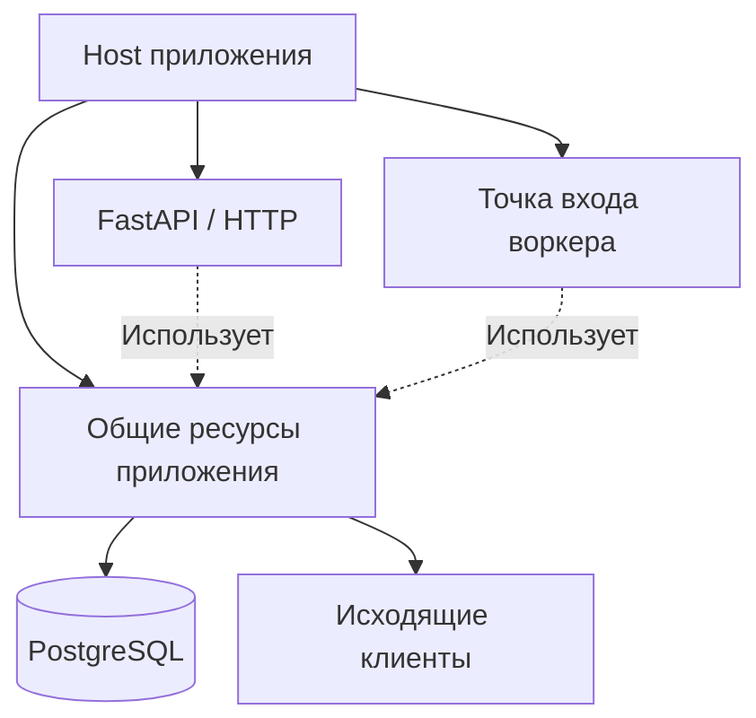

# Почему жизненный цикл приложения не должен принадлежать FastAPI {#why-application-lifecycle-should-not-belong-to-fastapi}

<div class="bdr-post__hero" data-bdr-post="2026-09-07-why-application-lifecycle-should-not-belong-to-fastapi" role="img" aria-label="Жизненный цикл приложения шире HTTP-фреймворка" markdown="0"></div>

`lifespan` FastAPI — хороший API: асинхронный контекстный менеджер с запуском до `yield` и остановкой после. Обычно туда помещают пул БД, прогрев, проверки здоровья и клиенты. Проблема в принадлежности: lifespan относится к HTTP-фреймворку, а приложение шире. Как только тому же сервису нужны worker, consumer или ночная задача, обвязка пишется второй раз. Покажу два возникающих файла и один, которым их можно заменить.

<!-- more -->

Код находится в [эксперименте статьи](../lab/2026-09-07-lifecycle-not-fastapi/README.md) и [эксперименте единого жизненного цикла](../lab/2026-09-07-one-lifecycle/README.md). Версии: FastAPI 0.141.1, uvicorn 0.52.4, servicewright 0.10.0, Python 3.13.

## Обычный API {#the-api-as-usually-written}

```python
@contextlib.asynccontextmanager
async def lifespan(app: FastAPI):
    log("pool opened")                      # startup: the pool, warmup, health registration, ...
    app.state.pool = Pool()
    yield
    log("pool closed")                      # shutdown: ... in whatever order uvicorn gets here


app = FastAPI(lifespan=lifespan)


@app.get("/work")
async def work() -> dict[str, str]:
    await app.state.pool.use("http request")
    return {"status": "ok"}
```

Сорок строк с импортами, каждая по отдельности правильна. Пул открыт до первого запроса и закрыт после последнего. До `yield` проходят прогрев, регистрация health и запуск метрик. Жизненный цикл приложения помещён внутрь `FastAPI(...)`.

Три вещи остаются вне его полномочий. Он не определяет общую готовность процесса: uvicorn начинает приём, readiness добавляется маршрутом. Не задаёт порядок ухода относительно балансировщика: uvicorn закрывает сокет по `SIGTERM`, создавая [проблему отклонённых запросов](2026-09-07-graceful-shutdown-is-a-protocol.md). И не существует без HTTP-сервера.

## Обычный worker {#the-worker-as-usually-written}

Через полгода нужны consumer, ночная задача или poller. В новом процессе FastAPI нет, lifespan нет, появляется файл:

```python
async def main() -> None:
    stop = asyncio.Event()
    loop = asyncio.get_running_loop()
    loop.add_signal_handler(signal.SIGTERM, stop.set)     # the API got this from uvicorn
    log("pool opened")                                    # the API got this from the lifespan
    pool = Pool()
    try:
        while not stop.is_set():
            await pool.use("worker loop")
            try:
                await asyncio.wait_for(stop.wait(), timeout=0.4)
            except TimeoutError:
                pass
        log("worker loop saw the stop event")
    finally:
        log("pool closed")                                # and this
```

Тридцать семь строк, из них девять — вручную восстановленная обвязка API: stop event, сигналы, открытие пула и закрытие в `finally`. Запустим и отправим `SIGTERM`:

```text
 0.00 s  pool opened
 0.80 s  worker loop used the pool
 0.97 s  worker loop saw the stop event
 0.97 s  pool closed
```

Работает, но иначе. Нет readiness, различающей прогрев и застрявший worker. Нет окна drain и отдельного бюджета: десятисекундный пакет ограничен только внешним сроком завершения. Нет реестра здоровья, пул никто не проверяет. Прогрев из API не скопирован — перенесли только пул. Следующий worker унаследует этот файл со всеми пропусками.

Настоящая цена lifecycle внутри lifespan — отсутствие общего механизма для остальных типов запуска. Всё вне HTTP воссоздаёт его немного иначе, пока consumer не потеряет сообщения при обновлении, а расследование не обнаружит отсутствие ожидания завершения.

## Фреймворк — точка входа {#the-framework-is-an-entrypoint}

FastAPI — один способ поступления работы, как цикл consumer, планировщик и gRPC-сервер. Ни один не равен процессу. Процессу нужен единый жизненный цикл от запуска до завершения, которым владеет общий Host для всех точек входа.

FastAPI остаётся обычным приложением, но контейнер, прогрев, health и readiness уже подготовил Host до первого запроса. После последнего он выполнит drain и очистку. Worker — функция от области зависимостей и stop event, планировщик — список задач. Все отвечают на `bind`, `serve`, `drain`, `stop`.

Предыдущая статья измерила выполнение; здесь важен diff. Полная замена двух файлов в модели Host:

```python
api = FastApiEntrypoint(config=HttpConfig(port=8000), routers=(router,))
worker = DaemonEntrypoint(consume)

ENTRYPOINTS = {"all": [api, worker], "api": [api], "worker": [worker]}

spec = AppSpec(service_name="orders", create_container=lambda settings: Container(), drain_delay_seconds=1.0)
run_sync(Service(spec, entrypoints=ENTRYPOINTS[role]), Settings())
```

Отдельный файл worker исчез. Сигналы, событие остановки, `finally` пула, готовность, бюджет drain и прогрев определены один раз. Worker содержит лишь цикл. Планировщик добавляется записью словаря; API и worker разделяются на развёртывания выбором его ключей.

<!-- diagram:concept -->
<figure class="bdr-diagram" markdown="1">
<figcaption><span class="bdr-diagram__eyebrow">ИДЕЯ В СХЕМЕ</span><strong>Приложение владеет ресурсами, фреймворки принимают трафик</strong></figcaption>
<div class="bdr-diagram__viewport" markdown="1" data-search-exclude>



</div>
<p class="bdr-diagram__caption">Пулы БД и общие клиенты принадлежат Host приложения. Точки входа HTTP и воркера используют эти ресурсы и подчиняются общему порядку запуска и завершения.</p>
</figure>
<!-- /diagram:concept -->

## Для чего остаётся lifespan FastAPI {#what-fastapis-lifespan-is-still-for}

Ресурсам только HTTP-приложения: шаблонизатору, кешу маршрутов, настройке OpenAPI. Правило простое: lifespan владеет нужным только HTTP-точке, Host — нужным процессу. Пул БД относится ко второму; раньше он жил в lifespan, потому что другого места не было.

С этим можно спорить: сервису, который навсегда останется только API, lifespan подходит, а Host добавляет уровень. На мой взгляд, часто это верно лишь в первый день: позже приходит worker, и содержимое lifespan всё равно приходится переносить. Раннее выделение стоит одного файла.

Host предоставляет [servicewright](https://bedrock-python.github.io/servicewright/concepts/lifecycle/). Его FastAPI-точка создаёт обычное приложение и передаёт общий жизненный цикл Host.

Суть — во втором файле: тридцать семь строк повторной обвязки.
