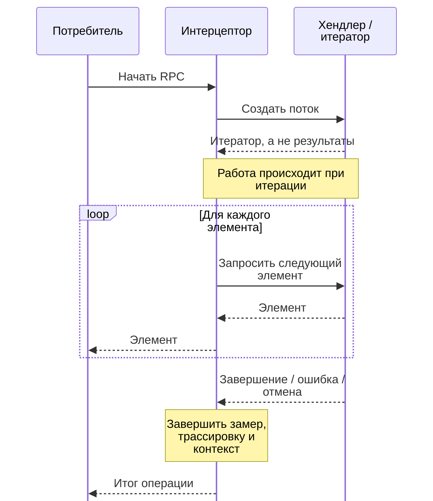

# Почему перехватчики gRPC ломаются на потоковых RPC {#why-grpc-interceptors-break-on-streaming-rpcs}

<div class="bdr-post__hero" data-bdr-post="2026-09-07-why-grpc-interceptors-break-on-streaming-rpcs" role="img" aria-label="Обёртка завершает работу до первого элемента потока" markdown="0"></div>

Перехватчик, измеряющий вызов, считающий ошибки и связывающий request id, занимает двадцать строк и работает. Затем добавляют серверный потоковый метод, и те же строки начинают врать: гистограмма показывает ноль миллисекунд вместо шестисот, ошибки не считаются, request id исчезает до первого элемента. Исключения нет; графики молча перестают описывать действительность.

<!-- more -->

Числа получены в [эксперименте статьи](../lab/2026-09-07-grpc-interceptors-and-streams/README.md): сервер внутри процесса с четырьмя видами RPC. Версии: grpc-client-kit 0.1.2, grpcio 1.83.1, Python 3.13.

## Перехватчик зарегистрирован лишь для одного вида из четырёх {#the-interceptor-that-is-registered-for-one-kind-out-of-four}

Ещё до измерения есть молчаливая проблема регистрации.

У `grpc.aio` четыре базовых класса клиентских перехватчиков, по виду RPC. Кажется естественным унаследовать все четыре и реализовать четыре метода. Канал делает следующее:

```text
    one object inheriting all four ABCs, channel lists: unary_unary=1, unary_stream=0,
                                                        stream_unary=0, stream_stream=0
    unary_unary    intercept ran 1 time(s)
    unary_stream   intercept ran 0 time(s)
    stream_unary   intercept ran 0 time(s)
    stream_stream  intercept ran 0 time(s)
```

Он раскладывает объекты в четыре списка цепочкой `if`/`elif`. Объект, подходящий под все проверки, попадает лишь в первый: unary-unary. Ошибок и предупреждений нет, остальные методы не вызываются.

Четыре объекта с одним базовым классом каждый регистрируются ожидаемо:

```text
    four objects, one ABC each, channel lists: unary_unary=1, unary_stream=1,
                                               stream_unary=1, stream_stream=1
```

Поэтому потоковые ошибки часто обнаруживаются позже появления: сначала перехватчик вообще не работал на потоках.

## Что unary-перехватчик измеряет у потока {#what-a-unary-interceptor-measures-on-a-stream}

Регистрация исправлена. Теперь привычная форма, корректная для unary-вызова:

```python
async def intercept_unary_stream(self, continuation, details, request):
    token = REQUEST_ID.set("req-42")
    started = time.perf_counter()
    try:
        return await continuation(details, request)
    except grpc.aio.AioRpcError:
        self.errors += 1
        raise
    finally:
        self.measured_ms = (time.perf_counter() - started) * 1000
        REQUEST_ID.reset(token)
```

Проверим поток из пяти элементов с интервалом 120 мс и такой же с ошибкой на третьем:

```text
    unary-style wrapper, healthy stream: it measured 0 ms
      the caller waited 609 ms for 5 items; request id during the stream: None
    unary-style wrapper, failing stream: it counted 0 errors, measured 0 ms
      the caller waited 245 ms, got 2 items and then UNAVAILABLE: report generator died at item 3
```

Три сбоя с общей причиной: для потокового ответа `continuation` возвращается при создании *объекта вызова*. Получение ответа происходит позже, во время итерации потребителя.

- **Нулевая длительность.** Измерено создание объекта, названное задержкой RPC на 609 мс. График ошибочно считает потоковый метод самым быстрым.
- **Невидимая ошибка.** Потребитель получил `UNAVAILABLE` посреди `async for`, но `except` вокруг `continuation` уже завершился в другом стеке. Счётчик остаётся нулевым.
- **Потерянный контекст.** `finally` сбросил request id до первого элемента, и журналы обработки потока лишились корреляции именно там, где она особенно нужна.

<!-- diagram:concept -->
<figure class="bdr-diagram" markdown="1">
<figcaption><span class="bdr-diagram__eyebrow">ИДЕЯ В СХЕМЕ</span><strong>Поток живёт дольше вызова, который его создал</strong></figcaption>
<div class="bdr-diagram__viewport" markdown="1" data-search-exclude>



</div>
<p class="bdr-diagram__caption">Замер только создания итератора пропускает работу и последующие ошибки. Потоковый интерцептор должен сохранять контекст во время итерации и завершать его при успехе, ошибке или отмене.</p>
</figure>
<!-- /diagram:concept -->

## Ручное исправление {#doing-it-by-hand}

Нужно обернуть возвращённый вызов и охватить итерацию, а не только создание:

```python
async def intercept_unary_stream(self, continuation, details, request):
    started = time.perf_counter()
    call = await continuation(details, request)

    async def wrapped():
        token = REQUEST_ID.set("req-42")
        try:
            async for item in call:
                yield item
        except grpc.aio.AioRpcError:
            self.errors += 1
            raise
        finally:
            self.measured_ms = (time.perf_counter() - started) * 1000
            REQUEST_ID.reset(token)

    return wrapped()
```

Тот же эксперимент и сервер:

```text
    stream-aware wrapper, healthy stream: it measured 608 ms
      the caller waited 608 ms for 5 items; request id during the stream: 'req-42'
    stream-aware wrapper, failing stream: it counted 1 errors, measured 244 ms
```

608 против 609 мс, одна ошибка на один сбой, request id виден при поступлении элементов. Асинхронный генератор работает в контексте вызывающего, поэтому установленное значение намеренно видно потребителю, а reset выполняется при завершении генератора.

Идея правильна, но появляются обязательства. Нужно обработать брошенный посередине поток, иначе `finally` отложится до сборки мусора или не выполнится вовремя. Не проглотить `GeneratorExit`, корректно обработать отмену. Повторить реализацию для четырёх видов RPC; stream-unary отличается снова: там итератором является *запрос*, а окончательный исход приходит позже.

## Четыре вида, одна реализация {#the-four-kinds-one-implementation}

Хочется писать как unary-перехватчик, сохраняя правильное поведение всех видов. Для этого логический перехватчик предоставляет `around_call` с одним yield, охватывающим весь RPC.

```python
class Observability(AsyncAroundClientInterceptor):
    async def around_call(self, call: ClientCall):
        started = time.perf_counter()
        try:
            yield                       # the whole RPC, response stream included
        except grpc.aio.AioRpcError:
            self.errors += 1
            raise
        finally:
            self.measured[call.method] = (time.perf_counter() - started) * 1000
```

Один класс разворачивается в четыре записи канала, нужные его `if`/`elif`:

```text
    flatten_interceptors([one logical interceptor]) -> 4 channel entries
    channel lists: unary_unary=1, unary_stream=1, stream_unary=1, stream_stream=1
    unary_unary    around_call ran 1 time(s)
    unary_stream   around_call ran 1 time(s)
    stream_unary   around_call ran 1 time(s)
    stream_stream  around_call ran 1 time(s)
    measured /lab.Reports/Get       123 ms
    measured /lab.Reports/Stream    608 ms
    measured /lab.Reports/Chat      367 ms
    measured /lab.Reports/Upload      1 ms
```

Каждый вид вызывается один раз; поток измерен реально — 608 мс, не ноль. Ошибка посреди потока достигает `except` как обычный `AioRpcError`:

```text
    failing stream: around_call counted 1 errors, measured 246 ms
```

У вызывающей стороны сохраняется интерфейс настоящего call. Про эту проверку часто забывают: обычный async generator вместо обёртки лишит `code()`, `details()` и `trailing_metadata()`:

```text
    no interceptor               code()='OK'; details()=''; trailing_metadata()=Metadata(())
    the kit's around interceptor code()='OK'; details()=''; trailing_metadata()=Metadata(())
```

## Особенность потокового контекста {#the-part-that-only-shows-up-on-streams}

Есть ещё асимметрия, превращающая это из маленького совета в задачу проектирования.

У unary создание, RPC и очистка происходят в одной корутине, задаче и контексте. У потока очистка выполняется там, где закончена итерация. Поэтому ресурс до yield и освобождение после — токен `ContextVar`, контекст OpenTelemetry, семафор — требуют внимания. Токен одного контекста нельзя сбросить в другом: `contextvars` отклонит это.

Библиотека закрепляет контекст на вызов и выполняет обе половины внутри него, поэтому обычная запись работает для всех видов:

```text
--- an around_call that sets a ContextVar before the yield and resets it after
    unary_unary    caller got the response
    unary_stream   caller got the response
    stream_unary   caller got the response
    stream_stream  caller got the response
```

Вторая гарантия — ошибка самой очистки: отправка метрик, запись журнала, недоступный exporter.

```text
--- any teardown that raises, per RPC kind
    unary_unary    caller got the response
    unary_stream   caller got the response
    stream_unary   caller got the response
    stream_stream  caller got the response
```

Во всех видах ответ сохраняется, ошибка очистки журналируется. Слой наблюдаемости не должен превращать успешный RPC в ошибку клиента, тем более лишь для части видов.

## Что проверить в своих перехватчиках {#what-to-check-in-your-own-interceptors}

- **Для скольких видов он зарегистрирован?** Один класс с четырьмя ABC в проверенной реализации попадает лишь в первый список.
- **Где заканчивается измерение?** Возврат `continuation` не означает завершение потокового ответа.
- **Где появится ошибка посреди потока?** Не в уже завершившемся `try` вокруг создания.
- **Виден ли контекст потребителю и можно ли сбросить токен в месте очистки?**
- **Что получает клиент?** Генератор может отнять `code()` и `trailing_metadata()`.
- **Что будет при ошибке собственных метрик или журналирования?** Она не должна менять результат RPC.

## Инструменты {#the-pieces}

`around_call` предоставляет [grpc-client-kit](https://bedrock-python.github.io/grpc-client-kit/), вместе с журналами, трассировкой, метриками, таймаутами, повторами и circuit breaker в фиксированном порядке. `flatten_interceptors` разворачивает их в четыре записи канала. Общий контекст через yield и безопасная очистка появились в 0.1.2: эксперимент обнаружил их отсутствие.

Нулевая задержка самого быстрого endpoint может означать, что перехватчик измеряет не то.
