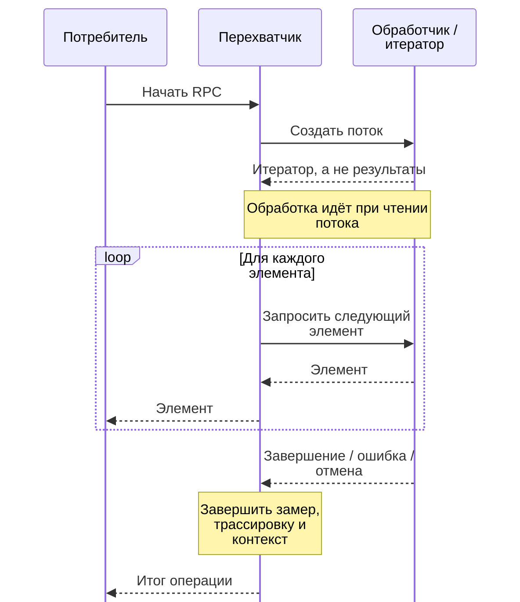

# Почему перехватчики gRPC ломаются на потоковых RPC {#why-grpc-interceptors-break-on-streaming-rpcs}

<div class="bdr-post__hero" data-bdr-post="2026-09-07-why-grpc-interceptors-break-on-streaming-rpcs" role="img" aria-label="Обёртка завершает работу до первого элемента потока" markdown="0"></div>

Перехватчик, который измеряет длительность вызова, считает ошибки и добавляет идентификатор запроса в контекст, занимает двадцать строк и работает. Затем в сервисе появляется метод с потоковым ответом, и измерения становятся неверными: гистограмма показывает ноль миллисекунд вместо шестисот, ошибки не учитываются, а идентификатор запроса исчезает до получения первого элемента. Сам перехватчик не сообщает об ошибке — неверными оказываются метрики и логи.

<!-- more -->

Измерения получены в [лаборатории статьи](../lab/2026-09-07-grpc-interceptors-and-streams/README.md) на сервере с четырьмя видами RPC, запущенном в том же процессе. Версии: grpc-client-kit 0.1.2, grpcio 1.83.1, Python 3.13.

## Перехватчик зарегистрирован лишь для одного вида из четырёх {#the-interceptor-that-is-registered-for-one-kind-out-of-four}

Первая проблема возникает ещё при регистрации перехватчика, причём без ошибок и предупреждений.

В `grpc.aio` четыре базовых класса клиентских перехватчиков — по одному на каждый вид RPC. Кажется естественным создать класс, который наследуется от всех четырёх и реализует все четыре метода. Но канал обрабатывает его так:

```text
    one object inheriting all four ABCs, channel lists: unary_unary=1, unary_stream=0,
                                                        stream_unary=0, stream_stream=0
    unary_unary    intercept ran 1 time(s)
    unary_stream   intercept ran 0 time(s)
    stream_unary   intercept ran 0 time(s)
    stream_stream  intercept ran 0 time(s)
```

Он раскладывает объекты в четыре списка цепочкой `if`/`elif`. Объект, подходящий под все проверки, попадает лишь в первый: unary-unary. Ошибок и предупреждений нет, остальные методы не вызываются.

Чтобы зарегистрировать обработку всех четырёх видов RPC, нужны четыре объекта, каждый со своим базовым классом:

```text
    four objects, one ABC each, channel lists: unary_unary=1, unary_stream=1,
                                               stream_unary=1, stream_stream=1
```

Поэтому ошибки потоковых перехватчиков легко пропустить: код может долго существовать, вообще не вызываясь для потоковых RPC.

## Что измеряет обычный перехватчик в потоковом RPC {#what-a-unary-interceptor-measures-on-a-stream}

Исправим регистрацию и возьмём обычную реализацию для unary-вызова — одного запроса с одним ответом:

```python
async def intercept_unary_stream(self, continuation, details, request):
    token = REQUEST_ID.set("req-42")
    started = time.perf_counter()
    try:
        return await continuation(details, request)
    except grpc.aio.AioRpcError:
        self.errors += 1
        raise
    finally:
        self.measured_ms = (time.perf_counter() - started) * 1000
        REQUEST_ID.reset(token)
```

Проверим поток из пяти элементов с интервалом 120 мс и такой же с ошибкой на третьем:

```text
    unary-style wrapper, healthy stream: it measured 0 ms
      the caller waited 609 ms for 5 items; request id during the stream: None
    unary-style wrapper, failing stream: it counted 0 errors, measured 0 ms
      the caller waited 245 ms, got 2 items and then UNAVAILABLE: report generator died at item 3
```

У трёх проблем одна причина: при потоковом ответе `continuation` возвращает управление, как только создан *объект вызова*. Чтение ответа происходит позже, когда вызывающий код перебирает элементы потока.

- **Нулевая длительность.** Измерено только создание объекта вызова, хотя весь RPC занял 609 мс. На графике потоковый метод ошибочно выглядит самым быстрым.
- **Невидимая ошибка.** Вызывающий код получил `UNAVAILABLE` внутри `async for`, когда блок `try` вокруг `continuation` уже завершился. Поэтому счётчик ошибок остался нулевым.
- **Потерянный контекст.** Блок `finally` сбросил идентификатор запроса до получения первого элемента. Связать последующие записи в логах с этим запросом уже не получится.

<!-- diagram:concept -->
<figure class="bdr-diagram" markdown="1">
<figcaption><span class="bdr-diagram__eyebrow">ИДЕЯ В СХЕМЕ</span><strong>Создание потока — только начало RPC</strong></figcaption>
<div class="bdr-diagram__viewport" markdown="1" data-search-exclude>



</div>
<p class="bdr-diagram__caption">Измерять нужно весь поток, включая чтение элементов и ошибки. Перехватчик сохраняет контекст до конца чтения, затем освобождает ресурсы при успехе, ошибке или отмене.</p>
</figure>
<!-- /diagram:concept -->

## Ручное исправление {#doing-it-by-hand}

Нужна обёртка над объектом вызова, которая измеряет и обработку элементов потока:

```python
async def intercept_unary_stream(self, continuation, details, request):
    started = time.perf_counter()
    call = await continuation(details, request)

    async def wrapped():
        token = REQUEST_ID.set("req-42")
        try:
            async for item in call:
                yield item
        except grpc.aio.AioRpcError:
            self.errors += 1
            raise
        finally:
            self.measured_ms = (time.perf_counter() - started) * 1000
            REQUEST_ID.reset(token)

    return wrapped()
```

Тот же эксперимент и сервер:

```text
    stream-aware wrapper, healthy stream: it measured 608 ms
      the caller waited 608 ms for 5 items; request id during the stream: 'req-42'
    stream-aware wrapper, failing stream: it counted 1 errors, measured 244 ms
```

Теперь измерение даёт 608 мс при фактических 609 мс, счётчик фиксирует ошибку, а идентификатор запроса доступен при обработке элементов. Асинхронный генератор выполняется в контексте вызывающего кода, поэтому значение, установленное через `set`, видно и там. Вызов `reset` происходит при завершении генератора.

Но у такой обёртки есть несколько важных случаев. Потребитель может прекратить чтение посередине — тогда `finally` рискует отложиться до сборки мусора. Нельзя подавлять `GeneratorExit`, нужно корректно обрабатывать отмену вызова. Кроме того, реализация нужна для всех четырёх видов RPC. У stream-unary своя особенность: итератором служит *запрос*, а окончательный результат становится известен после возврата из перехватчика.

## Четыре вида, одна реализация {#the-four-kinds-one-implementation}

Хотелось бы написать обработчик один раз и получить правильное поведение для всех четырёх видов RPC. Для этого в библиотеке есть логический перехватчик: метод `around_call` с одним `yield`, до которого выполняется подготовка, а после — обработка завершения RPC.

```python
class Observability(AsyncAroundClientInterceptor):
    async def around_call(self, call: ClientCall):
        started = time.perf_counter()
        try:
            yield                       # the whole RPC, response stream included
        except grpc.aio.AioRpcError:
            self.errors += 1
            raise
        finally:
            self.measured[call.method] = (time.perf_counter() - started) * 1000
```

Один класс преобразуется в четыре перехватчика, которые канал сможет зарегистрировать через свой `if`/`elif`:

```text
    flatten_interceptors([one logical interceptor]) -> 4 channel entries
    channel lists: unary_unary=1, unary_stream=1, stream_unary=1, stream_stream=1
    unary_unary    around_call ran 1 time(s)
    unary_stream   around_call ran 1 time(s)
    stream_unary   around_call ran 1 time(s)
    stream_stream  around_call ran 1 time(s)
    measured /lab.Reports/Get       123 ms
    measured /lab.Reports/Stream    608 ms
    measured /lab.Reports/Chat      367 ms
    measured /lab.Reports/Upload      1 ms
```

Для каждого вида RPC обработчик вызывается один раз. Длительность потока измеряется целиком: 608 мс. Ошибка во время чтения попадает в `except` как обычный `AioRpcError`:

```text
    failing stream: around_call counted 1 errors, measured 246 ms
```

Вызывающий код при этом сохраняет доступ к интерфейсу объекта вызова. Обычный асинхронный генератор вместо такой обёртки лишил бы его методов `code()`, `details()` и `trailing_metadata()`:

```text
    no interceptor               code()='OK'; details()=''; trailing_metadata()=Metadata(())
    the kit's around interceptor code()='OK'; details()=''; trailing_metadata()=Metadata(())
```

## В каком контексте завершается поток {#the-part-that-only-shows-up-on-streams}

У потоковых вызовов есть ещё одна особенность, которую нужно учесть в устройстве перехватчика.

В unary-вызове подготовка, сам RPC и освобождение ресурсов происходят в одной корутине, задаче и контексте. У потокового ответа завершающий код выполняется в той задаче, которая закончила чтение. Это важно, если до `yield` перехватчик устанавливает `ContextVar`, открывает контекст OpenTelemetry или захватывает семафор, а после — освобождает их. Например, токен `ContextVar`, полученный в одном контексте, нельзя сбросить в другом.

Библиотека сохраняет отдельный контекст для каждого вызова и выполняет в нём код как до, так и после `yield`. Поэтому одна и та же реализация подходит для всех видов RPC:

```text
--- an around_call that sets a ContextVar before the yield and resets it after
    unary_unary    caller got the response
    unary_stream   caller got the response
    stream_unary   caller got the response
    stream_stream  caller got the response
```

Вторая гарантия касается ошибок при завершении перехватчика: например, если не удалось отправить метрику или записать лог.

```text
--- any teardown that raises, per RPC kind
    unary_unary    caller got the response
    unary_stream   caller got the response
    stream_unary   caller got the response
    stream_stream  caller got the response
```

Во всех четырёх случаях клиент получает успешный ответ, а ошибка завершающего кода записывается в лог. Сбой в отправке метрик или логировании не должен менять результат самого RPC.

## Что проверить в своих перехватчиках {#what-to-check-in-your-own-interceptors}

- **Для каких видов RPC зарегистрирован перехватчик?** Один класс, наследующийся от четырёх базовых классов, в проверенной реализации попадает только в первый список.
- **Где заканчивается измерение?** Возврат `continuation` не означает завершение потокового ответа.
- **Где появится ошибка посреди потока?** Не в уже завершившемся `try` вокруг создания.
- **Виден ли контекст потребителю и можно ли сбросить токен в месте очистки?**
- **Что получает вызывающий код?** Если вернуть обычный генератор, методы `code()` и `trailing_metadata()` станут недоступны.
- **Что произойдёт при ошибке в отправке метрик или логировании?** Она не должна менять результат RPC.

## Как это реализовано в grpc-client-kit {#the-pieces}

Метод `around_call` предоставляет [grpc-client-kit](https://bedrock-python.github.io/grpc-client-kit/). В библиотеке уже есть перехватчики для логирования, трассировки, метрик, таймаутов, повторов и circuit breaker. Они выполняются в заданном порядке, а `flatten_interceptors` подготавливает их к регистрации для четырёх видов RPC. Общий контекст для кода до и после `yield` и защита результата RPC от ошибок завершающего кода появились в версии 0.1.2 — их необходимость показал этот эксперимент.

Если потоковый метод показывает нулевую длительность, стоит проверить, действительно ли перехватчик измеряет весь вызов.
