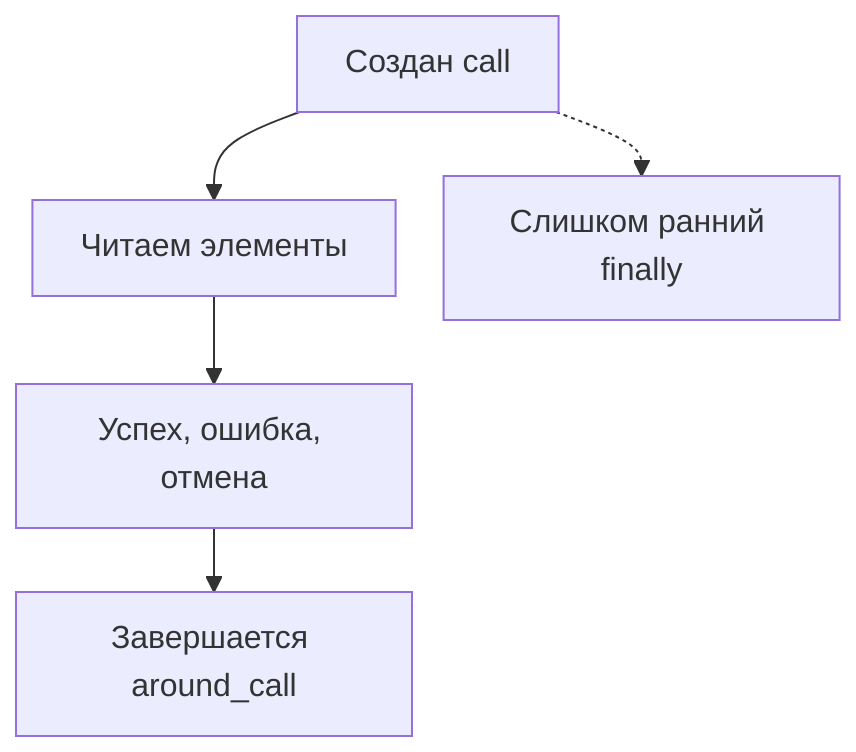

# Почему перехватчики gRPC ломаются на потоковых RPC {#why-grpc-interceptors-break-on-streaming-rpcs}

<div class="bdr-post__hero" data-bdr-post="2026-09-07-why-grpc-interceptors-break-on-streaming-rpcs" role="img" aria-label="Поток отчёта продолжает работать, хотя таймер вокруг создания вызова уже остановлен" markdown="0"></div>

Представим воркер выгрузок, который получает строки от сервиса отчётов по gRPC. Загрузка занимает сотни миллисекунд, а перехватчик записывает почти ноль. Если сервер падает после двух строк, воркер получает ошибку, но перехватчик по-прежнему считает вызов успешным.

Воспроизведём обе проблемы, исправим измерение и проверим, что происходит, когда воркер прекращает чтение. Примеры работают с настоящим локальным сервером gRPC: `grpc-client-kit 0.4.0`, `grpcio 1.84.0`, Python `3.13`.

<!-- more -->

## Какой сервис будем вызывать {#reporting-service}

У нашего сервиса четыре операции, по одной на каждый вид RPC. В обозначении RPC, например unary-stream, первая часть описывает запрос, вторая описывает ответ:

| Метод | Вид RPC | Что делает воркер |
|---|---|---|
| `Get` | unary-unary | Получает один статус отчёта |
| `Stream` | unary-stream | Скачивает строки отчёта |
| `Upload` | stream-unary | Отправляет строки и получает их количество |
| `Chat` | stream-stream | Отправляет строки и получает подтверждения |

В практикуме используем байтовые сообщения и обычные обработчики gRPC без генерации protobuf-кода. Вызовы при этом настоящие: по `127.0.0.1` через автоматически выбранный порт. Вот генератор строк, который вызывается внутри `Stream`:

```python
import asyncio

import grpc

GAP = 0.03
ITEMS = [bytes([number]) for number in range(1, 6)]


async def report_rows(request, context):
    for number, row in enumerate(ITEMS, start=1):
        if request == b"fail" and number == 3:
            await context.abort(
                grpc.StatusCode.UNAVAILABLE, "report generator failed at row 3"
            )
        if request != b"fast":
            await asyncio.sleep(GAP)
        yield row
```

На запрос `b"ok"` приходят пять строк. На `b"fail"` сервер отдаёт две строки, затем `UNAVAILABLE`. Значение `b"fast"` убирает паузы для отдельной проверки длительности. Сервис также передаёт завершающие метаданные `report-id: r-42`.

## Сначала убеждаемся, что перехватчик вызывается {#the-interceptor-that-is-registered-for-one-kind-out-of-four}

Допустим, мы собрали все четыре метода в одном перехватчике:

```python
from collections import Counter

import grpc
import grpc.aio


class EverythingInterceptor(
    grpc.aio.UnaryUnaryClientInterceptor,
    grpc.aio.UnaryStreamClientInterceptor,
    grpc.aio.StreamUnaryClientInterceptor,
    grpc.aio.StreamStreamClientInterceptor,
):
    def __init__(self):
        self.calls = Counter()

    async def intercept_unary_unary(self, continuation, details, request):
        self.calls["unary_unary"] += 1
        return await continuation(details, request)

    async def intercept_unary_stream(self, continuation, details, request):
        self.calls["unary_stream"] += 1
        return await continuation(details, request)

    async def intercept_stream_unary(self, continuation, details, request):
        self.calls["stream_unary"] += 1
        return await continuation(details, request)

    async def intercept_stream_stream(self, continuation, details, request):
        self.calls["stream_stream"] += 1
        return await continuation(details, request)
```

Вызываем каждый метод сервиса по одному разу, но в `calls` получаем только `{"unary_unary": 1}`. В проверенной версии grpcio [конструктор канала](https://grpc.github.io/grpc/python/_modules/grpc/aio/_channel.html) регистрирует объект через цепочку `if`/`elif`: срабатывает первый подходящий базовый класс.

Нужен отдельный объект перехватчика для каждого вида RPC либо четыре адаптера из `grpc-client-kit`, которые подключим ниже. Перед сравнением длительности практикум проверяет, что измеряющий перехватчик действительно вызван. Нетронутый счётчик ещё не означает быстрый RPC.

## Таймер вокруг continuation измеряет подготовку {#what-a-unary-interceptor-measures-on-a-stream}

Этот перехватчик наследует только класс для потокового ответа. С регистрацией всё правильно, а с измерением по-прежнему нет:

```python
import asyncio
from time import perf_counter

import grpc


class SetupTimer(grpc.aio.UnaryStreamClientInterceptor):
    def __init__(self):
        self.entered = 0
        self.errors = 0
        self.seconds = None
        self.finished = asyncio.Event()

    async def intercept_unary_stream(self, continuation, details, request):
        self.entered += 1
        started = perf_counter()
        try:
            return await continuation(details, request)
        except grpc.aio.AioRpcError:
            self.errors += 1
            raise
        finally:
            self.seconds = perf_counter() - started
            self.finished.set()
```

Практикум проверяет: `entered == 1`, а к приходу первой строки событие `finished` уже установлено. При сбое воркер получает две строки и `UNAVAILABLE`, но `errors` остаётся равным нулю.

[`continuation`](https://grpc.github.io/grpc/python/grpc_asyncio.html#grpc.aio.UnaryStreamClientInterceptor) возвращает объект вызова, не дожидаясь завершения потока. Сетевая ошибка появляется позже, внутри `async for`. Это различие важно и для обычного unary-перехватчика: объект вызова можно получить раньше ответа.

<!-- diagram:concept -->
<figure class="bdr-diagram" markdown="1">
<figcaption><span class="bdr-diagram__eyebrow">ИДЕЯ В СХЕМЕ</span><strong>Вызов создан, но RPC ещё не завершён</strong></figcaption>
<div class="bdr-diagram__viewport" markdown="1" data-search-exclude>


```mermaid
---
config:
  theme: default
  look: classic
  flowchart:
    useMaxWidth: false
    wrappingWidth: 150
    padding: 12
    nodeSpacing: 24
    rankSpacing: 32
---
flowchart TD
    accTitle: Вызов создан, но RPC ещё не завершён
    accDescr: Обёртка вокруг continuation завершает измерение после создания call. Перехватчик around_call получает итог RPC: успех, ошибку или отмену.
    A["Создан call"]
    B["Читаем элементы"]
    C["Успех, ошибка, отмена"]
    D["Завершается around_call"]
    E["Слишком ранний finally"]
    A --> B --> C --> D
    A -.-> E
```

</div>
<p class="bdr-diagram__caption">Обёртка вокруг continuation завершает измерение после создания call. Перехватчик around_call получает итог RPC: успех, ошибку или отмену.</p>
</figure>
<!-- /diagram:concept -->

## Оборачиваем чтение потока {#doing-it-by-hand}

Если воркер читает поток до конца, измерение и обработку ошибок можно перенести в цикл. Класс использует импорты из предыдущего примера:

```python
class IterationTimer(grpc.aio.UnaryStreamClientInterceptor):
    def __init__(self):
        self.errors = 0
        self.seconds = None
        self.finished = asyncio.Event()

    async def intercept_unary_stream(self, continuation, details, request):
        started = perf_counter()
        call = await continuation(details, request)

        async def rows():
            try:
                async for row in call:
                    yield row
            except grpc.aio.AioRpcError:
                self.errors += 1
                raise
            finally:
                self.seconds = perf_counter() - started
                self.finished.set()

        return rows()
```

Теперь практикум получает пять строк при успехе либо две строки и одну учтённую ошибку при сбое. На первой строке событие `finished` ещё не установлено; оно появляется при завершении итерации.

Важен порядок: объект вызова создаётся **до** возврата генератора. В этой версии grpcio gRPC связывает возвращённый итератор с вызовом, поэтому `code()`, `details()` и `trailing_metadata()` остаются доступны. Практикум проверяет статус и `report-id` и для ручной обёртки, и для библиотечной. Сам по себе возврат генератора не лишает потребителя интерфейса вызова.

Эта небольшая обёртка покрывает только unary-stream, прочитанный до конца или до ошибки. Для досрочного выхода нужно определить, кто отменяет вызов. У потоковых запросов есть ещё один случай: ожидание окончательного ответа внутри перехватчика может заблокировать код, которому сначала нужно отправить данные через `write()`.

## Один around_call для четырёх видов RPC {#the-four-kinds-one-implementation}

В Bedrock [grpc-client-kit](https://github.com/bedrock-python/grpc-client-kit) для этого есть `AsyncAroundClientInterceptor`. Его метод `around_call()` делает один `yield`: до него выполняется подготовка, после обрабатывается результат. В практикуме складываем результаты в очередь, чтобы явно дождаться завершения, а не подбирать задержку:

```python
from contextvars import ContextVar

from grpc_client_kit.interceptors.base import AsyncAroundClientInterceptor, ClientCall

REQUEST_ID = ContextVar("request_id", default=None)


class Observability(AsyncAroundClientInterceptor):
    def __init__(self):
        self.finished = asyncio.Queue()

    async def around_call(self, call: ClientCall):
        started = perf_counter()
        outcome = "OK"
        try:
            yield
        except grpc.aio.AioRpcError as error:
            outcome = error.code().name
            raise
        except asyncio.CancelledError:
            outcome = "CANCELLED"
            raise
        except Exception:
            outcome = "LOCAL_ERROR"
            raise
        finally:
            self.finished.put_nowait(
                {
                    "kind": call.rpc_type,
                    "method": call.method,
                    "outcome": outcome,
                    "seconds": perf_counter() - started,
                    "request_id": REQUEST_ID.get(),
                }
            )
```

Здесь по-прежнему используются `asyncio`, `grpc` и `perf_counter` из предыдущих примеров. В сервисе эти данные отправляются в метрики или логи; очередь нужна практикуму для проверки результата.

Классы находятся в `observers.py`. Эта функция из `consumer.py` подключает один логический перехватчик через `flatten_interceptors()` и скачивает отчёт:

```python
from grpc_client_kit import flatten_interceptors

from observers import Observability
from report_service import STREAM


async def download(target):
    observer = Observability()
    async with grpc.aio.insecure_channel(
        target, interceptors=flatten_interceptors([observer])
    ) as channel:
        call = channel.unary_stream(STREAM)(b"ok", timeout=5)
        rows = [row async for row in call]
        record = await asyncio.wait_for(observer.finished.get(), timeout=5)
        assert await call.code() == grpc.StatusCode.OK
        assert dict(await call.trailing_metadata()) == {"report-id": "r-42"}
        return rows, record
```

Практикум вызывает эту функцию и отдельно проверяет все четыре вида RPC. Из `flatten_interceptors([observer])` получаются четыре адаптера; на каждый RPC приходится одна запись о результате. Ошибка после двух строк доходит до `around_call` как `AioRpcError`, локальная отмена даёт `CANCELLED`. Вызов stream-unary через `write()` и `done_writing()` тоже завершается.

**Метрика описывает время RPC, а не всю обработку его результата приложением.** Библиотека может завершить перехватчик по уведомлению о завершении вызова. В проверке быстрого потока потребитель уже получил пятую строку, но ещё не продолжил итерацию до EOF; `around_call` к этому моменту завершился. Если выгрузка включает валидацию, запись файла и другую обработку, измеряйте всю операцию воркера отдельно. При этом темп чтения и управление потоком могут влиять на длительность самого RPC.

## Разделяем контекст перехватчика и вызывающего кода {#the-part-that-only-shows-up-on-streams}

Допустим, на время RPC один из слоёв устанавливает контекстную переменную:

```python
class TokenScope(AsyncAroundClientInterceptor):
    def __init__(self):
        self.finished = asyncio.Queue()

    async def around_call(self, call: ClientCall):
        token = REQUEST_ID.set("interceptor-only")
        try:
            yield
        finally:
            inside = REQUEST_ID.get()
            REQUEST_ID.reset(token)
            self.finished.put_nowait((inside, REQUEST_ID.get()))
```

Проверяем это для всех четырёх видов RPC. Вложенный наблюдатель видит `interceptor-only`, вызывающий код сохраняет `caller-owned`, а сброс токена проходит успешно. `grpc-client-kit` обеспечивает общий контекст для подготовки и завершения, когда они выполняются в разных задачах.

Но это не переносит значение в задачу, которая читает поток, и не передаёт `ContextVar` на сервер. Если идентификатор нужен в логах потребителя, установите его там до создания вызова. Для передачи между сервисами нужны явные метаданные gRPC. Работа контекста задач описана в [документации Python](https://docs.python.org/3/library/contextvars.html#asyncio-support).

Отдельно проверим сбой при завершении: отправка метрики сама выбрасывает исключение.

```python
class RaisingTeardown(AsyncAroundClientInterceptor):
    async def around_call(self, call: ClientCall):
        try:
            yield
        finally:
            raise RuntimeError("metrics exporter unavailable")
```

Практикум подтверждает: все четыре успешных RPC остаются успешными, сломанный поток по-прежнему возвращает `UNAVAILABLE`, а все пять исключений `RuntimeError` попадают в лог библиотеки. В этих случаях ошибка служебного кода после `yield` не подменяет результат RPC.

## Прекращаем RPC, когда воркер закончил чтение {#what-to-check-in-your-own-interceptors}

Для предпросмотра воркеру нужна только первая строка. Вот код из `consumer.py`, который управляет временем жизни вызова. Он использует ту же переменную `REQUEST_ID`, что и перехватчики:

```python
from observers import REQUEST_ID
from report_service import STREAM


async def first_row(channel, request=b"hold"):
    token = REQUEST_ID.set("req-42")
    call = None
    try:
        call = channel.unary_stream(STREAM)(request, timeout=5)
        async for row in call:
            assert REQUEST_ID.get() == "req-42"
            return row
    finally:
        if call is not None:
            call.cancel()
        REQUEST_ID.reset(token)
```

Специальный запрос `b"hold"` отдаёт одну строку и оставляет серверный обработчик ждать. Практикум проверяет, что функция отменяет вызов, останавливает обработчик на сервере, создаёт ровно одну запись `CANCELLED` и восстанавливает контекст потребителя.

Есть и обратная проверка: после `break` без отмены, при сохранённой ссылке на объект вызова, RPC остаётся активным, а запись о результате ещё не создана. Явно вызывайте `cancel()` в `finally`: выход из цикла не сообщает серверу о завершении. Метод `cancel()` синхронный; для уже завершённого вызова он ничего не меняет.

## Запускаем примеры {#labs}

Из корня репозитория сайта, с установленным uv:

```bash
cd docs/blog/lab/2026-09-07-grpc-interceptors-and-streams
uv run --no-project --python 3.13 --with-requirements requirements.txt python interceptors_lab.py
uv run --no-project --python 3.13 --with-requirements requirements.txt python probe.py
```

Оба скрипта проверяют результаты утверждениями и завершаются с ошибкой при несовпадении. Они проверяют регистрацию, число строк, ошибки, статус и завершающие метаданные, изоляцию контекста, отмену и логирование сбоев завершающего кода. Длительности печатаются для сравнения; точные миллисекунды не зашиты в проверки. Файлы и границы примера описаны в [README практикума](../lab/2026-09-07-grpc-interceptors-and-streams/README.md).

<div id="the-pieces" data-search-exclude></div>

## Что использовать в своём сервисе {#conclusion}

Для потокового отчёта мало измерить создание вызова: перехватчик должен видеть завершение RPC и ошибку во время чтения. Вызывающий код отвечает за цикл чтения и отмену, если отчёт больше не нужен.

Используйте [grpc-client-kit](https://github.com/bedrock-python/grpc-client-kit), если общий слой логирования, метрик или трассировки должен работать для всех четырёх видов RPC. `around_call` и `flatten_interceptors` позволяют написать его один раз. Проверяйте его на сценарии потребителя, как в этом практикуме: с частичным чтением и ошибкой после первого элемента. Владение каналами, дедлайны и повторы разобраны в статье [«HTTP- и gRPC-клиенты для продакшена»](2026-09-13-production-http-grpc-clients.md).
