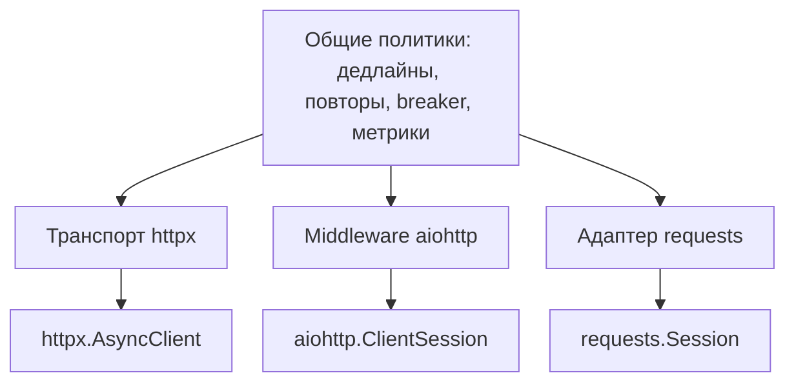

# Почему я перестал писать обёртки над HTTP-клиентами {#why-i-stopped-wrapping-http-clients}

<div class="bdr-post__hero" data-bdr-post="2026-09-07-why-i-stopped-wrapping-http-clients" role="img" aria-label="Сохранить родной клиент, подключив политику рядом" markdown="0"></div>

В каждой компании, где я работал, появлялась своя HTTP-обёртка: помощник повторов, класс конфигурации, метрики, затем `class HttpClient` в общем пакете, от которого зависят все и с которого никто не может уйти. Я написал три таких. Проблема не в полезных функциях, а в случайном последствии: обёртка забирает сам клиент. Разберём её реальную ответственность, измерим цену и покажем альтернативу, где политика подключена к родному клиенту, сохраняющему документированный тип.

<!-- more -->

Числа получены в [эксперименте статьи](../lab/2026-09-07-why-i-stopped-wrapping-http-clients/README.md) с управляемо сбойным origin внутри процесса. Версии: clientwright 0.2.2, httpx 0.28.1, aiohttp 3.14.3, requests 2.34.2, tenacity 9.1.4, Python 3.13.

## Жизнь обёртки {#the-life-of-a-wrapper}

Первый этап — функция. Во вторник внешний сервис дал сбой, кто-то написал `async def get_with_retry(url)`. Одиннадцать правильных строк.

Второй — класс. Нужен таймаут, отдельный таймаут медленного endpoint, общий заголовок, метрика. Появляется `HttpClient(base_url, timeout, retries, headers)` с `.get()`, `.post()` и настройками; каждый сервис создаёт его при старте. Сейчас обёртка особенно полезна, но важное решение уже принято незаметно: её методы стали единственным доступным HTTP API.

Третий — бесконечная передача возможностей. Нужны потоки — добавляется `.stream()`. Авторизация — `auth=`. Потом hooks, mounts, HTTP/2, proxy, тестовый transport. Каждая возможность требует PR общего пакета, ревью, выпуска и обновления тридцати сервисов. Две тысячи строк переэкспортируют половину родного API под другими именами, документация исходной библиотеки больше не подходит. Обёртка стала собственным HTTP-диалектом компании.

## Чем она действительно должна управлять {#what-the-wrapper-actually-owns}

Уберём передачу чужих аргументов. Останутся повторы с задержкой, общий таймаут, circuit breaker, входящий дедлайн, стандартные заголовки, метрики, span, классификация отказа соединения и 503.

Это политики *вызовов*, применимые независимо от того, идут bytes через httpx, aiohttp или requests. Обёртка связывает их с API конкретной библиотеки и скрывает этот API. Политика не переносится, библиотека не используется напрямую. Независимые вещи оказываются сцеплены.

Цену можно измерить.

## Измеренная цена {#measured-the-price}

**Потерян тип.** `HttpClient` нельзя передать SDK, ожидающему `httpx.AsyncClient` для общего пула, использовать как родной клиент в fixture или напрямую применить документацию. Альтернатива — одна политика для трёх библиотек; посмотрим возвращаемые типы:

```text
build('httpx')    -> httpx.AsyncClient              type(client) is AsyncClient:   True
build('aiohttp')  -> aiohttp.client.ClientSession   type(client) is ClientSession: True
build('requests') -> requests.sessions.Session      type(client) is Session:       True
```

Это не подкласс и не proxy: `type(client) is httpx.AsyncClient`. Подходит документация и любой SDK с таким параметром. Механизм повторов живёт в штатной точке расширения: transport httpx, middleware aiohttp, adapter requests. Сверху клиент остаётся родным.

**Циклы повторов перемножаются.** Повторяющую обёртку однажды обернут tenacity, service mesh или родной политикой библиотеки. По отдельности всё разумно. Вместе:

```text
tenacity(3) around a client with max_attempts=3, one 503 endpoint: origin saw 9 requests
```

Девять запросов к серверу с 503 от клиента, ожидавшего три. Так сбой зависимости усиливается, когда повторы скрыты от места вызова. Настройка `retry=RetryConfig(max_attempts=3)` видна добавляющему декоратор разработчику; скрытая внутри `HttpClient.get` — нет.

**Наблюдаемость привязана к обёртке.** Её метрики и labels исчезнут при замене. Альтернатива — общая схема метрик слоя политик, где транспортная библиотека лишь label. Endpoint дважды падает, затем проходит через два клиента:

```text
httpx    status=200  origin saw 3 requests  attempt records=3
         {'service': 'orders', 'adapter': 'httpx',   'seam': 'transport',  'method': 'GET', 'status': '200', 'outcome': 'success'}
aiohttp  status=200  origin saw 3 requests  attempt records=3
         {'service': 'orders', 'adapter': 'aiohttp', 'seam': 'middleware', 'method': 'GET', 'status': '200', 'outcome': 'success'}
```

Одинаковые повторы, исход и формат записи; два отличающихся label называют библиотеку и место подключения движка. График переживает миграцию, политика остаётся на месте.

<!-- diagram:concept -->
<figure class="bdr-diagram" markdown="1">
<figcaption><span class="bdr-diagram__eyebrow">ИДЕЯ В СХЕМЕ</span><strong>Сохранить родной клиент, подключить политики под ним</strong></figcaption>
<div class="bdr-diagram__viewport" markdown="1" data-search-exclude>



</div>
<p class="bdr-diagram__caption">Движок политик использует точку расширения каждой библиотеки. Вызывающий код сохраняет родной тип клиента и API; проверка возможностей адаптера выявляет настройки, которые библиотека не поддерживает.</p>
</figure>
<!-- /diagram:concept -->

## Честность о возможностях {#capability-honesty}

Аргумент за обёртку — единый API и одинаковое поведение. Но библиотеки различаются. Requests не умеет принудительно отменить блокирующую попытку; aiohttp не имеет отдельного write timeout. Предлагать поверх requests `timeout_attempt=0.5`, не имея способа обеспечить его, — создавать ложное ожидание до часовой зависшей загрузки.

Альтернатива — выявлять несовместимость при сборке. Адаптер объявляет возможности, конфигурация получает отчёт:

```text
requests, attempt=0.5, on_unsupported=warn   -> built; report.dropped = {'timeout_attempt': 'sync engine cannot cancel a blocked attempt; only phase timeouts and the soft total apply'}
requests, attempt=0.5, on_unsupported=strict -> UnsupportedCapabilityError: Adapter 'requests' cannot express the requested config: timeout_attempt: ...
aiohttp, write=1.0                           -> built; report.dropped = {'timeout_write': 'aiohttp has no write timeout; a slow upload is bounded only by the attempt ceiling'}
```

По умолчанию сборка предупреждает о конкретной отброшенной настройке и продолжается. В `strict` она завершается ошибкой: несовместимый параметр обнаруживается до обслуживания. Такой отчёт делает различия явными вместо обещания, что их нет.

## Устройство {#the-shape}

Полная конфигурация сервиса, вызывающего складской API:

```python
import httpx

from clientwright import CircuitBreakerConfig, ClientConfig, RetryConfig, TimeoutConfig, build

config = ClientConfig(
    service_name="orders",
    base_url="https://api.warehouse.example.com",
    timeout=TimeoutConfig(total=10.0, connect=2.0),   # the call, not the attempt
    retry=RetryConfig(max_attempts=3),                # visible to whoever adds the next loop
    circuit_breaker=CircuitBreakerConfig(fail_threshold=5),
    on_unsupported="strict",                          # a knob this adapter cannot honour fails the build
)

client: httpx.AsyncClient = build("httpx", config)
response = await client.get("/stock/widgets")
```

Ответственность обёртки теперь видна в объекте настроек и доступна ревью. HTTP остаётся родному httpx со своей документацией, тестовыми инструментами и экосистемой. Для поддерживаемой общей политики переход к aiohttp или requests меняет выбранный адаптер; отчёт проверяет ограничения нового транспорта.

Это [clientwright](https://bedrock-python.github.io/clientwright/): общий движок повторов, дедлайнов, перенаправлений, автоматов и телеметрии; адаптеры httpx, aiohttp, requests и urllib3 в штатных точках расширения; описание поддерживаемых возможностей каждого. Он появился после третьей обёртки, когда я наконец посчитал её цену.

Суть — в первой таблице: три раза `True`.
