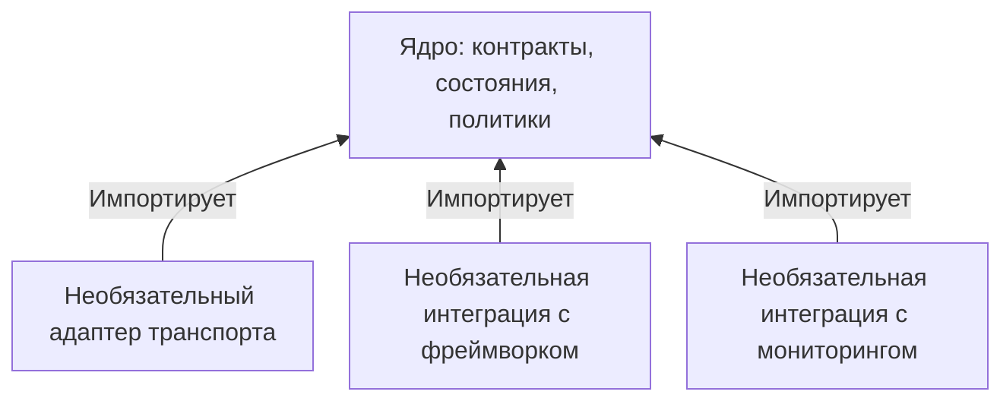

# Ядро без зависимостей: зачем инфраструктурным библиотекам необязательные зависимости {#zero-dependency-cores-why-optional-dependencies-matter-in-infrastructure-libraries}

<div class="bdr-post__hero" data-bdr-post="2026-09-07-zero-dependency-cores" role="img" aria-label="Небольшое ядро и интеграции только для тех, кому они нужны" markdown="0"></div>

Инфраструктурную библиотеку подключают ко многим сервисам, и каждый из них получает все её зависимости. Чтобы оценить, во что это обходится, я проверил восемь библиотек: какие пакеты устанавливаются вместе с ними, сколько места они занимают и как долго импортируются. В самом лёгком случае устанавливается только сама библиотека, а импорт занимает 1,2 мс. В случае с обязательным драйвером БД — уже девять пакетов и около 125 мс.

<!-- more -->

Методика и скрипты есть в [лаборатории статьи](../lab/2026-09-07-zero-dependency-cores/README.md). Для каждой библиотеки я создавал отдельное временное окружение, считал установленные пакеты и их размер, затем пять раз измерял время импорта. Использовал Python 3.13 и версии библиотек, опубликованные на день измерения.

## Во что обходится установка каждой библиотеки {#what-each-library-costs}

```text
    package                     deps      MB  import ms   with the extra
    deadline-budget                1     0.1        1.2
    clientwright                   1     0.3       23.9
    grpc-client-kit                3    38.3       27.6   [deadline]: +1 deps, +0.7 MB
    redis-client-kit               2     2.6       43.4   [settings]: +7 deps, +8.7 MB
    servicewright                  1     0.4       30.1   [fastapi]: +22 deps, +16.4 MB
    sqlalchemy-foundation-kit      9    18.1      124.7   [metrics]: +1 deps, +7.9 MB
    aiokafka-foundation-kit        5     2.0       33.4   [models]: +4 deps, +7.1 MB
    pg-partsmith                  10    17.4      107.6   [cli]: +9 deps, +14.1 MB
```

Три библиотеки устанавливаются без дополнительных пакетов. `deadline-budget` считает оставшееся время запроса. `clientwright` создаёт HTTP-клиенты, но выбор HTTP-библиотеки оставляет вам. `servicewright` управляет жизненным циклом приложения, не требуя конкретного веб-фреймворка.

Особенно показателен extra `[fastapi]` — набор зависимостей для интеграции с FastAPI. Он добавляет **двадцать два пакета и шестнадцать мегабайт**, тогда как само ядро — один пакет размером около четырёхсот килобайт. Сервису, который принимает запросы только по gRPC, всё это устанавливать не нужно.

## Какую проблему это предотвращает {#the-failure-mode-this-prevents}

Основная проблема возникает, когда установщик пытается подобрать совместимые версии всех зависимостей.

Допустим, библиотека требует определённые версии FastAPI, а те, в свою очередь, — определённые версии Starlette и Pydantic. Другая библиотека в том же сервисе может предъявить несовместимые требования. По отдельности обе работают, а установить их вместе уже нельзя. Чем больше общих библиотек и сервисов, тем вероятнее такой конфликт. Ради его устранения порой приходится обновлять пакеты сразу во многих сервисах.

Обязательная зависимость накладывает ограничения на все сервисы, использующие библиотеку. Необязательная — только на те, которым нужна соответствующая интеграция.

Время импорта тоже имеет значение: между 1,2 и 124,7 мс — разница примерно в сто раз. Эта задержка повторяется при каждом запуске процесса, задания CI, холодном старте serverless-функции и даже при вызове `--help`.

## Что должно оставаться в ядре {#what-a-good-core-looks-like}

У трёх библиотек без обязательных зависимостей общий принцип: **в ядре — логика работы, в extras — интеграции**.

Это хорошо видно на примере `clientwright`. Ядро отвечает за таймауты, повторы, бюджеты времени, circuit breaker и метрики. Оно не импортирует httpx, aiohttp, requests или urllib3. Поддержка этих библиотек вынесена в адаптеры: нужные зависимости устанавливаются через extras, а адаптер выбирается по имени при создании клиента:

```text
    registered adapters without any HTTP library: ('aiohttp', 'httpx', 'httpx2', 'requests', 'urllib3')
```

Все пять адаптеров зарегистрированы, даже если ни одна HTTP-библиотека не установлена: реестр хранит их имена и пути для импорта, не загружая сами модули. Поэтому посмотреть и сравнить возможности адаптеров можно заранее. Ошибка возникает только при попытке создать клиент, для которого не установлена нужная зависимость:

```text
    build('httpx') -> ImportError: httpx support requires clientwright[httpx]; install it.
```

<!-- diagram:concept -->
<figure class="bdr-diagram" markdown="1">
<figcaption><span class="bdr-diagram__eyebrow">ИДЕЯ В СХЕМЕ</span><strong>Необязательные интеграции зависят от ядра</strong></figcaption>
<div class="bdr-diagram__viewport" markdown="1" data-search-exclude>



</div>
<p class="bdr-diagram__caption">Ядро не импортирует фреймворки и необязательные адаптеры. Интеграции подключаются через extras и используют интерфейсы ядра. Если назначение библиотеки — работа с SQLAlchemy, SQLAlchemy может быть обязательной зависимостью.</p>
</figure>
<!-- /diagram:concept -->

## Сообщение об ошибке — фича, а не баг {#the-message-is-the-feature}

Если зависимость необязательная, нужно заранее продумать, что увидит пользователь, когда её нет. Понятное сообщение позволяет решить проблему за пару минут; неясное заставляет разбираться гораздо дольше. В лаборатории получились три варианта:

```text
    servicewright     ImportError: FastAPI support requires servicewright[fastapi]; install it.
    redis-client-kit  ImportError: pydantic-settings not installed. Install
                      redis-client-kit[settings] to use BaseRedisSettings.
    grpc-client-kit   imported; HAS_DEADLINE_BUDGET = False
```

Первые два сообщения сразу называют нужный extra и объясняют, что установить. До исправления первое выглядело так: `ModuleNotFoundError: No module named 'starlette'`. Пользователь подключал `servicewright`, а ошибка жаловалась на Starlette. Догадаться, что нужен `servicewright[fastapi]`, по такому сообщению сложно.

В третьем случае библиотека продолжает работать без одной из функций. Если пакет для работы с дедлайнами не установлен, клиент не передаёт бюджет времени, но по-прежнему может выполнять запросы. Об этом сообщают предупреждение и флаг, который можно проверить в коде. Такой вариант допустим, только если отключение функции *безопасно*. С проверкой безопасности так поступать нельзя: её отсутствие должно приводить к явной ошибке.

Моё правило: **если без зависимости код работает некорректно — выбрасывать исключение; если можно безопасно обойтись без отдельной функции — отключать её. В обоих случаях явно сообщать, что произошло**.

## Когда зависимость стоит сделать обязательной {#when-a-hard-dependency-is-right}

Некоторые библиотеки из таблицы без своих зависимостей просто не имеют смысла.

`sqlalchemy-foundation-kit` требует SQLAlchemy и asyncpg: девять пакетов, 18 МБ, около 125 мс на импорт. Библиотека предназначена для асинхронной работы с PostgreSQL через SQLAlchemy. Делать драйвер необязательным стоит лишь тогда, когда есть реальный сценарий работы без него. Для `pg-partsmith` такую же роль играют SQLAlchemy и Pydantic.

Полезный вопрос: «Кому нужна эта библиотека без данной зависимости?» Клиенту Redis из примера необходим redis-py. А управление жизненным циклом приложения нужно и сервисам, которые вообще не используют FastAPI.

Если интеграция нужна только части пользователей, её удобно вынести в extra, а ожидаемый интерфейс описать протоколом. Так устроены метрики: ядро принимает любой объект с нужными методами, а `[metrics]` добавляет реализацию для Prometheus.

## Что проверить в своей библиотеке {#the-checklist}

- **Можно ли использовать библиотеку без зависимости X?** Если да, вынесите её в extra.
- **Не импортирует ли ядро X на уровне модуля?** Одного случайного импорта достаточно, чтобы необязательная зависимость стала обязательной. Проверяйте импорт модулей интеграции в окружении, где её зависимости не установлены.
- **Указан ли в сообщении об ошибке нужный extra?** Проверяйте текст сообщения, а не только тип исключения.
- **Безопасно ли продолжать работу без этой функции?** Если нет, выбрасывайте исключение.
- **Готовы ли вы установить эту зависимость во все сервисы, использующие библиотеку?** Обязательная зависимость попадёт в каждый из них.

## Как это устроено в Bedrock Python {#the-pieces}

В статье я измерял библиотеки [Bedrock Python](https://bedrock-python.github.io/). У них общий подход: в ядре остаются только необходимые зависимости, интеграции подключаются через extras, а там, где достаточно набора методов, используются протоколы. При подготовке статьи нашлись два неудачных сообщения об ошибках — их исправили в тот же день.

Необязательные интеграции позволяют каждому сервису устанавливать только то, что ему нужно. В этих примерах выбор означает вполне измеримую разницу: дополнительные пакеты, мегабайты на диске и время запуска.
