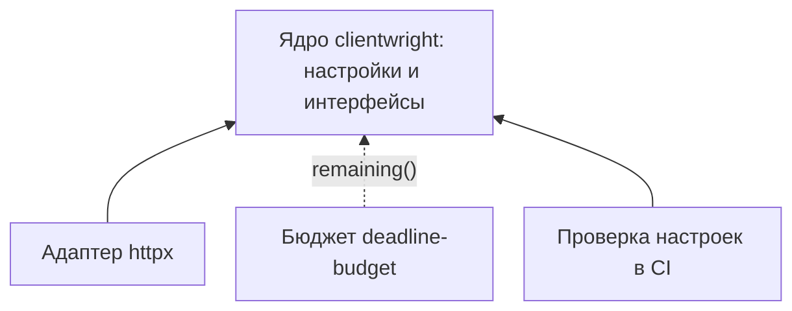

# Ядро без зависимостей: подключаем только нужные интеграции {#zero-dependency-cores-why-optional-dependencies-matter-in-infrastructure-libraries}

<div class="bdr-post__hero" data-bdr-post="2026-09-07-zero-dependency-cores" role="img" aria-label="Общие настройки клиента работают сами по себе; API заказов добавляет HTTP и бюджет времени" markdown="0"></div>

Представим API заказов, которое запрашивает остатки у склада по HTTP. Рядом есть задание CI: оно читает те же настройки клиента и проверяет возможности адаптеров. API нужна HTTP-библиотека. Для работы с настройками устанавливать все транспорты и веб-фреймворки незачем.

Начнём с базовой установки clientwright, дойдём до операции, которой нужна дополнительная зависимость, затем подключим её и выполним настоящий запрос. Так станет видно, что работает само по себе, когда возникает ошибка и что именно нужно установить.

<!-- more -->

## Общие настройки до выбора транспорта {#what-a-good-core-looks-like}

В `warehouse_policy.py` зададим лимит в две секунды и одну попытку. Повторы здесь отключены, чтобы сосредоточиться на зависимостях. Все типы настроек предоставляет ядро [clientwright](https://github.com/bedrock-python/clientwright):

```python
from clientwright import ClientConfig, RetryConfig, TimeoutConfig


def warehouse_config(base_url):
    return ClientConfig(
        service_name="warehouse",
        base_url=base_url,
        timeout=TimeoutConfig(total=2),
        retry=RetryConfig(max_attempts=1),
        circuit_breaker=None,
        deadline_header="X-Deadline-Ms",
        on_unsupported="strict",
    )
```

В окружении, где установлен только `clientwright==0.5.0`, практикум создаёт эту конфигурацию, читает реестр адаптеров и проверяет таблицу их возможностей:

```python
from importlib.util import find_spec
from clientwright import capabilities_matrix, registered_adapters
from warehouse_policy import warehouse_config

config = warehouse_config("http://127.0.0.1:1")
assert config.timeout.total == 2
assert "httpx" in capabilities_matrix()
assert find_spec("httpx") is None
print(registered_adapters())
```

`find_spec()` проверяет, может ли Python найти httpx. Реестр и таблица возможностей работают и без него. В реестре есть `aiohttp`, `httpx`, `httpx2`, `requests` и `urllib3`, но наличие имени ещё не означает, что соответствующая библиотека установлена.

В этой версии реестр хранит пути для импорта. Даже `import clientwright.adapters.httpx` не загружает реализацию HTTP-клиента: она понадобится, когда `build()` выберет адаптер. Поэтому задание CI может изучить настройки и возможности адаптеров заранее. Это ещё не доказывает, что выбранный адаптер сможет применить всю конфигурацию при создании клиента.

<!-- diagram:concept -->
<figure class="bdr-diagram" markdown="1">
<figcaption><span class="bdr-diagram__eyebrow">ИДЕЯ В СХЕМЕ</span><strong>Интеграции подключаются к ядру</strong></figcaption>
<div class="bdr-diagram__viewport" markdown="1" data-search-exclude>


```mermaid
---
config:
  theme: default
  look: classic
  flowchart:
    useMaxWidth: false
    wrappingWidth: 150
    padding: 12
    nodeSpacing: 24
    rankSpacing: 32
---
flowchart BT
    accTitle: Интеграции подключаются к ядру
    accDescr: Настройки клиента и интерфейс бюджета работают без HTTP-библиотеки. Адаптер httpx и бюджет deadline-budget подключаются там, где они нужны приложению.
    A["Ядро clientwright: настройки и интерфейсы"]
    B["Адаптер httpx"] --> A
    C["Бюджет deadline-budget"] -.->|"remaining()"| A
    D["Проверка настроек в CI"] --> A
```

</div>
<p class="bdr-diagram__caption">Настройки клиента и интерфейс бюджета работают без HTTP-библиотеки. Адаптер httpx и бюджет deadline-budget подключаются там, где они нужны приложению.</p>
</figure>
<!-- /diagram:concept -->

## Сообщение об ошибке — фича, а не баг {#the-message-is-the-feature}

Теперь попробуем создать клиент для API заказов в том же окружении без httpx:

```python
from clientwright import build
from warehouse_policy import warehouse_config

build("httpx", warehouse_config("http://127.0.0.1:1"))
```

Практикум проверяет, что вызов выбрасывает `ImportError`, а текст ошибки содержит `clientwright[httpx]`. Получаем:

```text
ImportError: httpx support requires clientwright[httpx]; install it.
```

Разработчик сразу видит, какую интеграцию установить. Ошибка про незнакомый транзитивный пакет заставила бы разбираться в дереве зависимостей. Для сравнения: базовый `servicewright==0.13.1` успешно импортируется, а импорт его FastAPI-адаптера сообщает, что нужен `servicewright[fastapi]`.

Проверять нужно ту публичную операцию, которой нужна интеграция. Один лишь `import clientwright.adapters.httpx` пропустил бы этот сценарий: пакет загружает реализацию лениво.

## Подключаем extra и отправляем запрос {#install-extra}

Установим в окружении API `clientwright[httpx]==0.5.0`. **Extra** — именованный набор дополнительных зависимостей в метаданных пакета. Он не переключает флаг во время работы и не заменяет ядро. Как объявить такой набор, описано в [руководстве по упаковке Python-проектов](https://packaging.python.org/en/latest/guides/writing-pyproject-toml/#dependencies-and-requirements).

Теперь сервис может запросить остаток с теми же настройками:

```python
from clientwright import build

from warehouse_policy import warehouse_config


async def fetch_stock(base_url, deps=None):
    async with build("httpx", warehouse_config(base_url), deps) as client:
        response = await client.get("/stock/sku-42")
        response.raise_for_status()
        return response.json()
```

В практикуме локальный HTTP-сервер отвечает `{"available": 3}`. Проверяем путь запроса, ответ и переданный заголовок `X-Deadline-Ms`. Отдельно проверяем, что `build()` возвращает настоящий `httpx.AsyncClient`, а выход из контекста закрывает клиент. FastAPI, aiohttp и requests в этом окружении по-прежнему отсутствуют.

Граница проходит через выбор `"httpx"`. Модуль настроек импортирует только clientwright, а сервис создаёт HTTP-клиент и отвечает за его закрытие, когда ему действительно нужен HTTP.

## Принимаем остаток времени через небольшой интерфейс {#protocols}

Допустим, теперь на просмотр заказа выделено 500 мс вместе с остальными шагами. Установим `clientwright[httpx,deadline]==0.5.0`: extra `[deadline]` добавляет [deadline-budget](https://github.com/bedrock-python/deadline-budget). Его бюджет можно передать клиенту напрямую:

```python
from clientwright import AdapterDeps
from deadline_budget import BudgetContext

from http_flow import fetch_stock


async def fetch_with_budget(base_url):
    budget = BudgetContext.create(total_seconds=0.5)
    return await fetch_stock(base_url, AdapterDeps(deadline_source=budget))
```

Протокол `DeadlineSource` в clientwright требует метод `remaining() -> float | None`. У `BudgetContext` такой метод есть, поэтому наследоваться от класса clientwright ему не нужно. Ядро получает остаток времени через этот интерфейс и не импортирует deadline-budget. Здесь бюджет относится к одному вызову; общий бюджет нескольких шагов разобран в [статье о дедлайнах](2026-09-06-timeouts-are-not-deadlines.md).

Локальный сервер получает не больше 500 мс, хотя в настройках клиента разрешены две секунды. До установки extra импорт нашего `budget_flow.py` завершается ошибкой: пакета `deadline_budget` нет. Мы намеренно сохраняем эту ошибку. Если приложение обещает общий дедлайн, незаметная подмена другим ограничением времени изменит его поведение.

Интеграция может быть необязательной для библиотеки и обязательной для конкретного сервиса.

## Что действительно устанавливается {#what-each-library-costs}

Практикум начинает с трёх отдельных окружений, затем добавляет extras в два из них. С Python 3.13 и зафиксированными версиями проверяем такие результаты:

| Установка | Что проверяет практикум |
|---|---|
| `deadline-budget==0.1.3` | Только этот пакет; бюджет работает без HTTP-библиотек и веб-фреймворков |
| `clientwright==0.5.0` | Только этот пакет; настройки и таблица возможностей доступны |
| `clientwright[httpx]==0.5.0` | HTTP-клиент отправляет запрос; deadline-budget ещё не установлен |
| `clientwright[httpx,deadline]==0.5.0` | Тот же запрос учитывает бюджет в 500 мс |
| `servicewright==0.13.1` | Только этот пакет; FastAPI-адаптер сообщает, какой extra нужен |
| `servicewright[fastapi]==0.13.1` | Адаптер импортируется, объект точки входа создаётся |

«Один пакет» включает саму библиотеку: дополнительных установленных пакетов нет. Extras добавляют и свои транзитивные зависимости. Файл ограничений фиксирует версии для практикума; передача через `--constraint` не устанавливает все перечисленные в нём пакеты.

Необязательный режим `--measure` сохраняет полный список пакетов, размер `site-packages` в МиБ и время пяти импортов корневого модуля в новых процессах. В отчёте остаются все замеры и медиана. Время запуска Python в замер не входит; загрузка всех адаптеров тоже не измеряется, а файловый кеш ОС продолжает влиять на результат. Такой отчёт помогает сравнивать установки в своём окружении, но не обещает время запуска на другой машине.

## Не навязываем сервису чужие ограничения версий {#the-failure-mode-this-prevents}

Допустим, общая библиотека жизненного цикла сделала FastAPI обязательной зависимостью. Воркеру нужен только запуск и остановка, но требования к версиям FastAPI всё равно попадут в его окружение. Если другой пакет потребует несовместимую версию, установить их вместе не получится, хотя воркер вообще не принимает HTTP-запросы.

Extra ограничивает эту проблему приложениями, которые его выбрали. Он **не устраняет** конфликты в API, где FastAPI действительно нужен. Если повсюду устанавливать все extras, преимущество тоже исчезнет.

## Когда зависимость должна быть обязательной {#when-a-hard-dependency-is-right}

Критерий простой: есть ли у библиотеки полезный сценарий без этой зависимости? Проверка настроек может использовать clientwright без httpx. Воркеру может быть нужен servicewright без FastAPI. А пакет для работы с SQLAlchemy вполне обоснованно требует SQLAlchemy.

У необязательных интеграций есть своя цена: проверки импортов, больше вариантов установки для тестирования, документация о том, какой extra для чего нужен. Выделяйте реальную границу ответственности, не превращая каждый импорт в плагин. В [примере API заказов](2026-09-13-why-bedrock-python-libraries.md) показано, как эти решения сочетаются внутри одного сервиса.

## Проверяем обе стороны границы {#the-checklist}

Проверяйте ядро в чистом окружении, а интеграции — после установки соответствующих extras. Окружение разработчика, где уже стоят все дополнения, не доказывает, что базовая установка работает. Скрипт `footprint.py` можно запускать в CI: неудачная установка, неожиданный результат импорта или несовпадение утверждения завершают его с ошибкой.

<div id="the-pieces" data-search-exclude></div>

## Начните с ядра, добавьте нужную интеграцию {#conclusion}

Мы использовали настройки clientwright без HTTP-библиотеки, получили понятную ошибку при создании клиента, добавили httpx и затем подключили общий дедлайн. Такое же разделение позволяет servicewright управлять жизненным циклом, не навязывая FastAPI каждому приложению.

Подключайте `clientwright[httpx]`, если сервису нужен httpx-клиент, добавляйте `[deadline]`, если вызовы должны учитывать общий бюджет deadline-budget, и выбирайте `servicewright[fastapi]` для точки входа FastAPI. Там, где достаточно ядра, оставляйте базовую установку. Тогда список зависимостей будет соответствовать тому, что приложение действительно делает.

## Запуск примера {#labs}

Из корня репозитория сайта, с установленным uv:

```bash
cd docs/blog/lab/2026-09-07-zero-dependency-cores
uv run --no-project --python 3.13 python footprint.py
```

Скрипт сам создаёт временные окружения и локальный HTTP-сервер. Пути к окружениям учитывают Windows и POSIX; Docker не нужен. Для загрузки пакетов нужен доступ к сети. Чтобы сохранить список установленных пакетов и замеры, выполните:

```bash
uv run --no-project --python 3.13 python footprint.py --measure --report footprint-results.json
```

В [README практикума](../lab/2026-09-07-zero-dependency-cores/README.md) описаны файлы, проверки и ограничения измерений.
