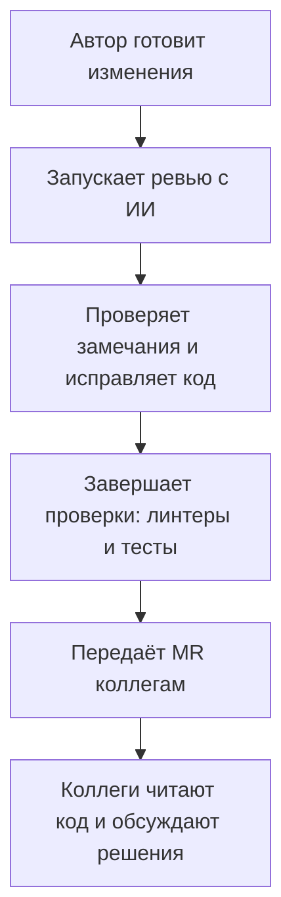

# Почему ревью с ИИ нужно контролировать {#ai-code-review-should-not-be-fully-autonomous}

ИИ помог мне находить ошибки в собственных merge request. Проблемы начались, когда я стал автоматизировать ревью кода коллег: полезные находки смешивались с неверными замечаниями и многословными комментариями. Этот опыт убедил меня, что основное место AI-ревью — в подготовке изменений самим автором, до передачи MR команде.

<!-- more -->

## От своих MR к ревью коллег {#how-i-started}

Первые эксперименты были удачными. Я просил агента проверить свой код, разбирал замечания и исправлял найденные ошибки. Контекст задачи был у меня в голове, поэтому оценивать предложения модели было сравнительно легко.

Затем я стал использовать ИИ для ревью MR коллег. Подходящие замечания вручную переносил в обсуждения, предварительно проверяя выводы и редактируя текст. Я понимал каждый опубликованный комментарий и мог объяснить его автору кода.

## Что изменилось после автоматизации {#the-pipeline}

Когда я автоматизировал процесс, качество комментариев стало проблемой. Модель давала развёрнутые объяснения там, где хватило бы пары предложений, и предлагала исправления без учёта контекста. Перед публикацией результат всё равно приходилось разбирать.

Так появился отдельный этап доработки — *polish*: проверить замечания, удалить неуместные и сократить оставшиеся. Этот подход я использовал и в [mr-review](https://bedrock-python.github.io/mr-review/). После такой обработки ревью стало полезнее и легче читалось.

У коллеги процесс был полностью автономным. ИИ создавал треды и отвечал в обсуждениях без предварительной проверки человеком. Иногда от имени коллеги публиковалось замечание, а затем автоматически отправлялся ответ в тот же тред. Наблюдая за этим, я выделил три проблемы.

## 1. Цена неверного замечания {#what-goes-wrong-when-the-bot-posts}

Модель может понять код, но не знать планов команды, границ задачи и причин прежних решений. Например, предложенная доработка уже запланирована на следующий этап. Без этого контекста даже технически обоснованное замечание может оказаться неуместным.

Пока результат остаётся у ревьюера, он может проверить и отклонить его. После публикации эта работа переходит к автору MR: прочитать, разобраться, объяснить ограничения и закрыть обсуждение. Время, сэкономленное на проверке комментария, приходится тратить коллеге.

## 2. Доверие между коллегами {#review-is-a-conversation}

В ревью я рассчитываю на содержательный разговор: почему выбран этот подход, какие альтернативы рассматривались, что я сам мог упустить. Так участники учатся друг у друга.

Длинные сгенерированные треды затрудняют этот разговор. Сначала приходится искать конкретную претензию среди общих рассуждений. Если ответ на пояснение тоже отправляется автоматически, уже непонятно, участвует ли коллега в обсуждении.

Меня это раздражает: возникает ощущение, что ревью провели формально, а разбираться с результатом оставили мне. Намерение сэкономить время понятно, но для автора MR такое отношение может выглядеть как пренебрежение его работой.

Комментарий под именем ревьюера предполагает, что он прочитал код, проверил замечание и готов его обсуждать. Использование ИИ не снимает этой ответственности.

## 3. Потеря знаний о проекте {#what-the-person-adds}

Читая MR коллег, мы узнаём, какие функции появляются в проекте, как они реализованы и какие компромиссы приняла команда. Эти знания понадобятся при следующих изменениях и разборе ошибок.

Если делегировать весь просмотр агенту, реализация рискует остаться понятной только её автору. Пока он рядом, это может быть незаметно. Когда он уйдёт или окажется недоступен, остальным придётся восстанавливать контекст самостоятельно.

Личное участие в ревью помогает распределять знания внутри команды. Для этого нужно читать код и задавать вопросы; одного отчёта агента недостаточно.

## AI-ревью до передачи MR коллегам {#the-copilot-not-the-gatekeeper}

**Я предлагаю сделать AI-ревью обычным этапом подготовки изменений, за который отвечает автор.** Если агент способен найти проблему до обсуждения с командой, разработчик может запустить проверку сам. Он знает цель задачи, быстрее оценит замечания и исправит ошибки.

По месту в процессе это сопоставимо с pre-commit, линтерами и тестами. Отличие в том, что выводы модели требуют оценки: каждое замечание нужно проверить, а отсутствие замечаний не гарантирует корректность кода. MR может уже существовать как черновик — проверка должна предшествовать запросу ревью у коллег.

<!-- diagram:concept -->
<figure class="bdr-diagram" markdown="1">
<figcaption>ИДЕЯ В СХЕМЕ<strong>Проверка с ИИ до ревью коллег</strong></figcaption>

Автор запускает проверку с ИИ и разбирает замечания до передачи MR коллегам. Команда читает код и обсуждает решения лично.

</figure>
<!-- /diagram:concept -->

После этого команда читает код и обсуждает решения. Ревьюер тоже может обращаться к ИИ, если это помогает анализу, но опубликованные комментарии и ответы должны оставаться результатом его собственного решения.

## Договорённости внутри команды {#what-it-costs}

Для такого процесса я бы согласовал несколько правил:

- **Момент проверки.** Для каких изменений нужно AI-ревью и после каких правок его следует повторить.
- **Контекст и фокус.** Передавать описание задачи, ограничения и правила проекта. Проверять логику, обработку ошибок и пробелы в тестах; форматирование оставить линтерам.
- **Разбор результатов.** Автор проверяет находки и исправляет подтверждённые проблемы до передачи MR коллегам.
- **Публикация.** Любой комментарий или ответ от имени сотрудника должен быть прочитан и проверен им самим.

К моменту запроса ревью автор уже должен разобраться с замечаниями ИИ. Тогда время коллег остаётся на оценку решений, обмен опытом и понимание проекта — работу, ради которой команда и проводит ревью.
