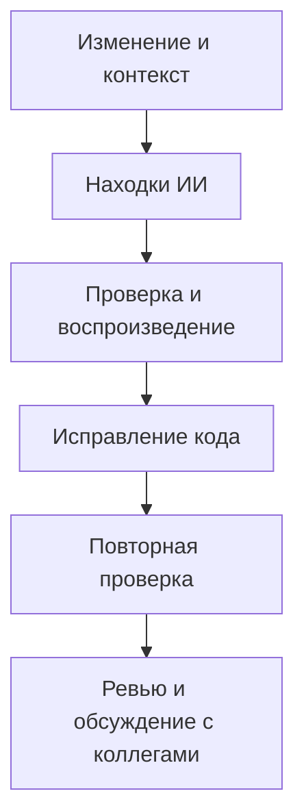

# Почему замечания ИИ-ревью нужно проверять {#ai-code-review-should-not-be-fully-autonomous}

<div class="bdr-post__hero" data-bdr-post="2026-09-13-ai-code-review-should-not-be-fully-autonomous" role="img" aria-label="Замечание ревью проходит через воспроизведение ошибки, исправление кода и проверку результата" markdown="0"></div>

Представим merge request, который добавляет повтор запроса на резервирование товара после таймаута склада. Изменение небольшое, тест успешного вызова проходит. Но склад мог уже создать резерв, а ответ — потеряться. Повтор создаст второй резерв для того же заказа.

ИИ может помочь заметить этот сценарий. Прежде чем отправлять замечание коллеге, нужно проверить договорённости API склада, воспроизвести эффект и решить, как должно вести себя приложение. Разберём этот путь на исполняемом примере. Замечания ниже подготовлены для разбора; результаты проверки какой-либо модели здесь не приводятся.

<!-- more -->

## Начинаем с изменения и правил API {#how-i-started}

Сервис заказов вызывает адаптер приложения `warehouse.reserve(order_id)`. В нашем примере каждый принятый вызов создаёт новый резерв. Склад не убирает дубликаты по номеру заказа, а `TimeoutError` не сообщает, произошла ли запись. Это явные условия примера, а не свойства любого складского API.

MR добавляет вторую попытку:

```python
async def reserve_with_retry(order_id, warehouse):
    for attempt in range(2):
        try:
            return await warehouse.reserve(order_id)
        except TimeoutError:
            if attempt == 1:
                raise
```

В практикуме адаптер заменяет управляемая модель склада со сбоями до и после записи. Так можно увидеть побочный эффект, не дожидаясь настоящего сетевого сбоя.

В задание на ревью стоит включить правила адаптера, цель изменения и относящиеся к нему тесты. Без этого агент может предположить, что повторные вызовы уже защищены от дубликатов или что таймаут гарантирует отсутствие записи. Как передать такой контекст, разобрано в [статье о документации](2026-09-07-documentation-for-ai-coding-agents.md).

## Превращаем подозрение в воспроизводимую ошибку {#the-pipeline}

Предполагаемый сбой конкретен: склад записал резерв, потерял ответ и получил ту же операцию повторно. В `WarehouseStub` сценарий `"timeout_after_write"` сначала добавляет резерв, затем выбрасывает `TimeoutError`. Сценарий `"ok"` создаёт следующий резерв и возвращает ответ.

Одну и ту же проверку можно запустить с обеими реализациями:

```python
from reservation import ReservationOutcomeUnknown
from warehouse_stub import WarehouseStub


async def check_lost_reply(reserve):
    warehouse = WarehouseStub("timeout_after_write", "ok")
    try:
        await reserve("order-42", warehouse)
    except ReservationOutcomeUnknown:
        pass
    print(f"calls={len(warehouse.calls)}, reservations={len(warehouse.reservations)}")
    assert len(warehouse.reservations) == 1, (
        "One operation created duplicate reservations"
    )
```

С `reserve_with_retry` она печатает `calls=2, reservations=2` и падает на утверждении. Успешный ответ второй попытки не отменяет первый резерв. Теперь у замечания есть условие возникновения, путь по изменённому коду и наблюдаемый результат.

Модель склада доказывает этот ход выполнения при заданных условиях. Она не подтверждает поведение конкретного развёрнутого сервиса: для этого всё ещё нужны его контракт или интеграционный тест. Если настоящая операция уже защищена от дубликатов, замечание придётся пересмотреть.

## Отбираем замечания {#what-goes-wrong-when-the-bot-posts}

После проверки такого цикла могут появиться разные предложения. Обращаться с ними нужно по-разному:

| Вывод | Проверка | Решение |
|---|---|---|
| Повтор создаёт дубликат | Сбой после записи привёл к двум резервам | Приложить тест |
| Нет предела попыток | `range(2)` и тест показывают две попытки | Отклонить |
| Нужна защита от повторов | Нужна поддержка API склада | Уточнить правила API |
| Нужно поправить стиль | Ошибка поведения не показана | Линтер и правила проекта |

Даже аккуратно сформулированное неверное замечание отнимает время. После публикации автору MR придётся разбираться и объяснять, почему проблемы нет. Пока замечание остаётся черновиком, эту работу выполняет тот, кто готовит ревью.

## Пишем короткий комментарий {#review-is-a-conversation}

Полезный комментарий привязан к ветке повтора и называет условие и последствие:

> Если склад создаст резерв и затем потеряет ответ, повтор добавит ещё один резерв для того же заказа. `reproduce.py before` воспроизводит две записи. Можем пока убрать автоматический повтор, если API не гарантирует защиту от дубликатов?

Этого достаточно для начала технического разговора. Общая лекция о распределённых системах не нужна. Если автор ответит, что настоящий склад защищён от повторных операций, следующий шаг — проверить это поведение и уточнить или снять замечание.

Человек, публикующий комментарий под своим именем, должен уметь объяснить его и оценить ответ. Автоматическое продолжение обсуждения без разбора нового контекста может поддерживать уже неактуальное возражение.

## Выбираем поведение после таймаута {#what-the-person-adds}

Для этого MR уберём автоматический повтор и явно сообщим, что результат неизвестен:

```python
class ReservationOutcomeUnknown(RuntimeError):
    def __init__(self, order_id):
        self.order_id = order_id
        super().__init__(f"Reservation outcome is unknown for order {order_id}")


async def reserve_once(order_id, warehouse):
    try:
        return await warehouse.reserve(order_id)
    except TimeoutError as error:
        raise ReservationOutcomeUnknown(order_id) from error
```

Это не означает, что резервирование не состоялось. Вызывающий код получает номер заказа и исходное исключение как причину. Дальше нужен предусмотренный приложением процесс проверки статуса или сверки состояния. Нельзя объявлять успех или безусловно повторять новое исключение уровнем выше.

То же воспроизведение теперь печатает `calls=1, reservations=1` и проходит. В тестах есть и таймаут до записи: наружу выходит та же ошибка неопределённого результата, хотя резерва нет. По одному таймауту клиент не может различить эти случаи.

В дальнейшем правильным решением может стать защита от дубликатов. Одного нового заголовка недостаточно: принимающий сервис должен выполнять договорённость, а повторы — использовать один идентификатор операции. Это отдельное решение, разобранное в [статье об идемпотентности](2026-09-13-idempotency-in-apis-and-background-jobs.md).

Здесь ревью коллег приносит знание проекта. Команде нужно договориться, кто выясняет судьбу резерва, как меняется состояние заказа и что видит пользователь. Локальное воспроизведение подтверждает ошибку, но не выбирает поведение продукта.

## Проверяем с ИИ во время подготовки MR {#the-copilot-not-the-gatekeeper}

Я использую ИИ-ревью как часть подготовки изменений автором: выполнить обычные проверки, разобрать находки, воспроизвести вероятные сбои, исправить подтверждённые проблемы и затем запросить ревью коллег. Ревьюеры тоже могут обращаться к агенту при изучении кода, сохраняя ответственность за опубликованные замечания.

В [mr-review](https://github.com/bedrock-python/mr-review#how-it-works) этому соответствует процесс **Brief → Dispatch → Polish → Post**. На Brief задаётся контекст проверки, на Dispatch появляются находки, на Polish пользователь редактирует, оставляет или отклоняет их, а Post публикует выбранные комментарии. В нашем примере воспроизведение потери ответа и отклонение вывода о бесконечном цикле должны произойти до публикации. Одной правки формулировок для проверки этих выводов мало.

<!-- diagram:concept -->
<figure class="bdr-diagram" markdown="1">
<figcaption><span class="bdr-diagram__eyebrow">ИДЕЯ В СХЕМЕ</span><strong>От находки к проверенному комментарию</strong></figcaption>
<div class="bdr-diagram__viewport" markdown="1" data-search-exclude>


```mermaid
---
config:
  theme: default
  look: classic
  flowchart:
    useMaxWidth: false
    wrappingWidth: 150
    padding: 12
    nodeSpacing: 24
    rankSpacing: 32
---
flowchart TD
    accTitle: От находки к проверенному комментарию
    accDescr: Автор проверяет находку, воспроизводит ошибку и исправляет код. После повторной проверки коллеги обсуждают актуальное изменение и поведение приложения.
    A["Изменение и контекст"] --> B["Находки ИИ"]
    B --> C["Проверка и воспроизведение"]
    C --> D["Исправление кода"]
    D --> E["Повторная проверка"]
    E --> F["Ревью и обсуждение с коллегами"]
```

</div>
<p class="bdr-diagram__caption">Автор проверяет находку, воспроизводит ошибку и исправляет код. После повторной проверки коллеги обсуждают актуальное изменение и поведение приложения.</p>
</figure>
<!-- /diagram:concept -->

Отсутствие замечаний ИИ не доказывает корректность MR. Пользу дают подтверждённые проблемы, которые удалось найти. Коллегам всё равно нужно читать реализацию и обсуждать решения: тогда знание нового поведения не останется только у автора.

## Перепроверяем замечание после изменения кода {#what-it-costs}

После замены `reserve_with_retry` комментарий про старый цикл уже нельзя отправлять как актуальный. Сохраните, какая ревизия проверялась, посмотрите обновлённый diff и повторите нужное воспроизведение. Убедитесь, что указанная строка и описанное поведение ещё существуют. Существенная правка может потребовать нового прохода ревью; возможность нажать «опубликовать» сама по себе не делает старое замечание верным.

Команде достаточно начать с трёх договорённостей: передавать цель задачи и правила API, проверять каждое замечание до отправки и оставлять обсуждение за человеком, который его опубликовал. Также определите место автоматических проверок в подготовке MR. Правила должны прояснять ответственность, а не превращать каждое предпочтение по стилю в блокирующую проблему.

## Запуск примера {#labs}

С установленным uv выполните из корня репозитория сайта:

```bash
cd docs/blog/lab/2026-09-13-ai-code-review-should-not-be-fully-autonomous
uv run --no-project --python 3.13 python reproduce.py before
uv run --no-project --python 3.13 python reproduce.py after
uv run --no-project --python 3.13 python test_review.py
```

Команда `before` намеренно завершается ошибкой утверждения. `after` проходит, а семь тестов проверяют успешный вызов, оба положения таймаута, ограничение числа попыток и посторонние ошибки. Практикум использует Python 3.13 и стандартную библиотеку: не вызывает модель, не обращается к складу и не публикует комментарии.

В [README практикума](../lab/2026-09-13-ai-code-review-should-not-be-fully-autonomous/README.md) описаны условия и результаты.

## Прикладываем к замечанию доказательство {#conclusion}

Мы провели возможную находку через падающее воспроизведение, небольшое исправление и успешную проверку. По пути отклонили один неверный вывод и оставили более широкий вопрос для команды. Эту работу полезно закончить до того, как просить коллегу отвечать на замечание.

Используйте mr-review, чтобы собрать и разобрать находки, а к оставленным комментариям прикладывайте нужный код и результат проверки. ИИ помогает найти следующий вопрос; проверка ответа, публикация и разговор с автором остаются вашей ответственностью.
