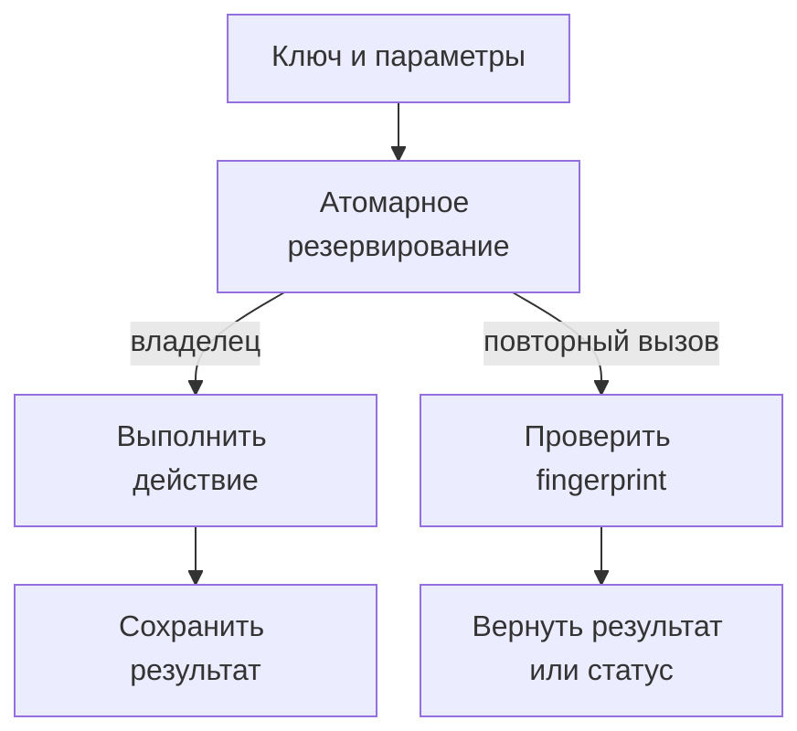

# Идемпотентность в API и фоновых задачах {#idempotency-in-apis-and-background-jobs}

Клиент отправил запрос, не получил ответ и повторил его. Worker завершил задачу, но упал перед подтверждением. В обоих случаях повторная доставка нормальна; опасность появляется, когда она повторяет бизнес-действие.

Идемпотентность начинается с определения этого действия. Ключ должен обозначать намерение выполнить операцию, а не отдельную сетевую попытку или получение сообщения.

<!-- more -->

## Кеш результата не защищает выполняющуюся операцию {#reservation}

Последовательность «проверить кеш → выполнить → сохранить» пропускает два одновременных запроса: оба увидят отсутствие результата. Нужна атомарная попытка занять ключ до начала действия.

Запись обычно содержит область действия, ключ, fingerprint параметров и состояние выполнения. Победитель выполняет работу; повтор с теми же параметрами получает сохранённый результат, ждёт его ограниченное время или узнаёт, что операция ещё выполняется. Повтор с другими параметрами должен быть отклонён по явно описанному контракту.

Fingerprint не заменяет авторизацию. Область ключа должна отделять пользователей, арендаторов и разные бизнес-операции, чтобы чужой запрос не получил сохранённый ответ.

<!-- diagram:concept -->
<figure class="bdr-diagram" markdown="1">
<figcaption>ИДЕЯ В СХЕМЕ<strong>Ключ резервируется до действия</strong></figcaption>

Победитель атомарного резервирования выполняет действие. Повтор проверяет параметры и получает сохранённый результат либо состояние выполнения.

</figure>
<!-- /diagram:concept -->

## Один ключ проходит через все попытки {#propagation}

В цепочке gateway → orders → payments новый ключ на каждом переходе не связывает повтор оплаты с исходным намерением пользователя. Ключ создают на границе операции и стабильно передают либо детерминированно преобразуют для конкретного дочернего действия.

Например, отправка счёта и списание денег по одному заказу — разные операции. Они должны иметь разные области ключа даже при общем order id. Для фоновой задачи выбирайте устойчивую идентичность действия и его версии, а не номер очередной доставки.

Успешная дедупликация не обязательно сразу даёт ответ пользователю. Если первый вызов ещё работает, API нужен понятный способ узнать результат: повтор с тем же ключом, status endpoint или идентификатор операции.

## Закрыть окно между эффектом и сохранением результата {#effects}

Резервирование в Redis само по себе не делает внешний платёж атомарным с записью результата. Процесс может завершить платёж и упасть до отметки о завершении. После истечения lease другой worker снова получит право работать.

Если эффект находится в той же БД, запись дедупликации и изменение данных можно объединить одной транзакцией. Для внешнего провайдера нужен стабильный ключ, который поддерживает сам провайдер, либо сверка результата и процедура восстановления. Без этого нельзя обещать однократность отправки письма или списания только благодаря локальной блокировке.

Lease должен соответствовать времени работы и правилам продления. Истечение записи не доказывает, что прежний исполнитель остановился. Эти условия особенно важны для долгих фоновых задач.

## Определить срок хранения и поведение при отказе {#failure-policy}

| Решение | Что нужно учесть |
|---|---|
| TTL результата | Максимальное окно повторов, replay и восстановления из очереди |
| Незавершённая запись | Как обнаружить и восстановить прерванную операцию |
| Ошибка действия | Можно ли безопасно повторить и какой результат показывать |
| Недоступность хранилища | Допустим ли повторный эффект без дедупликации |
| Удаление старых ключей | Что произойдёт при позднем повторе |

Автоматически удалять ключ при любом исключении опасно, если внешний эффект уже мог произойти. Так же опасно продолжать операцию без хранилища, когда её повторная стоимость неприемлема. Решение о fail-open принимается по конкретному действию.

## Проверять повторы в неудобные моменты {#verification}

Проверьте два параллельных запроса, одинаковый ключ с разными параметрами, потерю ответа, перезапуск после эффекта и до записи результата, истечение lease и сбой хранилища. Проверка только последовательного повтора уже завершённой операции недостаточна.

Для Kafka [inbox](2026-09-13-reliable-events-outbox-inbox-kafka.md) защищает транзакционные эффекты потребителя в БД. Внешнее действие остаётся отдельной границей. [idempotency-kit](https://bedrock-python.github.io/idempotency-kit/) предоставляет координацию ключей; полный контракт операции всё равно определяется системой, которая выполняет эффект.

## Примеры и лабораторные работы {#labs}

Полные стенды и условия воспроизведения вынесены в отдельные материалы:

- [Практикум: ключи идемпотентности](../lab/2026-09-07-idempotency-keys/README.md)
- [Практикум: идемпотентность в цепочке сервисов](../lab/2026-09-07-idempotency-across-a-chain/README.md)
- [Практикум: идемпотентность фоновых задач и консьюмеров](../lab/2026-09-07-idempotency-for-jobs-and-consumers/README.md)
