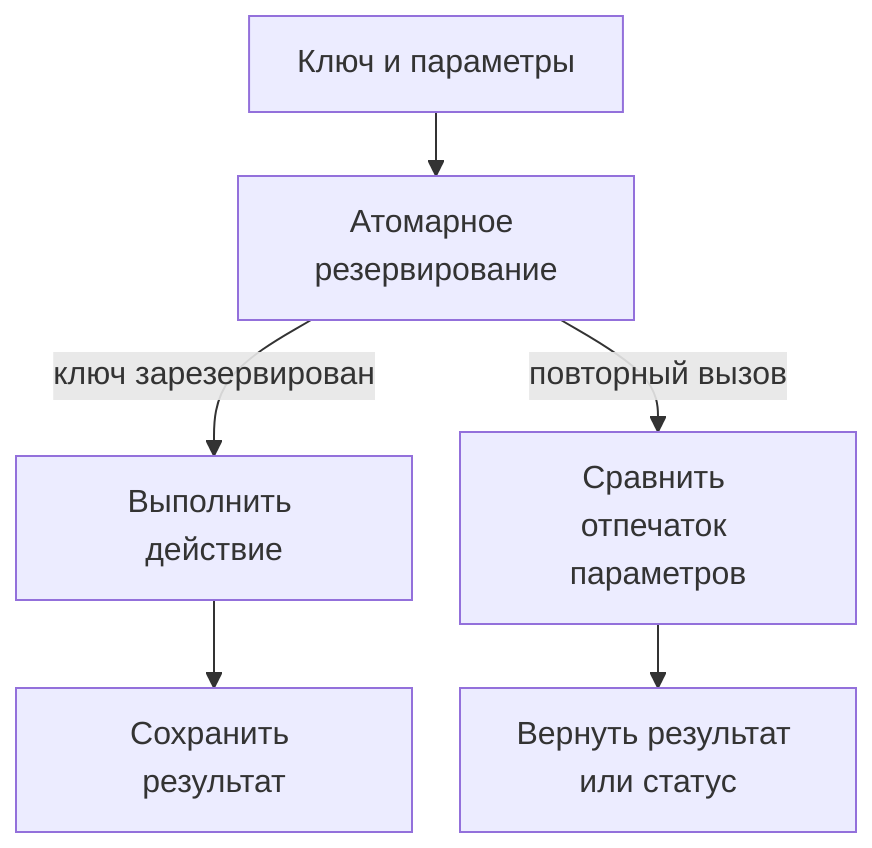

# Идемпотентность в API и фоновых задачах {#idempotency-in-apis-and-background-jobs}

Клиент отправил запрос, не получил ответ и повторил попытку. Воркер выполнил задачу, но упал до подтверждения. В обоих случаях повторная доставка ожидаема; опасно, если она приводит к повторному списанию денег или другому нежелательному действию.

Поэтому сначала нужно определить, какую операцию защищаем от повторов. Ключ идемпотентности обозначает намерение выполнить её один раз и остаётся тем же при новых сетевых попытках и повторных доставках сообщения.

<!-- more -->

## Кеш результата не защищает выполняющуюся операцию {#reservation}

Схема «проверить кеш → выполнить → сохранить результат» не защищает от двух одновременных запросов: оба могут не найти результат и начать работу. До выполнения операции нужно атомарно зарезервировать её ключ.

Запись обычно содержит область действия ключа, сам ключ, отпечаток параметров (fingerprint) и состояние операции. Запрос, который зарезервировал ключ, выполняет операцию. Повтор с теми же параметрами получает сохранённый результат, ждёт его ограниченное время или узнаёт, что обработка ещё идёт. Если параметры отличаются, запрос нужно отклонить так, как предусмотрено API.

Отпечаток параметров не заменяет авторизацию. Ключи нужно разделять по пользователям, клиентским организациям (tenants) и видам операций, чтобы один пользователь не получил сохранённый ответ другого.

<!-- diagram:concept -->
<figure class="bdr-diagram" markdown="1">
<figcaption>ИДЕЯ В СХЕМЕ<strong>Ключ резервируется до действия</strong></figcaption>

Операцию выполняет запрос, которому удалось зарезервировать ключ. При повторе проверяются параметры и возвращается готовый результат или текущее состояние.

</figure>
<!-- /diagram:concept -->

## Сохраняем ключ между попытками {#propagation}

В цепочке gateway → orders → payments новый ключ на каждом шаге разрывает связь между повтором оплаты и исходным действием пользователя. Ключ создают в начале операции и передают дальше без изменений либо по одному и тому же правилу получают из него ключ конкретной дочерней операции.

Например, отправка счёта и списание денег по одному заказу — разные действия. Их ключи нужно различать даже при общем идентификаторе заказа. Для фоновой задачи ключ должен определяться самой операцией и её версией, а не номером доставки сообщения.

Защита от дублей не всегда позволяет сразу вернуть результат. Если первый запрос ещё выполняется, API должен предоставлять способ проверить его состояние: повтор с тем же ключом, отдельный метод проверки статуса или идентификатор операции.

## Что делать, если действие выполнено, а результат не сохранён {#effects}

Резервирование ключа в Redis не объединяет внешний платёж и сохранение его результата в одну атомарную операцию. Процесс может провести платёж и упасть до записи об успехе. Когда срок резервирования (lease) закончится, другой воркер получит право начать работу заново.

Если операция меняет данные в той же БД, отметку о выполнении и сами изменения можно сохранить одной транзакцией. Для внешнего провайдера нужна поддержка стабильного ключа идемпотентности либо проверка результата и процедура восстановления. Одна локальная блокировка не гарантирует, что письмо не уйдёт дважды или деньги не спишутся повторно.

Срок резервирования должен учитывать длительность операции и правила продления. Его истечение не доказывает, что прежний исполнитель остановился. Это особенно важно для долгих фоновых задач.

## Сколько хранить ключи и что делать при сбое {#failure-policy}

| Решение | Что нужно учесть |
|---|---|
| TTL результата | Как долго возможны повторы, повторное чтение истории и восстановление сообщений из очереди |
| Незавершённая запись | Как обнаружить и восстановить прерванную операцию |
| Ошибка действия | Можно ли безопасно повторить и какой результат показывать |
| Недоступность хранилища | Можно ли выполнять операцию без защиты от дублей |
| Удаление старых ключей | Что произойдёт при позднем повторе |

Нельзя безусловно удалять ключ при любом исключении: внешняя операция уже могла выполниться. Продолжать без хранилища тоже опасно, если повторное действие недопустимо. Решение о работе без защиты (fail open) зависит от конкретной операции.

## Проверяем повторы после сбоев и во время выполнения {#verification}

Проверьте два параллельных запроса, один ключ с разными параметрами, потерю ответа, перезапуск между выполнением действия и сохранением результата, истечение срока резервирования и сбой хранилища. Одного теста, повторяющего уже завершённую операцию, недостаточно.

Для Kafka [inbox](2026-09-13-reliable-events-outbox-inbox-kafka.md) защищает от повторных изменений в БД, если они входят в одну транзакцию с отметкой об обработке. Внешние действия требуют отдельной защиты. [idempotency-kit](https://bedrock-python.github.io/idempotency-kit/) предоставляет механизм работы с ключами, а гарантии самой операции определяет выполняющая её система.

## Примеры и лабораторные работы {#labs}

Запускаемые примеры и инструкции к ним:

- [Практикум: ключи идемпотентности](../lab/2026-09-07-idempotency-keys/README.md)
- [Практикум: идемпотентность в цепочке сервисов](../lab/2026-09-07-idempotency-across-a-chain/README.md)
- [Практикум: идемпотентность фоновых задач и обработчиков сообщений](../lab/2026-09-07-idempotency-for-jobs-and-consumers/README.md)
