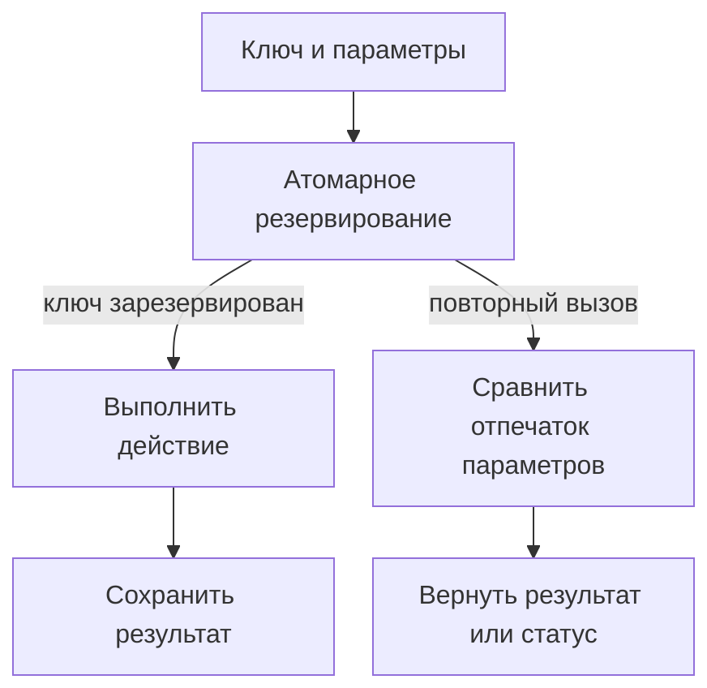

# Идемпотентность в API и фоновых задачах {#idempotency-in-apis-and-background-jobs}

<div class="bdr-post__hero" data-bdr-post="2026-09-13-idempotency-in-apis-and-background-jobs" role="img" aria-label="Повторный запрос приходит до завершения первого" markdown="0"></div>

Представим сервис заказов. Покупатель оплачивает заказ на 1999 копеек, платёж проходит, но HTTP-соединение обрывается до получения ответа. Клиент повторяет запрос. Затем воркер отправляет счёт и теряет соединение с очередью до подтверждения задания. Как вернуть результат оплаты и обработать задание повторно, не списав деньги и не отправив письмо ещё раз?

Разберём эти ситуации с `idempotency-kit`: сначала два запроса к одному API, затем цепочку сервисов и фоновую задачу. Примеры проверены на версии **0.4.1**, Redis **7** и Python **3.13**. В конце разберём сбои, при которых одной записи в Redis недостаточно.

<!-- more -->

## Один платёж, несколько попыток {#payment-example}

Сервис получает сумму в копейках, валюту и идентификатор заказа. `tenant_id` обозначает организацию покупателя: в приложении его берём из проверенного контекста авторизации. Перед оплатой также проверяем доступ пользователя к заказу.

```python
from typing import Literal
from uuid import UUID

from pydantic import BaseModel, Field


class Payment(BaseModel):
    tenant_id: UUID
    order_id: UUID
    amount: int = Field(gt=0)
    currency: Literal["RUB"] = "RUB"


class Charge(BaseModel):
    charge_id: str
    amount: int
```

Клиент создаёт `Idempotency-Key` при начале оплаты и сохраняет его для всех повторов этой операции. Новый платёж получает новый ключ, даже если сумма и остальные параметры совпадают. Хеш тела запроса для этого не подходит: он не различает два самостоятельных действия с одинаковыми параметрами.

<div id="idempotency-keys-the-part-everyone-gets-wrong" data-search-exclude></div>
<div id="what-the-key-promises" data-search-exclude></div>
<div id="measured-the-request-that-is-still-running" data-search-exclude></div>
<div id="it-is-still-not-a-lock" data-search-exclude></div>
<div id="the-key-is-not-the-request" data-search-exclude></div>
<div id="failures-are-not-cached-and-neither-is-the-store" data-search-exclude></div>
<div id="scope-and-lifetime" data-search-exclude></div>
<div id="the-shape" data-search-exclude></div>

## Повтор пришёл, пока первый запрос ещё выполняется {#reservation}

Схема «посмотреть результат в кеше → списать → сохранить» допускает гонку: два запроса одновременно видят пустой кеш. Координатор сначала резервирует ключ в Redis. В нашем API второй запрос сразу получает `IdempotencyInProgressError`; обработчик преобразует его в HTTP 409 с кодом `payment_in_progress` и `Retry-After: 1`.

```python
from redis.asyncio import Redis
from idempotency_kit import AsyncIdempotencyCoordinator, IdempotencyDomainService
from idempotency_kit.infra.storage.redis.aio import RedisAsyncIdempotencyRepository


def make_coordinator(redis: Redis) -> AsyncIdempotencyCoordinator:
    return AsyncIdempotencyCoordinator(
        RedisAsyncIdempotencyRepository(redis),
        IdempotencyDomainService(),
        in_flight="raise",
        in_flight_lease_seconds=30,
    )
```

Клиент `redis` используется всё время работы приложения; при остановке закрываем его через `await redis.aclose()`. Резервирование на 30 секунд подходит здесь для короткой операции с меньшим общим дедлайном. Автоматического продления в версии 0.4.1 нет.

Теперь обернём списание. В аргументе `charge` передаём асинхронную функцию платёжного провайдера. Она принимает платёж и ключ, возвращает `Charge`.

```python
from collections.abc import Awaitable, Callable
from idempotency_kit import (
    IdempotencyIdentifiers, PydanticResultAdapter, fingerprint_of,
)


async def charge_once(
    coordinator: AsyncIdempotencyCoordinator,
    charge: Callable[[Payment, str], Awaitable[Charge]],
    payment: Payment,
    key: str,
) -> Charge:
    ids = IdempotencyIdentifiers(
        operation=f"payment.charge.{payment.tenant_id.hex}",
        idempotency_key=key,
    )
    provider_key = f"{ids.operation}.{ids.idempotency_key}"
    return await coordinator.coordinate(
        ids.operation, ids.idempotency_key, 3600,
        PydanticResultAdapter(Charge), charge, payment, provider_key,
        idempotency_fingerprint=fingerprint_of(
            order_id=str(payment.order_id),
            amount=payment.amount,
            currency=payment.currency,
        ),
    )
```

Имя операции разделяет ключи разных организаций. `fingerprint_of` фиксирует параметры: повтор с другой суммой должен завершиться ошибкой. Ключ провайдера тоже включает организацию и вид действия, чтобы повтор дошёл до той же операции на его стороне.

`IdempotencyIdentifiers` проверяет ключ **до** входа в координатор. В этой версии пустой ключ отключает защиту, а недопустимый ключ, например с двоеточием, может привести к выполнению действия без сохранения результата. На HTTP-границе возвращаем 400 при ошибке валидации.

<!-- diagram:concept -->
<figure class="bdr-diagram" markdown="1">
<figcaption><span class="bdr-diagram__eyebrow">ИДЕЯ В СХЕМЕ</span><strong>Ключ резервируется до действия</strong></figcaption>
<div class="bdr-diagram__viewport" markdown="1" data-search-exclude>


```mermaid
---
config:
  theme: default
  look: classic
  flowchart:
    useMaxWidth: false
    wrappingWidth: 150
    padding: 12
    nodeSpacing: 24
    rankSpacing: 32
---
flowchart TD
    accTitle: Ключ резервируется до действия
    accDescr: Операцию выполняет запрос, которому удалось зарезервировать ключ. При повторе проверяются параметры и возвращается готовый результат или текущее состояние.
    A["Ключ и параметры"]
    B["Атомарное резервирование"]
    C["Выполнить действие"]
    D["Сохранить результат"]
    E["Сравнить отпечаток параметров"]
    F["Вернуть результат или статус"]
    A --> B
    B -->|"ключ зарезервирован"| C --> D
    B -->|"повторный вызов"| E --> F
```

</div>
<p class="bdr-diagram__caption">Операцию выполняет запрос, которому удалось зарезервировать ключ. При повторе проверяются параметры и возвращается готовый результат или текущее состояние.</p>
</figure>
<!-- /diagram:concept -->

Проверим завершённый платёж: два одинаковых запроса возвращают один результат, а изменение суммы вызывает `IdempotencyKeyReuseError`.

```python
from idempotency_kit import IdempotencyKeyReuseError


async def replay_example(coordinator, charge, payment, key):
    first = await charge_once(coordinator, charge, payment, key)
    again = await charge_once(coordinator, charge, payment, key)
    assert first == again

    changed = payment.model_copy(update={"amount": 5})
    try:
        await charge_once(coordinator, charge, changed, key)
    except IdempotencyKeyReuseError:
        return first
    raise AssertionError("A changed amount must not reuse the saved result")
```

Эту ошибку тоже отображаем в HTTP 409, но с кодом `key_reused`: повторять такой запрос бессмысленно. Для ещё выполняющегося платежа клиент ждёт и повторяет запрос с прежним ключом.

В практикуме первый вызов удерживается внутри действия, пока второй не дойдёт до координатора. При работающем Redis и действующем резервировании получаем:

| `in_flight` | Что происходит со вторым запросом | Списаний |
|---|---|---|
| `"run"` | Тоже выполняет действие | 2 |
| `"wait"` (по умолчанию) | Ждёт результат первого | 1 |
| `"raise"` (наш API) | Получает `IdempotencyInProgressError` | 1 |

В режиме `wait` ожидание ограничено сроком lease; общий дедлайн запроса задаём отдельно. Режим `run` подходит только там, где параллельное повторное действие допустимо.

<div id="idempotency-across-a-chain-of-microservices" data-search-exclude></div>
<div id="the-shape-of-the-problem" data-search-exclude></div>
<div id="the-mistake-that-looks-like-a-fix" data-search-exclude></div>
<div id="the-key-belongs-to-the-request-not-to-the-attempt" data-search-exclude></div>
<div id="the-line-that-says-the-work-is-not-finished" data-search-exclude></div>
<div id="when-there-is-no-key-to-propagate" data-search-exclude></div>
<div id="what-to-standardise-across-the-chain" data-search-exclude></div>
<div id="the-pieces" data-search-exclude></div>

## Ответ потерялся между сервисами {#propagation}

Добавим цепочку: шлюз вызывает сервис заказов, который обращается к сервису платежей. Клиентский ключ передаётся через оба перехода. В примере ниже используем общий `httpx.AsyncClient(timeout=2)` под именем `http`. Аргумент `url` содержит адрес следующего сервиса.

```python
import httpx


async def request_payment(http, url, payment, key):
    for attempt in range(2):
        try:
            response = await http.post(
                url,
                json=payment.model_dump(mode="json"),
                headers={"Idempotency-Key": key},
            )
            response.raise_for_status()
            return Charge.model_validate(response.json())
        except httpx.TransportError:
            if attempt == 1:
                raise
```

Ключ передан аргументом и остаётся прежним на второй попытке. Пример делает не более двух попыток при транспортной ошибке; HTTP 409 обрабатывает вызывающий код. Для общего дедлайна и задержек между попытками используйте подход из [статьи об HTTP- и gRPC-клиентах](2026-09-13-production-http-grpc-clients.md).

В практикуме намеренно обрываем два соединения: сначала после списания и сохранения результата в сервисе платежей, затем после получения результата сервисом заказов. После двух обращений к сервису заказов и трёх к сервису платежей получаем:

| Подход | Списаний |
|---|---|
| Без координатора | 3 |
| Координатор есть, но шлюз создаёт новый ключ на повторе | 2 |
| Один ключ сохраняется на всех попытках | 1 |

Если заказ порождает несколько разных платежей, каждому нужен собственный стабильный ключ: например, идентификатор конкретной платёжной операции. Один ключ на весь заказ объединил бы их ошибочно.

<div id="idempotency-for-background-jobs-and-kafka-consumers" data-search-exclude></div>
<div id="the-crash-before-the-ack" data-search-exclude></div>
<div id="two-workers-one-job" data-search-exclude></div>
<div id="what-the-key-is-made-of" data-search-exclude></div>
<div id="consumers-the-inbox-and-the-key-are-not-the-same-tool" data-search-exclude></div>
<div id="lifetime" data-search-exclude></div>

## Воркер отправил счёт, но не подтвердил задание {#jobs}

Теперь очередь повторно доставляет задание отправки счёта. `delivery_id` меняется при доставке; сам счёт определяется организацией, заказом и версией. Из этих полей и строим ключ.

```python
from idempotency_kit import JsonResultAdapter


class InvoiceJob(BaseModel):
    delivery_id: UUID
    tenant_id: UUID
    order_id: UUID
    invoice_version: int = Field(ge=1)
    email: str


async def send_invoice_once(coordinator, send, job: InvoiceJob):
    operation = f"mail.invoice.{job.tenant_id.hex}"
    key = f"{job.order_id.hex}.v{job.invoice_version}"
    return await coordinator.coordinate(
        operation, key, 86400, JsonResultAdapter(),
        send, job, f"{operation}.{key}",
        idempotency_fingerprint=fingerprint_of(email=job.email),
    )
```

Функция `send` вызывает почтового провайдера и возвращает JSON-совместимый результат, например `{"email_id": "em_1"}`. В нашем сценарии счёт одной версии отправляется один раз; повторная отправка по отдельной просьбе пользователя потребовала бы нового идентификатора операции.

Подтверждаем задание после завершения координатора:

```python
async def handle_invoice(coordinator, send, job, ack):
    receipt = await send_invoice_once(coordinator, send, job)
    await ack(job.delivery_id)
    return receipt
```

В практикуме первая попытка теряет подтверждение **после сохранения результата**. При повторной доставке `send_invoice_once` возвращает прежний `email_id`, а воркер подтверждает задание. Получаем две доставки и одно письмо. Новая версия счёта отправляется отдельно; подмена адреса в старой версии отклоняется по fingerprint.

## Провайдер выполнил действие, а Redis ещё не знает об этом {#effects}

Изменим место сбоя. Провайдер уже списал деньги, но его ответ потерялся внутри `charge`. Функция выбрасывает исключение; координатор освобождает резервирование. Следующая попытка снова вызывает провайдера.

| Поведение провайдера в практикуме | Вызовов | Списаний |
|---|---|---|
| Каждый вызов списывает деньги | 2 | 2 |
| Сохраняет результат по переданному стабильному ключу | 2 | 1 |

Поэтому `charge_once` передаёт ключ дальше. Его поддержка и срок хранения у реального провайдера входят в контракт интеграции. Если поддержки нет, после неопределённого исхода нужна сверка статуса операции перед повторным списанием.

При аварийном завершении процесса резервирование может остаться до истечения lease. Само истечение не останавливает работу: практикум удерживает первый вызов дольше короткого lease и показывает, что второй тоже начинает списание. Для долгих задач нужна отдельная схема координации; увеличение TTL готового результата этого не исправляет.

## Redis недоступен или ключ уже удалён {#failure-policy}

У версии 0.4.1 фиксированное поведение при ошибках хранилища: координатор выполняет действие без защиты (**fail open**). Настройки `fail_closed=True` у него нет. В практикуме два вызова с одним ключом при недоступном Redis дают два списания у провайдера без собственной дедупликации.

Это нужно учитывать при выборе инструмента. Для платежа защита должна сохраняться на стороне провайдера. Если повторяемая операция меняет только вашу БД, запись об обработке и изменения можно объединить в одной транзакции, как в [примере с inbox](2026-09-13-reliable-events-outbox-inbox-kafka.md). Предварительный `PING` Redis не закрывает сбой между проверкой и записью.

У сроков хранения разные задачи:

| Настройка в примере | Назначение |
|---|---|
| `in_flight_lease_seconds=30` | Удерживает ключ на время незавершённого действия |
| `3600` в `charge_once` | Хранит результат платежа один час |
| `86400` в `send_invoice_once` | Хранит результат отправки один день |

Выбирайте TTL результата по максимальному сроку повторов и восстановления очереди. После удаления записи прежний ключ снова допускает выполнение. В 0.4.1 TTL координатора переводится в минуты с округлением вниз и минимумом в одну минуту; целые часы в примере не теряют точность.

## Что мы проверили {#verification}

Практикумы проверяют утверждения через `assert`: конкурентные вызовы, изменение параметров, разделение организаций, потерю HTTP-ответов, повторную доставку задания, истечение lease и TTL, недоступность Redis. Redis и HTTP-сервисы запускаются по-настоящему; платёжный и почтовый провайдеры заменены локальными счётчиками действий, очередь моделируется в памяти.

## Какой инструмент использовать {#conclusion}

Мы рассмотрели повтор оплаты, потерю ответа в цепочке сервисов и повторную доставку счёта. Во всех трёх случаях начинайте с идентификатора конкретного действия и сохраняйте его между попытками.

Используйте наш [idempotency-kit](https://bedrock-python.github.io/idempotency-kit/) для резервирования ключей, проверки параметров и возврата сохранённого результата. Для безопасных повторов внешнего действия добавьте поддержку того же ключа у провайдера; изменения в своей БД объедините в одну транзакцию с записью об обработке. [Clientwright](https://bedrock-python.github.io/clientwright/) и [DeadlineBudget](https://bedrock-python.github.io/deadline-budget/) помогут ограничить повторы и время ожидания на стороне клиента.

## Примеры и лабораторные работы {#labs}

- [Практикум: ключи идемпотентности](../lab/2026-09-07-idempotency-keys/README.md)
- [Практикум: идемпотентность в цепочке сервисов](../lab/2026-09-07-idempotency-across-a-chain/README.md)
- [Практикум: идемпотентность фоновых задач и обработчиков сообщений](../lab/2026-09-07-idempotency-for-jobs-and-consumers/README.md)
