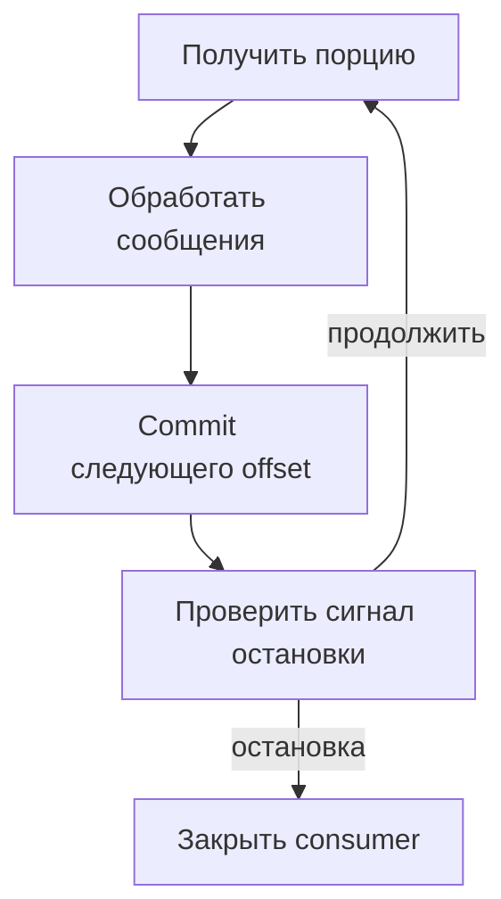

# Kafka в Python-сервисе: producer, consumer и эксплуатация {#kafka-in-python-services}

<div class="bdr-post__hero" data-bdr-post="2026-09-13-kafka-in-python-services" role="img" aria-label="Каждое стандартное поведение проверено на настоящем брокере" markdown="0"></div>

Kafka-клиент должен вписываться в правила сервиса: кто владеет топиками, когда сообщение считается обработанным и что происходит при остановке. Значения по умолчанию библиотеки не отвечают на эти вопросы.

Удобно рассматривать producer и consumer вместе с их жизненным циклом. Тогда подтверждения, повторы и завершение процесса образуют один проверяемый процесс.

<!-- more -->

<div id="the-production-checklist-for-aiokafka" data-search-exclude></div>
<div id="the-producer" data-search-exclude></div>
<div id="the-consumer" data-search-exclude></div>
<div id="topics-and-health" data-search-exclude></div>
<div id="the-list-short" data-search-exclude></div>
<div id="the-pieces" data-search-exclude></div>

## Настроить отправку под требуемую гарантию {#producer}

Producer создаётся внутри работающего event loop и закрывается владельцем приложения. При отправке нужно отличать постановку в локальную очередь от полученного подтверждения брокера. Если результат важен для ответа пользователю, дождитесь соответствующего future или используйте явный асинхронный контракт.

Настройки acknowledgements, replication и минимального числа синхронных реплик должны соответствовать друг другу. Идемпотентный producer помогает с повторами его отправки, но не устраняет две отдельные публикации одной бизнес-операции приложением.

Заранее определите сериализацию, ключ партиционирования и максимальный размер сообщения. Порядок гарантируется в рамках партиции, поэтому выбор ключа относится к контракту данных.

## Зафиксировать, что означает commit {#consumer}

Offset указывает позицию чтения, а commit сохраняет точку восстановления группы. Для ручного commit записывается offset следующего сообщения после успешно обработанного. Соответствующий API и особенности rebalance описаны в [документации aiokafka](https://aiokafka.readthedocs.io/en/stable/consumer.html).

Ниже фрагмент цикла с `enable_auto_commit=False`. Обработчик `process` и событие `stop` предоставляет приложение:

```python
async def consume_batches(consumer, process, stop):
    await consumer.start()
    try:
        while not stop.is_set():
            batches = await consumer.getmany(timeout_ms=1000, max_records=100)
            for partition, messages in batches.items():
                for message in messages:
                    await process(message)
                if messages:
                    await consumer.commit({partition: messages[-1].offset + 1})
    finally:
        await consumer.stop()
```

Если `process` падает, прогресс этой порции не фиксируется, и часть сообщений может прийти повторно. Значит, обработка должна выдерживать дубль. При параллельной работе нельзя фиксировать позицию дальше сообщения, которое ещё выполняется.

Это основа цикла, а не полный runtime: проекту также нужны политика исключений, обработка rebalance и ограничение времени остановки. Неудачный commit после смены владельца партиции нельзя превращать в подтверждение якобы сохранённого прогресса.

<!-- diagram:concept -->
<figure class="bdr-diagram" markdown="1">
<figcaption><span class="bdr-diagram__eyebrow">ИДЕЯ В СХЕМЕ</span><strong>Прогресс фиксируется после обработки</strong></figcaption>
<div class="bdr-diagram__viewport" markdown="1" data-search-exclude>



</div>
<p class="bdr-diagram__caption">Consumer завершает обработку принятой порции до commit offset. После сигнала остановки он больше не запрашивает новую порцию.</p>
</figure>
<!-- /diagram:concept -->

<div id="should-your-application-create-kafka-topics-on-startup" data-search-exclude></div>
<div id="what-the-broker-does-for-you" data-search-exclude></div>
<div id="what-the-application-does" data-search-exclude></div>
<div id="the-shape-is-decided-once-forever" data-search-exclude></div>
<div id="three-replicas-start-at-the-same-time" data-search-exclude></div>
<div id="a-shape-the-cluster-cannot-give-you" data-search-exclude></div>
<div id="so-should-it" data-search-exclude></div>

## Назначить владельца топиков {#topics}

Автоматическое создание удобно в локальной среде, но production-топик имеет контракт: число партиций, replication, retention, права и совместимость формата сообщений.

Если топиком владеет сервис, создание может входить в его deployment-процесс. Для общего топика нескольких команд лучше явно выделить владельца инфраструктурного изменения. Повторное «создать, если отсутствует» не обязано менять настройки уже существующего топика: provisioning и reconciliation — разные задачи.

Проверьте одновременный запуск реплик и отказ создания из-за недопустимой конфигурации. Эти случаи должны давать понятный результат, а не случайно оставлять приложение работающим без нужного топика.

<div id="graceful-kafka-consumer-shutdown-in-kubernetes" data-search-exclude></div>
<div id="what-the-group-does-when-a-member-disappears" data-search-exclude></div>
<div id="measured-the-consumer-that-exits" data-search-exclude></div>
<div id="the-protocol" data-search-exclude></div>
<div id="the-numbers-to-set" data-search-exclude></div>

## Завершить работу в пределах бюджета {#shutdown}

После сигнала остановки consumer прекращает запрашивать новую работу, завершает принятую порцию, фиксирует обработанный прогресс и покидает группу. Размер порции и длительность обработчика определяют, сколько времени потребуется на drain.

Если работа не помещается в бюджет, возможна повторная доставка. Это штатный сценарий для идемпотентного обработчика, но не повод подтверждать необработанное. Подробный порядок остановки процесса разобран в [материале о lifecycle](2026-09-13-python-service-lifecycle.md).

## Смотреть на задержку обработки {#verification}

Lag полезен вместе со скоростью поступления, временем обработки и возрастом старейшего сообщения. Дополнительно нужны ошибки producer, неудачные commits, rebalance и сообщения, отправленные в отдельную очередь разбора.

Проверьте потерю брокера, падение обработчика и остановку посреди порции. Гарантии для изменений БД и внешних эффектов раскрыты в [материале об Outbox и Inbox](2026-09-13-reliable-events-outbox-inbox-kafka.md). [aiokafka-foundation-kit](https://bedrock-python.github.io/aiokafka-foundation-kit/) собирает настройки и lifecycle клиентов; контракт обработки остаётся у приложения.

## Примеры и лабораторные работы {#labs}

Полные стенды и условия воспроизведения вынесены в отдельные материалы:

- [Практикум: проверка aiokafka перед продакшеном](../lab/2026-09-07-aiokafka-checklist/README.md)
- [Практикум: кто создаёт топик Kafka](../lab/2026-09-07-topics-on-startup/README.md)
- [Практикум: корректное завершение консьюмера Kafka в Kubernetes](../lab/2026-09-07-kafka-consumer-shutdown/README.md)
