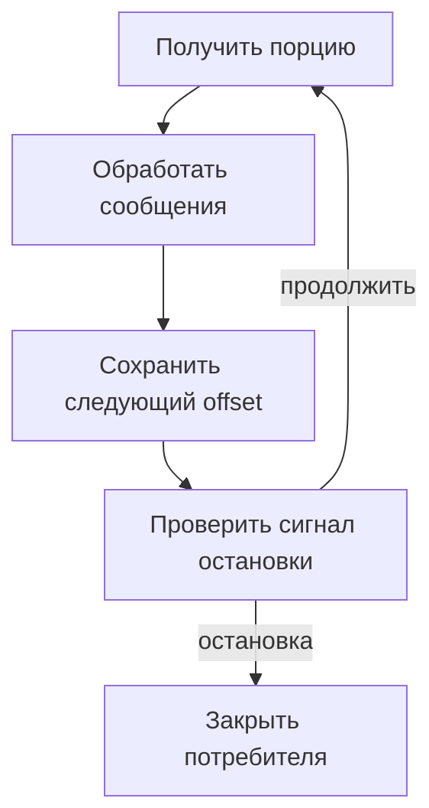

# Kafka в Python-сервисе: отправка, обработка сообщений и эксплуатация {#kafka-in-python-services}

<div class="bdr-post__hero" data-bdr-post="2026-09-13-kafka-in-python-services" role="img" aria-label="Каждое стандартное поведение проверено на настоящем брокере" markdown="0"></div>

При подключении Kafka нужно определить, кто создаёт и настраивает топики, когда сообщение считается обработанным и что делать при остановке сервиса. Настройки клиента по умолчанию не отвечают на эти вопросы.

Удобно рассматривать отправителя (producer) и потребителя (consumer) вместе с их жизненным циклом. Тогда можно проверить весь процесс: отправку, подтверждения, повторы и завершение работы.

<!-- more -->

<div id="the-production-checklist-for-aiokafka" data-search-exclude></div>
<div id="the-producer" data-search-exclude></div>
<div id="the-consumer" data-search-exclude></div>
<div id="topics-and-health" data-search-exclude></div>
<div id="the-list-short" data-search-exclude></div>
<div id="the-pieces" data-search-exclude></div>

## Настраиваем отправку с нужными гарантиями {#producer}

Producer создаётся внутри работающего event loop и закрывается при завершении приложения. Постановка сообщения в локальную очередь и подтверждение от брокера — разные этапы отправки. Если ответ пользователю зависит от доставки, дождитесь соответствующего future. Иначе API должен явно сообщать, что операция принята и завершится позже.

Подтверждения записи (acknowledgements), число реплик и минимальное число синхронных реплик нужно настраивать согласованно. Идемпотентный producer защищает от дублей при собственных повторах отправки, но не от ситуации, когда приложение дважды публикует одну бизнес-операцию.

Заранее определите формат сериализации, ключ распределения по партициям и максимальный размер сообщения. Порядок сообщений гарантируется внутри партиции, поэтому выбор ключа — часть правил обмена данными.

## Когда фиксировать позицию обработки {#consumer}

Offset обозначает позицию сообщения, а commit сохраняет позицию, с которой группа продолжит работу после восстановления. При ручном commit указывают offset следующего сообщения после успешно обработанных. API и особенности перераспределения партиций (rebalance) описаны в [документации aiokafka](https://aiokafka.readthedocs.io/en/stable/consumer.html).

Ниже фрагмент цикла с `enable_auto_commit=False`. Обработчик `process` и событие `stop` предоставляет приложение:

```python
async def consume_batches(consumer, process, stop):
    await consumer.start()
    try:
        while not stop.is_set():
            batches = await consumer.getmany(timeout_ms=1000, max_records=100)
            for partition, messages in batches.items():
                for message in messages:
                    await process(message)
                if messages:
                    await consumer.commit({partition: messages[-1].offset + 1})
    finally:
        await consumer.stop()
```

Если `process` завершается с ошибкой, позиция обработки этой порции не фиксируется, и часть сообщений может прийти снова. Поэтому обработчик должен быть готов к дублям. При параллельной обработке нельзя фиксировать позицию, оставляя перед ней незавершённые сообщения.

Это только основа цикла. Приложению также нужны обработка исключений, реакция на перераспределение партиций и ограничение времени остановки. Если commit не удался после передачи партиции другому потребителю, нельзя считать позицию сохранённой.

<!-- diagram:concept -->
<figure class="bdr-diagram" markdown="1">
<figcaption><span class="bdr-diagram__eyebrow">ИДЕЯ В СХЕМЕ</span><strong>Сначала обработка, затем commit</strong></figcaption>
<div class="bdr-diagram__viewport" markdown="1" data-search-exclude>



</div>
<p class="bdr-diagram__caption">Потребитель обрабатывает текущую порцию сообщений, затем фиксирует позицию. После сигнала остановки следующая порция уже не запрашивается.</p>
</figure>
<!-- /diagram:concept -->

<div id="should-your-application-create-kafka-topics-on-startup" data-search-exclude></div>
<div id="what-the-broker-does-for-you" data-search-exclude></div>
<div id="what-the-application-does" data-search-exclude></div>
<div id="the-shape-is-decided-once-forever" data-search-exclude></div>
<div id="three-replicas-start-at-the-same-time" data-search-exclude></div>
<div id="a-shape-the-cluster-cannot-give-you" data-search-exclude></div>
<div id="so-should-it" data-search-exclude></div>

## Кто создаёт и настраивает топики {#topics}

Автоматическое создание удобно при локальной разработке. Для топика в продакшене нужно заранее определить число партиций и реплик, сроки хранения, права доступа и правила совместимости формата сообщений.

Если за топик отвечает один сервис, его создание можно включить в процесс развёртывания. Для общего топика нескольких команд нужно явно определить ответственного за изменения. Команда «создать, если отсутствует» не обязательно меняет настройки уже существующего топика: создание и приведение настроек к нужному состоянию — разные задачи.

Проверьте одновременный запуск реплик и отказ создания из-за недопустимой конфигурации. Эти случаи должны давать понятный результат, а не случайно оставлять приложение работающим без нужного топика.

<div id="graceful-kafka-consumer-shutdown-in-kubernetes" data-search-exclude></div>
<div id="what-the-group-does-when-a-member-disappears" data-search-exclude></div>
<div id="measured-the-consumer-that-exits" data-search-exclude></div>
<div id="the-protocol" data-search-exclude></div>
<div id="the-numbers-to-set" data-search-exclude></div>

## Завершаем работу за отведённое время {#shutdown}

После сигнала остановки consumer прекращает запрашивать новые сообщения, завершает текущую порцию, фиксирует позицию обработки и выходит из группы. Время на завершение (drain) зависит от размера порции и длительности работы обработчика.

Если времени не хватило, сообщения могут прийти повторно. Идемпотентный обработчик должен выдерживать это, но подтверждать необработанные сообщения нельзя. Подробный порядок остановки разобран в [статье о жизненном цикле сервиса](2026-09-13-python-service-lifecycle.md).

## Как отслеживать задержку обработки {#verification}

Отставание потребителя (lag) нужно оценивать вместе со скоростью поступления сообщений, временем их обработки и возрастом самого старого сообщения. Отдельно отслеживайте ошибки отправителя, неудачные commit, перераспределения партиций и сообщения, отложенные для разбора ошибок.

Проверьте недоступность брокера, ошибку обработчика и остановку посередине порции. Гарантии для изменений в БД и внешних действий разобраны в [статье об Outbox и Inbox](2026-09-13-reliable-events-outbox-inbox-kafka.md). [aiokafka-foundation-kit](https://bedrock-python.github.io/aiokafka-foundation-kit/) помогает настраивать клиентов и управлять их жизненным циклом. Правила обработки сообщений определяет приложение.

## Примеры и лабораторные работы {#labs}

Запускаемые примеры и инструкции к ним:

- [Практикум: проверка aiokafka перед продакшеном](../lab/2026-09-07-aiokafka-checklist/README.md)
- [Практикум: кто создаёт топик Kafka](../lab/2026-09-07-topics-on-startup/README.md)
- [Практикум: корректная остановка потребителя Kafka в Kubernetes](../lab/2026-09-07-kafka-consumer-shutdown/README.md)
