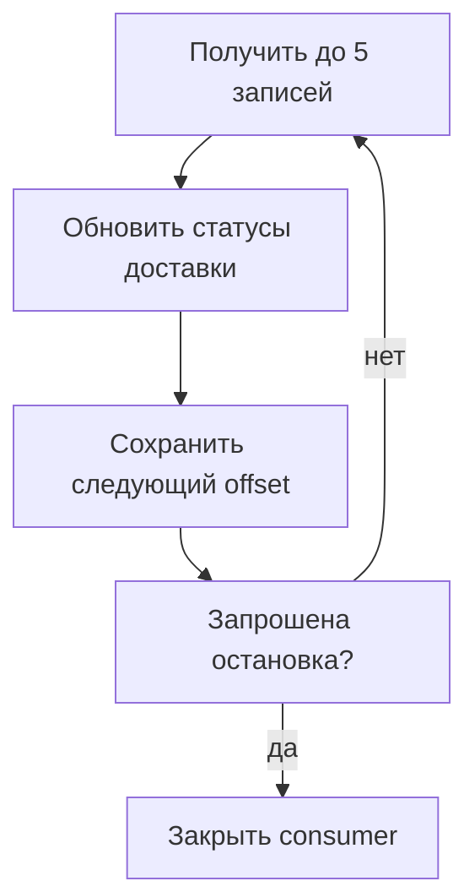

# Kafka в Python: отправка, обработка и остановка сервиса {#kafka-in-python-services}

<div class="bdr-post__hero" data-bdr-post="2026-09-13-kafka-in-python-services" role="img" aria-label="Статусы доставки: отправка, обработка, commit и завершение текущей пачки при остановке" markdown="0"></div>

Представим сервис доставки, который отправляет статусы посылок в Kafka. Сервис отслеживания читает их и обновляет карточку заказа. При выкладке новой версии он должен закончить принятые сообщения или оставить их следующему экземпляру для повтора.

Соберём этот процесс, сломаем обработчик и остановим consumer посередине пачки. На каждом шаге проверим конкретный результат: что отправлено, что обработано и с какого сообщения продолжится работа.

<!-- more -->

<div id="the-production-checklist-for-aiokafka" data-search-exclude></div>
<div id="the-producer" data-search-exclude></div>
<div id="the-consumer" data-search-exclude></div>
<div id="topics-and-health" data-search-exclude></div>
<div id="the-list-short" data-search-exclude></div>
<div id="the-pieces" data-search-exclude></div>

## Отправляем статус доставки {#producer}

До создания клиентов договоримся о формате сообщений:

| Поле | В нашем примере |
| --- | --- |
| Топик | `delivery.status`, создаётся до запуска сервиса |
| Ключ | ID доставки в виде байтов UTF-8 |
| Значение | JSON с `delivery_id`, `status` и возрастающей `revision` |
| Группа потребителей | `tracking`, общая для экземпляров сервиса отслеживания |

Возьмём [aiokafka-foundation-kit](https://bedrock-python.github.io/aiokafka-foundation-kit/): библиотека даёт настройки, сериализацию JSON и управление жизненным циклом клиентов. Модели Pydantic находятся в `contrib.models`; для примеров нужна установка с `[models]`.

Восемь фрагментов работы с Kafka ниже собираются в `kafka_flow.py` практикума. Подключение servicewright ближе к концу статьи находится в `consumer_service.py`. Практикумы запускают эти же функции с настоящим брокером.

Сервис доставки создаёт один producer внутри работающего event loop и использует его до остановки. `bootstrap` — адрес подключения к Kafka. Контекстный менеджер запускает и закрывает клиент:

```python
from contextlib import asynccontextmanager

from aiokafka_foundation_kit import producer_lifecycle
from aiokafka_foundation_kit.contrib.models import BaseKafkaProducerSettings

TOPIC = "delivery.status"


@asynccontextmanager
async def delivery_producer(bootstrap):
    settings = BaseKafkaProducerSettings(
        bootstrap_servers=bootstrap,
        acks="all", enable_idempotence=True, compression_type="gzip",
    )
    async with producer_lifecycle(settings) as producer:
        yield producer
```

Обновление отправляется через такую функцию:

```python
async def publish_status(producer, delivery_id, status, revision):
    return await producer.send_and_wait(
        TOPIC,
        value={"delivery_id": delivery_id, "status": status, "revision": revision},
        key=delivery_id.encode("utf-8"),
    )
```

Например, `publish_status(producer, "delivery-42", "in_transit", 4)` отправит словарь в формате JSON и ключ в байтах. После `await` мы получим метаданные подтверждённой брокером записи: в том числе партицию и offset. Это ещё не означает, что сервис отслеживания применил обновление. [Практикум про клиентов](../lab/2026-09-07-aiokafka-checklist/README.md) читает пять таких сообщений обратно и проверяет данные, ключи и последовательность.

`acks="all"` и идемпотентность нужно согласовать с числом реплик и настройкой `min.insync.replicas` кластера. Стенд с одним брокером не проверяет надёжность репликации. Идемпотентность producer защищает от повторов в его собственном протоколе; два явных вызова приложения всё ещё могут опубликовать одно обновление дважды. Подробнее — в [документации aiokafka producer](https://aiokafka.readthedocs.io/en/stable/producer.html#idempotent-produce).

Если запрос должен одновременно сохранить данные приложения и отправить событие, используйте [схему с Outbox](2026-09-13-reliable-events-outbox-inbox-kafka.md). Здесь разберём клиентов Kafka и порядок обработки сообщений.

## Обновляем карточку, затем делаем commit {#consumer}

Сначала определим работу обработчика. В практикуме он хранит последний статус доставки в словаре и пропускает повторы и старые версии:

```python
class TrackingView:
    def __init__(self):
        self.deliveries = {}

    async def process(self, message):
        event = message.value
        delivery_id = event["delivery_id"]
        previous = self.deliveries.get(delivery_id)
        if previous is None or event["revision"] > previous["revision"]:
            self.deliveries[delivery_id] = event
```

Словарь позволяет увидеть результат проверки. Для настоящей витрины нужно постоянное хранилище: данные в памяти не переживут перезапуск. Такое сравнение версий подходит для полных снимков статуса. Если необходимо применить каждый переход, понадобятся отдельные правила проверки последовательности.

Настроим consumer с ручным commit:

```python
from aiokafka_foundation_kit import consumer_lifecycle
from aiokafka_foundation_kit.contrib.models import BaseKafkaConsumerSettings


def tracking_settings(bootstrap, group="tracking"):
    return BaseKafkaConsumerSettings(
        bootstrap_servers=bootstrap, group_id=group,
        enable_auto_commit=False, auto_offset_reset="earliest",
        max_poll_records=5, max_poll_interval_ms=30_000,
    )
```

`earliest` используется, когда нет подходящего сохранённого offset. Следующий экземпляр той же группы продолжит с подтверждённой позиции. Библиотека десериализует JSON до передачи сообщения нашему обработчику.

Клиент уже запущен через `consumer_lifecycle`. Передадим `TrackingView().process` и событие остановки `stop` типа `asyncio.Event` в цикл:

```python
import asyncio


async def consume_batches(consumer, process, stop):
    while not stop.is_set():
        batches = await consumer.getmany(timeout_ms=500, max_records=5)
        async with asyncio.timeout(10):
            for partition, messages in batches.items():
                for message in messages:
                    await process(message)
                if messages:
                    await consumer.commit({partition: messages[-1].offset + 1})
```

Один опрос возвращает не больше пяти записей суммарно по всем партициям. Десятисекундный таймаут охватывает **обработку и commit полученной пачки**. Позиция каждой партиции фиксируется отдельно после успешной обработки её записей. После offset 0–4 сохраняется **5** — позиция следующего сообщения.

При исключении или таймауте цикл завершается. Он не продолжает чтение и не подтверждает позицию после неудачной записи. Уже подтверждённые партиции сохранят прогресс, а в незавершённой могут повториться сообщения, которые успели изменить данные. Проверка версии позволяет нашему обработчику выдержать такие повторы.

Практикум проверяет три случая на одной партиции:

| Сценарий | Обработанные offset | Сохранённый offset | Откуда начнёт следующий экземпляр |
| --- | --- | --- | --- |
| Обработчик упал на третьей записи | 0, 1 | Нет | 0 |
| Все пять записей завершены, ручной commit | 0–4 | 5 | 5 |
| Автоподтверждение сработало после чтения пяти записей и обработки двух | 0, 1 | 5 | 5 |

Последняя строка показывает, почему автоматический commit не подходит для нашего цикла: позиция восстановления может уйти дальше выполненной работы. Записи остаются в Kafka, но обычный перезапуск группы их уже пропустит.

`max_poll_interval_ms=30_000` оставляет время на нашу ограниченную по длительности пачку. При этом перераспределение партиций, или rebalance, всё равно может передать партицию другому consumer во время работы. Ошибка commit должна остановить этот цикл; считать позицию сохранённой и читать дальше нельзя. Более сложным воркерам с параллельной обработкой нужно согласовать отзыв партиций и commit. API разобрано в [документации aiokafka](https://aiokafka.readthedocs.io/en/stable/consumer.html#manual-vs-automatic-committing).

<!-- diagram:concept -->
<figure class="bdr-diagram" markdown="1">
<figcaption><span class="bdr-diagram__eyebrow">ИДЕЯ В СХЕМЕ</span><strong>Перед остановкой завершаем принятую пачку</strong></figcaption>
<div class="bdr-diagram__viewport" markdown="1" data-search-exclude>


```mermaid
---
config:
  theme: default
  look: classic
  flowchart:
    useMaxWidth: false
    wrappingWidth: 150
    padding: 12
    nodeSpacing: 24
    rankSpacing: 32
---
flowchart TD
    accTitle: Перед остановкой завершаем принятую пачку
    accDescr: После успешной обработки сохраняем следующий offset. При ошибке или таймауте незавершённая работа остаётся для повтора; затем consumer закрывается.
    A["Получить до 5 записей"]
    B["Обновить статусы доставки"]
    C["Сохранить следующий offset"]
    D["Запрошена остановка?"]
    E["Закрыть consumer"]
    A --> B --> C --> D
    D -->|"нет"| A
    D -->|"да"| E
```

</div>
<p class="bdr-diagram__caption">После успешной обработки сохраняем следующий offset. При ошибке или таймауте незавершённая работа остаётся для повтора; затем consumer закрывается.</p>
</figure>
<!-- /diagram:concept -->

<div id="should-your-application-create-kafka-topics-on-startup" data-search-exclude></div>
<div id="what-the-broker-does-for-you" data-search-exclude></div>
<div id="what-the-application-does" data-search-exclude></div>
<div id="the-shape-is-decided-once-forever" data-search-exclude></div>
<div id="three-replicas-start-at-the-same-time" data-search-exclude></div>
<div id="a-shape-the-cluster-cannot-give-you" data-search-exclude></div>
<div id="so-should-it" data-search-exclude></div>

## Создаём топик до запуска сервиса {#topics}

Допустим, за `delivery.status` отвечает команда доставки. При развёртывании она может создать топик через библиотеку:

```python
from aiokafka_foundation_kit import TopicConfig, ensure_topics_async


async def provision_delivery_topic(bootstrap, *, partitions=3, replicas=1):
    settings = BaseKafkaProducerSettings(bootstrap_servers=bootstrap)
    await ensure_topics_async([
        TopicConfig(
            name=TOPIC, num_partitions=partitions, replication_factor=replicas,
            topic_configs={"retention.ms": "604800000"},
        ),
    ], settings)
```

Здесь запрошены три партиции и срок хранения по времени в семь дней. Одна реплика нужна для стенда с одним брокером; для рабочего кластера выберите свои параметры репликации и хранения. На удаление данных влияют и другие настройки топика, например ограничение объёма.

`ensure_topics_async()` создаёт отсутствующие топики, но не приводит настройки существующих к заданным. [Практикум про топики](../lab/2026-09-07-topics-on-startup/README.md) показывает разницу:

| Запрос | Результат |
| --- | --- |
| Три вызова одновременно создают один топик с тремя партициями | Все завершаются успешно; создан один топик с тремя партициями |
| Следующий вызов запрашивает шесть партиций для того же топика | У существующего топика по-прежнему три |
| У одного брокера запрашиваются три реплики | `InvalidReplicationFactorError` |

Создание списка топиков тоже не атомарно. Для `[valid_topic, invalid_topic, next_topic]` первый останется созданным, неверная конфигурация вызовет исключение, а до последнего выполнение не дойдёт. При развёртывании нужно учесть этот частичный результат и устранить причину до запуска воркеров.

Если вместо отдельного шага используете `producer_lifecycle(..., topics=[...])`, передайте этому контекстному менеджеру `auto_create_topics=True`. Одного аргумента `topics` недостаточно. В практикумах автоматическое создание топиков на стороне брокера выключено, чтобы оно не скрывало пропущенный шаг настройки.

<div id="graceful-kafka-consumer-shutdown-in-kubernetes" data-search-exclude></div>
<div id="what-the-group-does-when-a-member-disappears" data-search-exclude></div>
<div id="measured-the-consumer-that-exits" data-search-exclude></div>
<div id="the-protocol" data-search-exclude></div>
<div id="the-numbers-to-set" data-search-exclude></div>

## Останавливаем consumer посередине пачки {#shutdown}

Выкладываем новую версию сервиса отслеживания. Старый экземпляр получил пять записей, обработал две и увидел событие остановки. Если закончить оставшиеся три, можно сохранить offset 5. При немедленной отмене пачка останется доступной для повтора.

Дадим текущей работе ограниченное время на завершение, затем закроем consumer:

```python
async def run_tracking(bootstrap, process, stop, *, group="tracking", grace=12):
    async with consumer_lifecycle(
        tracking_settings(bootstrap, group), topics=(TOPIC,),
    ) as consumer:
        worker = asyncio.create_task(consume_batches(consumer, process, stop))
        stopping = asyncio.create_task(stop.wait())
        try:
            await asyncio.wait({worker, stopping}, return_when=asyncio.FIRST_COMPLETED)
            async with asyncio.timeout(grace):
                await worker
        finally:
            worker.cancel()
            stopping.cancel()
            await asyncio.gather(worker, stopping, return_exceptions=True)
```

`consume_batches()` проверяет `stop` перед следующим опросом: при остановке во время обработки он закончит только принятую пачку. Уже начавшийся опрос может вернуть последнюю пачку, которую тоже нужно завершить. Если воркер упал до запроса остановки, `await worker` передаст ошибку наружу.

После `stop` параметр `grace` ограничивает ожидание воркера. Когда время истечёт, задача будет отменена и возникнет `TimeoutError`; незавершённая работа не будет подтверждена. Затем контекстный менеджер закроет consumer. На это закрытие нужно оставить дополнительное время в бюджете остановки процесса. Как и с другими таймаутами asyncio, обработчик должен поддерживать отмену.

### Передаём остановку от приложения воркеру {#service}

Наша библиотека [servicewright](https://bedrock-python.github.io/servicewright/) управляет жизненным циклом процесса и обработкой сигналов. `DaemonEntrypoint` передаёт событие остановки сервиса функции consumer. В [практикуме про остановку](../lab/2026-09-07-kafka-consumer-shutdown/README.md) минимальные объекты `Settings` и `Container` подготовлены в `consumer_common.py`:

```python
from servicewright import AppSpec, DaemonEntrypoint, Service, run_sync

from consumer_common import Container, Settings, flow


def build_service(bootstrap, process, *, group="tracking", grace=12):
    async def consume(scope, stop):
        # The timeout belongs to this loop. DaemonEntrypoint.drain() is a no-op.
        await flow.run_tracking(bootstrap, process, stop, group=group, grace=grace)

    spec = AppSpec(
        service_name="tracking", create_container=lambda settings: Container(),
        cleanup_timeout_seconds=3,
    )
    return Service(spec, entrypoints=[DaemonEntrypoint(consume)])
```

Запускаемый файл `consumer_service.py` вызывает `run_sync(service, Settings())`. В проверках `service.run(Settings(), stop=event)` получает событие явно, поэтому практикум работает и на Windows. Лимит обработки задан в `run_tracking()`: само по себе поле `AppSpec.drain_grace_seconds` не ограничивает произвольную функцию внутри `DaemonEntrypoint`.

При десяти ожидающих записях в одной партиции получаем:

```text
Отмена после двух изменений: processed=[0, 1],          committed=None, restart=0
Завершение пачки:            processed=[0, 1, 2, 3, 4], committed=5,    restart=5
Время ожидания истекло:      processed=[0, 1],          committed=None, restart=0
```

Проверки используют событие остановки или отмену задачи, настоящий брокер и новые экземпляры consumer. Они проверяют завершение текущей работы и offset; выкладку в Kubernetes и принудительное завершение процесса здесь не воспроизводим. Порядок остановки при развёртывании разобран в [статье о жизненном цикле сервиса](2026-09-13-python-service-lifecycle.md).

## Измеряем, сколько работы осталось подтвердить {#verification}

Consumer может прочитать весь топик, пока обработчик ещё работает. Сравним текущую позицию чтения с подтверждённой:

```python
async def read_lag(consumer):
    partitions = consumer.assignment()
    ends = await consumer.end_offsets(partitions)
    result = {}
    for partition, end in ends.items():
        position = await consumer.position(partition)
        committed = await consumer.committed(partition)
        result[partition] = {
            "position_lag": end - position,
            "committed_lag": None if committed is None else end - committed,
        }
    return result
```

В практикуме группа сохранила offset 0 и получила пять записей. `position_lag` уже равен **0**, а `committed_lag` всё ещё **5**. После успешной обработки и commit оба станут нулём. `None` означает, что у группы пока нет сохранённого offset. Это наблюдение через несколько обращений к брокеру, а не атомарный замер.

Вместе с lag отслеживайте время обработки, ошибки commit и перераспределения партиций. Успешный `check_kafka_health_async()` проверяет подключение: он не доказывает право записи в этот топик или успешную обработку сообщения сервисом отслеживания.

Примеры проверены с Python 3.13, aiokafka-foundation-kit 0.1.3, aiokafka 0.14.0 и servicewright 0.13.1. Зависимости практикумов закреплены; брокер — `confluentinc/cp-kafka:7.6.0` в режиме KRaft. Проверки работают с публичным API библиотек, без подмены внутренних функций.

## Начните с правил обработки {#conclusion}

Мы отправили статус доставки, повторили неудачную пачку, создали топик и остановили воркер во время обработки. Позиция восстановления оставалась корректной, когда приложение подтверждало только завершённую работу, а ошибка прерывала цикл.

Используйте наш [aiokafka-foundation-kit](https://bedrock-python.github.io/aiokafka-foundation-kit/) для настроек, клиентов с JSON и управления их подключениями. Добавьте [servicewright](https://bedrock-python.github.io/servicewright/), если воркеру нужен общий жизненный цикл процесса. Формат топика, сохранение результата обработки и решение о commit задайте в приложении; запускаемые практикумы помогут проверить эти правила.

## Примеры и практикумы {#labs}

- [Практикум: JSON, commit и повторная доставка](../lab/2026-09-07-aiokafka-checklist/README.md)
- [Практикум: создание топиков и одновременный запуск](../lab/2026-09-07-topics-on-startup/README.md)
- [Практикум: завершение consumer и нехватка времени на остановку](../lab/2026-09-07-kafka-consumer-shutdown/README.md)
