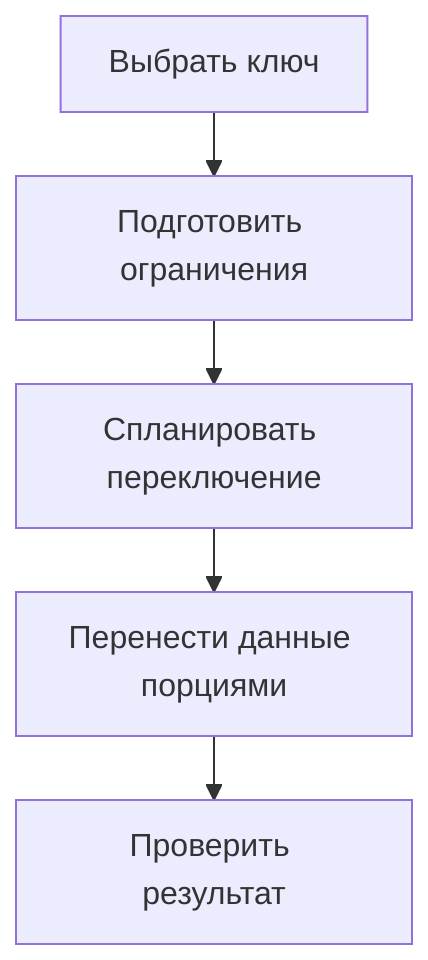

# Как перевести таблицу PostgreSQL на партиционирование {#partitioning-an-existing-postgresql-table}

Перевод существующей таблицы на партиционирование меняет больше, чем способ хранения строк. Он затрагивает уникальность, внешние ключи, планы запросов и процедуру записи во время перехода. Начинать с команды создания партиций поздно: сначала нужен ответ, какой ключ выдержит эти ограничения.

Цель миграции — получить предсказуемое дерево партиций с проверенными данными и понятным способом переключения приложения.

<!-- more -->

## Выбрать ключ по запросам и ограничениям {#keys}

Для временных данных естественен диапазон по timestamp. Но уникальное ограничение партиционированной таблицы обычно должно включать все колонки её ключа партиционирования. Это может изменить `PRIMARY KEY (id)` на составной ключ и потребовать изменения входящих внешних ключей. Ограничения описаны в [документации PostgreSQL](https://www.postgresql.org/docs/current/ddl-partitioning.html).

Альтернатива для подходящих новых данных — партиционирование непосредственно по UUIDv7. Тогда диапазоны задаются значениями id, и уникальный ключ может оставаться одноколоночным. Однако запрос по отдельному `created_at` не обязан отсекать партиции по id: предикат должен согласовываться с ключом.

UUIDv7 полезен, когда временная упорядоченность идентификаторов соответствует данным и запросам. Он не превращает существующие случайные UUID в упорядоченные и не отменяет работу с поздними записями. Выбор проверяется на реальных `EXPLAIN` и правилах хранения.

## Отдельно спроектировать переключение {#cutover}

Обычную таблицу нельзя просто объявить партиционированной без изменения структуры. Нужны новый родитель и путь переноса либо присоединения существующих данных. В одном из стендов блога прежняя таблица становится DEFAULT-партицией, после чего данные распределяются по диапазонам.

До переключения составьте перечень входящих внешних ключей, sequence, defaults, прав, индексов, triggers и зависимых представлений. Переименование таблиц само по себе не гарантирует, что все зависимые объекты теперь указывают на нужный родитель.

DDL-переключение требует блокировок. Репетируйте его с параллельными записями, задавайте ограничение ожидания блокировки и определяйте условие отмены попытки. Формулировка «без изменения запросов приложения» не означает отсутствие паузы или изменений схемы.

<!-- diagram:concept -->
<figure class="bdr-diagram" markdown="1">
<figcaption>ИДЕЯ В СХЕМЕ<strong>Переход без потери контроля над данными</strong></figcaption>

Ключи и внешние ссылки проектируются до переключения. Перенос завершается проверкой строк, ограничений и плана запросов.

</figure>
<!-- /diagram:concept -->

## Переносить данные контролируемыми порциями {#movement}

Размер порции ограничивает длительность транзакции, объём WAL и влияние на рабочую нагрузку. После каждой порции нужно понимать, что уже перенесено и как продолжить после перезапуска.

Создание диапазона рядом с DEFAULT требует внимания: строки этого диапазона могут ещё находиться в DEFAULT и мешать добавлению новой партиции. Порядок переноса, проверок и attach должен учитывать фактические ограничения дерева. Его не стоит заменять универсальным циклом `INSERT ... SELECT` с последующим удалением без защиты от конкурентной записи.

Для больших объёмов сравните несколько путей перехода: окно обслуживания, перенос с контролируемым переключением или специализированная схема синхронизации. Подходящий вариант зависит от доступного простоя и интенсивности записи.

## Проверить не только количество строк {#verification}

Сверьте данные и отсутствие дублей, восстановите и проверьте внешние ключи, убедитесь в корректности следующего значения sequence. Проверьте defaults, права и важные ограничения, затем выполните типовые запросы с `EXPLAIN`.

Отдельный сценарий — запись за пределами подготовленных диапазонов. Приложение должно либо иметь допустимый DEFAULT-путь, либо получать ожидаемый отказ, который наблюдается и разбирается. После миграции требуется регулярное [обслуживание партиций](2026-09-13-postgresql-partition-maintenance.md).

В лабораториях сохранены примеры перехода и UUIDv7. [pg-partsmith](https://bedrock-python.github.io/pg-partsmith/) помогает обслуживать диапазоны; выбор ключа, стратегия переключения и проверка внешних связей остаются частью проекта миграции.

## Примеры и лабораторные работы {#labs}

Полные стенды и условия воспроизведения вынесены в отдельные материалы:

- [Практикум: партиционирование работающей таблицы](../lab/2026-09-07-partition-existing-table/README.md)
- [Практикум: UUIDv7 как ключ партиционирования PostgreSQL](../lab/2026-09-07-uuidv7-partition-key/README.md)
