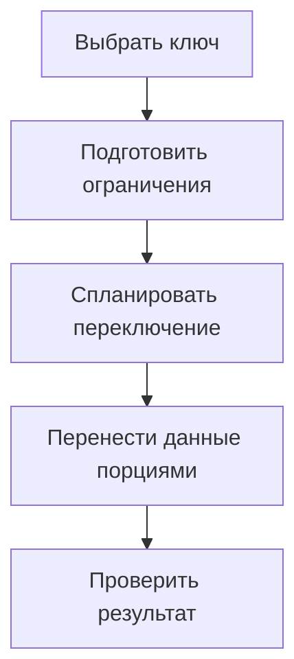

# Как перевести таблицу PostgreSQL на партиционирование {#partitioning-an-existing-postgresql-table}

При переводе существующей таблицы на партиционирование меняется не только хранение строк. Нужно учесть уникальность, внешние ключи, планы запросов и запись данных во время перехода. Поэтому сначала выбирают ключ партиционирования с учётом этих ограничений, а уже затем создают партиции.

После миграции данные должны находиться в нужных партициях, ограничения — работать, а приложение — обращаться к новой структуре таблиц. Способ переключения нужно продумать заранее.

<!-- more -->

## Выбираем ключ с учётом запросов и ограничений {#keys}

Для данных, связанных со временем, естественно выбрать диапазоны по timestamp. Но уникальное ограничение партиционированной таблицы обычно должно включать все столбцы ключа партиционирования. Тогда вместо `PRIMARY KEY (id)` может понадобиться составной ключ, а ссылающиеся на него внешние ключи тоже придётся изменить. Ограничения описаны в [документации PostgreSQL](https://www.postgresql.org/docs/current/ddl-partitioning.html).

Для подходящих новых данных можно использовать диапазоны непосредственно по UUIDv7. В этом случае границы партиций задаются значениями id, а уникальный ключ может остаться одноколоночным. Но запрос с условием только по `created_at` не обязательно исключит ненужные партиции: условие запроса должно учитывать ключ партиционирования.

UUIDv7 подходит, если порядок идентификаторов по времени соответствует данным и запросам. Уже существующие случайные UUID от этого не станут упорядоченными. Поздно поступающие записи тоже потребуют отдельного решения. Проверяйте выбор ключа на реальных планах `EXPLAIN` и с учётом правил хранения данных.

## Планируем переключение на новую структуру {#cutover}

Обычную таблицу нельзя сделать партиционированной одним изменением признака. Нужно создать новую родительскую таблицу и решить, как перенести или присоединить существующие данные. В одном из примеров блога прежняя таблица становится DEFAULT-партицией, после чего её строки распределяются по диапазонам.

До переключения составьте список внешних ключей, ссылающихся на таблицу, а также последовательностей, значений по умолчанию, прав, индексов, триггеров и зависимых представлений. Переименование таблиц само по себе не перенаправляет все эти связи на новую родительскую таблицу.

Изменение структуры требует блокировок. Проверьте переключение при одновременной записи данных, ограничьте время ожидания блокировки и заранее определите, когда прервать попытку. Даже если запросы приложения менять не нужно, переключение всё равно может потребовать паузы.

<!-- diagram:concept -->
<figure class="bdr-diagram" markdown="1">
<figcaption>ИДЕЯ В СХЕМЕ<strong>Переход без потери контроля над данными</strong></figcaption>

Ключ партиционирования и внешние ключи продумывают до переключения. После переноса проверяют данные, ограничения и планы запросов.

</figure>
<!-- /diagram:concept -->

## Переносим данные порциями {#movement}

От размера порции зависят длительность транзакции, объём WAL и влияние на работающий сервис. После каждой порции должно быть ясно, какие данные уже перенесены и откуда продолжить после перезапуска.

При наличии DEFAULT-партиции строки нового диапазона могут уже находиться в ней и мешать присоединению отдельной партиции. Порядок переноса, проверок и выполнения `ATTACH` должен учитывать реальные ограничения таблиц. Простой цикл `INSERT ... SELECT` с последующим удалением не заменяет защиту от одновременной записи.

Для больших таблиц сравните несколько вариантов: миграцию в окно обслуживания, перенос с отдельным этапом переключения или синхронизацию старой и новой таблиц. Выбор зависит от допустимого простоя и интенсивности записи.

## Проверяем данные, ограничения и запросы {#verification}

Сверьте данные и убедитесь, что нет дублей. Восстановите и проверьте внешние ключи, следующее значение последовательности, значения по умолчанию, права и важные ограничения. Затем выполните типовые запросы с `EXPLAIN`.

Отдельно проверьте запись за пределами подготовленных диапазонов. Такие строки должны либо попадать в DEFAULT-партицию, если это предусмотрено, либо вызывать понятную ошибку, которую сервис отслеживает. После миграции потребуется регулярное [обслуживание партиций](2026-09-13-postgresql-partition-maintenance.md).

В лабораториях сохранены примеры перехода и UUIDv7. [pg-partsmith](https://bedrock-python.github.io/pg-partsmith/) помогает обслуживать диапазоны; выбор ключа, стратегия переключения и проверка внешних связей остаются частью проекта миграции.

## Примеры и лабораторные работы {#labs}

Запускаемые примеры и инструкции к ним:

- [Практикум: партиционирование работающей таблицы](../lab/2026-09-07-partition-existing-table/README.md)
- [Практикум: UUIDv7 как ключ партиционирования PostgreSQL](../lab/2026-09-07-uuidv7-partition-key/README.md)
