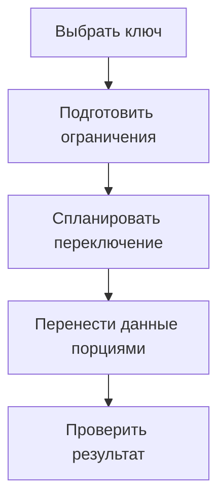

# Как перевести таблицу PostgreSQL на партиционирование {#partitioning-an-existing-postgresql-table}

<div class="bdr-post__hero" data-bdr-post="2026-09-13-partitioning-an-existing-postgresql-table" role="img" aria-label="Подготовить ключи, присоединить старую таблицу как DEFAULT и проверить результат переноса" markdown="0"></div>

Представим сервис аналитики, который хранит события в `events`. Отчёты обычно читают данные за месяц, а операторы оставляют заметки в `event_notes`. Хотим перейти на месячные партиции и сохранить имя `events` в запросах приложения. При этом нужно учесть первичный и внешний ключи, представление и последовательность для выдачи id.

Проведём миграцию на PostgreSQL 17 с pg-partsmith 1.5.1, SQLAlchemy 2.0.54 и asyncpg 0.31.0. В этом примере предусмотрено **окно обслуживания**: чтение и запись приложения приостановлены до проверки данных и зависимостей. Диагностические запросы практикума специально смотрят на промежуточные состояния.

<!-- more -->

## Начинаем с таблицы и её связей {#keys}

Вот исходная схема целиком. `events_app` задаёт права приложения; администратор в практикуме переключается на эту роль для проверки доступа. `event_summary` — простое представление для отчёта:

```sql
CREATE TABLE events (
    id bigserial PRIMARY KEY,
    created_at timestamptz NOT NULL,
    kind text NOT NULL,
    payload text NOT NULL
);
CREATE INDEX events_created_at_idx ON events (created_at);
CREATE TABLE event_notes (
    id bigserial PRIMARY KEY,
    event_id bigint NOT NULL REFERENCES events (id),
    note text NOT NULL
);
CREATE VIEW event_summary AS SELECT count(*) AS total FROM events;
CREATE ROLE events_app NOLOGIN;
GRANT USAGE ON SCHEMA public TO events_app;
GRANT SELECT, INSERT ON events TO events_app;
GRANT USAGE ON SEQUENCE events_id_seq TO events_app;
```

Практикум добавляет 615 событий за июль, август и сентябрь 2026 года, затем ещё одно — от имени роли приложения. Двадцать заметок ссылаются на существующие события. Перед изменениями сохраняем полные строки событий и заметок, чтобы сравнить их после переноса.

Попытка выполнить `CREATE TABLE ... (LIKE events INCLUDING ALL) PARTITION BY RANGE (created_at)` завершается с SQLSTATE `0A000`: в `PRIMARY KEY (id)` нет ключа партиционирования. Удалить этот ключ тоже не получится — ошибка `2BP01`, поскольку на него ссылается `event_notes`. Уникальный или первичный ключ партиционированной таблицы должен включать все столбцы ключа партиционирования. Это ограничение описано в [документации PostgreSQL 17](https://www.postgresql.org/docs/17/ddl-partitioning.html#DDL-PARTITIONING-DECLARATIVE-LIMITATIONS).

Для этой миграции выбираем `(id, created_at)`, поэтому заметки будут ссылаться на оба значения. **Уникальность одного `id` больше не гарантируется.** Практикум проверяет: одинаковая пара запрещена, а такой же id с другим временем разрешён. Если сервису нужна уникальность именно одного id, это нужно решить до выбора партиционирования по времени.

Приостанавливаем работу приложения, ждём завершения активных транзакций и готовим новый столбец для ссылки и замену индекса:

```python
async def prepare_keys(connection):
    await connection.execute("""
        ALTER TABLE event_notes ADD COLUMN event_created_at timestamptz;
        UPDATE event_notes AS n
        SET event_created_at = e.created_at
        FROM events AS e WHERE e.id = n.event_id;
        ALTER TABLE event_notes ALTER COLUMN event_created_at SET NOT NULL;
    """)
    await connection.execute("""
        CREATE UNIQUE INDEX CONCURRENTLY events_id_created_at_key
        ON events (id, created_at)
    """)
```

Функции принимают `asyncpg.Connection`. Столбец `event_created_at` становится NOT NULL: заметка не должна обходить будущий составной внешний ключ, оставляя время пустым. Код создания новых заметок тоже должен передавать время события. Сохранение имени родительской таблицы не отменяет этого изменения приложения.

`CREATE INDEX CONCURRENTLY` выполняется вне явной транзакции. Он уменьшает блокировку записи при построении индекса обычной таблицы, но замена ограничений и таблиц всё равно требует блокировок. По маленькому набору данных из практикума нельзя оценить длительность миграции в продакшене.

<div id="how-to-partition-an-existing-postgresql-table-without-rewriting-your-application" data-search-exclude></div>
<div id="step-1-the-primary-key-has-to-contain-the-partition-column" data-search-exclude></div>
<div id="step-2-the-swap" data-search-exclude></div>
<div id="step-3-the-first-maintenance-tick" data-search-exclude></div>
<div id="step-4-the-drain" data-search-exclude></div>
<div id="step-5-the-foreign-key-comes-back-composite" data-search-exclude></div>
<div id="step-6-the-empty-default-and-the-sequence" data-search-exclude></div>
<div id="the-result" data-search-exclude></div>
<div id="the-order-and-where-the-risk-is" data-search-exclude></div>
<div id="the-pieces" data-search-exclude></div>

## Подменяем родительскую таблицу в одной транзакции {#cutover}

Переименуем старую таблицу, создадим партиционированную родительскую и присоединим старую как DEFAULT-партицию. Для нового первичного ключа используем подготовленный индекс:

```python
async def cutover(connection):
    async with connection.transaction():
        await connection.execute("SET LOCAL lock_timeout = '200ms'")
        await connection.execute("""
            LOCK TABLE events, event_notes IN ACCESS EXCLUSIVE MODE;
            ALTER TABLE event_notes DROP CONSTRAINT event_notes_event_id_fkey;
            ALTER TABLE events DROP CONSTRAINT events_pkey,
                ADD CONSTRAINT events_pkey PRIMARY KEY USING INDEX events_id_created_at_key;
            ALTER TABLE events RENAME TO events_legacy;
            ALTER TABLE events_legacy RENAME CONSTRAINT events_pkey TO events_legacy_pkey;
            ALTER INDEX events_created_at_idx RENAME TO events_legacy_created_at_idx;
            CREATE TABLE events (LIKE events_legacy INCLUDING ALL)
                PARTITION BY RANGE (created_at);
            ALTER TABLE events ATTACH PARTITION events_legacy DEFAULT;
        """)
```

Таймаут ожидания блокировки в 200 мс специально выбран небольшим. Практикум держит читающую транзакцию на втором соединении и вызывает `cutover`. Получаем SQLSTATE `55P03`; контекст транзакции выполняет rollback, сохраняя исходную таблицу, внешний ключ и строки. Когда чтение завершается, то же переключение проходит.

Теперь запрос к новому родителю возвращает все 616 строк из `events_legacy`. Но две зависимости ещё нужно исправить: новая таблица не получила права приложения, а представление по-прежнему связано со старым объектом таблицы. Оба случая проверяем явно — переименование само их не исправит.

В нашем примере нет пользовательских триггеров и политик row-level security. Для своей схемы заранее составьте список таких объектов, входящих ссылок, представлений и прав.

<!-- diagram:concept -->
<figure class="bdr-diagram" markdown="1">
<figcaption><span class="bdr-diagram__eyebrow">ИДЕЯ В СХЕМЕ</span><strong>Переход без потери контроля над данными</strong></figcaption>
<div class="bdr-diagram__viewport" markdown="1" data-search-exclude>


```mermaid
---
config:
  theme: default
  look: classic
  flowchart:
    useMaxWidth: false
    wrappingWidth: 150
    padding: 12
    nodeSpacing: 24
    rankSpacing: 32
---
flowchart TD
    accTitle: Переход без потери контроля над данными
    accDescr: Ключ партиционирования и внешние ключи продумывают до переключения. После переноса проверяют данные, ограничения и планы запросов.
    A["Выбрать ключ"]
    B["Подготовить ограничения"]
    C["Спланировать переключение"]
    D["Перенести данные порциями"]
    E["Проверить результат"]
    A --> B --> C --> D --> E
```

</div>
<p class="bdr-diagram__caption">Ключ партиционирования и внешние ключи продумывают до переключения. После переноса проверяют данные, ограничения и планы запросов.</p>
</figure>
<!-- /diagram:concept -->

## Переносим строки из DEFAULT и проверяем промежуточный результат {#movement}

Если сразу создать июльскую партицию, получим SQLSTATE `23514`: в DEFAULT ещё лежат июльские строки. Для нового диапазона PostgreSQL должен исключить эти значения из DEFAULT, а существующие данные этому мешают.

`pg-partsmith` соблюдает нужный порядок: создаёт отдельную таблицу месяца, переносит в неё строки и присоединяет после освобождения соответствующего диапазона в DEFAULT. Каждая порция переносится одним выражением `DELETE ... RETURNING` / `INSERT`. До присоединения эти строки не видны через родителя. Поэтому приложение находится на паузе.

Функции ниже используют `PartitionGranularity` и `TablePartitionConfig` из `pg_partsmith`, а `PartitionToolkit` — из `pg_partsmith.aio`. В `engine` передаём SQLAlchemy `AsyncEngine`, подключённый к той же БД:

```python
def migration_toolkit(engine):
    config = TablePartitionConfig(
        schema="public",
        table_name="events",
        partition_column="created_at",
        granularity=PartitionGranularity.MONTH,
    )
    return PartitionToolkit.from_engine(engine), config


async def move_batch(toolkit, config, *, max_batches=10):
    result = await toolkit.service.partition_data(
        config, batch_rows=100, max_batches=max_batches,
    )
    if result.issues:
        raise RuntimeError(f"Data movement needs attention: {result.issues}")
    return result


async def finish_ranges(toolkit, config, expected_months):
    while True:
        result = await move_batch(toolkit, config)
        if result.complete:
            break
        if result.rows_moved == 0:
            raise RuntimeError("Data movement made no progress")
    await toolkit.service.ensure_partitions(config, expected_months)
    return result
```

Вызовем `move_batch(toolkit, config, max_batches=1)`, чтобы остановиться после одной порции. На данных практикума получаем:

| Что проверяем после первой порции | Результат |
|---|---|
| `rows_moved`, `batches`, `complete` | `100`, `1`, `False` |
| Строки, видимые через `events` | `516` |
| Строки в ещё не присоединённой `events__2026_07` | `100` |
| Полные строки из обеих таблиц вместе | В точности исходные 616 строк |

Практикум закрывает соединения engine, создаёт новый toolkit и вызывает `finish_ranges`, передавая ожидаемые начала июля, августа и сентября как `datetime` в UTC. Перенос продолжается по состоянию БД. Функция проверяет `issues` после каждой порции, прерывает цикл без продвижения и явно завершает присоединение ожидаемых диапазонов. После этого все сохранённые строки должны быть видны через `events`.

Зачем нужен последний шаг? Отдельная проверка воспроизводит ошибку на границе порции в **pg-partsmith 1.5.1**: ровно 100 июльских строк, `batch_rows=100`, `max_batches=1`. Порция опустошает DEFAULT, но июль остаётся неприсоединённым. Следующий вызов возвращает `complete=True`, поскольку DEFAULT уже пуста, хотя запрос к родителю видит ноль строк. `ensure_partitions` присоединяет ожидаемый июльский диапазон, а полная сверка подтверждает, что все 100 строк снова видны. Поэтому перед возобновлением работы проверяем и присоединение, и данные, а не только `complete`.

Во время миграции вызываем `partition_data`, а октябрьский диапазон создаём явно через `ensure_partitions`. Цикл удаления старых партиций здесь не запускаем: он не должен затронуть переносимую историю.

## Восстанавливаем связи до возобновления работы {#verification}

Старый внешний ключ из одного столбца уже не добавить: новый родитель не гарантирует уникальность одного `id`. Восстановим составную ссылку, проверим существующие заметки, перенесём владельца sequence, обновим запрос представления и выдадим права на родительскую таблицу:

```python
async def restore_references(connection):
    async with connection.transaction():
        await connection.execute("SET LOCAL lock_timeout = '200ms'")
        await connection.execute("""
            ALTER TABLE event_notes ADD CONSTRAINT event_notes_event_fkey
                FOREIGN KEY (event_id, event_created_at)
                REFERENCES events (id, created_at) NOT VALID;
            ALTER TABLE event_notes VALIDATE CONSTRAINT event_notes_event_fkey;
            ALTER SEQUENCE events_id_seq OWNED BY events.id;
            CREATE OR REPLACE VIEW event_summary AS SELECT count(*) AS total FROM events;
            GRANT SELECT, INSERT ON events TO events_app;
        """)
```

`NOT VALID` позволяет добавить внешний ключ до проверки старых строк, а `VALIDATE CONSTRAINT` выполняет эту проверку. Оба шага завершаются до возобновления запросов приложения. Заметка без времени события теперь отклоняется с `23502`, а несуществующая пара `(event_id, event_created_at)` — с `23503`.

Без обновления представления `event_summary` после переноса показывает ноль: старая таблица уже пуста. Без смены владельца sequence удаление старой таблицы конфликтует со значением по умолчанию, которое всё ещё использует её последовательность. Практикум проверяет исправленное представление и после очистки выполняет новую вставку от имени `events_app`: выданный id больше последнего id до переключения.

Удалять DEFAULT можно только после проверки, что она пуста. Проверка и отсоединение выполняются под одной блокировкой родительской таблицы:

```python
async def remove_empty_default(connection):
    async with connection.transaction():
        await connection.execute("SET LOCAL lock_timeout = '200ms'")
        await connection.execute("LOCK TABLE events IN ACCESS EXCLUSIVE MODE")
        remaining = await connection.fetchval("SELECT count(*) FROM ONLY events_legacy")
        if remaining:
            raise RuntimeError(f"DEFAULT still contains {remaining} rows")
        await connection.execute("ALTER TABLE events DETACH PARTITION events_legacy")
        await connection.execute("DROP TABLE events_legacy")
```

В конце сверяем не только количество строк:

| Проверка | Ожидаемый результат |
|---|---|
| Сохранённые строки и все двадцать исходных заметок | Не изменились |
| Проверенный составной внешний ключ | Неверные ссылки отклоняются |
| Вставка события исходным SQL от роли приложения | Работает с восстановленными правами и sequence |
| `event_summary` | Считает строки через нового родителя |
| Июльский диапазон времени в `EXPLAIN (FORMAT JSON)` | Читается только `events__2026_07` |
| Запись за неподготовленный старый месяц после удаления DEFAULT | Ошибка `23514` |

Поведение для неподготовленных диапазонов нужно выбрать заранее: здесь запись отклоняется. Можно принять другое решение и оставить DEFAULT под наблюдением. После миграции понадобится регулярное [обслуживание партиций](2026-09-13-postgresql-partition-maintenance.md).

<div id="uuidv7-as-a-postgresql-partition-key" data-search-exclude></div>
<div id="one-column-in-the-primary-key" data-search-exclude></div>
<div id="the-bounds-are-uuids" data-search-exclude></div>
<div id="pruning-happens-on-the-id-not-on-the-timestamp" data-search-exclude></div>
<div id="the-three-ids-that-do-not-fit" data-search-exclude></div>
<div id="retention-has-the-same-edge" data-search-exclude></div>
<div id="when-to-reach-for-it" data-search-exclude></div>

## Когда UUIDv7 позволяет сохранить ключ из одного столбца {#uuidv7}

Рассмотрим другую модель событий: идентификаторы уже имеют формат UUIDv7, и именно встроенное в них время определяет партицию. Тогда PostgreSQL принимает `id UUID PRIMARY KEY ... PARTITION BY RANGE (id)`: первичный ключ включает ключ партиционирования.

Второй практикум использует отдельную таблицу `uuid_events`. Настроим месячные границы UUID через кодек библиотеки:

```python
from pg_partsmith import (
    PartitionGranularity, RangePartitioning, TablePartitionConfig,
    TimeBoundaries, UUIDv7BoundaryCodec,
)


CONFIG = TablePartitionConfig(
    schema="public",
    table_name="uuid_events",
    scheme=RangePartitioning(
        key="id",
        boundaries=TimeBoundaries(
            granularity=PartitionGranularity.MONTH,
            codec=UUIDv7BoundaryCodec(),
        ),
    ),
)
```

Вызов `toolkit.service.ensure_partitions(CONFIG, months)` создаёт четыре явно указанных диапазона за июль–октябрь 2026 года. Чтобы прочитать август по ключу партиционирования, закодируем обе границы. Для этой функции также нужны `datetime` и `UTC` из модуля `datetime`:

```python
async def august_events(connection):
    start = datetime(2026, 8, 1, tzinfo=UTC)
    end = datetime(2026, 9, 1, tzinfo=UTC)
    lower, upper = UUIDv7BoundaryCodec().encode(start, end)
    return await connection.fetch(
        "SELECT payload FROM uuid_events WHERE id >= $1::uuid AND id < $2::uuid",
        lower, upper,
    )
```

Практикум проверяет настоящие планы запросов в JSON: диапазон id читает одну партицию, а аналогичное условие по отдельному столбцу `created_at` — все четыре. Минимальный UUID на сентябрьской границе попадает в сентябрь, поэтому соседние диапазоны стыкуются без пересечения.

Ещё две проверки помогают не ошибиться с моделью данных:

- UUIDv7 с сентябрьским временем и `created_at` за 2020 год всё равно попадает в сентябрь. Распределение по партициям и срок хранения определяются временем в id.
- Границы диапазонов не проверяют версию UUID. Специально составленный UUIDv4 с подходящими начальными байтами попадает в август. Практикум добавляет явный CHECK версии и после этого проверяет отказ.

Идентификатор вне подготовленных диапазонов отклоняется. Так же отклоняется запоздавшая июльская запись после отсоединения июля. UUIDv7 не преобразует существующие случайные id и не решает проблему поздних событий; это другой вариант ключа, который должен подходить требованиям сервиса.

## Повторяем миграцию {#reproduction}

Для двух практикумов нужны Docker и `uv`. Соответствующую команду выполняйте из каталога каждого примера:

```bash
uv run --no-project --python 3.13 --with-requirements requirements.txt python migrate_lab.py
uv run --no-project --python 3.13 --with-requirements requirements.txt python batch_boundary_lab.py
```

```bash
uv run --no-project --python 3.13 --with-requirements requirements.txt python uuidv7_lab.py
```

Скрипты запускают временные контейнеры PostgreSQL, проверяют результаты и удаляют контейнеры при выходе. Версии зависимостей Python закреплены в `requirements.txt`; фиксированные даты позволяют повторить сценарии независимо от текущего месяца. Это проверка корректности, не замер производительности и не система миграции без простоя.

## Что перенести в свою миграцию {#conclusion}

Мы изменили ключи, проверили таймаут блокировки, присоединили старую таблицу как DEFAULT, увидели промежуточное состояние данных и восстановили ссылки, права, представление и sequence. Вариант с UUIDv7 показал, как другой ключ влияет на уникальность и выбор партиций при чтении.

Используйте [pg-partsmith](https://bedrock-python.github.io/pg-partsmith/) для создания диапазонов и переноса строк из DEFAULT порциями. В процедуре миграции явно задайте паузу приложения, изменение зависимостей и итоговую сверку строк. Возобновляйте работу после того, как новый родитель возвращает ожидаемые данные, а реальные запросы приложения проходят.

## Примеры и лабораторные работы {#labs}

- [Практикум: партиционирование работающей таблицы](../lab/2026-09-07-partition-existing-table/README.md) — обновлённый сценарий использует окно обслуживания и проверяет видимость данных между шагами.
- [Практикум: UUIDv7 как ключ партиционирования PostgreSQL](../lab/2026-09-07-uuidv7-partition-key/README.md)
