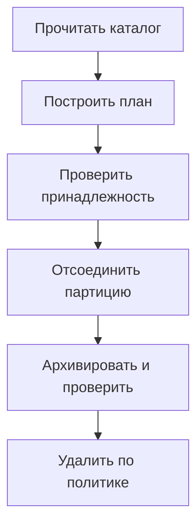

# Обслуживание партиций PostgreSQL: создание, архивирование и удаление {#postgresql-partition-maintenance}

Создать следующую партицию сравнительно просто. Эксплуатационная сложность появляется вокруг неё: кто отвечает за расписание, какие таблицы можно удалять, что делать при сбое архивации и как не запустить одно обслуживание двумя репликами.

Поэтому автоматизация должна начинаться с проверяемого плана операций. Особенно если ей выданы права на DDL и удаление данных.

<!-- more -->

## Сначала инспекция и план {#planning}

План строится по реальному каталогу PostgreSQL и политике таблицы. В нём должны быть видны создаваемые диапазоны, причины отсоединения и удаления, ожидаемые блокировки и операции, которые требуют отдельного разрешения.

Имя таблицы недостаточно для установления её принадлежности. Чужая партиция может случайно соответствовать шаблону имени. Границы, привязка к родителю и метаданные владения должны проверяться до разрушительной операции; неоднозначность — причина остановиться и разобраться.

Сохранённый план тоже может устареть. Между его просмотром и выполнением кто-то меняет конфигурацию или каталог. Исполнитель должен повторно проверить важные предусловия.

## Разделить исключение из горячих данных и удаление {#retention}

`DETACH PARTITION` убирает таблицу из дерева родителя, но сохраняет её данные. `DROP TABLE` удаляет саму таблицу. Это разные решения, между которыми можно оставить период восстановления.

Конкретные блокировки и возможность concurrent detach зависят от операции и устройства дерева. DEFAULT-партиция и внешние ключи могут изменить доступный путь. Сверяйте план с ограничениями [PostgreSQL](https://www.postgresql.org/docs/current/ddl-partitioning.html), а не рассчитывайте, что любое обслуживание можно выполнить одной транзакцией.

Архивация должна быть частью допуска к удалению. Наличие вызванного hook ещё не означает, что архив пригоден: нужен завершённый экспорт, понятное место хранения и проверка результата. Если обязательная архивация не удалась, удаление не выполняется.

<!-- diagram:concept -->
<figure class="bdr-diagram" markdown="1">
<figcaption>ИДЕЯ В СХЕМЕ<strong>Удаление проходит через проверяемый план</strong></figcaption>

Партиция отсоединяется и удаляется только после проверки принадлежности и успешной архивации, если она обязательна.

</figure>
<!-- /diagram:concept -->

## Один ответственный за расписание {#scheduling}

Обслуживание может вызывать CronJob, отдельный worker или существующий scheduler. Важно, чтобы расписание, права и мониторинг имели владельца. При нескольких репликах необходима защита от одновременной обработки одной таблицы.

Блокировка не заменяет идемпотентность операций и повторную инспекцию. После сбоя часть DDL могла уже завершиться. Следующий запуск должен продолжить из фактического состояния, а не повторять предположения прошлого плана.

Создавайте диапазоны заранее с запасом на пропущенные запуски. Следите за заполнением DEFAULT и возрастом необслуженных таблиц: успешный код завершения scheduler не доказывает, что нужные партиции существуют.

## Передать обслуживание от pg_partman {#migration}

Переход к другому инструменту обычно не требует пересоздавать уже существующие PostgreSQL-партиции. Меняется тот, кто читает дерево и выполняет обслуживание. Сначала сопоставьте политики, посмотрите план нового инструмента и убедитесь, что он правильно распознаёт существующие диапазоны.

На этапе переключения должен быть один активный владелец DDL. Не рассчитывайте на совместную работу двух scheduler, если они не координируют блокировки и политики. После переключения проверьте создание следующей партиции, retention и возможность возврата к прежней схеме обслуживания.

Отдельно проверьте используемые расширенные возможности pg_partman: новый инструмент может не предоставлять их аналоги. Пошаговый стенд перехода сохранён в лабораторных материалах.

## Сделать результат наблюдаемым {#verification}

Для каждого запуска нужны длительность, затронутые таблицы, выполненные и отклонённые операции, причина отказа и возраст последнего успеха. Журнал удаления должен позволять восстановить, на каком основании принято решение.

[pg-partsmith](https://bedrock-python.github.io/pg-partsmith/) предоставляет инспекцию, планирование и выполнение политик. Практическая ценность такого разделения — возможность увидеть намерение инструмента до изменения БД и проверить результат после него.

## Примеры и лабораторные работы {#labs}

Полные стенды и условия воспроизведения вынесены в отдельные материалы:

- [Практикум: политика хранения партиций — это не DROP TABLE](../lab/2026-09-07-partition-retention/README.md)
- [Практикум: подключение таблицы под управлением pg_partman](../lab/2026-09-07-migrating-from-pg-partman/README.md)
