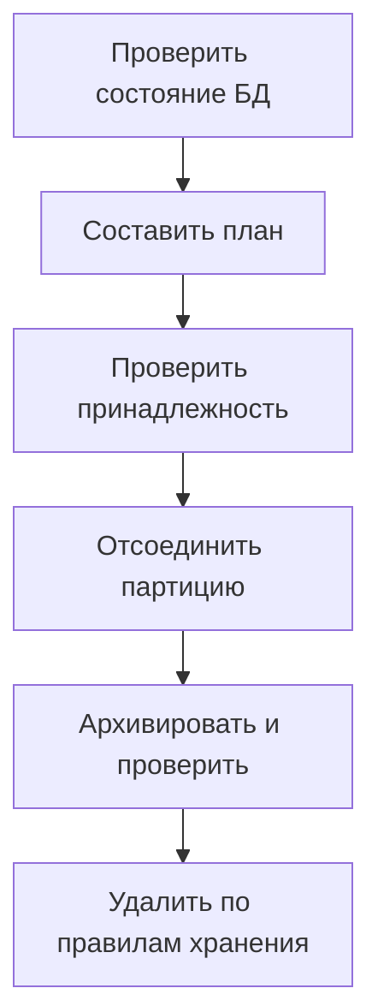

# Обслуживание партиций PostgreSQL: создание, архивирование и удаление {#postgresql-partition-maintenance}

Создать следующую партицию сравнительно просто. Сложнее организовать обслуживание: кто запускает его по расписанию, какие таблицы разрешено удалять, что делать при ошибке архивирования и как не допустить одновременный запуск на двух репликах.

Поэтому автоматизация должна сначала показывать план операций, который можно проверить. Особенно если у неё есть права менять структуру БД и удалять данные.

<!-- more -->

## Сначала проверяем состояние и составляем план {#planning}

План составляют по текущему состоянию PostgreSQL и правилам обслуживания таблицы. Он должен показывать, какие диапазоны будут созданы, какие партиции отсоединены или удалены и почему. Также важно знать ожидаемые блокировки и операции, для которых нужно отдельное разрешение.

По одному имени нельзя определить, имеет ли инструмент право обслуживать таблицу: чужая партиция тоже может соответствовать шаблону имени. До удаления нужно проверить её границы, связь с родительской таблицей и метаданные, подтверждающие, кто ею управляет. При неоднозначности следует остановиться и разобраться.

Сохранённый план может устареть: между проверкой и выполнением кто-то мог изменить настройки или структуру БД. Поэтому перед выполнением нужно повторно проверить условия, от которых зависит безопасность операций.

## Отсоединение партиции и её удаление — разные шаги {#retention}

`DETACH PARTITION` отсоединяет таблицу от родительской, сохраняя данные. `DROP TABLE` удаляет саму таблицу. Между этими действиями можно оставить время, в течение которого отсоединённую таблицу ещё можно вернуть.

Нужные блокировки и возможность выполнить concurrent detach зависят от структуры таблиц. Наличие DEFAULT-партиции и внешних ключей может повлиять на выбор операции. Сверяйтесь с ограничениями [PostgreSQL](https://www.postgresql.org/docs/current/ddl-partitioning.html): не все действия по обслуживанию можно объединить в одну транзакцию.

Если перед удалением требуется архивирование, одного вызова обработчика архивации недостаточно. Экспорт должен завершиться, архив — сохраниться в известном месте, а результат — пройти проверку. При неудаче обязательного архивирования удаление не выполняется.

<!-- diagram:concept -->
<figure class="bdr-diagram" markdown="1">
<figcaption>ИДЕЯ В СХЕМЕ<strong>Перед удалением — план и проверки</strong></figcaption>

Перед отсоединением проверяется, что партиция находится под управлением инструмента. Если требуется архив, удаление разрешено только после его успешного создания и проверки.

</figure>
<!-- /diagram:concept -->

## Кто запускает обслуживание {#scheduling}

Обслуживание может запускать CronJob, отдельный воркер или существующий планировщик. Важно определить, кто отвечает за расписание, права и мониторинг. При нескольких репликах нужна защита от одновременной обработки одной таблицы.

Блокировка не отменяет необходимости повторно проверять состояние БД и делать операции идемпотентными. После сбоя часть DDL уже могла выполниться. Следующий запуск должен учитывать фактическое состояние, а не безусловно повторять старый план.

Создавайте партиции заранее, с запасом на пропущенные запуски. Следите за строками в DEFAULT-партиции и временем с последнего успешного обслуживания каждой таблицы. Успешное завершение планировщика ещё не означает, что все нужные партиции созданы.

## Переходим с pg_partman на другой инструмент {#migration}

Для смены инструмента обычно не нужно пересоздавать существующие партиции PostgreSQL. Меняется программа, которая проверяет их состояние и обслуживает их. Сначала сопоставьте правила обслуживания, изучите план нового инструмента и убедитесь, что он правильно определяет существующие диапазоны.

В момент переключения изменять структуру партиций должен только один инструмент. Два планировщика могут работать совместно лишь при согласованных блокировках и правилах. После переключения проверьте создание следующей партиции, обработку старых данных и возможность вернуться к прежнему инструменту.

Отдельно проверьте, есть ли в новом инструменте аналоги расширенных возможностей pg_partman, которые вы используете. Пошаговый пример перехода находится в лабораторных материалах.

## Как отслеживать результат обслуживания {#verification}

Для каждого запуска записывайте длительность, затронутые таблицы, выполненные и отклонённые операции, причины отказов и время с последнего успешного обслуживания. По журналу удаления должно быть понятно, почему таблицу разрешили удалить.

[pg-partsmith](https://bedrock-python.github.io/pg-partsmith/) отдельно выполняет проверку состояния, составление плана и его применение. Такое разделение позволяет увидеть будущие изменения до обращения к БД с DDL и проверить результат после выполнения.

## Примеры и лабораторные работы {#labs}

Запускаемые примеры и инструкции к ним:

- [Практикум: политика хранения партиций — это не DROP TABLE](../lab/2026-09-07-partition-retention/README.md)
- [Практикум: переход с pg_partman на pg-partsmith](../lab/2026-09-07-migrating-from-pg-partman/README.md)
