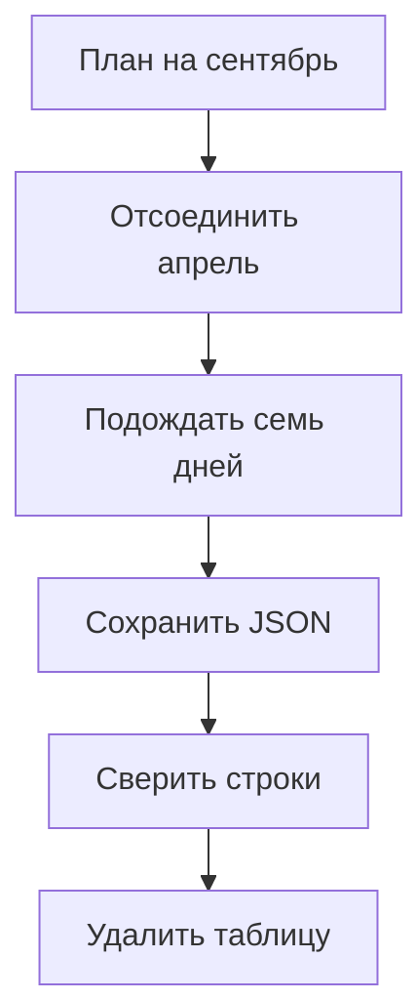

# Обслуживание партиций PostgreSQL: от плана до проверенного архива {#postgresql-partition-maintenance}

<div class="bdr-post__hero" data-bdr-post="2026-09-13-postgresql-partition-maintenance" role="img" aria-label="Создать будущие диапазоны, отсоединить старые партиции, проверить архив перед удалением" markdown="0"></div>

Представим сервис аналитики с месячными партициями `events`. Отчёты используют текущий месяц и два предыдущих. Для новых событий нужны ещё два месяца вперёд, а старую таблицу можно удалить только через неделю после отсоединения и после проверки архива. На некоторые события ссылается таблица квитанций `receipts`.

Разберём один запуск обслуживания: на дворе 15 сентября 2026 года, в базе есть история с апреля по сентябрь, а октябрь ещё не создан. Посмотрим, что попадёт в план, как внешний ключ остановит отсоединение и что останется в БД, если архивирование завершится ошибкой. Примеры проверены на PostgreSQL 17 и pg-partsmith 1.5.1; версии Python-зависимостей закреплены в практикуме.

<!-- more -->

<div id="managing-postgresql-partitions-one-failure-at-a-time" data-search-exclude></div>
<div id="not-knowing-what-maintenance-will-do" data-search-exclude></div>
<div id="dropping-something-you-did-not-make" data-search-exclude></div>
<div id="two-replicas-tick-at-once" data-search-exclude></div>
<div id="the-team-with-no-python-in-it" data-search-exclude></div>
<div id="the-archiver-has-to-run-before-the-drop" data-search-exclude></div>
<div id="wiring-it-with-an-assistant-in-the-loop" data-search-exclude></div>

## Задаём правила на конкретных месяцах {#planning}

В `events` три столбца: `id bigint`, `created_at timestamptz` и `payload text`. Первичный ключ состоит из `(id, created_at)`. Партиционирование выполняется по `created_at`. Квитанция хранит составную ссылку `(event_id, event_at)` на событие за май.

Сначала выразим требования в настройке. Классы правил импортируем из `pg_partsmith`, а `timedelta` из `datetime`:

```python
def events_config(*, protect_references=True):
    retention = KeepNewest(count=3)
    if protect_references:
        retention = ExpireIf(
            when=AllOf(members=(retention, Unreferenced())),
        )
    return TablePartitionConfig(
        schema="public",
        table_name="events",
        partition_column="created_at",
        granularity=PartitionGranularity.MONTH,
        lifecycle=LifecyclePolicy(
            creation=CreateAhead(count=3),
            retention=retention,
            drop=DropAfter(grace=timedelta(days=7)),
        ),
    )
```

У двух счётчиков разный смысл:

| Настройка в сентябре | Что она означает |
|---|---|
| `CreateAhead(count=3)` | Обеспечить сентябрь, октябрь и ноябрь: текущий месяц включён в число три |
| `KeepNewest(count=3)` | Сохранить июль, август и сентябрь; будущие диапазоны не сокращают эту историю |
| `Unreferenced()` вместе с правилом хранения | Не отсоединять старую партицию, пока на её строки ссылаются другие таблицы |
| `DropAfter(grace=timedelta(days=7))` | Удалять не раньше чем через семь дней после отсоединения |

Это правила для целых диапазонов, а не построчный срок хранения в 90 дней. Из-за квитанции сервис должен хранить май дольше обычного.

Создадим `toolkit = PartitionToolkit.from_engine(engine)`: `PartitionToolkit` берём из `pg_partsmith.aio`. В `engine` передаём SQLAlchemy `AsyncEngine`, подключённый к БД сервиса. Теперь можно получить план без DDL, вывести его и отдельно применить:

```python
async def preview(toolkit, config, *, now=None):
    plan = await toolkit.service.plan(config, now=now)
    print(plan.describe())
    return plan


async def apply_reviewed(toolkit, config, plan):
    result = await toolkit.service.apply(config, plan)
    if result.error or result.issues:
        raise RuntimeError(f"Maintenance needs attention: {result}")
    return result
```

В практикуме вызываем `preview(toolkit, events_config(), now=datetime(2026, 9, 15, tzinfo=UTC))`. Полученный план создаёт октябрь и ноябрь, отсоединяет апрель и июнь, сохраняет май со ссылкой. Удалений пока нет. Снимок каталога до и после `preview` совпадает: печать плана ничего не меняет.

План можно сохранить через `model_dump_json()` и прочитать через `MaintenancePlan.model_validate_json()`. Но если после этого изменить политику, `apply` откажет с `PlanConfigMismatchError`. Практикум проверяет этот отказ и отсутствие DDL. Для регулярного запуска ниже используем новый план по фактическому состоянию БД.

## Какие таблицы библиотека считает своими {#ownership}

Чтобы проверить границы автоматизации, добавим в тот же практикум три необычных случая:

| Таблица | Результат |
|---|---|
| `events_may_manual`, созданная вручную с границами мая | Подходит под обслуживание; пока её удерживает квитанция |
| `events__2026_03` с диапазоном от 1 февраля до 1 апреля | Остаётся на месте; в `findings` появляется `unmanaged_partition` |
| Отдельная `events__2025_01`, не присоединённая и без метки библиотеки | Не попадает в план удаления |

В версии 1.5.1 для присоединённой RANGE-партиции важны реальные границы: диапазон должен помещаться в один настроенный период. Это может быть и целый месяц, и более короткий диапазон внутри месяца. Кто создал таблицу и как она названа, не определяет принадлежность. Поэтому обычные месячные партиции другого инструмента тоже могут попасть под отсоединение.

После отсоединения библиотека записывает в комментарий таблицы метку родителя и время отсоединения. По ней последующие запуски находят таблицы для удаления. Не переносите это правило на присоединённые партиции: отсутствие такой метки не защищает их от обслуживания.

<div id="where-to-read-more" data-search-exclude></div>
<div id="partition-retention-is-not-drop-table" data-search-exclude></div>
<div id="the-job-everybody-writes" data-search-exclude></div>
<div id="print-the-plan-first" data-search-exclude></div>
<div id="detach-and-drop-are-two-steps" data-search-exclude></div>
<div id="the-archive-runs-before-the-drop-and-may-refuse-it" data-search-exclude></div>
<div id="what-a-foreign-key-does-to-retention" data-search-exclude></div>

## Отсоединяем старое, сохраняя возможность проверить данные {#retention}

После `apply_reviewed` счётчики равны `created=2`, `detached=2`, `dropped=0`. Вставка за октябрь теперь проходит; до запуска PostgreSQL отклонял её с SQLSTATE `23514`. Апрель и июнь больше не видны через `events`, но их таблицы и четыре исходные строки ещё существуют. Запоздавшее событие за апрель теперь получает `23514`: DEFAULT-партиции в этом примере нет.

Проверим защиту ссылок отдельно: составим новый план без `Unreferenced()`. Теперь в нём появится май, но PostgreSQL откажет в отсоединении из-за квитанции. Результат содержит `success=True` и непустой `issues`; май и квитанция сохраняются. **`success` означает отсутствие общей ошибки запуска, а не отсутствие проблем с отдельными операциями.** После удаления квитанции май можно отсоединить обычной политикой.

Операции обслуживания не объединены в одну общую транзакцию. Отказ на позднем шаге не откатывает уже созданные или отсоединённые партиции. Повторный запуск должен читать текущее состояние. В этом примере используется стандартный режим detach `AUTO`; особенности блокировок и ограничения `DETACH ... CONCURRENTLY` описаны в [документации PostgreSQL 17](https://www.postgresql.org/docs/17/ddl-partitioning.html#DDL-PARTITIONING-DECLARATIVE-MAINTENANCE).

<!-- diagram:concept -->
<figure class="bdr-diagram" markdown="1">
<figcaption><span class="bdr-diagram__eyebrow">ИДЕЯ В СХЕМЕ</span><strong>Путь апрельской партиции до удаления</strong></figcaption>
<div class="bdr-diagram__viewport" markdown="1" data-search-exclude>


```mermaid
---
config:
  theme: default
  look: classic
  flowchart:
    useMaxWidth: false
    wrappingWidth: 150
    padding: 12
    nodeSpacing: 24
    rankSpacing: 32
---
flowchart TD
    accTitle: Путь апрельской партиции до удаления
    accDescr: В сентябре апрель отсоединяется. Через семь дней обработчик сохраняет и проверяет архив; только затем таблицу можно удалить.
    A["План на сентябрь"]
    B["Отсоединить апрель"]
    C["Подождать семь дней"]
    D["Сохранить JSON"]
    E["Сверить строки"]
    F["Удалить таблицу"]
    A --> B --> C --> D --> E --> F
```

</div>
<p class="bdr-diagram__caption">В сентябре апрель отсоединяется. Через семь дней обработчик сохраняет и проверяет архив; только затем таблицу можно удалить.</p>
</figure>
<!-- /diagram:concept -->

## Архивируем строки, а затем разрешаем удаление {#archive}

Обработчик `before_drop` выполняется перед удалением каждой таблицы. Если он выбрасывает исключение, до её `DROP` дело не доходит. Сохраним небольшой набор данных в JSON и прочитаем файл обратно, сравнив все поля с исходными строками:

```python
class JsonArchive(BasePartitionLifecycleHooks):
    def __init__(self, connection, directory: Path):
        self.connection = connection
        self.directory = directory

    async def before_drop(self, event: PartitionEvent):
        schema, name = event.partition.name.split(".", 1)
        quoted = ".".join('"' + part.replace('"', '""') + '"' for part in (schema, name))
        rows = await self.connection.fetch(
            f"SELECT id, created_at, payload FROM {quoted} ORDER BY id, created_at",
        )
        data = [[row["id"], row["created_at"].isoformat(), row["payload"]] for row in rows]
        document = {"table": event.partition.name, "rows": data}
        # The OID distinguishes a replacement table with the same name.
        path = self.directory / f"{event.operation.oid}.json"
        if not path.exists():
            temporary = path.with_suffix(".tmp")
            with temporary.open("w", encoding="utf-8") as stream:
                json.dump(document, stream, ensure_ascii=False)
                stream.flush()
                os.fsync(stream.fileno())
            temporary.replace(path)
        if json.loads(path.read_text(encoding="utf-8")) != document:
            raise RuntimeError(f"Archive verification failed: {path.name}")
```

Здесь `BasePartitionLifecycleHooks` импортируется из `pg_partsmith.aio`, а `PartitionEvent` из `pg_partsmith`; также нужны `json`, `os` и `Path` из `pathlib`. В обработчик передаём `asyncpg.Connection` и существующий каталог. Подключаем его через `PartitionToolkit.from_engine(engine, hooks=[JsonArchive(connection, directory)])`.

Файл назван по OID из операции плана. Повторный вызов проверяет уже записанный архив; несовпадение останавливает удаление. Это исполняемый пример для маленькой таблицы: он читает её целиком в память и пишет на локальный диск. Для большого архива понадобится потоковый экспорт в постоянное хранилище и отдельная проверка восстановления.

В нашем сценарии приложение пишет только через родителя и не меняет отсоединённые таблицы. Если остаются прямые записи в такую таблицу, один `before_drop` не обеспечивает неизменность данных между экспортом и удалением. Сначала нужно остановить эти записи.

Практикум проверяет весь путь:

| Ситуация | Что проверяем в БД и архиве |
|---|---|
| До истечения семи дней | В плане нет `DROP` |
| Срок прошёл, хранилище недоступно | Обработчик выбрасывает ошибку; обе таблицы остаются |
| Архив существует, но его содержимое неверно | Сверка останавливает удаление |
| Повтор после устранения ошибки | Две таблицы удалены; все четыре строки восстановлены из JSON во временную таблицу и совпадают с исходными |

Чтобы не ждать неделю, практикум передаёт в `plan(now=...)` момент до и после сохранённого времени отсоединения плюс семь дней. Правило `DropAfter` при этом не меняется. Из будущего плана применяется только часть `DROP`. В рабочем задании время не подменяем.

## Запускаем по расписанию и замечаем частичные отказы {#scheduling}

Пусть обслуживание вызывает ежедневный CronJob. Ему нужен один законченный запуск с результатом для журнала и ненулевым завершением при ошибке:

```python
async def maintenance_tick(toolkit, config):
    result = await toolkit.maintainer.run_maintenance_safe(config)
    print({
        "created": result.created_count,
        "detached": result.detached_count,
        "dropped": result.dropped_count,
        "duration_ms": result.duration_ms,
        "error": result.error,
        "issues": [issue.model_dump() for issue in result.issues],
    })
    if result.error or result.issues:
        raise RuntimeError("Partition maintenance did not finish cleanly")
    return result
```

`run_maintenance_safe` составляет и выполняет план под блокировкой таблицы, возвращая общую ошибку в `error`. Наш код дополнительно проверяет `issues`: одного `success` недостаточно, как показал случай с квитанцией.

Практикум создаёт два toolkit с разными engine. Первый удерживает advisory lock для `public.events`; второй получает ошибку захвата и не меняет каталог. После освобождения тот же ключ снова доступен. Реплики должны использовать одну БД и одинаковые настройки ключа блокировки. Эта блокировка не координирует произвольный внешний скрипт или другой инструмент автоматически.

В журнале остаются счётчики, длительность и причины отказов. Для самого сервиса отдельно проверяйте наличие ближайших диапазонов и время последнего запуска без ошибок и `issues`. Если используете DEFAULT, следите и за его наполнением: отсутствие отказов вставки может скрывать пропущенное обслуживание.

<div id="the-checklist-for-a-retention-job" data-search-exclude></div>
<div id="the-pieces" data-search-exclude></div>
<div id="migrating-from-pg_partman-to-application-managed-partitions" data-search-exclude></div>
<div id="what-pg_partman-built" data-search-exclude></div>
<div id="the-configuration-is-the-migration" data-search-exclude></div>
<div id="adoption-is-not-a-step" data-search-exclude></div>
<div id="running-both-at-once" data-search-exclude></div>
<div id="switching-pg_partman-off" data-search-exclude></div>
<div id="what-you-give-up-and-what-you-get" data-search-exclude></div>

## Передаём обслуживание от pg_partman {#migration}

Представим, что эти месячные таблицы уже созданы `pg_partman`. Во втором практикуме работает настоящая версия **5.5.0**: исходную схему создаёт `partman.create_partition`, затем мы читаем `partman.part_config` и границы существующих таблиц.

Новый горизонт задаём явно: `CreateAhead(count=3)` обеспечивает текущий месяц и два будущих. Вместо механического пересчёта `premake` сравниваем реальные границы: при этой настройке pg_partman будущих таблиц может уже оказаться больше. Аналогично, `retention='3 months'` и `KeepNewest(count=3)` дают разные границы хранения. Практикум показывает дополнительную старую партицию, которую новое правило предлагает отсоединить. Выбираем его явно как изменение требований, сохраняя таблицу с `DropNever()`:

```python
def adopted_config(settings):
    return TablePartitionConfig(
        schema="public",
        table_name="events",
        partition_column=settings["control"],
        granularity=PartitionGranularity.MONTH,
        lifecycle=LifecyclePolicy(
            creation=CreateAhead(count=3),  # Current month and two future months.
            # An explicit NEW retention rule, not a conversion of an interval.
            retention=KeepNewest(count=3),
            drop=DropNever(),
        ),
    )


async def unregister_partman(connection):
    # First stop and drain jobs that explicitly pass this parent table.
    await connection.execute(
        "DELETE FROM partman.part_config WHERE parent_table = 'public.events'",
    )
```

В `settings` передаём сохранённую строку `part_config`. Пример рассчитан на `created_at`, месячный интервал и `retention_keep_table=true`. Это не универсальный конвертер: часовой пояс, DEFAULT, шаблоны таблиц, публикации и другие настройки нужно сопоставлять отдельно.

Переключение выполняем в таком порядке:

1. Сохраняем настройки, список таблиц с OID и границами, контрольные строки; смотрим план нового инструмента.
2. Выключаем автоматическое обслуживание этой таблицы и останавливаем задания, которые явно вызывают `run_maintenance('public.events')`. Ждём завершения уже начатых запусков.
3. Удаляем регистрацию через `unregister_partman`, затем применяем проверенный план `pg-partsmith`.
4. Сверяем OID и данные, увеличиваем горизонт на один месяц и проверяем, что следующий план пуст.

Одного `automatic_maintenance='off'` недостаточно: вызов с явно указанным родителем всё ещё работает. Это указано в [документации pg_partman 5.5.0](https://github.com/pgpartman/pg_partman/blob/v5.5.0/doc/pg_partman.md#maintenance-objects) и проверяется в практикуме **до** передачи обслуживания. Два инструмента одновременно партиции здесь не меняют.

При переходе существующие месячные таблицы распознаются по границам, без переименования и пересоздания. Практикум сверяет их OID и все исходные строки. Таблицы, ранее отсоединённые самим pg_partman, не имеют меток pg-partsmith и не становятся автоматически его архивами для удаления.

## Повторяем проверки {#verification}

Для первого примера нужны Docker и `uv`. Из каталога `2026-09-07-partition-retention`:

```bash
uv run --no-project --python 3.13 --with-requirements requirements.txt python retention_lab.py
```

Для перехода сначала собираем образ с pg_partman 5.5.0. Команды выполняются из `2026-09-07-migrating-from-pg-partman`:

```bash
docker build -t pg-partman-lab:17 .
uv run --no-project --python 3.13 --with-requirements requirements.txt python partman_lab.py
```

Каждый скрипт работает во временном контейнере. Первый использует фиксированную дату для месячных правил; второй берёт текущий месяц из PostgreSQL, поскольку по этим же часам работает pg_partman. JSON-архив первого практикума временный и удаляется после проверок вместе с его каталогом.

## Что использовать в своём сервисе {#conclusion}

Мы создали будущие диапазоны, сохранили партицию со ссылкой, проверили отказ архива и повторный запуск, восстановили удалённые строки из файла и передали обслуживание от другого инструмента.

Используйте [pg-partsmith](https://bedrock-python.github.io/pg-partsmith/) для построения плана и выполнения правил создания, отсоединения и удаления. Подключите свой архив через `before_drop`, проверяйте `error` вместе с `issues` и запускайте обслуживание с запасом до следующего периода. Правила хранения задавайте на конкретных датах: тогда сразу видно, какие данные останутся доступны сервису.

## Примеры и лабораторные работы {#labs}

- [Практикум: хранение партиций и проверка архива](../lab/2026-09-07-partition-retention/README.md)
- [Практикум: переход с pg_partman на pg-partsmith](../lab/2026-09-07-migrating-from-pg-partman/README.md)
