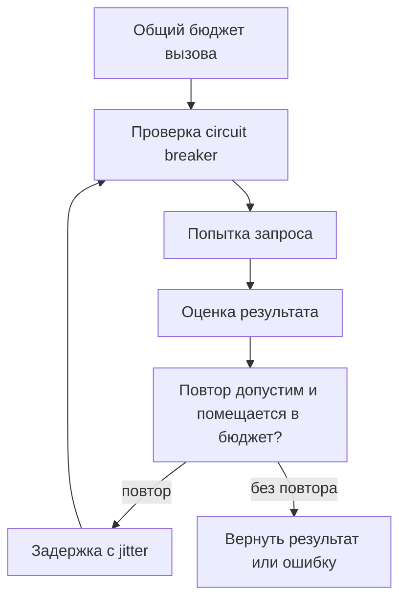

# Как строить HTTP- и gRPC-клиенты для продакшена {#production-http-grpc-clients}

<div class="bdr-post__hero" data-bdr-post="2026-09-13-production-http-grpc-clients" role="img" aria-label="Сохранить родной клиент, подключив политику рядом" markdown="0"></div>

Клиент внешнего сервиса должен ограничивать стоимость неудачного вызова: время ожидания, число попыток и нагрузку на зависимость. Эти решения связаны. Повторы без общего дедлайна увеличивают задержку, а circuit breaker с общей статистикой для разных сервисов распространяет один отказ на остальные.

Рассмотрим сервис заказов, который обращается к складу и оплате. Для него важна согласованная политика вызова — от получения соединения до обработки неопределённого результата.

<!-- more -->

<div id="why-i-stopped-wrapping-http-clients" data-search-exclude></div>
<div id="the-life-of-a-wrapper" data-search-exclude></div>
<div id="what-the-wrapper-actually-owns" data-search-exclude></div>
<div id="measured-the-price" data-search-exclude></div>
<div id="capability-honesty" data-search-exclude></div>
<div id="the-shape" data-search-exclude></div>

## Клиент принадлежит приложению {#ownership}

HTTP-клиент и gRPC-канал обычно живут дольше отдельного запроса: они владеют соединениями и переиспользуют их. Создавать их внутри каждого обработчика означает снова оплачивать установку соединения и терять накопленное состояние. Закрывать их следует после завершения работы, которая ими пользуется.

Общая инфраструктура может задавать таймауты, метрики и правила повторов, сохраняя интерфейс исходной библиотеки. Универсальная обёртка, которая копирует методы HTTPX, быстро начинает скрывать streaming, настройки транспорта и типы ответа. Выделять стоит общую политику; бизнес-операция вроде списания денег принадлежит клиенту конкретного сервиса.

<div id="reliability-is-not-retry3" data-search-exclude></div>
<div id="why-retries-look-free" data-search-exclude></div>
<div id="what-they-cost-when-it-matters" data-search-exclude></div>
<div id="a-deadline-is-the-first-real-mechanism" data-search-exclude></div>
<div id="a-retry-budget-removes-the-amplification" data-search-exclude></div>
<div id="a-circuit-breaker-protects-the-next-wave-not-this-one" data-search-exclude></div>
<div id="what-none-of-them-do" data-search-exclude></div>
<div id="the-list" data-search-exclude></div>
<div id="the-pieces" data-search-exclude></div>

## Ограничивать весь вызов {#budgets}

У HTTPX есть отдельные таймауты подключения, чтения, записи и ожидания пула. Таймаут чтения ограничивает ожидание очередной порции данных. Общую длительность операции нужно ограничивать отдельно. Это различие описано в [документации HTTPX](https://www.python-httpx.org/advanced/timeouts/).

В Python 3.11+ минимальный пример выглядит так:

```python
import asyncio
import httpx

async def fetch_stock(client: httpx.AsyncClient, url: str) -> dict:
    async with asyncio.timeout(2.0):
        response = await client.get(url)
        response.raise_for_status()
        return response.json()

async def main(url: str) -> dict:
    async with httpx.AsyncClient(
        timeout=httpx.Timeout(1.0, connect=0.3, pool=0.2),
        limits=httpx.Limits(max_connections=50),
    ) as client:
        return await fetch_stock(client, url)
```

Числа здесь иллюстрируют два уровня ограничений, а не рекомендуемые значения для любого сервиса. В работающем приложении клиент создаётся один раз, а `fetch_stock` вызывается многократно. Если добавить повторы, они вместе с задержками должны оставаться внутри внешнего бюджета. Входящий дедлайн может сделать этот бюджет ещё меньше; его передача разобрана [отдельно](2026-09-06-timeouts-are-not-deadlines.md).

<div id="retries-can-make-an-outage-worse-designing-a-retry-budget" data-search-exclude></div>
<div id="the-arithmetic" data-search-exclude></div>
<div id="measured-one-hop" data-search-exclude></div>
<div id="when-the-budget-is-invisible-and-when-it-hurts" data-search-exclude></div>
<div id="measured-three-services-deep" data-search-exclude></div>
<div id="where-retries-belong" data-search-exclude></div>
<div id="the-policy" data-search-exclude></div>
<div id="retry-after-backoff-and-jitter-what-a-production-http-client-actually-does" data-search-exclude></div>
<div id="honour-retry-after" data-search-exclude></div>
<div id="jitter-or-the-herd" data-search-exclude></div>
<div id="a-read-timeout-is-not-a-connection-error" data-search-exclude></div>
<div id="what-is-retried-at-all" data-search-exclude></div>
<div id="the-checklist" data-search-exclude></div>

## Сначала безопасность повтора {#retries}

После таймаута оплаты неизвестно, успел ли сервер провести платёж. Новый запрос без защиты от дублей может выполнить действие повторно. Поэтому разрешение на повтор начинается с контракта операции: идемпотентность, стабильный ключ или достоверное знание, что обработка не началась.

Код ответа помогает классифицировать отказ, но не доказывает отсутствие побочного эффекта. Это относится и к `UNAVAILABLE` в gRPC: такой статус способен вернуть уже запущенный обработчик. Ошибки валидации обычно требуют исправить запрос; временная недоступность может оправдывать повтор безопасной операции. Клиент также должен уметь воспроизвести тело запроса: прочитанный итератор нельзя просто отправить заново. Поток с уже полученными сообщениями требует отдельного протокола возобновления.

Задержка между попытками должна учитывать `Retry-After`, если сервер его прислал, и оставшееся время. Backoff увеличивает интервалы, jitter распределяет попытки разных клиентов. Они не ограничивают общее число повторов во всём сервисе: для этого нужен бюджет дополнительного трафика и согласование retry-слоёв.

<div id="circuit-breakers-should-be-per-origin-not-per-client" data-search-exclude></div>
<div id="measured-one-counter-three-upstreams" data-search-exclude></div>
<div id="what-counts-as-a-failure" data-search-exclude></div>
<div id="one-signal-per-logical-call" data-search-exclude></div>
<div id="the-probe" data-search-exclude></div>
<div id="the-configuration" data-search-exclude></div>

## Изолировать отказ зависимости {#circuit-breakers}

Circuit breaker временно отклоняет вызовы после накопления признаков отказа. Его область действия должна соответствовать независимой зависимости. Для HTTP отправная точка — origin: схема, хост и порт. Если одна точка этого origin имеет отдельный профиль отказов, может потребоваться более узкий ключ.

У сервиса заказов сбой оплаты не должен блокировать чтение склада. После паузы ограниченное число пробных вызовов проверяет восстановление. Отмена запроса клиентом требует отдельного учёта: она не обязательно свидетельствует о неисправности зависимости.

Нужно также определить, что считается наблюдением: каждая попытка или окончательный результат вызова. Это зависит от положения breaker относительно retry-слоя. Порог из одной реализации нельзя переносить в другую без проверки. В старых HTTP- и gRPC-стендах этого блога использованы разные варианты; это различие реализации, а не два универсальных правила.

<!-- diagram:concept -->
<figure class="bdr-diagram" markdown="1">
<figcaption><span class="bdr-diagram__eyebrow">ИДЕЯ В СХЕМЕ</span><strong>Ограничения одного исходящего вызова</strong></figcaption>
<div class="bdr-diagram__viewport" markdown="1" data-search-exclude>



</div>
<p class="bdr-diagram__caption">Общий бюджет ограничивает вызов целиком. Повтор требует одновременно безопасной операции, времени и разрешения политики защиты.</p>
</figure>
<!-- /diagram:concept -->

<div id="safe-grpc-retries-which-status-codes-you-should-actually-retry" data-search-exclude></div>
<div id="what-a-status-code-tells-you-about-the-work" data-search-exclude></div>
<div id="measured-five-ways-to-fail-a-charge" data-search-exclude></div>
<div id="the-deadline-is-for-the-call-not-the-attempt" data-search-exclude></div>
<div id="the-breaker-counts-attempts" data-search-exclude></div>
<div id="streams-are-not-calls" data-search-exclude></div>
<div id="the-policy-written-down" data-search-exclude></div>
<div id="grpc-channels-should-not-be-pooled-by-address-alone" data-search-exclude></div>
<div id="what-a-channel-is" data-search-exclude></div>
<div id="measured-the-audit-client-that-retried" data-search-exclude></div>
<div id="the-opposite-mistake-a-channel-per-call" data-search-exclude></div>
<div id="options-are-identity-too" data-search-exclude></div>
<div id="health-per-address" data-search-exclude></div>
<div id="the-pool" data-search-exclude></div>

## Особенности gRPC {#grpc}

В gRPC политика повторов может задаваться для отдельных методов через [service config](https://grpc.io/docs/guides/retry/). Проверьте, не включены ли одновременно повторы транспорта, интерцептора и бизнес-клиента: вложенные попытки умножают нагрузку.

Канал выбирается не только по адресу. Настройки безопасности, credentials, options и цепочка интерцепторов должны быть совместимы у его пользователей. При этом создание новой цепочки на каждый запрос способно уничтожить переиспользование каналов. Обвязка [потоковых RPC](2026-09-07-why-grpc-interceptors-break-on-streaming-rpcs.md) заслуживает отдельной проверки.

## Что проверять перед запуском {#verification}

| Сценарий | Ожидаемое свойство |
|---|---|
| Зависимость отвечает медленно | Вызов завершается в пределах бюджета |
| Ответ на запись потерян | Повтор не дублирует бизнес-действие |
| Одна зависимость отказала | Другие продолжают работать |
| Много одновременных ошибок | Повторы ограничены и распределены во времени |
| Началось восстановление | Пробные вызовы не создают новую волну нагрузки |

В метриках нужны и логические вызовы, и попытки: итоговая успешность может скрывать дорогие повторы. Полезно отдельно видеть ожидание соединения, исчерпание дедлайна, отказы breaker и отношение попыток к вызовам.

В Bedrock эти решения собраны в [clientwright](https://bedrock-python.github.io/clientwright/) и [grpc-client-kit](https://bedrock-python.github.io/grpc-client-kit/). При подключении важнее проверить согласованность политики, чем выставить одинаковое число попыток всем методам.

## Примеры и лабораторные работы {#labs}

Полные стенды и условия воспроизведения вынесены в отдельные материалы:

- [Практикум: отдельный circuit breaker для каждого origin](../lab/2026-09-07-circuit-breakers-per-origin/README.md)
- [Практикум: надёжность — это не retry=3](../lab/2026-09-07-reliability-is-not-retry-3/README.md)
- [Практикум: повторные попытки могут усугубить сбой](../lab/2026-09-07-retry-budget/README.md)
- [Практикум: Retry-After, backoff и jitter](../lab/2026-09-07-retry-after-backoff-jitter/README.md)
- [Практикум: безопасные повторы gRPC](../lab/2026-09-07-safe-grpc-retries/README.md)
- [Практикум: одного адреса недостаточно для пула каналов gRPC](../lab/2026-09-07-grpc-channel-identity/README.md)
- [Практикум: почему я перестал оборачивать HTTP-клиенты](../lab/2026-09-07-why-i-stopped-wrapping-http-clients/README.md)
