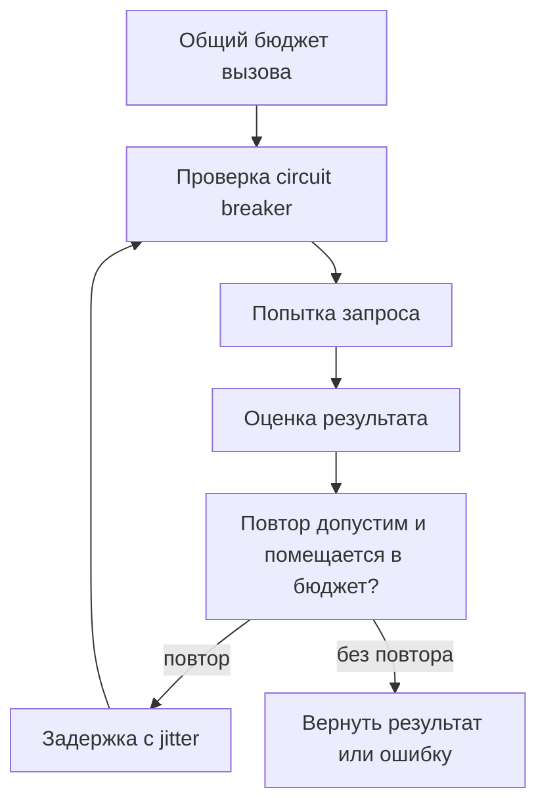

# Как строить HTTP- и gRPC-клиенты для продакшена {#production-http-grpc-clients}

<div class="bdr-post__hero" data-bdr-post="2026-09-13-production-http-grpc-clients" role="img" aria-label="Сохранить родной клиент, подключив политику рядом" markdown="0"></div>

Клиент внешнего сервиса должен ограничивать время ожидания, число повторов и нагрузку на этот сервис при сбое. Эти настройки связаны: повторы без общего дедлайна увеличивают задержку, а circuit breaker с общей статистикой для разных сервисов может из-за сбоя одного заблокировать вызовы остальных.

Рассмотрим сервис заказов, который обращается к сервисам склада и оплаты. Ему нужны согласованные правила для всего вызова: от получения соединения до ситуации, когда ответ потерян и результат операции неизвестен.

<!-- more -->

<div id="why-i-stopped-wrapping-http-clients" data-search-exclude></div>
<div id="the-life-of-a-wrapper" data-search-exclude></div>
<div id="what-the-wrapper-actually-owns" data-search-exclude></div>
<div id="measured-the-price" data-search-exclude></div>
<div id="capability-honesty" data-search-exclude></div>
<div id="the-shape" data-search-exclude></div>

## Клиенты и каналы живут на уровне приложения {#ownership}

HTTP-клиент и gRPC-канал обычно живут дольше отдельного запроса: они хранят и переиспользуют соединения. Если создавать их в каждом обработчике, придётся заново устанавливать соединения и терять накопленное состояние. Закрывать их следует после завершения всех операций, которые ими пользуются.

Общая инфраструктура может задавать таймауты, метрики и правила повторов, сохраняя интерфейс исходной библиотеки. Обёртка, копирующая методы HTTPX, рискует потерять поддержку потоковых ответов, настройки транспорта или исходные типы ответа. В общую библиотеку стоит вынести правила вызовов, а бизнес-операции вроде списания денег оставить клиенту конкретного сервиса.

<div id="reliability-is-not-retry3" data-search-exclude></div>
<div id="why-retries-look-free" data-search-exclude></div>
<div id="what-they-cost-when-it-matters" data-search-exclude></div>
<div id="a-deadline-is-the-first-real-mechanism" data-search-exclude></div>
<div id="a-retry-budget-removes-the-amplification" data-search-exclude></div>
<div id="a-circuit-breaker-protects-the-next-wave-not-this-one" data-search-exclude></div>
<div id="what-none-of-them-do" data-search-exclude></div>
<div id="the-list" data-search-exclude></div>
<div id="the-pieces" data-search-exclude></div>

## Ограничиваем время всего вызова {#budgets}

У HTTPX есть отдельные таймауты подключения, чтения, записи и ожидания соединения из пула. Таймаут чтения ограничивает ожидание очередной порции данных. Общую длительность операции нужно ограничивать отдельно. Это различие описано в [документации HTTPX](https://www.python-httpx.org/advanced/timeouts/).

В Python 3.11+ минимальный пример выглядит так:

```python
import asyncio
import httpx

async def fetch_stock(client: httpx.AsyncClient, url: str) -> dict:
    async with asyncio.timeout(2.0):
        response = await client.get(url)
        response.raise_for_status()
        return response.json()

async def main(url: str) -> dict:
    async with httpx.AsyncClient(
        timeout=httpx.Timeout(1.0, connect=0.3, pool=0.2),
        limits=httpx.Limits(max_connections=50),
    ) as client:
        return await fetch_stock(client, url)
```

Числа здесь иллюстрируют два уровня ограничений, а не рекомендуемые значения для любого сервиса. В работающем приложении клиент создаётся один раз, а `fetch_stock` вызывается многократно. Если добавить повторы, они вместе с задержками должны оставаться внутри внешнего бюджета. Входящий дедлайн может сделать этот бюджет ещё меньше; его передача разобрана [отдельно](2026-09-06-timeouts-are-not-deadlines.md).

<div id="retries-can-make-an-outage-worse-designing-a-retry-budget" data-search-exclude></div>
<div id="the-arithmetic" data-search-exclude></div>
<div id="measured-one-hop" data-search-exclude></div>
<div id="when-the-budget-is-invisible-and-when-it-hurts" data-search-exclude></div>
<div id="measured-three-services-deep" data-search-exclude></div>
<div id="where-retries-belong" data-search-exclude></div>
<div id="the-policy" data-search-exclude></div>
<div id="retry-after-backoff-and-jitter-what-a-production-http-client-actually-does" data-search-exclude></div>
<div id="honour-retry-after" data-search-exclude></div>
<div id="jitter-or-the-herd" data-search-exclude></div>
<div id="a-read-timeout-is-not-a-connection-error" data-search-exclude></div>
<div id="what-is-retried-at-all" data-search-exclude></div>
<div id="the-checklist" data-search-exclude></div>

## Сначала убеждаемся, что повтор безопасен {#retries}

После таймаута неизвестно, успел ли сервер провести платёж. Новый запрос без защиты от дублей может списать деньги повторно. Поэтому сначала нужно понять, допускает ли операция повтор: идемпотентна ли она, защищена ли стабильным ключом или достоверно известно, что обработка ещё не началась.

Код ответа помогает классифицировать отказ, но не доказывает отсутствие побочного эффекта. Это относится и к `UNAVAILABLE` в gRPC: такой статус способен вернуть уже запущенный обработчик. Ошибки валидации обычно требуют исправить запрос; временная недоступность может оправдывать повтор безопасной операции. Клиент также должен уметь воспроизвести тело запроса: прочитанный итератор нельзя просто отправить заново. Поток с уже полученными сообщениями требует отдельного протокола возобновления.

Пауза между попытками должна учитывать оставшееся время и заголовок `Retry-After`, если сервер его прислал. Backoff увеличивает интервалы, а jitter добавляет случайный разброс, чтобы разные клиенты не повторяли запросы одновременно. Но они не ограничивают общее число повторов в сервисе: для этого нужен отдельный лимит дополнительного трафика. Также важно согласовать повторы на разных уровнях кода.

<div id="circuit-breakers-should-be-per-origin-not-per-client" data-search-exclude></div>
<div id="measured-one-counter-three-upstreams" data-search-exclude></div>
<div id="what-counts-as-a-failure" data-search-exclude></div>
<div id="one-signal-per-logical-call" data-search-exclude></div>
<div id="the-probe" data-search-exclude></div>
<div id="the-configuration" data-search-exclude></div>

## Изолируем сбой внешнего сервиса {#circuit-breakers}

Circuit breaker временно отклоняет вызовы, когда число ошибок достигает заданного порога. У независимых внешних сервисов должно быть отдельное состояние breaker. Для HTTP его обычно разделяют по origin — сочетанию схемы, хоста и порта. Если отдельный метод API может сбоить независимо от остальных методов на том же origin, может понадобиться более точное разделение.

Сбой сервиса оплаты не должен блокировать чтение остатков на складе. После паузы breaker разрешает ограниченное число пробных вызовов, чтобы проверить восстановление. Отмену запроса клиентом стоит учитывать отдельно: она не обязательно означает неисправность внешнего сервиса.

Нужно также решить, что считать результатом для breaker: каждую попытку или весь вызов с его повторами. Это зависит от порядка перехватчиков. Поэтому пороги из одной реализации нельзя переносить в другую без проверки. В HTTP- и gRPC-примерах этого блога использованы разные варианты — при чтении результатов важно учитывать это различие.

<!-- diagram:concept -->
<figure class="bdr-diagram" markdown="1">
<figcaption><span class="bdr-diagram__eyebrow">ИДЕЯ В СХЕМЕ</span><strong>Ограничения одного исходящего вызова</strong></figcaption>
<div class="bdr-diagram__viewport" markdown="1" data-search-exclude>



</div>
<p class="bdr-diagram__caption">Общий бюджет ограничивает весь вызов. Повтор допустим, если он безопасен, осталось время и настройки защиты разрешают новую попытку.</p>
</figure>
<!-- /diagram:concept -->

<div id="safe-grpc-retries-which-status-codes-you-should-actually-retry" data-search-exclude></div>
<div id="what-a-status-code-tells-you-about-the-work" data-search-exclude></div>
<div id="measured-five-ways-to-fail-a-charge" data-search-exclude></div>
<div id="the-deadline-is-for-the-call-not-the-attempt" data-search-exclude></div>
<div id="the-breaker-counts-attempts" data-search-exclude></div>
<div id="streams-are-not-calls" data-search-exclude></div>
<div id="the-policy-written-down" data-search-exclude></div>
<div id="grpc-channels-should-not-be-pooled-by-address-alone" data-search-exclude></div>
<div id="what-a-channel-is" data-search-exclude></div>
<div id="measured-the-audit-client-that-retried" data-search-exclude></div>
<div id="the-opposite-mistake-a-channel-per-call" data-search-exclude></div>
<div id="options-are-identity-too" data-search-exclude></div>
<div id="health-per-address" data-search-exclude></div>
<div id="the-pool" data-search-exclude></div>

## Особенности gRPC {#grpc}

В gRPC правила повторов можно задать для отдельных методов через [service config](https://grpc.io/docs/guides/retry/). Проверьте, не повторяют ли запрос одновременно транспорт, перехватчик и прикладной клиент: вложенные повторы умножают нагрузку.

Выбор канала зависит не только от адреса. Все пользователи общего канала должны иметь совместимые настройки безопасности, учётные данные, параметры и цепочку перехватчиков. Если создавать новую цепочку на каждый запрос, каналы могут перестать переиспользоваться. Обработку [потоковых RPC](2026-09-07-why-grpc-interceptors-break-on-streaming-rpcs.md) стоит проверить отдельно.

## Что проверять перед запуском {#verification}

| Сценарий | Ожидаемое свойство |
|---|---|
| Зависимость отвечает медленно | Вызов завершается в пределах бюджета |
| Ответ на запись потерян | Повтор не дублирует бизнес-действие |
| Одна зависимость отказала | Другие продолжают работать |
| Много одновременных ошибок | Повторы ограничены и распределены во времени |
| Началось восстановление | Пробные вызовы не создают новую волну нагрузки |

В метриках нужно различать вызовы и отдельные попытки: успешный результат может скрывать несколько дорогих повторов. Полезно отдельно отслеживать ожидание соединения, истечение дедлайна, отказы circuit breaker и число попыток на один вызов.

В Bedrock эти механизмы собраны в [clientwright](https://bedrock-python.github.io/clientwright/) и [grpc-client-kit](https://bedrock-python.github.io/grpc-client-kit/). При подключении проверьте, согласованы ли дедлайны, повторы и circuit breaker. Одинаковое число попыток для всех методов само по себе этого не обеспечит.

## Примеры и лабораторные работы {#labs}

Запускаемые примеры и инструкции к ним:

- [Практикум: отдельный circuit breaker для каждого origin](../lab/2026-09-07-circuit-breakers-per-origin/README.md)
- [Практикум: надёжность — это не retry=3](../lab/2026-09-07-reliability-is-not-retry-3/README.md)
- [Практикум: повторные попытки могут усугубить сбой](../lab/2026-09-07-retry-budget/README.md)
- [Практикум: Retry-After, backoff и jitter](../lab/2026-09-07-retry-after-backoff-jitter/README.md)
- [Практикум: безопасные повторы gRPC](../lab/2026-09-07-safe-grpc-retries/README.md)
- [Практикум: одного адреса недостаточно для пула каналов gRPC](../lab/2026-09-07-grpc-channel-identity/README.md)
- [Практикум: почему я перестал оборачивать HTTP-клиенты](../lab/2026-09-07-why-i-stopped-wrapping-http-clients/README.md)
