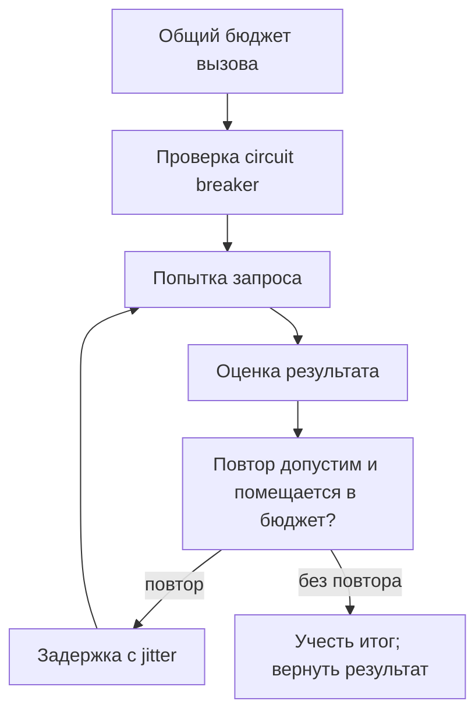

# Как строить HTTP- и gRPC-клиенты для продакшена {#production-http-grpc-clients}

<div class="bdr-post__hero" data-bdr-post="2026-09-13-production-http-grpc-clients" role="img" aria-label="Сохранить родной клиент, подключив политику рядом" markdown="0"></div>

Представим сервис заказов с двумя HTTP-зависимостями. Склад возвращает доступное количество товара, а сервис оплаты списывает деньги за заказ. Неудачный запрос остатков можно повторить. С неудачным ответом на платёж сложнее: деньги уже могли списаться.

Настроим клиентов, вызовем сбои зависимостей и посчитаем, сколько запросов действительно дошло до серверов. Затем подключимся к gRPC-версии склада и проверим, какие настройки можно перенести, а какие работают иначе.

<!-- more -->

<div id="why-i-stopped-wrapping-http-clients" data-search-exclude></div>
<div id="the-life-of-a-wrapper" data-search-exclude></div>
<div id="what-the-wrapper-actually-owns" data-search-exclude></div>
<div id="measured-the-price" data-search-exclude></div>
<div id="capability-honesty" data-search-exclude></div>
<div id="the-shape" data-search-exclude></div>

## Создаём клиентов при запуске приложения {#ownership}

Подключим [clientwright](https://bedrock-python.github.io/clientwright/), чтобы задать ограничения времени и правила повторов для HTTPX. `build('httpx', ...)` возвращает обычный `httpx.AsyncClient`: обработчики продолжают использовать `get()`, `post()` и ответы исходной библиотеки.

```python
from clientwright import (
    AdapterDeps, ClientConfig, RetryConfig, TimeoutConfig, build,
)


def http_client(base_url, *, metrics=None):
    return build(
        'httpx',
        ClientConfig(
            service_name='orders',
            base_url=base_url,
            timeout=TimeoutConfig(total=2, connect=0.3, read=0.5),
            retry=RetryConfig(max_attempts=3, budget_ratio=0.1),
            circuit_breaker=None,
            on_unsupported='strict',
        ),
        AdapterDeps(metrics=metrics),
    )
```

В `max_attempts=3` входит первая попытка. `service_name='orders'` обозначает вызывающий сервис в телеметрии. Circuit breaker подключим ниже. При `on_unsupported='strict'` неподдерживаемая настройка вызывает ошибку создания клиента; в [практикуме с адаптерами](../lab/2026-09-07-why-i-stopped-wrapping-http-clients/README.md) это показано на лимите одной попытки в Requests.

Создаём обоих клиентов в области приложения, передаём их обработчикам и закрываем после завершения активных запросов:

```python
from contextlib import asynccontextmanager


@asynccontextmanager
async def outbound_clients(inventory_url, payments_url):
    async with http_client(inventory_url) as inventory:
        async with http_client(payments_url) as payments:
            yield inventory, payments
```

Аргументы — базовые URL двух зависимостей, например `http://inventory:8080` и `http://payments:8080`. Если открывать этот контекст на каждый входящий заказ, соединения не будут переиспользоваться, а статистика повторов будет теряться. Где разместить область приложения, показано в [статье о жизненном цикле сервиса](2026-09-13-python-service-lifecycle.md).

<div id="reliability-is-not-retry3" data-search-exclude></div>
<div id="why-retries-look-free" data-search-exclude></div>
<div id="what-they-cost-when-it-matters" data-search-exclude></div>
<div id="a-deadline-is-the-first-real-mechanism" data-search-exclude></div>
<div id="a-retry-budget-removes-the-amplification" data-search-exclude></div>
<div id="a-circuit-breaker-protects-the-next-wave-not-this-one" data-search-exclude></div>
<div id="what-none-of-them-do" data-search-exclude></div>
<div id="the-list" data-search-exclude></div>
<div id="the-pieces" data-search-exclude></div>

## Ограничиваем время запроса остатков {#budgets}

Склад принимает `GET /stock/{sku}` и возвращает `{"sku": "sku-42", "available": 7}`. Обработчику достаточно небольшой функции: правила сетевого вызова уже настроены в клиенте.

```python
async def fetch_stock(client, sku):
    response = await client.get(f'/stock/{sku}')
    response.raise_for_status()
    return response.json()['available']
```

При `await fetch_stock(inventory, 'sku-42')` конфигурация отводит 0,3 секунды на подключение, 0,5 секунды на ожидание очередной порции ответа и две секунды на исходящий вызов вместе с попытками и паузами между ними. Read timeout HTTPX ограничивает отсутствие данных, а не длительность ответа целиком. См. [таймауты HTTPX](https://www.python-httpx.org/advanced/timeouts/).

В [практикуме с дедлайном](../lab/2026-09-07-reliability-is-not-retry-3/README.md) сервер отправляет по байту каждые 80 мс. Обычный HTTPX с read timeout 300 мс получает все десять байт. С `TimeoutConfig(total=0.35, read=0.3)` clientwright прерывает чтение тела через `DeadlineExceededError` до получения полного ответа.

Этот лимит относится к одному исходящему вызову. Если обращения к складу и оплате должны делить время входящего запроса, передавайте по цепочке общий [DeadlineBudget](2026-09-06-timeouts-are-not-deadlines.md). Две новые секунды для каждого клиента не дадут двухсекундного ограничения на обработку заказа целиком.

<div id="retries-can-make-an-outage-worse-designing-a-retry-budget" data-search-exclude></div>
<div id="the-arithmetic" data-search-exclude></div>
<div id="measured-one-hop" data-search-exclude></div>
<div id="when-the-budget-is-invisible-and-when-it-hurts" data-search-exclude></div>
<div id="measured-three-services-deep" data-search-exclude></div>
<div id="where-retries-belong" data-search-exclude></div>
<div id="the-policy" data-search-exclude></div>
<div id="retry-after-backoff-and-jitter-what-a-production-http-client-actually-does" data-search-exclude></div>
<div id="honour-retry-after" data-search-exclude></div>
<div id="jitter-or-the-herd" data-search-exclude></div>
<div id="a-read-timeout-is-not-a-connection-error" data-search-exclude></div>
<div id="what-is-retried-at-all" data-search-exclude></div>
<div id="the-checklist" data-search-exclude></div>

## Повторяем платёж, только если сервер умеет распознавать дубли {#retries}

Теперь сервис оплаты сохраняет платёж, но возвращает 503. Обычный POST с этой HTTP-политикой не повторяется. Если добавить только флаг идемпотентности, клиент отправит второй запрос — и в практикуме появится второе списание.

Допустим, API оплаты даёт дополнительную гарантию: одинаковые `Idempotency-Key` и тело запроса возвращают сохранённый результат, а тот же ключ с другим телом вызывает ошибку. На заказ приходится одна операция списания, поэтому стабильный ключ можно получить из ID заказа:

```python
from clientwright.adapters.httpx import IDEMPOTENT_EXTENSION


async def charge(client, order_id, amount_minor):
    response = await client.post(
        '/payments',
        json={'order_id': order_id, 'amount_minor': amount_minor},
        headers={'Idempotency-Key': f'charge:{order_id}'},
        extensions={IDEMPOTENT_EXTENSION: True},
    )
    response.raise_for_status()
    return response.json()['payment_id']
```

`IDEMPOTENT_EXTENSION` сообщает clientwright, что вызов разрешено повторять. Заголовок объясняет сервису оплаты, какую операцию нужно распознать при повторе. Этот механизм должен быть реализован на сервере; клиентский флаг не добавляет его автоматически.

[Практикум с повторами](../lab/2026-09-07-retry-after-backoff-jitter/README.md) проверяет три исхода на локальном HTTP-сервисе:

| После первого списания сервер вернул 503 | HTTP-запросов на вызов | Списаний |
| --- | --- | --- |
| Обычный POST | 1 | 1; клиент получает 503 |
| POST с флагом идемпотентности, но без ключа на сервере | 2 | 2 |
| POST со стабильным ключом и клиентским флагом | 2 | 1; клиент получает ID сохранённого платежа |

Ещё один вызов `charge()` с тем же заказом и суммой возвращает тот же ID платежа. Учебная дедупликация хранит данные в памяти и обрабатывает последовательные запросы. Для рабочего API нужны надёжное хранение и атомарная обработка одновременных дублей; см. [идемпотентность в API и фоновых задачах](2026-09-13-idempotency-in-apis-and-background-jobs.md).

### Учитываем паузу сервера и ограничиваем дополнительные запросы {#retry-budget}

Зададим увеличение пауз, случайный разброс времени повторов и общий бюджет дополнительных попыток:

```python
RETRIES = RetryConfig(
    max_attempts=3,
    initial_backoff=0.1,
    max_backoff=1,
    multiplier=2,
    jitter=0.2,
    respect_retry_after=True,
    budget_ratio=0.1,
)
```

Без `Retry-After` первая пауза составит 80–120 мс, вторая — 160–240 мс. При `Retry-After: 1` политика вместо этого использует паузу в одну секунду. Если она не помещается в оставшееся время, практикум получает исходный ответ 503 и фиксирует один запрос на сервере: новой попытки нет, ждать истечения дедлайна тоже незачем. Библиотека дополнительно ограничивает `Retry-After` параметром `retry_after_max`, по умолчанию 60 секунд; учитывайте этот предел, когда подключаетесь к конкретному API.

`budget_ratio=0.1` ограничивает дополнительные попытки для одного origin — сочетания схемы, хоста и порта URL — внутри runtime клиента. В версии 0.5.0 новый origin получает десять разрешений на повтор, а следующие вызовы пополняют этот запас с заданным коэффициентом. Поэтому начальный всплеск допустим: это не жёсткий предел в десять процентов для любой серии запросов.

[Практикум с бюджетом](../lab/2026-09-07-retry-budget/README.md) делает 50 последовательных вызовов к серверу, который всегда отвечает 503. Circuit breaker отключён:

| Настройки повторов | Запросов на сервере |
| --- | --- |
| Три попытки, `budget_ratio=None` | 150 |
| Три попытки, `budget_ratio=0.1` | 64 в этом запуске |

Проверка учитывает границу бюджета, а не требует универсального числа для конкурентной нагрузки. Ограничения действуют внутри процесса: у реплик отдельные бюджеты, а новый клиент получает новое состояние. Внешний цикл на три попытки вокруг клиента с тремя попытками тоже даёт девять запросов на операцию — этот случай проверяется в практикуме с адаптерами.

Для повтора нужно ещё и заново отправить тело. Этот адаптер HTTPX сначала сохраняет конечный итератор тела в памяти; практикум проверяет, что все три запроса получают одинаковые байты. Не стоит считать, что большая загрузка файла с такой политикой останется потоковой. Если буферизация не подходит, для клиента загрузки отключите собственные повторы и обработку перенаправлений через `retry=None, redirects='native'`. Время получения данных из источника загрузки ограничивайте отдельно.

<div id="circuit-breakers-should-be-per-origin-not-per-client" data-search-exclude></div>
<div id="measured-one-counter-three-upstreams" data-search-exclude></div>
<div id="what-counts-as-a-failure" data-search-exclude></div>
<div id="one-signal-per-logical-call" data-search-exclude></div>
<div id="the-probe" data-search-exclude></div>
<div id="the-configuration" data-search-exclude></div>

## Сбой оплаты не должен блокировать склад {#circuit-breakers}

Предположим, оба адреса обслуживает один общий HTTP-клиент. Circuit breaker должен временно отклонять вызовы недоступной оплаты, сохраняя доступ к работающему складу:

```python
from clientwright import CircuitBreakerConfig


def shared_http_client():
    return build('httpx', ClientConfig(
        service_name='orders',
        timeout=TimeoutConfig(total=2),
        retry=RETRIES,
        circuit_breaker=CircuitBreakerConfig(
            fail_threshold=3,
            recovery_timeout=10,
            half_open_max_calls=1,
        ),
    ))
```

Такому клиенту передаём полные URL. По умолчанию у каждого origin свой circuit breaker. В [практикуме](../lab/2026-09-07-circuit-breakers-per-origin/README.md) три неудачных вызова оплаты создают девять попыток. Четвёртый вызов получает `CircuitOpenError`, не отправив нового запроса. Чтение остатков по другому origin по-прежнему возвращает 200.

После паузы ограниченный пробный вызов проверяет восстановление зависимости. Практикум переводит тестовые часы вперёд и проверяет переход `open → half_open → closed`; время восстановления балансировщика он не измеряет. Ответ 400 этот breaker не открывает.

В clientwright breaker учитывает один итоговый результат вызова. Его проверка находится снаружи цикла повторов:

<!-- diagram:concept -->
<figure class="bdr-diagram" markdown="1">
<figcaption><span class="bdr-diagram__eyebrow">ИДЕЯ В СХЕМЕ</span><strong>Один HTTP-вызов, несколько возможных попыток</strong></figcaption>
<div class="bdr-diagram__viewport" markdown="1" data-search-exclude>


```mermaid
---
config:
  theme: default
  look: classic
  flowchart:
    useMaxWidth: false
    wrappingWidth: 150
    padding: 12
    nodeSpacing: 24
    rankSpacing: 32
---
flowchart TD
    accTitle: Один HTTP-вызов, несколько возможных попыток
    accDescr: HTTP breaker проверяется до повторов и учитывает их итоговый результат. Все попытки используют общий дедлайн вызова.
    A["Общий бюджет вызова"]
    B["Проверка circuit breaker"]
    C["Попытка запроса"]
    D["Оценка результата"]
    E["Повтор допустим и помещается в бюджет?"]
    F["Задержка с jitter"]
    G["Учесть итог; вернуть результат"]
    A --> B --> C --> D --> E
    E -->|"повтор"| F --> C
    E -->|"без повтора"| G
```

</div>
<p class="bdr-diagram__caption">HTTP breaker проверяется до повторов и учитывает их итоговый результат. Все попытки используют общий дедлайн вызова.</p>
</figure>
<!-- /diagram:concept -->

Origin — отправная точка для изоляции. Если за одним адресом шлюза стоят независимо отказывающие сервисы, их стоит разделить точнее, например отдельными клиентами и настройками.

<div id="safe-grpc-retries-which-status-codes-you-should-actually-retry" data-search-exclude></div>
<div id="what-a-status-code-tells-you-about-the-work" data-search-exclude></div>
<div id="measured-five-ways-to-fail-a-charge" data-search-exclude></div>
<div id="the-deadline-is-for-the-call-not-the-attempt" data-search-exclude></div>
<div id="the-breaker-counts-attempts" data-search-exclude></div>
<div id="streams-are-not-calls" data-search-exclude></div>
<div id="the-policy-written-down" data-search-exclude></div>
<div id="grpc-channels-should-not-be-pooled-by-address-alone" data-search-exclude></div>
<div id="what-a-channel-is" data-search-exclude></div>
<div id="measured-the-audit-client-that-retried" data-search-exclude></div>
<div id="the-opposite-mistake-a-channel-per-call" data-search-exclude></div>
<div id="options-are-identity-too" data-search-exclude></div>
<div id="health-per-address" data-search-exclude></div>
<div id="the-pool" data-search-exclude></div>

## Явно перечисляем gRPC-методы, которые можно повторять {#grpc}

Теперь у склада появляется gRPC API: `GetStock` читает количество, `Reserve` меняет его, а `Export` возвращает поток записей. Учебный `InventoryStub` связывает эти методы и передаёт байты; в рабочем сервисе такой клиент обычно генерируется из protobuf. Определение есть в [gRPC-практикуме](../lab/2026-09-07-safe-grpc-retries/README.md).

Подключим [grpc-client-kit](https://bedrock-python.github.io/grpc-client-kit/) и разрешим повторы только для `GetStock`:

```python
import grpc
from grpc_client_kit import (
    RetryConfig as GrpcRetry,
    TimeoutConfig as GrpcTimeout,
    build_interceptors,
)


def inventory_chain():
    return build_interceptors(
        timeout=GrpcTimeout(default=1),
        retry=GrpcRetry(
            max_attempts=3,
            initial_backoff=0.05,
            retryable_codes={grpc.StatusCode.UNAVAILABLE},
            idempotent_methods={'/shop.Inventory/GetStock'},
            retry_streaming=False,
        ),
    )
```

Статус `UNAVAILABLE` не доказывает, что обработчик ничего не сделал. В практикуме `Reserve` меняет остаток, а затем возвращает этот статус. С повторами без ограничения методов фиксируются три резервирования; с нашим списком — одно, после чего клиент получает ошибку. `GetStock`, который дважды отказал перед успешным ответом, по-прежнему делает три попытки и возвращает `b'7'`.

Секундный таймаут относится ко всему RPC. Отдельная проверка выделяет вызову 300 мс: после медленной неудачной первой попытки вторая получает только остаток времени и завершается с `DEADLINE_EXCEEDED`.

### Переиспользуем каналы только при совместимых настройках {#channel-identity}

Клиент аудита обращается к тому же складу, но должен делать ровно одну попытку. Настроим его отдельно, сохранив общий пул на время жизни приложения:

```python
from contextlib import asynccontextmanager
from grpc_client_kit import ChannelPool, GrpcClient, GrpcClientConfig


@asynccontextmanager
async def grpc_clients(target):
    config = GrpcClientConfig(
        target=target,
        insecure=True,  # Local lab; configure credentials for a TLS deployment.
        options=[('grpc.enable_retries', 0)],
    )
    async with ChannelPool() as pool:
        orders = GrpcClient(
            InventoryStub, config, pool,
            interceptor_factory=lambda target: inventory_chain(),
        )
        audit = GrpcClient(
            InventoryStub, config, pool,
            interceptor_factory=lambda target: build_interceptors(
                timeout=GrpcTimeout(default=1), retry=None,
            ),
        )
        yield orders, audit
```

`interceptor_factory` создаёт и сохраняет цепочку перехватчиков для каждого адреса. Её повторное использование сохраняет идентичность канала. Пул различает настройки безопасности, учётные данные, параметры, сжатие и цепочки перехватчиков; одного адреса недостаточно. Выход из контекста `GrpcClient` завершает использование stub, а выход из `ChannelPool` закрывает каналы. [Практикум с пулом](../lab/2026-09-07-grpc-channel-identity/README.md) проверяет переиспользование и разделение через публичный API и число попыток на сервере.

В примере `grpc.enable_retries=0` отключает встроенные повторы gRPC: ими управляет перехватчик. Иначе повторы из service config могут сочетаться с повторами приложения. См. [настройку повторов gRPC](https://grpc.io/docs/guides/retry/). Для клиента аудита `retry=None` убирает перехватчик повторов. Пустой набор `idempotent_methods` в версии 0.4.0 не означает «ничего не повторять».

Ещё два отличия от HTTP:

- В gRPC breaker находится внутри цикла повторов и учитывает попытки. При пороге два он блокирует третью попытку уже в первом неудачном вызове. HTTP-порог выше относится к завершённым вызовам.
- Перезапуск `Export` после элементов `1, 2` может дать последовательность `1, 2, 1, 2, 3`. Практикум проверяет этот явно включённый режим и обычное завершение с ошибкой после `1, 2`. Оставьте повторы потоков выключенными, пока протокол не определяет продолжение с нужного места или удаление дублей; см. [перехватчики потоковых RPC](2026-09-07-why-grpc-interceptors-break-on-streaming-rpcs.md).

## Считаем попытки, даже если вызов завершился успешно {#verification}

Для склада, который дважды вернул 503, а затем ответил успешно, эта функция возвращает `(7, 1, 3)`: количество товара, число вызовов и число попыток.

```python
from clientwright.core.testing import RecordingMetrics


async def observe_stock(base_url):
    metrics = RecordingMetrics()
    async with http_client(base_url, metrics=metrics) as client:
        available = await fetch_stock(client, 'sku-42')
    return available, len(metrics.calls), len(metrics.attempts)
```

`RecordingMetrics` — тестовый сборщик библиотеки; в рабочем сервисе своя реализация передаётся через `AdapterDeps(metrics=...)`. Один успешный вызов может скрывать три обращения к зависимости. Время чтения тела ответа учитывается отдельно от транспортного вызова — это нужно учесть при интерпретации задержек.

Все девять фрагментов взяты из запускаемых практикумов и проверены на Python 3.13 с `clientwright==0.5.0`, `httpx==0.28.1`, `grpc-client-kit==0.4.0` и `grpcio==1.84.0`. Семь практикумов используют настоящие локальные HTTP- и gRPC-серверы и проверки через `assert`. Они проверяют поведение клиентов; производительность, рабочие TLS-настройки, прокси и хранилище платежей здесь не тестируются.

## Настраиваем клиента под конкретные операции {#conclusion}

Мы прочитали остатки, повторили временно неудачный запрос, получили результат платежа без повторного списания, изолировали недоступный origin и подключили два gRPC-клиента с разными правилами повторов. У каждой настройки появился видимый результат: число попыток, потраченное время или записанные действия.

Используйте нашу библиотеку [clientwright](https://bedrock-python.github.io/clientwright/) для HTTP-политик с привычным интерфейсом SDK, а [grpc-client-kit](https://bedrock-python.github.io/grpc-client-kit/) — для gRPC-каналов и перехватчиков. Начните с общего ограничения времени и списка операций, которые безопасно повторять. Затем добавьте бюджет повторов и circuit breaker, проверив их на тестовой зависимости со сбоями перед подключением к своему сервису.

## Примеры и практикумы {#labs}

- [HTTP-клиенты, метрики и вложенные повторы](../lab/2026-09-07-why-i-stopped-wrapping-http-clients/README.md)
- [Таймаут чтения и общий дедлайн](../lab/2026-09-07-reliability-is-not-retry-3/README.md)
- [Retry-After, защита платежей от дублей и повтор тела запроса](../lab/2026-09-07-retry-after-backoff-jitter/README.md)
- [Бюджет повторов и число запросов на сервере](../lab/2026-09-07-retry-budget/README.md)
- [Отдельный circuit breaker для каждого origin](../lab/2026-09-07-circuit-breakers-per-origin/README.md)
- [Безопасность повторов gRPC, дедлайны и потоки](../lab/2026-09-07-safe-grpc-retries/README.md)
- [Переиспользование и изоляция gRPC-каналов](../lab/2026-09-07-grpc-channel-identity/README.md)
